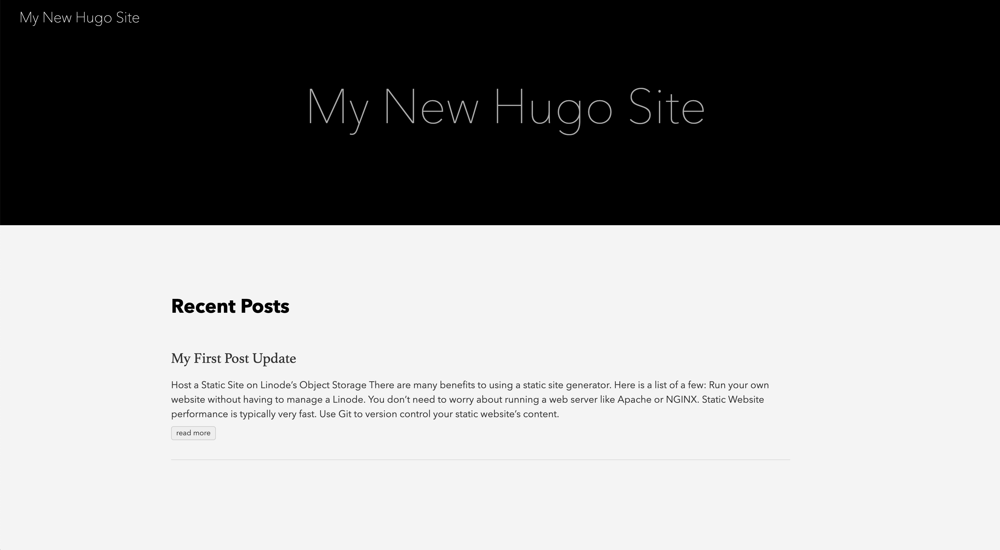





## Why Host a Static Site on Object Storage?

[Static site generators](/docs/guides/how-to-choose-static-site-generator/) are a popular solution for creating simple, fast, flexible, and attractive websites that are easy to update. You can contribute new pages and content to a static site in two steps:

1.  First, write the content for your site's new page using [Markdown](https://www.markdownguide.org), an easy-to-learn and light-weight markup language.

1.  Then, tell your static site generator to compile your Markdown (along with other relevant assets, like CSS styling, images, and JavaScript) into static HTML files.

The second compilation step only needs to happen once for each time that you update your content. This is in contrast with a dynamic website framework like WordPress or Drupal, which references a relational database and compiles your HTML every time a visitor loads your site.

### Benefits of Hosting on Object Storage

Traditionally, these static HTML files would be served by a web server (like [NGINX](/docs/guides/web-servers/nginx/) or [Apache](/docs/guides/web-servers/apache/)) running on a Linode. Using Object Storage to host your static site files means you do not have to worry about maintaining your site's infrastructure. It is no longer necessary to perform typical server maintenance tasks, like software upgrades, web server configuration, and security upkeep.

Object Storage provides an HTTP REST gateway to objects, which means a unique URL over HTTP is available for every object. Once your static site is built, making it available publicly over the Internet is as easy uploading files to an Object Storage bucket.

### Object Storage Hosting Workflow

At a high-level, the required steps to host a static site using Object Storage are:

1. [Install](#install-the-hugo-static-site-generator) the static site generator of your choice to your local computer.

1. [Create](#create-a-hugo-site) the desired content and build the site (using your static site generator).

1. [Upload](#upload-your-static-site-to-linode-object-storage) the static files to your Object Storage bucket to make the content publicly available over the Internet.

This guide uses [Hugo](https://gohugo.io/) to demonstrate how to create a static site and hosts it on Linode Object Storage. However, there are [many other static site generators](https://www.staticgen.com) to choose from--[Jekyll](https://jekyllrb.com/) and [Gatsby](https://www.gatsbyjs.org/) are popular choices, and the general steps outlined in this guide could be adapted to them. For more information on choosing a static site generator, see the [How to Choose a Static Site Generator](/docs/guides/how-to-choose-static-site-generator/) guide.

## Before You Begin

1. Read the [Get Started with Object Storage](/docs/products/storage/object-storage/get-started/) guide or take a look through all the [Object Storage guides](/docs/products/storage/object-storage/guides/) to familiarize yourself with Object Storage on Linode. Specifically, be sure that you have:

    - Created your Object Storage access and secret keys.
    - Installed and configure the [s3cmd tool](https://s3tools.org/download).

1. [Install and configure Git](/docs/guides/how-to-install-git-and-clone-a-github-repository/#install-and-configure-git) on your local computer.

## Install the Hugo Static Site Generator

Hugo is written in [Go](https://golang.org/) and is known for being extremely fast to compile sites, even very large ones. It is well-supported, [well-documented](https://gohugo.io/documentation/), and has an [active community](https://discourse.gohugo.io/). Some useful Hugo features include [*shortcodes*](https://gohugo.io/content-management/shortcodes/), which are an easy way to include predefined templates inside of your Markdown, and built-in [*LiveReload*](https://gohugo.io/getting-started/usage/#livereload) web server, which allows you to preview your site changes locally as you make them.

1. Install Hugo on your computer:

    **macOS**:

    -   Use the Homebrew package manager for macOS to install Hugo:

            brew install hugo

    **Linux/Ubuntu**:

    -   Determine your Linux kernel's architecture:

            uname -r

        Your output resembles the following:

        
4.9.0-8-amd64


    -   Navigate to [Hugo's GitHub releases page](https://github.com/gohugoio/hugo/releases) and download the appropriate version for your platform. This example command downloads version 0.55, but a newer release may be available:

            wget https://github.com/gohugoio/hugo/releases/download/v0.55.0/hugo_0.55.0_Linux-64bit.deb

    -   Install the package using `dpkg`:

            sudo dpkg -i hugo*.deb

1.  Verify that Hugo is installed. You should see output indicating your installed Hugo's version number:

        hugo version

## Create a Hugo Site

In this section, you use the [Hugo CLI](https://gohugo.io/commands/) (command line interface) to create your Hugo site, initialize a Hugo theme, and add content to your site. Hugo's CLI provides several useful commands for common tasks needed to build, configure, and interact with your Hugo site.

1.  Create a new Hugo site on your local computer. This command creates a folder named `example-site` and scaffold [Hugo's directory structure](https://gohugo.io/getting-started/directory-structure/) inside it:

        hugo new site example-site

1.  Move into your Hugo site's root directory:

        cd example-site

    
All commands in this section of the guide should be issued from your site's root directory.


1.  You use Git to add a theme to your Hugo site's directory. Initialize your Hugo site's directory as a Git repository:

        git init

1.  Install the [Ananke theme](https://github.com/budparr/gohugo-theme-ananke) as a submodule of your Hugo site's Git repository. [Git submodules](https://git-scm.com/book/en/v2/Git-Tools-Submodules) allow one Git repository to be stored as a subdirectory of another Git repository, while still being able to maintain each repository's version control information separately. The Ananke theme's repository is located in the `~/example-site/themes/ananke` directory of your Hugo site.

        git submodule add https://github.com/budparr/gohugo-theme-ananke.git themes/ananke

    
Hugo has many [available themes](https://themes.gohugo.io/) that can be installed as a submodule of your Hugo site's directory.


1.  Add the theme to your Hugo site's [configuration file](https://gohugo.io/getting-started/configuration/). The configuration file (`config.toml`) is located at the root of your Hugo site's directory.

        echo 'theme = "ananke"' >> config.toml

1.  Create a new content file for your site. This command generates a Markdown file with an auto-populated date and title:

        hugo new posts/my-first-post.md

1.  You should see a similar output. Note that the file is located in the `content/posts/` directory of your Hugo site:

    
/home/username/example-site/content/posts/my-first-post.md created


1. Open the Markdown file in the text editor of your choice to begin modifying its content; you can copy and paste the example snippet into your file, which contains an updated *front matter* section at the top and some example Markdown body text.

    Set your desired value for `title`. Then, set the `draft` state to `false` and add your content below the `---` in Markdown syntax, if desired:

    
---
title: "My First Post"
date: 2019-04-11T11:25:11-04:00
draft: false
---

# Host a Static Site on Linode Object Storage

There are many benefits to using a static site generator. Here is a list of a few of them:

- Run your own website without having to manage a Linode.
- You don't need to worry about running a web server like Apache or NGINX.
- Static website performance is typically very fast.
- Use Git to version control your static website's content.


    
[*Front matter*](https://gohugo.io/content-management/front-matter/) is a collection of metadata about your content, and it is embedded at the top of your file within opening and closing `---` delimiters.

Front matter is a powerful Hugo feature that provides a mechanism for passing data that is attached to a specific piece of content to Hugo's rendering engine. Hugo accepts front matter in TOML, YAML, and JSON formats. In the example snippet, there is YAML front matter for the title, date, and draft state of the Markdown file. These variables are referenced and displayed by your Hugo theme.


1.  Once you have added your content, you can preview your changes by building and serving the site using Hugo's built-in webserver:

        hugo server

1.  You see a similar output:

    

.                  | EN
+------------------+----+
  Pages              | 11
  Paginator pages    |  0
  Non-page files     |  0
  Static files       |  3
  Processed images   |  0
  Aliases            |  1
  Sitemaps           |  1
  Cleaned            |  0

Total in 7 ms
Watching for changes in /home/username/example-site/{content,data,layouts,static,themes}
Watching for config changes in /home/username/example-site/config.toml
Serving pages from memory
Running in Fast Render Mode. For full rebuilds on change: hugo server --disableFastRender
Web Server is available at http://localhost:1313/ (bind address 127.0.0.1)
Press Ctrl+C to stop


1.  The output provides a URL to preview your site. Copy and paste the URL into a browser to access the site. In the above example Hugo's web server URL is `http://localhost:1313/`.

1.  When you are happy with your site's content you can *build* your site:

        hugo -v

    Hugo generates your site's static HTML files and store them in a `public` directory that it creates inside your project. The static files that are generated by Hugo are the files that you upload to your Object Storage bucket to make your site accessible via the Internet.

1.  View the contents of your site's `public` directory:

        ls public

    Your output should resemble the following example. When you built the site, the Markdown file you created and edited in steps 6 and 7 was used to generate its corresponding static HTML file in the `public/posts/my-first-post/index.html` directory.

    
  404.html    categories  dist        images      index.html  index.xml   posts       sitemap.xml tags
  

    
It's not necessary to version control your site files in order to host them on Object Storage, but we still recommended that you do so:

1.  Display the state of your current working directory (root of your Hugo site):

        git status

2.  Stage all your files to be committed:

        git add -A

3.  Commit all your changes and add a meaningful commit message:

        git commit -m 'Add my first post.'

Once you have used Git to track your local Hugo site files, you can easily push them to a remote Git repository, like [GitHub](https://github.com/) or [GitLab](https://about.gitlab.com/). Storing your static site files on a remote Git repository opens up many possibilities for collaboration and automating your static site's deployment to Linode Object Storage. To learn more about Git, see the [Getting Started with Git](/docs/guides/how-to-configure-git/) guide.


## Upload your Static Site to Linode Object Storage

Before proceeding with this section ensure that you have already created your Object Storage access and secret keys and have installed the s3cmd tool.

1.  Create a new Object Storage bucket; prepend `s3://` to the beginning of the bucket's name:

        s3cmd mb s3://my-bucket

    
Buckets names must be unique within the Object Storage cluster. You might find the bucket name `my-bucket` is already in use by another Linode customer, in which case you need to choose a new bucket name.


    

1.  Initialize your Object Storage bucket as a website. You must tell your bucket which files to serve as the index page and the error page for your static site. This is done with the `--ws-index` and `--ws-error` options:

        s3cmd ws-create --ws-index=index.html --ws-error=404.html s3://my-bucket

    In our Hugo example, the site's index file is `index.html` and the error file is `404.html`. Whenever a user visits your static site's URL, the Object Storage service serves the `index.html` page. If a site visitor tries to access an invalid path, they are presented with the `404.html` page.

1.  The command returns the following message:

      
Bucket 's3://my-bucket/': website configuration created.


1.  Display information about your Object Storage's website configuration to obtain your site's URL:

        s3cmd ws-info s3://my-bucket

1.  You should see a similar output. Be sure to take note of your Object Storage bucket's URL:

    
Bucket s3://my-bucket/: Website configuration
Website endpoint: http://my-bucket.website-us-east-1.linodeobjects.com/
Index document:   index.html
Error document:   404.html


    - Even if s3cmd is configured to point to Linode Object Storage, this command may return a Website endpoint that looks similar to: `http://my-bucket.s3-website-default.amazonaws.com/`.
    - This is because there is a hardcoded value for this in the `.s3cfg` configuration file that creates this string.
    - You can change this by editing this file in a text editor and change the line for `website_endpoint` to the following:

        
website_endpoint = http://%(bucket)s.website-us-east-1.linodeobjects.com


    - Change `us-east-1` to match the region where your bucket is hosted.

    
Linode Object Storage provides SSL enabled by default. This means you can access your Object Storage bucket using `https`, as well.


1.  Use s3cmd's `sync` command to upload the contents of your static site's `public` directory to your Object Storage bucket. This step makes your site available publicly on the Internet. Ensure you are in your site's root directory on your computer (e.g. `/home/username/example-site`):

        s3cmd --no-mime-magic --acl-public --delete-removed --delete-after sync public/ s3://my-bucket

    | Option&nbsp;&nbsp;&nbsp;&nbsp;&nbsp;&nbsp;&nbsp;&nbsp;&nbsp;&nbsp;&nbsp;&nbsp;&nbsp;&nbsp;&nbsp;&nbsp;&nbsp;&nbsp;&nbsp;&nbsp;&nbsp;&nbsp;&nbsp;&nbsp;&nbsp; | Description |
    |--------|-------------|
    | `no-mime-magic` | Tells Object Storage not to use file signatures when guessing the object's MIME-type. |
    | `acl-public` | Sets the access level control of the objects to public. |
    | `delete-removed` | Deletes any destination objects with no corresponding source file. |
    | `delete-after` | Deletes destination files that are no longer found at the source after all files are uploaded to the bucket. |

1. Use a browser to navigate to your Object Storage bucket's URL to view your Hugo site:

      

    
It may take a minute or two after your s3cmd sync completes for the page to appear at your bucket's website URL.


1. If needed, you can continue to update your static site locally and upload any changes using s3cmd's `sync` command from step 3 of this section.

## (Optional) Next Steps

After uploading your static site to Linode Object Storage, you may want to use a custom primary domain for your site. To do this, you can add a CNAME entry to your domain's DNS records that aliases it to your Object Storage bucket's website URL. For example, if you have `www.mydomain.tld`, your CNAME entry looks like:

    www.mydomain.tld    CNAME	my-new-bucket.website-us-east-1.linodeobjects.com

Alternatively, you can freely create a custom subdomain that does not need to match the name of your bucket. For example, if your bucket is named `my-new-bucket`, you could freely create a subdomain as a CNAME like the following:

    subdomain.mydomain.tld    CNAME	my-new-bucket.us-east-1.linodeobjects.com

To learn about managing DNS records on Linode, see the [DNS Manager](/docs/products/networking/dns-manager/) and [DNS Records: An Introduction](/docs/guides/dns-overview/) guides.

For instructions on how to set up `https` access for your custom domain, see the  [Configure a Custom Domain (with a TLS/SSL Certificate)](/docs/products/storage/object-storage/guides/custom-domain/) guide.

As noted before, it's possible to trigger automatic deployments to the Object Storage service when you push new content updates to GitHub or GitLab. This is done by leveraging a CI/CD (continuous integration/continuous delivery) tool like [Travis CI](https://travis-ci.org). Essentially, you would build your Hugo site within the Travis environment and then run the `s3cmd sync` command from it to your bucket.
