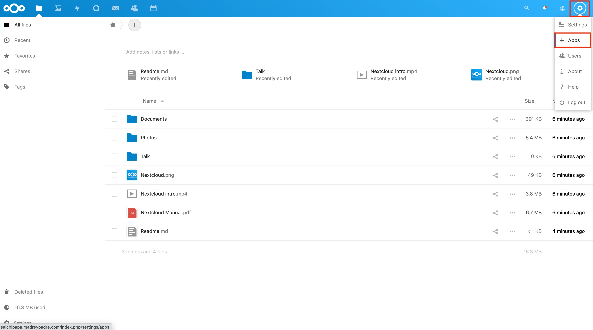
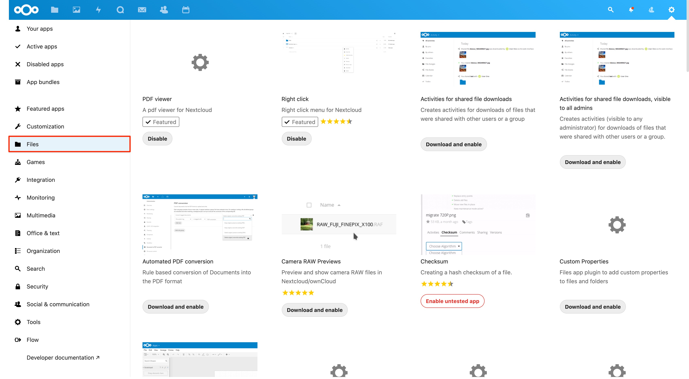
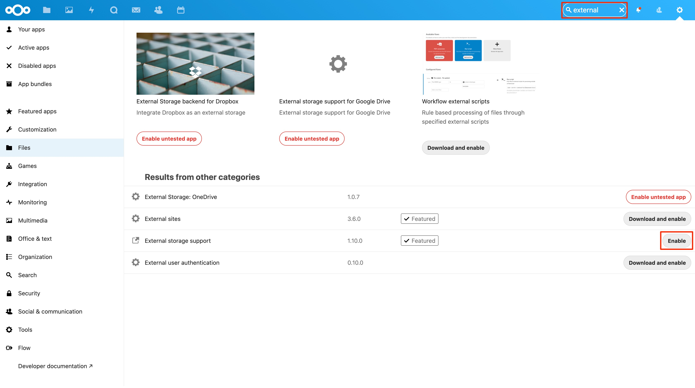
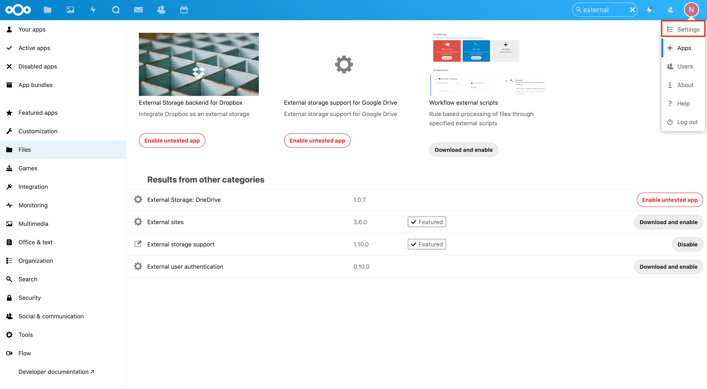
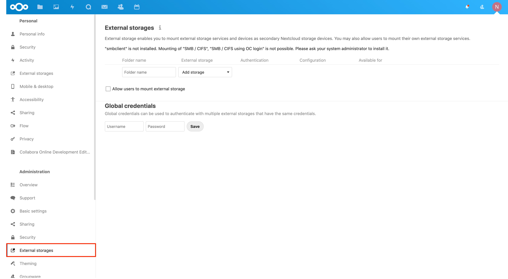
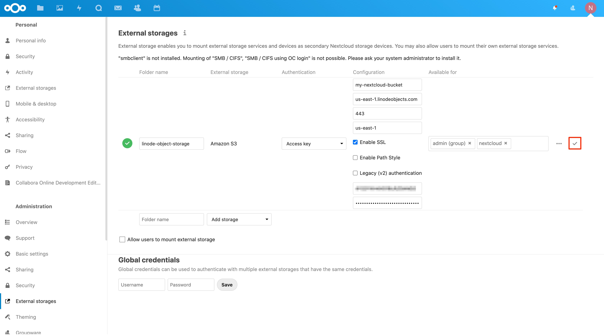
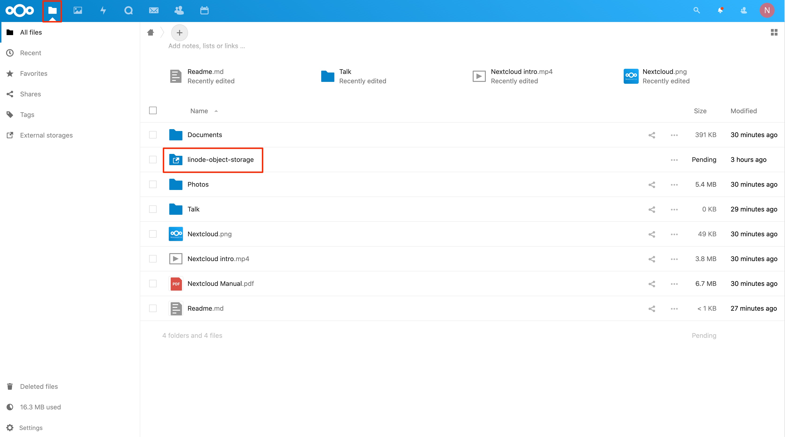
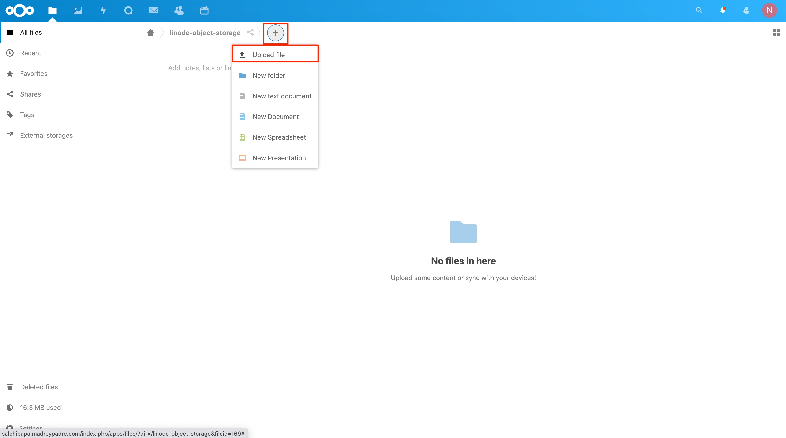
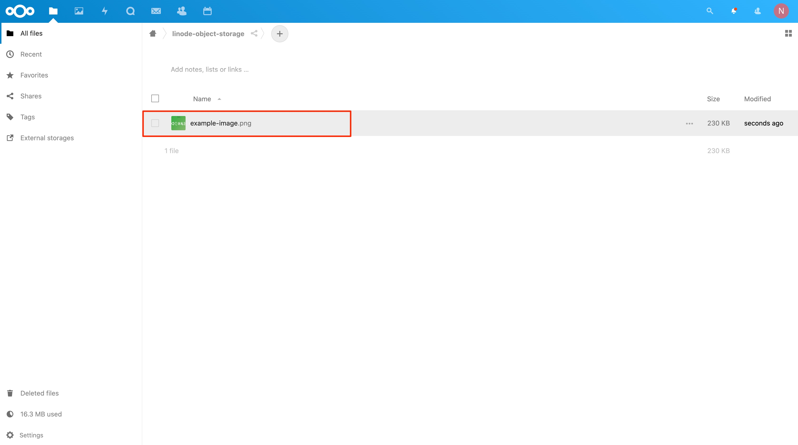



[Nextcloud](https://nextcloud.com/) is an open source solution for file hosting and sharing. With Nextcloud, you can synchronize files from a local computer to the Linode server and share them with collaborators. Nextcloud’s customizable security features and intuitive user interface keeps the files safe and easy to manage.

You can configure Nextcloud to enable external storage devices and services, like [Linode Object Storage](https://www.linode.com/products/object-storage/), to use as a secondary place to store files. Using Linode Object Storage to store files prevents you from running out of storage space limited by the Linode's plan size. When using Nextcloud's graphical user interface (GUI) to manage files, the external storage device shows up just like any other folder.

## Before You Begin

1. Deploy a Nextcloud server instance. You can use the [Linode Nextcloud Marketplace App](/docs/products/tools/marketplace/guides/nextcloud/) for an easy and quick deployment.

1. [Generate Object Storage access keys](/docs/products/storage/object-storage/guides/access-keys/.

1. If you are not familiar with Linode Object Storage, review the [Get Started with Object Storage](/docs/products/storage/object-storage/get-started/) guide or take a look through the available [Object Storage guides](/docs/products/storage/object-storage/guides/).

### In This Guide

- Nextcloud provides an app that makes it easy to configure an external storage device or service. You first [enable this app in Nextcloud's app settings](#enable-the-external-storage-app).

- After the External Storage app is enabled, you can provide the necessary configurations to connect Nextcloud to a Linode Object Storage bucket as documented in the [Create a New Linode Object Storage External Storage Mount](#create-a-new-linode-object-storage-external-storage-mount) section.

## Nextcloud Configurations
### Enable the External Storage App

In this section you enable the *External Storage Support* Nextcloud app in order to use external storage sources.


You must belong to the `admin` user group in order to install the External storage support app.


1. Log into your Nextcloud instance.

1. Click the user icon (or cog wheel) in the top navigation menu and select **Apps**.

    

1.  Click **Files** to access all Nextcloud apps related to file management, in the left-hand navigation menu.

    

1. Use the search field in the top navigation to narrow down the visible apps. You can enter *external* as your search term.

1. Viewing the *External storage support* app, click the **Enable** button in order to install it to the Nextcloud instance.

    

### Create a New Linode Object Storage External Storage Mount

After enabling the External Storage Support app, you are now ready to add a new external storage mount. You configure the new external storage mount to use the Linode Object Storage service.


If you have not yet [created an Object Storage access key](/docs/products/storage/object-storage/guides/access-keys/), you should do so now before proceeding with this section.


1. Click the user icon (or cog wheel) in the top navigation menu and select **Settings**.

    

1. In the left-hand navigation menu, under the **Administration** heading, click **External Storages**. The *External Storages* administration page appears.

    

1. In the **Folder name** text entry box, provide a name for the external storage directory.

1. From the **External Storage** dropdown menu, select the **Amazon S3** option.

    
Linode Object Storage is *S3-compatible*. Nextcloud connects to Amazon's Object Storage service by default, however, in the next step you override the default behavior to use Linode Object Storage hosts instead.
    

1. Select **Access Key** from the **Authentication** dropdown menu.

1. Under the **Configuration** heading, provide the following configurations:

    | **Configuration** | **Description** |
    | :------: | :------: |
    | Bucket | The name to assign to the Object Storage bucket. If this bucket name already exists in the data center region you select, an error occurs. |
    | Hostname | The hostname used for the Object Storage region where the bucket is be stored. Refer to the *Linode Object Storage Region and Hostname Values* note located below this table for available hostname values. |
    | Port | The port number to use to access the Object Storage host. This value must be `443`. |
    | Region | The data center region to store your Object Storage bucket. Refer to the *Linode Object Storage Region and Hostname Values* note located below this table for available data center region IDs. |
    | Enable SSL | A configuration to enable secure sockets layer (SSL). This configuration must be enabled. |
    | Enable Path Style | This configuration changes the default path format used by Nextcloud to access the Object Storage bucket. **Do not** enable this configuration. |
    | Legacy (v2) Authentication | This configuration enables version 2 authentication to the Object Storage service. By default Nextcloud uses version 4 authentication that is compatible with Linode Object Storage. **Do not** enable this configuration.|
    | Access Key | The value of the Access Key you created using the Linode Cloud Manager. |
    | Secret Key | The value of the Secret Key you created using the Linode Cloud Manager. |

      

| **Region** | **Region ID** | **Hostname** |
|:------:|:------:|:------:|
| Newark, NJ, USA | `us-east-1` | us-east-1.linodeobjects.com |
| Frankfurt, Germany | `eu-central-1` | eu-central-1.linodeobjects.com |
| Singapore, Singapore | `ap-south-1` | ap-south-1.linodeobjects.com |
      


There is a known bug when configuring Frankfurt buckets that will cause failure unless the user enters `us-east-1` as the Region ID, despite the correct ID being `eu-central-1`. The correct bucket will still be configured using the hostname. If you are hosting a bucket in Frankfurt and the  Nextcloud configuration is not applying, this solution should be attempted.


1. In the **Available for** text entry box, enter the group name(s) you would like to give access to the Linode Object Storage external storage. To learn more about user and group permissions related to external storage, see [Nextcloud's documentation](https://docs.nextcloud.com/server/15/admin_manual/configuration_files/external_storage_configuration_gui.html#user-and-group-permissions).

1. Click the **check icon**  to save the configurations. If all your configurations are valid, you should see a green check box appear next to the external storage entry.

      

1. Using the top navigation menu, click the **Files** menu item. The external storage folder appears in the list of folders.

      

1. Click the external storage folder to view its contents. You should not see anything stored there yet.

1. Test out the external storage mount by adding a file to the folder. Click the **+** button in the top breadcrumbs area of the screen and select **Upload file**.

      

1. The local file browser appears. Select a test file to add to the external storage folder and click **Open**. The file appears in the folder.

      

    
The file you uploaded is also be available through the [Linode Cloud Manager](https://cloud.linode.com/). You can verify this by following the steps in the [View Bucket Objects](/docs/products/storage/object-storage/guides/manage-buckets/) guide. You should not use the Linode Cloud Manager to remove or add files from your Nextcloud external storage Object Storage bucket.
    
