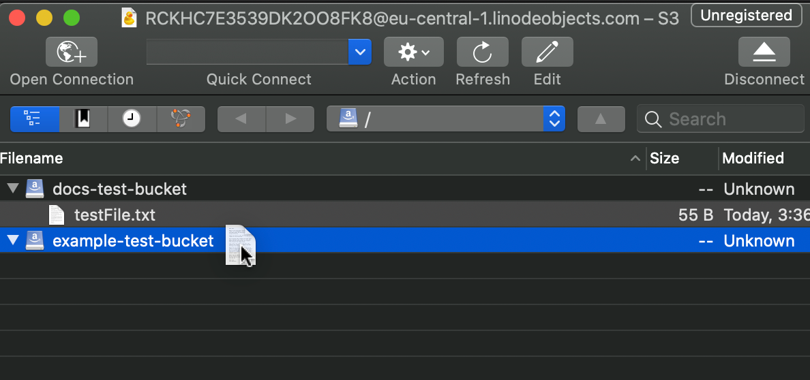
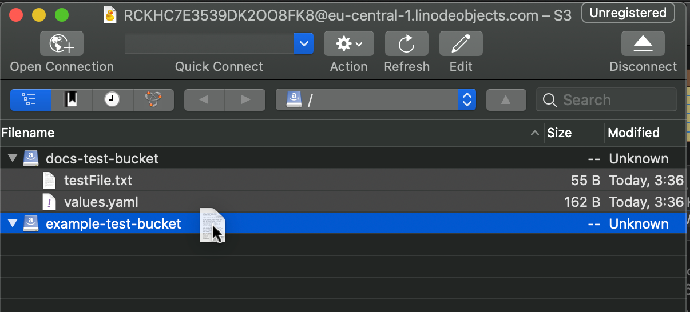
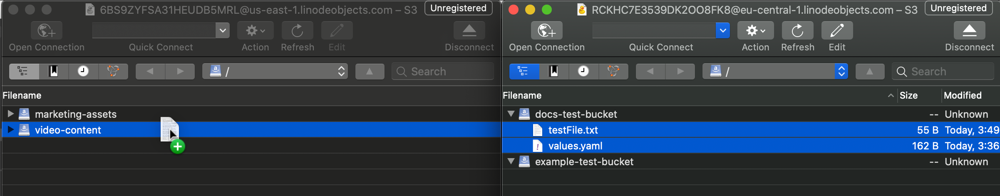



Linode’s Object Storage is a globally-available, S3-compatible method for storing and accessing data. With Object Storage more widely available, you may have buckets in multiple locations, this guide shows you how to move objects between buckets quickly and easily.

In this guide you learn how to move objects between buckets using:

- [Cyberduck's Graphical Interface](#cyberduck-graphical-interface)

- [Cyberduck's CLI, duck](#cyberduck-cli)

## Cyberduck Graphical Interface

The easiest way to move objects between buckets is using a Graphical User Interface (GUI) such as Cyberduck. Using a GUI, you can simply drag and drop objects between buckets.

### Transfer Between Buckets in the Same Cluster

To transfer objects within the same cluster on the same account, you need to open only one Cyberduck window.

1.  Open Cyberduck and make a connection to access your buckets as described in [Using Cyberduck with Object Storage](/docs/products/storage/object-storage/guides/cyberduck/).

1.  Expand the two buckets you want to transfer objects between by clicking the down arrow to the left of the folders.

1.  Locate the object you want to transfer.

1.  Drag the item from the source location to the destination.

    

1.  Select multiple items or folders and drag the group to the destination.

    

### Transfer Between Buckets in Different Clusters

To transfer objects between two clusters, whether they are on the same account or not, you need to open two separate Cyberduck widows so that you can make two separate connections.


Transferring objects between two different connections creates a copy of the object(s). If you don't want the original files in the source bucket, you need to delete them after the transfer.


1.  Open Cyberduck, click the **File** menu and select **New Browser**. A second interface window appears where you can create another connection.

1.  In the first window, connect to the source bucket and locate the object you want to copy.

1.  In the second window, connect to the destination bucket and navigate to the location you want to place a copy of the object.

1.  Drag the object from the source to the destination.

    


You can easily copy multiple items, folders, or buckets by selecting everything you want to move and dragging the group. If you move a bucket to another bucket, it creates a folder with that bucket name.


## Cyberduck CLI

You can also use the Cyberduck CLI, duck, to move objects from one bucket to another using the command line. The file transfer tool duck, is available for Linux, macOS, and Windows. To transfer using duck, you need the [access keys](/docs/products/storage/object-storage/guides/access-keys/) that you generated for the source and destination buckets.

1.  [Install duck](https://duck.sh) using the instructions for your platform.

1.  Use the access keys and bucket names in the following command to move objects between buckets:

        duck --copy s3://$access_key_source@$bucket_source/source_object_file_name s3://$access_key_destination@$bucket_destination/destination_object_file_name

    After issuing this command, you may be asked for login information.


The bucket source and destination names are the fully qualified names including the cluster name, for example: `us-east-1.linodeobjects.com/example_bucket`.


