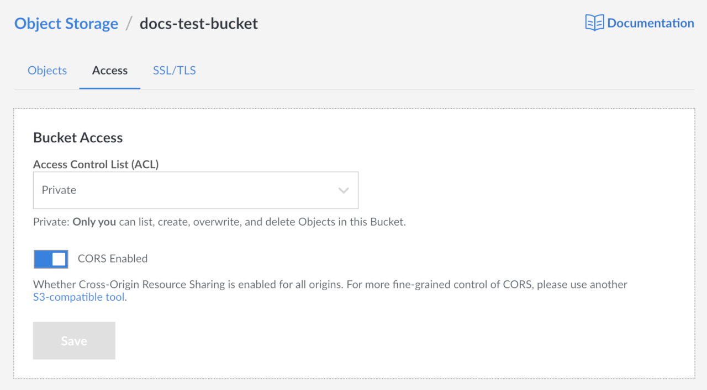
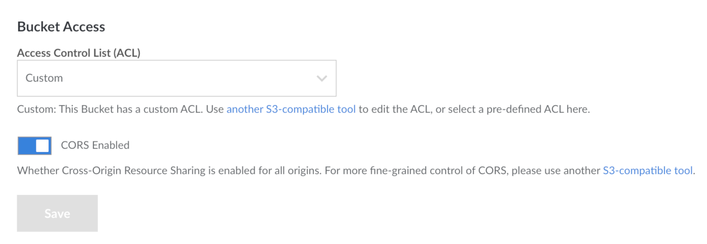





Linode Object Storage allows users to share access to objects and buckets with other Object Storage users. There are two mechanisms for setting up sharing: *Access Control Lists (ACLs)*, and *bucket policies*. These mechanisms perform similar functions: both can be used to restrict and grant access to Object Storage resources.

In this guide you learn about:

- [The differences between ACLs and bucket policies](#acls-vs-bucket-policies)
- [How to use ACLs in the Cloud Manager](#acls-in-cloud-manager)
- [How to use ACLs with s3cmd](#acls-with-s3cmd)
- [How to use bucket policies with s3cmd](#bucket-policies-with-s3cmd)

## Before You Begin

- This guide describes two ways to use ACLs to control access to buckets and bucket objects.
  - ACLs in the [Linode Cloud Manager](https://cloud.linode.com).
  - ACLs using the [s3cmd](https://s3tools.org/s3cmd) command line utility to interact with Object Storage. For s3cmd installation and configuration instructions, visit our [How to Use Object Storage](/docs/platform/object-storage/how-to-use-object-storage/#install-and-configure-s3cmd) guide.

- For the s3cmd method, you also need the [*canonical ID*](#retrieve-a-user-s-canonical-id) of every user you wish to grant additional permissions to.


Currently, you can only create a new canonical ID by creating a completely new Linode account. A canonical ID is not assigned to a limited access user on an existing Linode account.


### Retrieve a User's Canonical ID

Follow these steps to determine the canonical ID of the Object Storage users you want to share with:

1. The following command returns the canonical ID of a user, given any of the user's buckets:

        s3cmd info s3://other-users-bucket

    
The bucket referred to in this section is an arbitrary bucket on the target user's account. It is not related to the bucket on your account that you would like to set ACLs or bucket policies on.


    There are two options for running this command:

    - The users you're granting or restricting access to can run this command on one of their buckets and share their canonical ID with you, or:

    - You can run this command yourself if you have use of their access tokens (you need to configure s3cmd to use their access tokens instead of your own).

1. Run the above command, replacing `other-users-bucket` with the name of the bucket. The output is similar to the following:

    
s3://other-users-bucket/ (bucket):
Location:  default
Payer:     BucketOwner
Expiration Rule: none
Policy:    none
CORS:      none
ACL:       a0000000-000a-0000-0000-00d0ff0f0000: FULL_CONTROL


1. The canonical ID of the owner of the bucket is the long string of letters, dashes, and numbers found in the line labeled `ACL`, which in this case is `a0000000-000a-0000-0000-00d0ff0f0000`.

1. Alternatively, you *may* be able to retrieve the canonical ID by curling a bucket and retrieving the Owner ID field from the returned XML. This method is an option when both of these conditions are true:

    - The bucket has objects within it and has already been set to public (with a command like `s3cmd setacl s3://other-users-bucket --acl-public`).
    - The bucket has not been set to serve static websites.

1. Run the curl command, replacing the bucket name and cluster URL with the relevant values:

        curl other-users-bucket.us-east-1.linodeobjects.com

    

1. This results in the following output:

        <ListBucketResult xmlns="http://s3.amazonaws.com/doc/2006-03-01/">
            <Name>acl-bucket-example</Name>
            <Prefix/>
            <Marker/>
            <MaxKeys>1000</MaxKeys>
            <IsTruncated>false</IsTruncated>
            <Contents>
            <Key>cpanel_marketplace.gif</Key>
            <LastModified>2019-11-20T16:52:49.946Z</LastModified>
            <ETag>"9aeafcb192a8e540e7be5b51f7249e2e"</ETag>
            <Size>961023</Size>
            <StorageClass>STANDARD</StorageClass>
            <Owner>
                <ID>a0000000-000a-0000-0000-00d0ff0f0000</ID>
                <DisplayName>a0000000-000a-0000-0000-00d0ff0f0000</DisplayName>
            </Owner>
            <Type>Normal</Type>
            </Contents>
        </ListBucketResult>

    In the above output, the canonical ID is `a0000000-000a-0000-0000-00d0ff0f0000`.

## ACLs vs Bucket Policies

ACLs and bucket policies perform similar functions: both can restrict or grant access to buckets. ACLs can also restrict or grant access to *individual objects*, but they don't offer as many fine-grained access modes as bucket policies.

### How to Choose Between ACLs and Bucket Policies

If you can organize objects with similar permission needs into their own buckets, then it's strongly suggested that you use bucket policies. However, if you cannot organize your objects in this fashion, ACLs are still a good option.

ACLs offer permissions with less fine-grained control than the permissions available through bucket policies. If you are looking for more granular permissions beyond read and write access, choose bucket policies over ACLs.

Additionally, bucket policies are created by applying a written bucket policy file to the bucket. This file cannot exceed 20KB in size. If you have a policy with a lengthy list of policy rules, you may want to look into ACLs instead.


ACLs and bucket policies can be used at the same time. When this happens, any rule that limits access to an Object Storage resource overrides a rule that grants access. For instance, if an ACL allows a user access to a bucket, but a bucket policy denies that user access, the user can not access that bucket.


## ACLs

Access Control Lists (ACLs) are a legacy method of defining access to Object Storage resources. You can apply an ACL to a bucket or to a specific object. There are two generalized modes of access: setting buckets and/or objects to be private or public. A few other more granular settings are also available; the [Cloud Manager](#granular-permissions-for-cloud-manager) and [s3cmd](#granular-permissions-for-s3cmd) sections provide information on these respective settings.

### ACLs in the Cloud Manager

In Cloud Manager ACLs can be controlled at both the bucket and object level. ACLs in Cloud Manager go beyond s3cmd's ACLs and combine them with [bucket policies](#bucket-policies-with-s3cmd) for more granular control than just *public* or *private*.

#### Granular Permissions for Cloud Manager

| Level | Permission | Description |
| ----- | ---------- | ----------- |
| Bucket | Private | Only you can list, create, overwrite, and delete Objects in this Bucket. *Default* |
| Bucket | Authenticated Read | All authenticated Object Storage users can list Objects in this Bucket, but only you can create, overwrite, and delete them. |
| Bucket | Public Read | Everyone can list Objects in this Bucket, but only you can create, overwrite, and delete them. |
| Bucket | Public Read/Write | Everyone can list, create, overwrite, and delete Objects in this Bucket. *This is not recommended.* |
| Object | Private | Only you can download this Object. *Default* |
| Object | Authenticated Read | All authenticated Object Storage users can download this Object. |
| Object | Public Read | Everyone can download this Object. |

#### Bucket Level ACLs in Cloud Manager


Existing buckets and any new bucket created in the Cloud Manager have a default ACL permission setting of Private.


1.  If you have not already, log into the [Linode Cloud Manager](https://cloud.linode.com).

1.  Click the **Object Storage** link in the sidebar, and then click on the bucket you wish to edit the ACLs for.

    

1.  The Object Storage Bucket detail page appears. Click the **Access** tab.

    

1.  The Object Storage Bucket Access Page appears.

    

1.  On this page you can select the ACL for this bucket as well as enable CORS.

    
CORS is enabled by default on all existing buckets and on all new buckets.


1.  Select the ACL for this bucket from the dropdown menu.

    

1.  Click the **Save** button to save these settings to the bucket.

    

#### Object Level ACLs in Cloud Manager


Existing objects and any new objects created in the Cloud Manager have a default ACL permission setting of Private.


1.  If you have not already, log into the [Linode Cloud Manager](https://cloud.linode.com).

1.  Click the **Object Storage** link in the sidebar, and then click on the bucket that holds the objects that you wish to edit the ACLs for.

    

1.  The Object Storage Bucket detail page appears and displays all the objects in your bucket.

1.  Next to the object you wish to edit the ACL settings for, click the ***more options ellipsis*** and select **Details** from the drop down menu that appears.

    

1.  The Object ACL panel opens.

    

1.  Select the ACL you wish to set for this object from the dropdown menu.

    

1.  Click the **Save** button. The panel closes and the ACL is applied to the object.

    

### ACLs with s3cmd

With s3cmd, you can set a bucket to be public with the `setacl` command and the `--acl-public` flag:

    s3cmd setacl s3://acl-example --acl-public

This causes the bucket and its contents to be downloadable over the public Internet.

To set an object or bucket to private, you can use the `setacl` command and the `--acl-private` flag:

    s3cmd setacl s3://acl-example --acl-private

This prevents users from accessing the bucket's contents over the public Internet.

#### Granular Permissions for s3cmd

The more granular permissions are:

|Permission|Description|
|-----|-----------|
|**read**| Users with can list objects within a bucket|
|**write**| Users can upload objects to a bucket and delete objects from a bucket.|
|**read_acp**| Users can read the ACL currently applied to a bucket.|
|**write_acp**| Users can change the ACL applied to the bucket.|
|**full_control**| Users have read and write access over both objects and ACLs.|

**Setting a permission:** To apply granular permissions for a specific user with s3cmd, use the following `setacl` command with the `--acl-grant` flag:

    s3cmd setacl s3://acl-example --acl-grant=PERMISSION:CANONICAL_ID

Substitute `acl-example` with the name of the bucket (and the object, if necessary), `PERMISSION` with a permission from the above table, and `CANONICAL_ID` with the canonical ID of the user to which you would like to grant permissions.

**Revoking a permission:** To revoke a specific permission, you can use the `setacl` command with the `acl-revoke` flag:

    s3cmd setacl s3://acl-example --acl-revoke=PERMISSION:CANONICAL_ID

Substitute the bucket name (and optional object), `PERMISSION`, and `CANONICAL_ID` with your relevant values.

**View current ACLs:** To view the current ACLs applied to a bucket or object, use the `info` command, replacing `acl-example` with the name of your bucket (and object, if necessary):

    s3cmd info s3://acl-example

You should see output like the following:


s3://acl-bucket-example/ (bucket):
   Location:  default
   Payer:     BucketOwner
   Expiration Rule: none
   Policy:    none
   CORS:      b'&lt;CORSConfiguration xmlns="http://s3.amazonaws.com/doc/2006-03-01/"&gt;&lt;CORSRule&gt;&lt;AllowedMethod&gt;GET&lt;/AllowedMethod&gt;&lt;AllowedMethod&gt;PUT&lt;/AllowedMethod&gt;&lt;AllowedMethod&gt;DELETE&lt;/AllowedMethod&gt;&lt;AllowedMethod&gt;HEAD&lt;/AllowedMethod&gt;&lt;AllowedMethod&gt;POST&lt;/AllowedMethod&gt;&lt;AllowedOrigin&gt;*&lt;/AllowedOrigin&gt;&lt;AllowedHeader&gt;*&lt;/AllowedHeader&gt;&lt;/CORSRule&gt;&lt;/CORSConfiguration&gt;'
   ACL:       *anon*: READ
   ACL:       a0000000-000a-0000-0000-00d0ff0f0000: FULL_CONTROL
   URL:       http://us-east-1.linodeobjects.com/acl-example/



The owner of the bucket always has the `full_control` permission.



If you set an ACL that does not map to an ACL in the Cloud Manager, the Cloud Manager displays this as `Custom`.



## Bucket Policies with s3cmd

Bucket policies can offer finer control over the types of permissions you can grant to a user.


In the examples below, access to all objects within a bucket are defined with a wildcard `*`. While these resources can be defined to target the bucket resource itself by removing the `/*` where the resource is defined. Creating a policy with this rule can cause the bucket to become inaccessible to the Linode Cloud Manager, API, and CLI.


### Basic Access Policy
Below is an example bucket policy written in JSON:


{
  "Version": "2012-10-17",
  "Statement": [{
    "Effect": "Allow",
    "Principal": {
      "AWS": [
        "arn:aws:iam:::a0000000-000a-0000-0000-00d0ff0f0000"
      ]
    },
    "Action": [
      "s3:PutObject",
      "s3:GetObject",
      "s3:ListBucket"
    ],
    "Resource": [
      "arn:aws:s3:::bucket-policy-example/*"
    ]
  }]
}


This policy allows the user with the canonical ID `a0000000-000a-0000-0000-00d0ff0f0000`, known here as the "principal", to interact with the bucket, known as the "resource". The "resource" that is listed (`bucket-policy-example`) is the only bucket the user has access to.


The principal (a.k.a. the user) must have the prefix of `arn:aws:iam:::`, and the resource (a.k.a. the bucket) must have the prefix of `arn:aws:s3:::`.


The permissions are specified in the `Action` array. For the current example, these are:

- `s3:PutObject`: The ability to upload objects to a bucket
- `s3:GetObject`: The ability to retrieve objects from a bucket
- `s3:ListBucket`: The ability to list the contents of the bucket

    
For a full list of of available actions, visit the [Ceph bucket policy documentation](https://docs.ceph.com/docs/master/radosgw/bucketpolicy/#limitations).


The `Action` and `Principal.AWS` fields of the bucket policy are arrays. Therefore, you can easily add additional users and permissions to the bucket policy, separating them by a comma. To grant permissions to all users, you can supply a wildcard (`*`) to the `Principal.AWS` field.

### Subdirectory Access Policy
You can also define a finer level of control over the level of access to your bucket's directory structure using policy rules.


{
  "Version": "2012-10-17",
  "Statement": [
    {
      "Effect": "Allow",
      "Principal": {
        "AWS": "arn:aws:iam::a0000000-000a-0000-0000-00d0ff0f0000"
      },
      "Action": [
        "s3:ListBucket"
      ],
      "Resource": [
        "arn:aws:s3:::*"
      ]
    },
    {
      "Effect": "Allow",
      "Principal": {
        "AWS": "arn:aws:iam::a0000000-000a-0000-0000-00d0ff0f0000"
      },
      "Action": [
        "s3:GetObject"
      ],
      "Resource": [
        "arn:aws:s3:::bucket-policy-example/test/*"
      ]
    }
  ]
}


This example shows how you can grant read-only access to a user by allowing them to list buckets and get objects from the bucket only from the `test` directory. However, they can not perform any other actions.

### Denying Access by IP Address
If you wanted to deny all access to a resource and whitelist by IP address, you can change the `Effect` field from `Allow` to `Deny` and supply an IP address in a condition.


{
  "Version": "2012-10-17",
  "Statement": [{
    "Effect": "Deny",
    "Principal": "*",
    "Action": "s3:*",
    "Resource": "arn:aws:s3:::bucket-policy-example/*",
    "Condition": {
      "NotIpAddress": {
        "aws:SourceIp": "172.104.2.4"
      }
    }
  }]
}


### Combining Rules
Only one policy file [can be enabled](#enable-a-bucket-policy) at a time. Therefore, if you wanted to enact several of the above rules together, instead of enabling them one at a time, you would need to combine them into a single file with each rule listed as items in the `Statements` array.


{
  "Version": "2012-10-17",
  "Statement": [{
    "Effect": "Allow",
    "Principal": {
      "AWS": [
        "arn:aws:iam:::a0000000-000a-0000-0000-00d0ff0f0000"
      ]
    },
    "Action": [
      "s3:PutObject",
      "s3:GetObject",
      "s3:ListBucket"
    ],
    "Resource": [
      "arn:aws:s3:::bucket-policy-example/*"
    ]
  },
  {
    "Effect": "Allow",
    "Principal": {
      "AWS": "arn:aws:iam::a0000000-000a-0000-0000-00d0ff0f0000"
    },
    "Action": [
      "s3:ListBucket"
    ],
    "Resource": [
      "arn:aws:s3:::*"
    ]
  },
  {
    "Effect": "Allow",
    "Principal": {
      "AWS": "arn:aws:iam::a0000000-000a-0000-0000-00d0ff0f0000"
    },
    "Action": [
      "s3:GetObject"
    ],
    "Resource": [
      "arn:aws:s3:::bucket-policy-example/test/*"
    ]
  },
  {
    "Effect": "Deny",
    "Principal": "*",
    "Action": "s3:*",
    "Resource": "arn:aws:s3:::bucket-policy-example/*",
    "Condition": {
      "NotIpAddress": {
        "aws:SourceIp": "172.104.2.4"
      }
    }
  }]
}


### Enable a Bucket Policy

To enable the bucket policy, use the `setpolicy` s3cmd command, supplying the filename of the bucket policy as the first argument, and the S3 bucket address as the second argument:

    s3cmd setpolicy bucket_policy_example.json s3://bucket-policy-example

To ensure that it has been applied correctly, you can use the `info` command:

    s3cmd info s3://bucket-policy-example

You should see output like the following:


s3://bucket-policy-example/ (bucket):
   Location:  default
   Payer:     BucketOwner
   Expiration Rule: none
   Policy:    b'{\n  "Version": "2012-10-17",\n  "Statement": [{\n    "Effect": "Allow",\n    "Principal": {"AWS": ["arn:aws:iam:::a0000000-000a-0000-0000-00d0ff0f0000"]},\n    "Action": ["s3:PutObject","s3:GetObject","s3:ListBucket"],\n    "Resource": [\n      "arn:aws:s3:::bucket-policy-example/*"\n    ]\n  }]\n}'
   CORS:      none
   ACL:       a0000000-000a-0000-0000-00d0ff0f0000: FULL_CONTROL



The policy is visible in the output.

