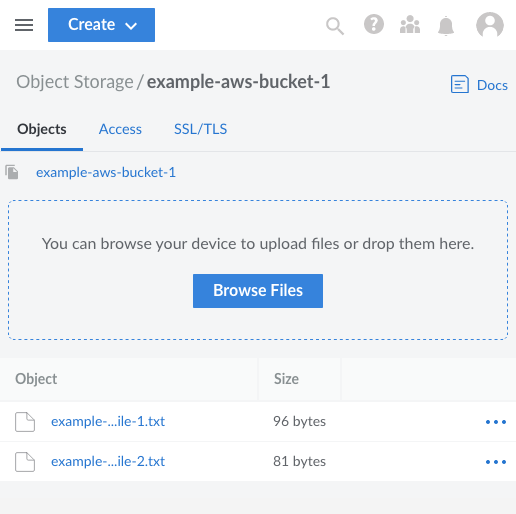

[Linode Object Storage](https://www.linode.com/products/object-storage/) is S3-compatible. So it not only offers all the benefits of S3, but can also leverage common S3 tooling. This lets Linode Object Storage instances work with hyper-scale S3s like AWS and Google Cloud.

This tutorial the tooling needed to make migration from AWS S3 to Linode Object Storage a smooth and straightforward process. It covers what you need to know before making the migration, then gives you two options depending on your needs:

-   How to use rclone to migrate one bucket at a time.

-   How to use a custom Python script to migrate all of your buckets at once.

## Before You Begin

1.  Familiarize yourself with our [Getting Started with Linode](/docs/products/platform/get-started/) guide, and complete the steps for setting your Linode's hostname and timezone.

1.  This guide uses `sudo` wherever possible. Complete the sections of our [How to Secure Your Server](/docs/products/compute/compute-instances/guides/set-up-and-secure/) guide to create a standard user account, harden SSH access, and remove unnecessary network services.

1.  Update your system.

    -   **Debian** and **Ubuntu**:

            sudo apt update && sudo apt upgrade

    -   **AlmaLinux**, **CentOS Stream** (8 or later), **Fedora**, and **Rocky Linux**:

            sudo dnf upgrade


This guide is written for a non-root user. Commands that require elevated privileges are prefixed with `sudo`. If you’re not familiar with the `sudo` command, see the [Users and Groups](/docs/guides/linux-users-and-groups/) guide.


## How S3 Migration Works

While popularized by AWS, S3 has become a widely used model for object storage. Because they share the same model, these S3-compatible object storage services can interact with the same tooling.

Linode Object Storage is no different. For instance, you can fully operate your Linode buckets through the s3cmd tool commonly used for managing AWS S3 and other S3-compatible services. You can learn more about that in our guide [Using S3cmd with Object Storage](/docs/products/storage/object-storage/guides/s3cmd/).

As such, most tools designed for working with S3 can be used seamlessly with either AWS S3 or Linode Object Storage.

This includes the two tools used in this tutorial:

-   **rclone**: a popular tool for transferring data between storage systems.

-   **Boto3**: a Python library designed for managing AWS S3 instances.

## What to Consider Before Migrating to Linode Object Storage

Both migration processes in this tutorial require you to have access and secret keys for your AWS S3 and Linode Object Storage instances.

-   To learn about creating and managing access keys for Linode Object Storage, take a look at our guide [Manage Access Keys](/docs/products/storage/object-storage/guides/access-keys/)

-   For more on AWS access keys, take a look at the AWS [documentation on access keys](https://docs.aws.amazon.com/general/latest/gr/aws-sec-cred-types.html). Essentially, navigate to the **Security Credentials** page, scroll down, and select **Create access key**.

Throughout the rest of this tutorial, and in its supplementary files, you need to substitute the placeholders for your own keys. This means replacing `AWS_ACCESS_KEY` and `AWS_SECRET_KEY` with the access and secret keys, respectively, for your AWS S3 instance. Likewise, replace `LINODE_ACCESS_KEY` and `LINODE_SECRET_KEY` with your access and secret keys, respectively, for your Linode Object Storage instance.

You also need to have the region name used for each instance as well:

-   **Linode Object Storage**: The region name for your bucket is provided in the endpoint URL. For instance, if your endpoint URL is `example-aws-bucket-1.us-southeast-1.linodeobjects.com`, the region name for your bucket is `us-southeast-1`.

-   **AWS S3**: The region name for your bucket is provided on the dashboard, within the listing of your buckets.

This tutorial uses `us-east-2` as the placeholder for the AWS S3 region and `us-southeast-1` as the placeholder for the Linode Object Storage region. Replace both throughout with your own instances' regions.

## How to Migrate a Bucket from AWS S3 to Linode Object Storage

When migrating one or only a few buckets, *rclone* provides the smoothest process. Enter the credentials and connection details for your S3 instances, and you can migrate a bucket with a single command.

These next few sections walk you through that process. They demonstrate how to set up rclone on your system, how to configure it, and the commands used to migrate buckets.

### Setting Up the Prerequisites

To get started, you need to install the rclone tool and connect it to both your AWS S3 and Linode Object Storage instances.

1.  Install rclone. rclone specializes in transferring files over SSH, but it also comes with full support for connecting to and transferring data over S3.

    -   **Debian** and **Ubuntu**:

            sudo apt install rclone

    -   **Fedora**:

            sudo dnf install rclone

    -   **AlmaLinux**, **CentOS Stream**, and **Rocky Linux**:

            sudo dnf install epel-release
            sudo dnf install rclone

    You can then verify your installation with:

        rclone version

    
rclone v1.53.3-DEV
- os/arch: linux/amd64
- go version: go1.18
    

1.  Create an rclone configuration file with the connection details for the AWS S3 and Linode Object Storage instances. The rclone configuration file, located at `~/.config/rclone/rclone.conf`, can hold multiple connection configurations. Here, the connections are named `awss3` and `linodes3`.

    Replace the `AWS_ACCESS_KEY`, `AWS_SECRET_KEY`, `LINODE_ACCESS_KEY`, and `LINODE_SECRET_KEY` with your instances' access and secret keys. Placeholder regions have been provided below — `us-east-2` for AWS and `us-southeast-1` for Linode. Be sure to replace these as well with your instances' actual region names.

    
[awss3]
type = s3
env_auth = false
acl = private
access_key_id = AWS_ACCESS_KEY
secret_access_key = AWS_SECRET_KEY
region = us-east-2
location_constraint = us-east-2

[linodes3]
type = s3
env_auth = false
acl = private
access_key_id = LINODE_ACCESS_KEY
secret_access_key = LINODE_SECRET_KEY
region = us-southeast-1
endpoint = us-southeast-1.linodeobjects.com


1.  You can then verify your configuration by listing the remote storage sources for rclone:

        rclone listremotes --long

    
awss3:    s3
linodes3: s3
    

    You can further verify the connections by checking object contents for buckets on the storage services. This command, for instance, lists the contents of the `example-aws-bucket-1` on the services configured under `awss3`:

        rclone tree awss3:example-aws-bucket-1

    In this case, the AWS S3 bucket has two text files.

    
/
├── example-text-file-1.txt
└── example-text-file-2.txt
    

### Syncing Buckets

rclone works by copying files from a storage source to a storage destination. Once you have a configuration like the one above, copying can be easily done with a command like the following. This example copies objects from an AWS S3 bucket named `example-aws-bucket-1` to a Linode Object Storage bucket named `example-linode-bucket-1`:

    rclone copy awss3:example-aws-bucket-1 linodes3:example-linode-bucket-1 -P


Transferred:   	      177 / 177 Bytes, 100%, 468 Bytes/s, ETA 0s
Transferred:            2 / 2, 100%
Elapsed time:         0.5s


The `-P` option tells rclone to output the steps in the transfer process. You can also test out a given copy command by using the `--dry-run` option.

Alternatively to the `copy` command, you can use the `sync` command. With `sync`, any files in the destination that are not in the source are deleted. In other words, this command has rclone make the contents of the destination bucket match the contents of the source bucket. The `sync` command should be used when you strictly need the destination to match the source.

### Verifying the Results

The simplest way to verify the results is through rclone itself. You can use a `tree` command like the one shown below:

    rclone tree linodes3:example-linode-bucket-1


/
├── example-text-file-1.txt
└── example-text-file-2.txt


Alternatively, you can also check in the Linode Cloud Manager by navigating to your Object Storage instance and selecting the target bucket.

## How to Migrate All Buckets from AWS S3 to Linode Object Storage

The approach covered above works well when you need to migrate a few buckets. But it quickly becomes unrealistic when you have numerous buckets you need to migrate from AWS to Linode.

To address this, the following sections walk you through using a custom Python script for migrating AWS S3 buckets to a Linode Object Storage instance.

The script uses Boto3, Amazon's Python SDK for interacting with and managing AWS S3 buckets. The SDK can readily interface with many other S3-compatible services, including Linode Object Storage.

### Setting Up the Prerequisites

This process uses Python 3 with the Boto3 library to connect to and operate the AWS S3 and Linode Object Storage buckets. To get this working, you also need to provide credentials for connecting to each of your instances.

Follow the steps here to get the prerequisite software you need and find links to download the migration script and its configuration file.

1.  Ensure that you have Python 3 and Pip 3 installed. You can find instructions for installing these on your system in the [Install Python 3 and pip3](/docs/products/tools/cli/guides/install/#install-python-3-and-pip3) section of our guide on installing the Linode CLI.

1.  Install the Boto3 Python library via Pip 3:

        pip3 install boto3

1.  Download the configuration file for the migration script [here](s3_migration.conf). Then, modify the configurations to match your AWS and Linode instances' credentials and regions.

    Note that the `endpoint_url` value needs to have the `http`/`https` prefix and should be the Linode endpoint excluding the bucket portion of the URL.

1.  Finally, download the migration script [here](s3_migration.py).

### Understanding the Script

The script downloaded above should already cover most use cases for migrating from an AWS S3 instance to a Linode Object Storage instance. Nevertheless, you may want familiarize yourself with the script and make adjustments to fit your particular needs.

To help make navigating and reviewing the script easier, here is a rough diagram of its operations. The diagram does not represent a one-to-one outline of the script. Instead, its purpose is to clarify the script's organization and order of operations.

### Running the Script

When you are ready, you can run the script with the following Python command:

    python3 s3_migration.py

The output indicates the script's progress and provides alerts if any errors are encountered along the way.

### Verifying the Results

You can verify the script's success in the same manner as shown in the section on rclone above. Probably the most accessible method here is navigating to your the Linode Cloud Manager and taking a look at your Object Storage instance. There, you should see the buckets from your AWS S3 instance and, within them, the objects that have been migrated.

## Conclusion

This tutorial has covered the tools you need to migrate from an AWS S3 instance to a Linode Object Storage instance. You can readily migrate one or even a few buckets with a straightforward rclone setup. Or you can use our custom script to migrate all of your buckets from one instance to another.