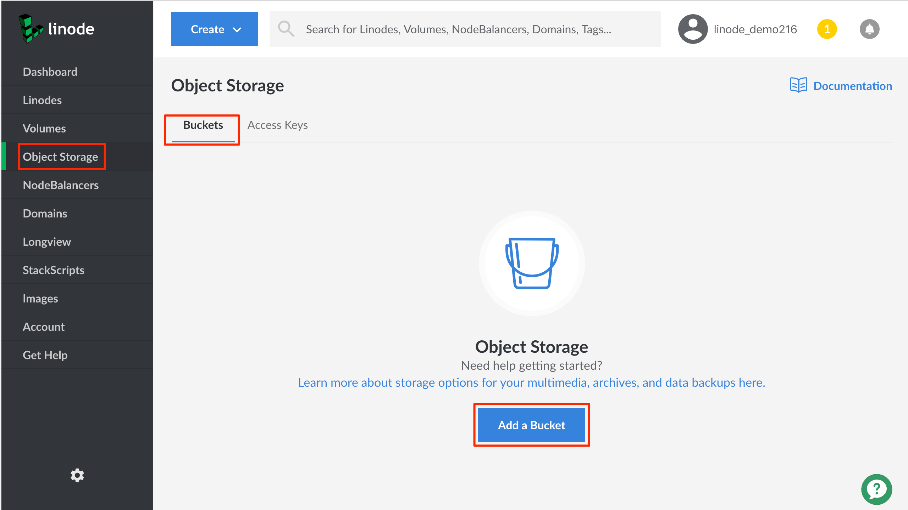
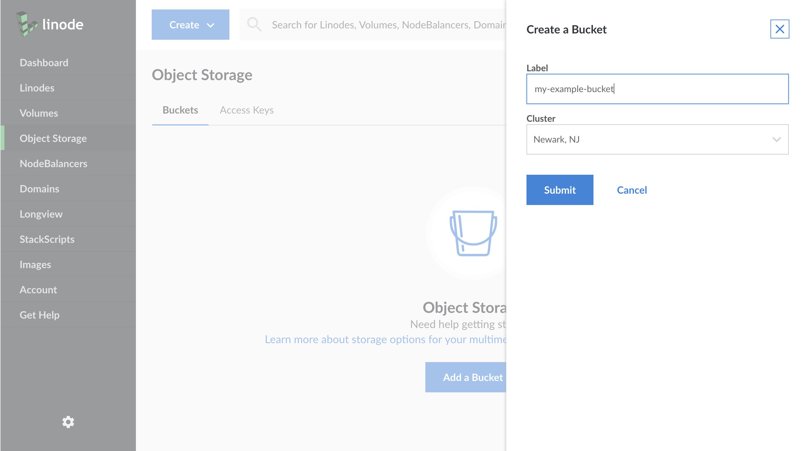

The Cloud Manager provides a web interface for creating buckets. To create a bucket:

1.  If you have not already, log into the [Linode Cloud Manager](https://cloud.linode.com).

1.  Click the **Object Storage** link in the sidebar, and then click **Add a Bucket**.

    

    If you have not created an access key or a bucket before, you are prompted to enable Object Storage.

1.  The **Create a Bucket** menu appears.

    

1.  Add a label for the bucket. See the [Bucket Name](/docs/platform/object-storage/how-to-use-object-storage/#bucket-names) section for rules on naming the bucket.

1.  Choose a cluster location for the bucket to reside in.

    

1.  Click **Submit**. You are now ready to [upload objects to the bucket](/docs/products/storage/object-storage/guides/upload-objects/).
