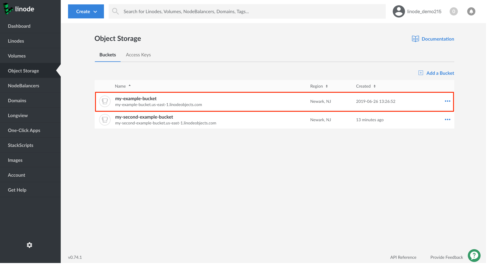

Follow these steps to delete objects in a bucket from the Cloud Manager:

1.  If you have not already, log into the [Linode Cloud Manager](https://cloud.linode.com).

1.  Click the **Object Storage** link in the sidebar. A list of all the buckets appears. Click the bucket whose objects you'd like to delete.

    

1. The bucket's **Objects Listing Page** appears, which displays all the objects in the bucket.

    

1. Click the ellipsis menu corresponding to the object you'd like to delete. Then, select **Delete**.

    

1. A dialog box appears prompting you to confirm if you'd like to delete the object. Click **Delete** to proceed. After the object has been deleted, it is no longer be visible on the **Objects Listing Page**.
