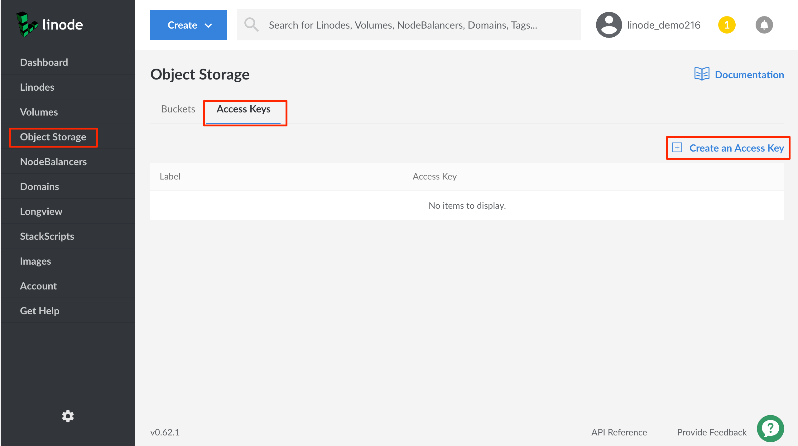
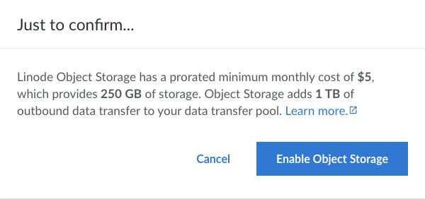
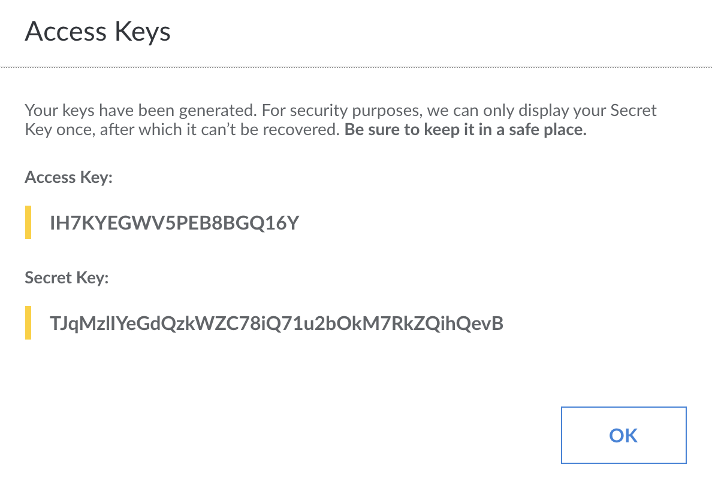

---
author:
  name: Linode
  email: docs@linode.com
description: 'Shortguide that shows you how to generate a key pair for the Linode Object Storage service.'
license: '[CC BY-ND 4.0](https://creativecommons.org/licenses/by-nd/4.0)'
modified: 2020-07-22
modified_by:
  name: Heather Zoppetti
published: 2020-07-22
title: How to Generate a Key Pair for the Linode Object Storage Service
keywords: ["object storage"]
headless: true
show_on_rss_feed: false
tags: ["linode platform"]
aliases: ['/platform/object-storage/object-storage-key-pair-shortguide/']
---

You need a pair of keys to use Object Storage: an access key and a secret key. You can generate them from the Cloud Manager by following these steps:

1.  Log into the [Linode Cloud Manager](https://cloud.linode.com).

1.  Click the **Object Storage** link in the sidebar, click the **Access Keys** tab, and then click the **Create an Access Key** link.

    

1.  A prompt appears asking you to confirm that you'd like to enable Object Storage. Click **Enable Object Storage**.

    

2.  The **Create an Access Key** menu appears.

    

3.  Enter a label for the key pair. This label is how you reference the key pair in the Linode Cloud Manager. Then, click **Submit**.

4.  A window appears that contains the access key and the secret key. Write these down somewhere secure. The access key is visible in the Linode Cloud Manager, but **you can not retrieve the secret key again after you close the window!**

    

    You now have the credentials needed to connect to Linode Object Storage.
