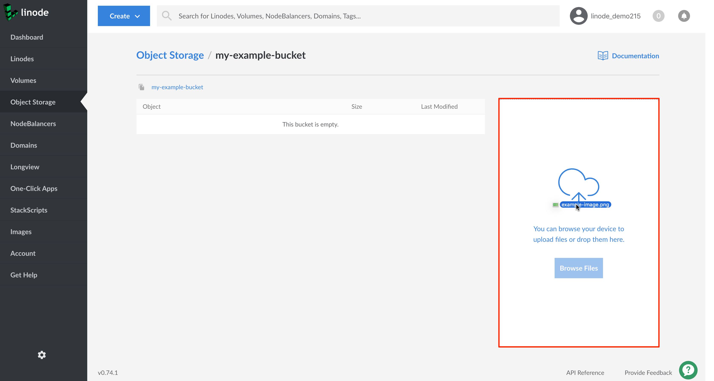
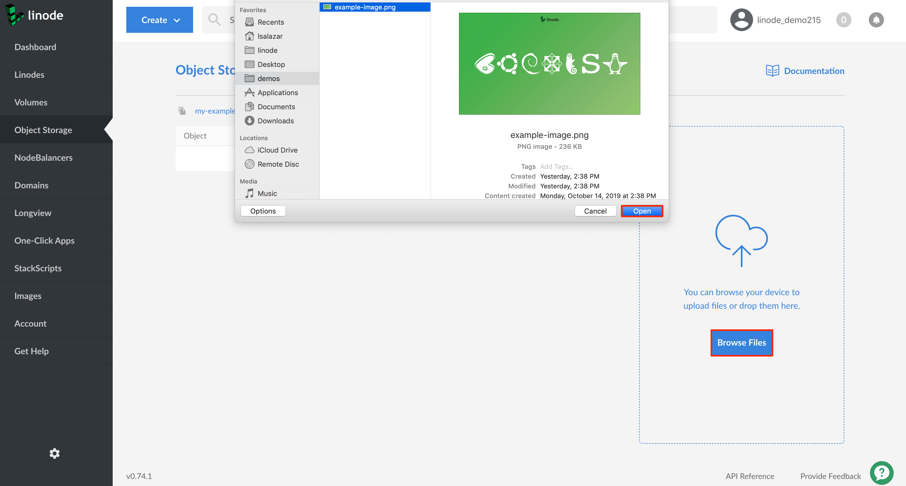
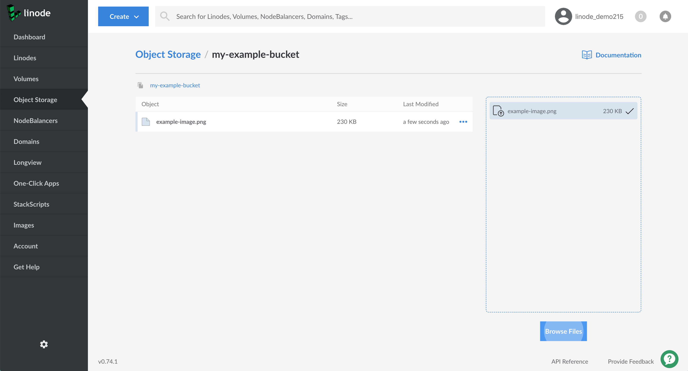

Follow these steps to upload objects to a bucket using the Cloud Manager:

1.  If you have not already, log into the [Linode Cloud Manager](https://cloud.linode.com).

1.  Click the **Object Storage** link in the sidebar. A list of all the buckets appears. Click the bucket where you want to upload the objects.

    

1. The bucket's **Objects Listing Page** appears. In the example, the *my-example-bucket* does not yet contain any objects. You can use the **Upload Files Pane** to drag and drop a file from the local computer to the object storage bucket.

    
You can drag and drop multiple files to the **Upload Files Pane** at one time.
    

    

    You can also click the **Browse Files** button to bring up the local computer's file browser and select a file to upload to the bucket.

    

1.  When the upload has completed, the object appears in the **Objects Listing Page**.

    

    
Individual object uploads are limited to a size of 5GB each, though larger object uploads can be facilitated with multipart uploads. [s3cmd](/docs/platform/object-storage/how-to-use-object-storage/#s3cmd) and [Cyberduck](/docs/platform/object-storage/how-to-use-object-storage/#cyberduck) do this for you automatically if a file exceeds this limit as part of the uploading process.

