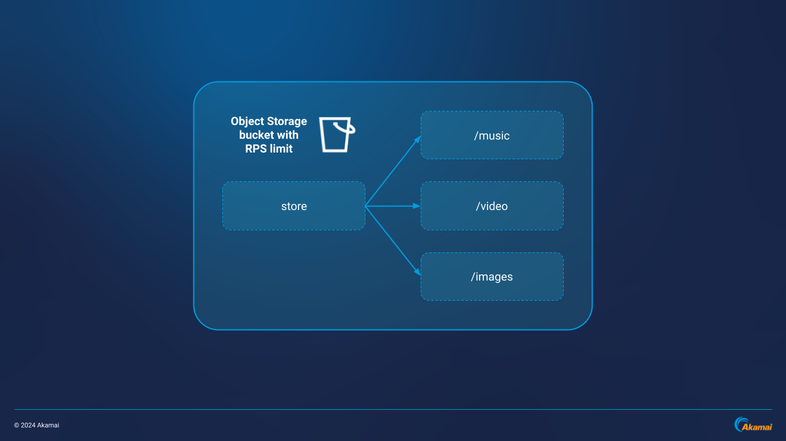
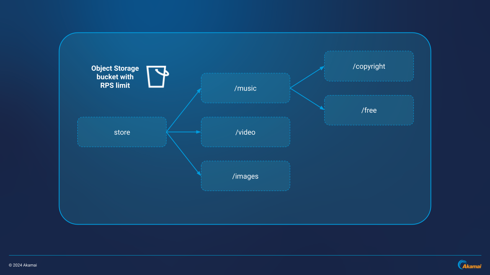
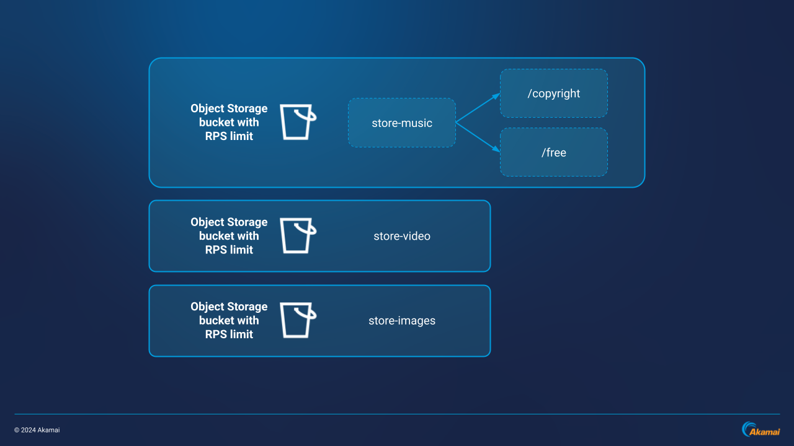
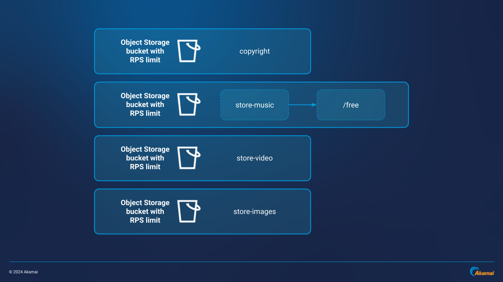

Linode Object Storage can be an efficient, cost-effective solution for streaming and data delivery applications when used as an origin point for Akamai CDN. Since Object Storage is a part of Akamai Connected Cloud and uses the same backbone as Akamai CDN, egress can also be significantly reduced.

Your Object Storage bucket architecture is critical to performance success. In particular, distributing content across multiple buckets helps with load distribution, CDN optimization, and adds security benefits like segmentation and origin obfuscation. This guide walks through bucket design strategies using a commerce site example, including an optimal bucket architecture for Akamai CDN integration.

## How Object Storage Works

[Object Storage](https://techdocs.akamai.com/cloud-computing/docs/object-storage) stores files in a “flat” or unstructured file structure. This means that bucket contents do not exist in a hierarchy like traditional file structures; however, hierarchy can be emulated by creating folders within a bucket. Files (or “objects”) are stored alongside their rich metadata, and access can be granted on a per-object level, with each object assigned a unique URL.

## Bucket Architecture Strategies

### Example Scenario

For the example bucket architecture, consider the following scenario:

-   An online commerce site serving audio, video, and image-based content
-   All audio, video, and image files are stored on object storage as an origin point

### What "Not" To Do

In the first bucket example, the top-level directory `store` has paths to three lower-level directories containing different types of content: music, video, and images. `store` and its sub-directories are in a single bucket. This bucket has a defined requests per second (RPS) limit, where the RPS limit is shared by all objects in the bucket.

Paths in this bucket are: `store/music`, `store/video`, and `store/images`.

Additional content such as copyrighted music or free music is placed as sub-directories under the `store/music` directory. Paths in this bucket now include: `store/music`, `store/music/copyright`, `store/music/free`, `store/video`, and `store/images`.

This architecture places content paths and object endpoints all within the same bucket, `store`. This may potentially result in poor performance with rate limits for the bucket being reached as the number of users and requests increases.


For up-to-date technical specifications of Linode Object Storage such as bucket and rate limits, see: [Object Storage: Technical Specifications and Considerations](https://techdocs.akamai.com/cloud-computing/docs/object-storage#technical-specifications-and-considerations)


### What To Do & How To Leverage CDN Advantages

#### CDN Offloading

One way to overcome these issues is by utilizing Akamai CDN and its ability to cache and deliver content closer to end users. Once the CDN caches an object like a song, video, or image, it doesn’t need to be pulled from origin storage again until the object file changes or the cache timeout expires. For example, by offloading requests to the CDN, a single MP3 audio file downloaded 1 million times only requires a single request to the source bucket.

#### Distributed Bucket Architecture

While Akamai CDN can help get around some limitations of a single-bucket architecture, you can improve and optimize your object storage performance even further by **distributing content across multiple buckets**. Doing this results in:

-   Overall load distribution
-   Increased requests-per-second (RPS) capacity
-   Segmentation of content across endpoints can act as a security measure in case of compromise
-   Distribution of the number of single endpoint requests from the CDN

Rather than placing music, video, and image content folders within the same top-level directory, you can triple [RPS capacity](https://techdocs.akamai.com/cloud-computing/docs/object-storage#technical-specifications-and-considerations) by placing each type of content (music, video, and images) in their own buckets: `store-music`, `store-video`, and `store-images`. In the example below, additional content is placed underneath the top-level directory of each bucket:

-   Paths for the `store-music` bucket include: `store-music`, `store-music/copyright`, and `store-music/free`
-   Paths for the `store-video` bucket include: `store-video`
-   Paths for the `store-images` bucket include: `store-images`

As the site scales, you can create additional buckets and move sub-category content (such as copyrighted or free music) to their own buckets. This increases RPS capacity by further distributing the number of endpoints from which the CDN can cache content. In the example below, copyrighted music is stored in a new `copyright` bucket. RPS capacity is now four times the original bucket architecture:

-   Paths for the `copyright` bucket include: `copyright`
-   Paths for the `store-music` bucket now include: `store-music` and `store-music/free`
-   Paths for the `store-video` bucket include: `store-video`
-   Paths for the `store-images` bucket include: `store-images`

## CDN & the Relationship To Bucket Design

### CDN Considerations

Each bucket in your architecture has the ability to serve as a single origin endpoint from which Akamai CDN can pull content. This results in a distributed backend with less opportunities for RPS limits to be reached. The more distributed your backend architecture is, the higher the capacity for scaling.

### Relationship To Bucket Design

CDNs can often overcome flaws of poorly architected environments. However, when a bucket architecture is designed well, the benefits can directly translate to the CDN. Object Storage bucket architecture should be designed to be functional, scalable, performant, resilient, and cost efficient so that Akamai CDN serves your content as effectively as possible.