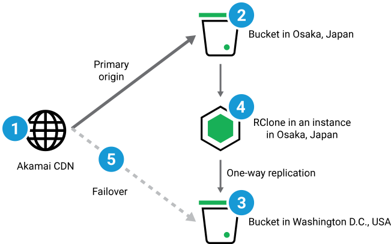

Cross-region data replication has numerous potential benefits, including increased data availability, resilience and redundancy, improved application performance, meeting compliance needs, and more. With Object Storage, one way to achieve this is by using an open source file copying utility such as [rclone](https://rclone.org/) to replicate data across buckets in different regions.

This guide outlines benefits and considerations for cross-region replication of Object Storage buckets, as well as provides ready-to-use scripts for replicating bucket contents from one bucket to another.

## Benefits of Data Replication Across Regions

-   **Failover and Disaster Recovery:** In the event of a disaster, regional outage, or maintenance, having copies of data stored in multiple regions ensures data availability and business continuity. If one region goes down, users and applications can still access data from another region.

-   **Reduced Latency:** Bring data closer to end-users by replicating data to more than one geographical location. This can minimize latency and improve performance for applications and services that rely on object storage.

-   **Compliance and Data Residency:** Some regulations or compliance requirements mandate that data be stored in specific geographic regions. Cross-region replication enables organizations to comply with these requirements while maintaining data availability and redundancy.

-   **Load Balancing:** Distributing data across multiple regions helps balance the load on individual storage systems and can improve overall system performance and scalability.

## Considerations and Limitations

-   **Replication time may vary** depending on bucket regions and network performance.

-   **Large file counts may take longer.** The solution in this guide uses the rclone utility to sync contents from one bucket to another, and the time it takes to complete depends on the amount of files being synced.

-   **The method in this guide syncs bucket contents automatically once.** After the sync occurs, multiple buckets can be managed congruently to ensure consistency between bucket contents. This can be achieved by uploading and deleting objects at the same time via the Linode CLI, the Linode API, or other [Object Storage compatible tools](/docs/products/storage/object-storage/get-started/#object-storage-tools) such as s3cmd.

-   **One-way syncing.** The method in the provided scripts runs a one-way sync from a source bucket to a destination bucket.

## Failover With Akamai CDN

The diagram below illustrates how replication of Object Storage data from one bucket to another has the ability to achieve a failover setup with Akamai’s CDN as a client front end. In this scenario, client requests can be directed to, or cached from, alternate regions in the event the primary region is unavailable:

1.  Akamai's CDN used as a client front end.

1.  An Object Storage bucket located in the Osaka data center is used as the primary origin for Akamai's CDN to source and cache data.

1.  A second Object Storage bucket in the Washington, D.C. data center is set up as a destination bucket for the one-way rclone sync.

1.  A Compute Instance running rclone performs a one-time, one-way sync between buckets. The instance is also located in Osaka (the same as the origin bucket) to reduce latency.

1.  As needed, requests can be redirected to the second bucket in Washington, D.C.




Storage owners are responsible for their own bucket management. To ensure continuity between bucket contents, additional buckets should be integrated with your system and managed similarly after an initial sync with the primary bucket.

For example, if an application was previously set up to send and store logs to a single, primary bucket, the application should then be reconfigured to send logs to all buckets for ongoing redundancy.


### CDN Considerations

Consider the following CDN-level logic when implementing a failover setup:

-   **Failover logic:** Using Akamai's CDN, HTTP-based [site failover](https://techdocs.akamai.com/property-mgr/docs/site-failover) can be achieved to direct traffic to various backends based on configurable behaviors. Additionally, you can use Akamai [Global Traffic Manager (GTM)](https://www.akamai.com/products/global-traffic-management) to implement DNS-based failover logic.

-   **Connection timeouts:** Access requests from the CDN to the bucket cannot be completed or take too long to complete.

-   **404 responses:** The bucket can be accessed, but no files are present.

-   **Other negative responses:** Other 4XX permission denied or client issues, or 5XX server issues.

## Replicating Bucket Contents Across Regions

### The Replication Script

Below is a ready-to-use script for running a one-way sync to replicate contents of Object Storage buckets. The script installs and configures rclone, then uses rclone to scan source bucket contents and run a one-time sync to a destination bucket. The sync can function between any two buckets regardless of region.

```file
#!/bin/bash

# Source bucket information
SRC_REGION=""
SRC_BUCKET=""
SRC_ACCESSKEY=""
SRC_SECRETKEY_PASSWORD=""

# Destination bucket information
DEST_REGION=""
DEST_BUCKET=""
DEST_ACCESSKEY=""
DEST_SECRETKEY_PASSWORD=""

# Install system updates and install rclone
sudo apt-get update
sudo apt-get install rclone -y
echo "Rclone installation completed."

# Rclone configuration file
CONFIG_DIR="$HOME/.config/rclone/"
CONFIG_FILE="$CONFIG_DIR/rclone.conf"

mkdir -p "$CONFIG_DIR"

# Rclone configuration context
CONFIG_CONTENT="[src_region]
type = s3
provider = Ceph
access_key_id = $SRC_ACCESSKEY
secret_access_key = $SRC_SECRETKEY_PASSWORD
endpoint = https://$SRC_REGION.linodeobjects.com
acl = private

[dest_region]
type = s3
provider = Ceph
access_key_id = $DEST_ACCESSKEY
secret_access_key = $DEST_SECRETKEY_PASSWORD
endpoint = https://$DEST_REGION.linodeobjects.com
acl = private"

# copy the config context to the config file
echo "$CONFIG_CONTENT" | sed 's/\[/\n\[/g' > "$CONFIG_FILE"

# verify if config file is created
if [ -f "$CONFIG_FILE" ]; then
    echo "Rclone config file is created at $CONFIG_FILE"
else
    echo "Failed to create Rclone config file."
    exit 1
fi

#Run the first rclone sync command
RCLONE_SYNC_COMMAND="rclone sync -vv src_region:$SRC_BUCKET dest_region:$DEST_BUCKET --log-file=$CONFIG_DIR/rclone.log"
$RCLONE_SYNC_COMMAND
```

### Running the script

-   **Supported distribution images:** Ubuntu 16.04 LTS, Ubuntu 18.04 LTS, Ubuntu 20.04 LTS, Ubuntu 22.04 LTS, Ubuntu 22.10, Ubuntu 23.04, Ubuntu 23.10

-   **Script location:** The script is designed to be run from a Compute Instance on a supported distribution by a user with sudo permissions.

-   **Bucket access:** The script requires access to both your source and destination buckets via an access key and a secret key. If you do not have an access key or secret key for your buckets, follow the instructions for generating them in our [Object Storage - Get Started](/docs/products/storage/object-storage/get-started/#generate-an-access-key) guide.

-   **Defining bucket information:** Prior to running the script, define the following variables at the top of the script (lines 3-13) with the corresponding information for your source and destination buckets. This can be done by typing in the required information between the quotation marks after each variable.

    For example, if `` is the region ID of your source bucket, you would type `` between the quotation marks after the `SRC_REGION` variable: `SRC_REGION=""`

    - `SRC_REGION`: The region ID of your source bucket
    - `SRC_BUCKET`: The label for your source bucket
    - `SRC_ACCESSKEY`: The access key for your source bucket
    - `SRC_SECRETKEY_PASSWORD`: The secret key for your source bucket
    - `DEST_REGION`: The region ID of your destination bucket
    - `DEST_BUCKET`: The label for your destination bucket
    - `DEST_ACCESSKEY`: The access key for your destination bucket
    - `DEST_SECRETKEY_PASSWORD`: The secret key for your destination bucket

    
    A full list of region IDs and their corresponding data centers is listed under the **Availability** section of our [Object Storage](/docs/products/storage/object-storage/#availability) guide.
    

## Alternative Script Deployment Methods

Another method for running the rclone sync is to run the script functions automatically on a newly deployed Compute Instance. You can achieve this by using either our [Metadata](/docs/products/compute/compute-instances/guides/metadata/) (recommended) or [StackScripts](/docs/products/tools/stackscripts/) services.

The first method below uses user data with our Metadata service during instance creation, and the second method uses StackScripts to create the new instance. In both methods, the script functions are run once automatically upon initial boot.

### Deploying with Metadata

1.  Begin the process of deploying a new Compute Instance using the steps in our [Create a Compute Instance](/docs/products/compute/compute-instances/guides/create/) guide.

    When choosing a distribution image, select one of the versions of Ubuntu that is both supported by the script (see [Running the Script](#running-the-script)) and compatible with cloud-init (denoted with a note icon).

    When choosing a region, select a region where the Metadata servce is available. A list of data center availability for Metadata can be found in our [Overview of the Metadata Service](/docs/products/compute/compute-instances/guides/metadata/#availability) guide.

    Stop when you get to the **Add User Data** section.

1.  The **Add User Data** section works with our Metadata service and is compatible with cloud-config data or executable scripts (this method). Here is where you will add the contents of the script below so that it can be consumed by cloud-init when your instance boots for the first time:

    ```file
    #!/bin/bash

    # Source bucket information
    SRC_REGION=""
    SRC_BUCKET=""
    SRC_ACCESSKEY=""
    SRC_SECRETKEY_PASSWORD=""

    # Destination bucket information
    DEST_REGION=""
    DEST_BUCKET=""
    DEST_ACCESSKEY=""
    DEST_SECRETKEY_PASSWORD=""

    # Install system updates and install rclone
    sudo apt-get update
    sudo apt-get install rclone -y
    echo "Rclone installation completed."

    # Rclone configuration file
    CONFIG_DIR="/root/.config/rclone/"
    CONFIG_FILE="$CONFIG_DIR/rclone.conf"

    mkdir -p "$CONFIG_DIR"

    # Rclone configuration context
    CONFIG_CONTENT="[src_region]
    type = s3
    provider = Ceph
    access_key_id = $SRC_ACCESSKEY
    secret_access_key = $SRC_SECRETKEY_PASSWORD
    endpoint = https://$SRC_REGION.linodeobjects.com
    acl = private

    [dest_region]
    type = s3
    provider = Ceph
    access_key_id = $DEST_ACCESSKEY
    secret_access_key = $DEST_SECRETKEY_PASSWORD
    endpoint = https://$DEST_REGION.linodeobjects.com
    acl = private"

    # copy the config context to the config file
    echo "$CONFIG_CONTENT" | sed 's/\[/\n\[/g' > "$CONFIG_FILE"

    # verify if config file is created
    if [ -f "$CONFIG_FILE" ]; then
        echo "Rclone config file is created at $CONFIG_FILE"
    else
        echo "Failed to create Rclone config file."
        exit 1
    fi

    #Run the first rclone sync command
    RCLONE_SYNC_COMMAND="rclone sync -vv src_region:$SRC_BUCKET dest_region:$DEST_BUCKET --log-file=$CONFIG_DIR/rclone.log"
    $RCLONE_SYNC_COMMAND
    ```

1.  Once the script contents are entered into the **User Data** field, define the required variables with your source and destination bucket information as specified in [Running the Script](#running-the-script) above.

1.  Configure any additional options for your Compute Instance and select **Create Linode**.

1.  The user data you entered will be consumed by cloud-init upon initial boot and run as a script once fully booted.

### Deploying with StackScripts

1.  Create a new StackScript using the steps in our [StackScripts - Get Started](/docs/products/tools/stackscripts/get-started/#create-the-stackscript) guide.

1.  Enter your **StackScript Label** and **Description**, and select your **Target Image**. Supported distribution images are listed in the [Running the Script](#running-the-script) section.

1.  In the **Script** field, copy and paste the script contents below:

    ```file
    #!/bin/bash

    # <UDF name="SRC_REGION" label="Source Bucket Region" default="jp-osa-1" oneOf="nl-ams-1,us-southeast-1,in-maa-1,us-ord-1,eu-central-1,id-cgk-1,us-lax-1,es-mad-1,us-mia-1,it-mil-1,us-east-1,jp-osa-1,fr-par-1,br-gru-1,us-sea-1,ap-south-1,se-sto-1,us-iad-1"/>
    # <UDF name="SRC_BUCKET" label="Source Bucket Name" default="" />
    # <UDF name="SRC_ACCESSKEY" label="Source Bucket Access Key" default="" />
    # <UDF name="SRC_SECRETKEY_PASSWORD" label="Source Bucket Secret Key" default="" />
    # <UDF name="DEST_REGION" label="Destination Bucket Region" default="jp-osa-1" oneOf="nl-ams-1,us-southeast-1,in-maa-1,us-ord-1,eu-central-1,id-cgk-1,us-lax-1,es-mad-1,us-mia-1,it-mil-1,us-east-1,jp-osa-1,fr-par-1,br-gru-1,us-sea-1,ap-south-1,se-sto-1,us-iad-1"/>
    # <UDF name="DEST_BUCKET" label="Destination Bucket Name" default="" />
    # <UDF name="DEST_ACCESSKEY" label="Destination Bucket Access Key" default="" />
    # <UDF name="DEST_SECRETKEY_PASSWORD" label="Destination Bucket Secret Key" default="" />

    sudo apt-get update
    sudo apt-get install rclone -y
    echo "Rclone installation completed."

    # Rclone configuration file
    CONFIG_FILE="$HOME/.config/rclone/rclone.conf"

    # Rclone Directory creation
    # This should be manually configured as it may be under /root directory
    CONFIG_DIR=$(dirname "$CONFIG_FILE")
    mkdir -p "$CONFIG_DIR"

    # Rclone configuration context
    CONFIG_CONTENT="[src_region]
    type = s3
    provider = Ceph
    access_key_id = $SRC_ACCESSKEY
    secret_access_key = $SRC_SECRETKEY_PASSWORD
    endpoint = https://$SRC_REGION.linodeobjects.com
    acl = private

    [dest_region]
    type = s3
    provider = Ceph
    access_key_id = $DEST_ACCESSKEY
    secret_access_key = $DEST_SECRETKEY_PASSWORD
    endpoint = https://$DEST_REGION.linodeobjects.com
    acl = private"

    # copy the config context to the config file
    echo "$CONFIG_CONTENT" | sed 's/\[/\n\[/g' > "$CONFIG_FILE"

    # verify if config file is created
    if [ -f "$CONFIG_FILE" ]; then
        echo "Rclone config file is created at $CONFIG_FILE"
    else
        echo "Failed to create Rclone config file."
        exit 1
    fi

    #Run the first rclone sync command
    RCLONE_SYNC_COMMAND="rclone sync -vv src_region:$SRC_BUCKET dest_region:$DEST_BUCKET --log-file=$CONFIG_DIR/rclone.log"
    $RCLONE_SYNC_COMMAND
    ```

1.  Select **Create StackScript**.

1.  Deploy the StackScript by locating it on your **StackScripts** page in Cloud Manager. Click the ellipsis option to the right of the StackScript and select **Deploy New Linode**. This brings you to the **Create** screen.

1.  Fill out the **Advanced Options** with your source and destination bucket details. For both buckets, you will need the following:

    - Bucket region ID
    - Bucket name
    - Bucket access key
    - Bucket secret key

1.  Select your deployment **Image**. This should be the same as the target image you selected when creating your StackScript.

1.  Select your desired **Region** and **Linode Plan**.

1.  Enter a **Linode Label**, create a **Root Password**, and complete any additional options you would like to configure.

1.  Select **Create Linode**.

## Next Steps

For more information on using rclone or managing Object Storage, see the below links and documentation:

- [Rclone official documentation](https://rclone.org/docs/)

- [Object Storage - Guides](/docs/products/storage/object-storage/guides/)