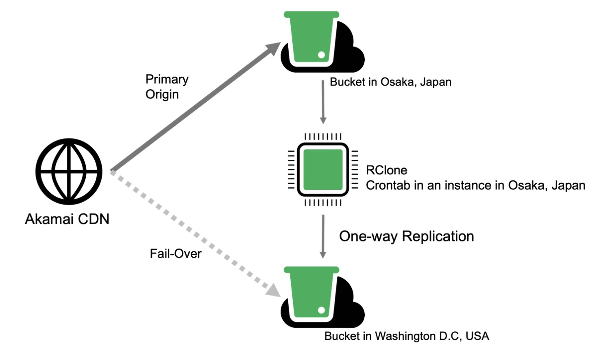

Cross-region data replication has numerous potential benefits, including increased data availability, resilience and redundancy, improved application performance, meeting compliance needs, and more. With Object Storage, one way to achieve this is by using an open source file copying utility such as rclone running on a Compute Instance to replicate data across buckets in different regions.

This guide outlines benefits and considerations for cross-region replication of Object Storage buckets, as well as provides a ready-to-use script for replicating bucket contents from one bucket to another. The provided script deploys a Compute Instance that runs a one-time automatic sync between buckets with rclone after deployment. Also included in this guide are steps to automate a syncing schedule with crontab after an initial sync with rclone.

## Benefits of Data Replication Across Regions

- **Failover and Disaster Recovery:** In the event of a disaster, regional outage, or maintenance, having copies of data stored in multiple regions ensures data availability and business continuity. If one region goes down, users and applications can still access data from another region.

- **Reduced Latency:** Bring data closer to end-users by replicating data to more than one geographical location. This can minimize latency and improve performance for applications and services that rely on object storage.

- **Compliance and Data Residency:** Some regulations or compliance requirements mandate that data be stored in specific geographic regions. Cross-region replication enables organizations to comply with these requirements while maintaining data availability and redundancy.

- **Load Balancing:** Distributing data across multiple regions helps balance the load on individual storage systems and can improve overall system performance and scalability.

## Considerations and Limitations

- **Replication time may vary** depending on bucket regions and network performance.

- **Large file counts may take longer.** The solution in this guide uses the rclone utility to sync contents from one bucket to another, and the time it takes to complete depends on the amount of files being synced.

- **The method in this guide syncs bucket contents automatically once.** In order to sync contents again, you may need to run the sync again manually or set up automated syncing with crontab (See [Set Up Recurring Syncs With Crontab](#set-up-recurring-syncs-with-crontab)).

- **One-way syncing.** The method in the provided scripts runs a one-way sync from a source bucket to a destination bucket.

## Failover With Akamai CDN

The diagram below illustrates how continuous replication of object storage data from one bucket to another has the ability to achieve a fail-over setup with Akamai’s CDN as a client front end. Using the failover functionality of [Global Traffic Manager (GTM)](https://www.akamai.com/products/global-traffic-management), client requests can be directed to, or cached from, alternative regions in the event the primary region is unavailable:

1.  Akamai's CDN running Global Traffic Manager.

2.  An Object Storage bucket located in the Osaka data center is used as the primary origin for Akamai's CDN to source and cache data.

3.  To reduce syncing latency, a Compute Instance scheduled to perform a recurring rclone sync between buckets is also located in Osaka (the same as the origin bucket).

4.  A second Object Storage bucket in the Washington, D.C. data center is set up as a destination bucket for the one-way rclone sync.

5.  As needed, Global Traffic Manager can redirect to the second bucket in Washington, D.C. since it is being regularly synced with the primary bucket in Osaka.



## How to Replicate Bucket Contents Across Regions

This guide includes two scripts for replicating contents of Object Storage buckets across regions. The first method uses user data with our Metadata service during the deployment of a new Compute Instance, and the second method uses our StackScripts service.

The scripts in both methods below install, configure, and run the rclone utility on a new Compute Instance running your selected version of Ubuntu. The sync happens automatically one time and runs from your specified source bucket to your destination bucket.

When deploying your Compute Instance, you must select a supported image for the script. Supported images include: Ubuntu 16.04 LTS, Ubuntu 18.04 LTS, Ubuntu 20.04 LTS, Ubuntu 22.04 LTS, Ubuntu 22.10, Ubuntu 23.04, Ubuntu 23.10

### Method 1: Metadata

1.  Begin the process of deploying a new Compute Instance using the steps in our [Create a Compute Instance](/docs/products/compute/compute-instances/guides/create/) guide.

    When choosing a distribution image, select one of the versions of Ubuntu that is both supported by the script (see the [list above](#how-to-replicate-bucket-contents-across-regions)) and compatible with cloud-init (denoted with a note icon).

    When choosing a region, select a region where the Metadata servce is available. A list of data center availability for Metadata can be found in our [Overview of the Metadata Service](/docs/products/compute/compute-instances/guides/metadata/#availability) guide.

    Stop when you get to the **Add User Data** section.

1.  The **Add User Data** section works with our [Metadata service](/docs/products/compute/compute-instances/guides/metadata/) and is compatible with cloud-config data or executable scripts. Here is where you will add the contents of the script below so that it can be consumed by cloud-init when your instance boots for the first time:

    ```file
    #!/bin/bash

    # The region ID of your source bucket
    # Choose one of the following: nl-ams-1,us-southeast-1,in-maa-1,us-ord-1,eu-central-1,id-cgk-1,us-lax-1,es-mad-1,us-mia-1,it-mil-1,us-east-1,jp-osa-1,fr-par-1,br-gru-1,us-sea-1,ap-south-1,se-sto-1,us-iad-1
    SRC_REGION=""

    # The label for your source bucket
    SRC_BUCKET=""

    # The access key for your source bucket
    SRC_ACCESSKEY=""

    # The secret key for your source bucket
    SRC_SECRETKEY_PASSWORD=""

    # The region ID of your destination bucket
    # Choose one of the following: nl-ams-1,us-southeast-1,in-maa-1,us-ord-1,eu-central-1,id-cgk-1,us-lax-1,es-mad-1,us-mia-1,it-mil-1,us-east-1,jp-osa-1,fr-par-1,br-gru-1,us-sea-1,ap-south-1,se-sto-1,us-iad-1
    DEST_REGION=""

    # The label for your destination bucket
    DEST_BUCKET=""

    # The access key for your destination bucket
    DEST_ACCESSKEY=""

    # The secret key for your destination bucket
    DEST_SECRETKEY_PASSWORD=""

    # Install system updates and install rclone
    sudo apt-get update
    sudo apt-get install rclone -y
    echo "Rclone installation completed."

    # Rclone configuration file
    CONFIG_FILE="$HOME/.config/rclone/rclone.conf"

    # Rclone Directory creation
    # This should be manually configured as it may be under /root directory
    CONFIG_DIR=$(dirname "$CONFIG_FILE")
    mkdir -p "$CONFIG_DIR"

    # Rclone configuration context
    CONFIG_CONTENT="[src_region]
    type = s3
    provider = Ceph
    access_key_id = $SRC_ACCESSKEY
    secret_access_key = $SRC_SECRETKEY_PASSWORD
    endpoint = https://$SRC_REGION.linodeobjects.com
    acl = private

    [dest_region]
    type = s3
    provider = Ceph
    access_key_id = $DEST_ACCESSKEY
    secret_access_key = $DEST_SECRETKEY_PASSWORD
    endpoint = https://$DEST_REGION.linodeobjects.com
    acl = private"

    # copy the config context to the config file
    echo "$CONFIG_CONTENT" | sed 's/\[/\n\[/g' > "$CONFIG_FILE"

    # verify if config file is created
    if [ -f "$CONFIG_FILE" ]; then
        echo "Rclone config file is created at $CONFIG_FILE"
    else
        echo "Failed to create Rclone config file."
        exit 1
    fi

    #Run the first rclone sync command
    RCLONE_SYNC_COMMAND="rclone sync -vv src_region:$SRC_BUCKET dest_region:$DEST_BUCKET --log-file=$CONFIG_DIR/rclone.log"
    ```

1.  Once the script contents are entered into the **User Data** field, define the following values with their corresponding information in lines 3-27. This can be done by typing in the required information between the quotation marks after each variable.

    For example, if `` is the region ID of your source bucket, you would type `` between the quotation marks after `SRC_REGION`: `SRC_REGION=""`

    - `SRC_REGION`: The region ID of your source bucket
    - `SRC_BUCKET`: The label for your source bucket
    - `SRC_ACCESSKEY`: The access key for your source bucket
    - `SRC_SECRETKEY_PASSWORD`: The secret key for your source bucket
    - `DEST_REGION`: The region ID of your destination bucket
    - `DEST_BUCKET`: The label for your destination bucket
    - `DEST_ACCESSKEY`: The access key for your destination bucket
    - `DEST_SECRETKEY_PASSWORD`: The secret key for your destination bucket

    
    A full list of region IDs and their corresponding data centers is listed under the **Availability** section of our [Object Storage](/docs/products/storage/object-storage/#availability) guide.
    

1.  Configure any additional options for your Compute Instance and select **Create Linode**.

1.  The user data you entered will be consumed by cloud-init upon initial boot and run as a script once fully booted.


### Method 2: StackScript

1.  Create a new StackScript using the steps in our [StackScripts - Get Started](/docs/products/tools/stackscripts/get-started/#create-the-stackscript) guide.

1.  Enter your **StackScript Label** and **Description**, and select your **Target Image**. Supported distribution images are listed in the [How to Replicate Bucket Contents Across Regions](#how-to-replicate-bucket-contents-across-regions) section above.

1.  In the **Script** field, copy and paste the script contents below:

    ```file
    #!/bin/bash

    # <UDF name="SRC_REGION" label="Source Bucket Region" default="jp-osa-1" oneOf="nl-ams-1,us-southeast-1,in-maa-1,us-ord-1,eu-central-1,id-cgk-1,us-lax-1,es-mad-1,us-mia-1,it-mil-1,us-east-1,jp-osa-1,fr-par-1,br-gru-1,us-sea-1,ap-south-1,se-sto-1,us-iad-1"/>
    # <UDF name="SRC_BUCKET" label="Source Bucket Name" default="" />
    # <UDF name="SRC_ACCESSKEY" label="Source Bucket Access Key" default="" />
    # <UDF name="SRC_SECRETKEY_PASSWORD" label="Source Bucket Secret Key" default="" />
    # <UDF name="DEST_REGION" label="Destination Bucket Region" default="jp-osa-1" oneOf="nl-ams-1,us-southeast-1,in-maa-1,us-ord-1,eu-central-1,id-cgk-1,us-lax-1,es-mad-1,us-mia-1,it-mil-1,us-east-1,jp-osa-1,fr-par-1,br-gru-1,us-sea-1,ap-south-1,se-sto-1,us-iad-1"/>
    # <UDF name="DEST_BUCKET" label="Destination Bucket Name" default="" />
    # <UDF name="DEST_ACCESSKEY" label="Destination Bucket Access Key" default="" />
    # <UDF name="DEST_SECRETKEY_PASSWORD" label="Destination Bucket Secret Key" default="" />

    sudo apt-get update
    sudo apt-get install rclone -y
    echo "Rclone installation completed."

    # Rclone configuration file
    CONFIG_FILE="$HOME/.config/rclone/rclone.conf"

    # Rclone Directory creation
    # This should be manually configured as it may be under /root directory
    CONFIG_DIR=$(dirname "$CONFIG_FILE")
    mkdir -p "$CONFIG_DIR"

    # Rclone configuration context
    CONFIG_CONTENT="[src_region]
    type = s3
    provider = Ceph
    access_key_id = $SRC_ACCESSKEY
    secret_access_key = $SRC_SECRETKEY_PASSWORD
    endpoint = https://$SRC_REGION.linodeobjects.com
    acl = private

    [dest_region]
    type = s3
    provider = Ceph
    access_key_id = $DEST_ACCESSKEY
    secret_access_key = $DEST_SECRETKEY_PASSWORD
    endpoint = https://$DEST_REGION.linodeobjects.com
    acl = private"

    # copy the config context to the config file
    echo "$CONFIG_CONTENT" | sed 's/\[/\n\[/g' > "$CONFIG_FILE"

    # verify if config file is created
    if [ -f "$CONFIG_FILE" ]; then
        echo "Rclone config file is created at $CONFIG_FILE"
    else
        echo "Failed to create Rclone config file."
        exit 1
    fi

    #Run the first rclone sync command
    RCLONE_SYNC_COMMAND="rclone sync -vv src_region:$SRC_BUCKET dest_region:$DEST_BUCKET --log-file=$CONFIG_DIR/rclone.log"
    $RCLONE_SYNC_COMMAND
    ```

1.  Select **Create StackScript**.

1.  Deploy the StackScript by locating it on your StackScripts page in Cloud Manager. Click the ellipsis option to the right of the StackScript and select **Deploy New Linode**. This brings you to the *Create From* screen.

1.  Fill out the **Advanced Options** with your source and destination bucket details. For both buckets, you will need the following:

    - Bucket region ID
    - Bucket name
    - Bucket access key
    - Bucket secret key

1.  If you do not have an access key or secret key for your buckets, you can follow our instructions for generating them in our [Object Storage - Get Started](/docs/products/storage/object-storage/get-started/#generate-an-access-key) guide.

1.  Select your deployment **Image**. This should be the same as the Target Image you selected when creating your StackScript.

1.  Select your desired **Region** and **Linode Plan**.

1.  Enter a **Linode Label**, create a **Root Password**, and complete any additional options you would like to configure.

1.  Select **Create Linode**.

## Set Up Recurring Syncs With Crontab


If you have a large amount of objects (over __), do not set up cron jobs for recurring syncs as it could result in high, unexpected storage costs, negatively impact Akamai infrastructure, or negatively affect other customers.


In the deployed script, the initial command to run a sync between buckets is defined and assigned to the variable `RCLONE_SYNC_COMMAND`. To run recurring, automated syncs, you can configure the crontab utility to call on the variable on a set schedule with cron jobs.

Crontab uses five “fields” to determine the frequency of the job it needs to run. In order, the fields are defined by the following values:

- Minutes (0-59)
- Hours (0-23)
- Days of the month (1-31)
- Months (1-12)
- Days of the week (0-6)

Using the `RCLONE_SYNC_COMMAND` variable, the command below creates a temporary crontab file and sets up a cron job for a weekly sync at 8:00 PM every Monday. `00` represents minute zero, `20` represents 8:00 PM (hour 20 on the 24 hour time scale), the first asterisk (`*`) is a placeholder for day values, the second asterisk (`*`) is a placeholder for month values, and the `1` represents Monday where Sunday is 0. Replace each field with your preferred values:

```command
echo “00 20 * * 1 $RCLONE_SYNC_COMMAND” >> /tmp/crontab.tmp
crontab /tmp/crontab.tmp
```


Rclone reanalyzes bucket contents each time a sync job is run. To ensure ample amount of time for syncs to occur, it is not recommended to perform syncs too soon after one another.

In general, we do not recommend syncs across buckets occurring more than 1x daily.


## Next Steps

For more information on using rclone or scheduling tasks with cron, see the below links and documentation:

- [Rclone official documentation](https://rclone.org/docs/)

- [Using Cron to Schedule Tasks for Certain Times or Intervals](/docs/guides/schedule-tasks-with-cron/)

- [Cron format helper](https://abunchofutils.com/u/computing/cron-format-helper/)