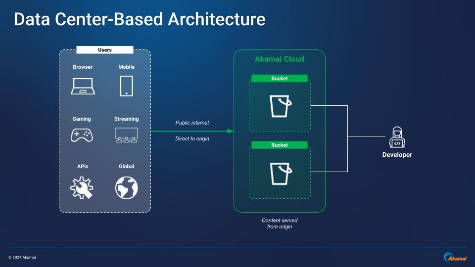
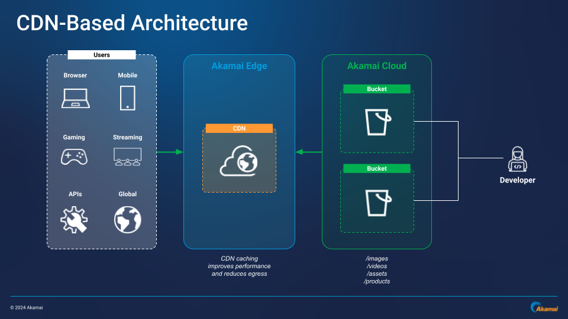
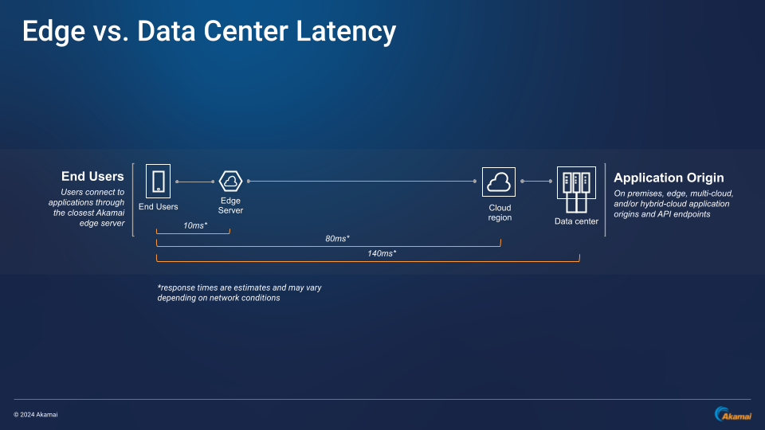

Object storage stores data in an unstructured, flat format where data is stored as “objects”. Object storage is cheaper than block storage, and it can be especially useful for large volumes of unstructured data like photos, videos, documents, web pages, sensor data, and audio files. Cloud-based object storage systems distribute this unstructured data across multiple physical devices for redundancy, while users are able to access the content from a single interface. Object storage is HTTP accessible and ideal for building cloud-native applications that require scale and flexibility, as well as storage for application artifacts like analytics, backups, and archives.

With its reliability and cost-effectiveness, Linode Object Storage can be coupled with Akamai’s content delivery network (CDN) to create a viable solution for applications that need to serve large files and large amounts of data. This includes video on demand (VOD) streaming, ecommerce, firmware update distribution, media-based website content, and other applications.

The solution presented in this guide focuses on the architectural best practices for designing and operating reliable, secure, efficient, and sustainable content storage and delivery systems using [Linode Object Storage](https://techdocs.akamai.com/cloud-computing/docs/object-storage) on Akamai Connected Cloud with [Akamai CDN](https://techdocs.akamai.com/platform-basics/docs/content-delivery).

## Object Storage For Data Delivery

With the right [bucket architecture](/docs/guides/optimizing-obj-bucket-architecture-for-akamai-cdn/), object storage can be used to house content for effective unstructured data delivery. Object storage supports file-critical features such as encryption, compression, deduplication, and versioning, and its accessibility via HTTP protocols offers instant access to objects. These factors make object storage ideal for storing unstructured data like video and audio files that don’t require frequent updating, as well as services that require efficient input/output.

## Object Storage Specifications, Considerations, and Strategies for Streaming Data

### Technical Specifications

When architecting applications that source data from object storage -- like streaming video or audio -- consider these technical factors:

-   **Bandwidth and latency:** Object storage solutions are not always optimized for high-bandwidth streaming applications. This can lead to potential buffering issues and slower delivery speeds.

-   **Scalability:** To preserve infrastructure integrity, object storage systems may have limitations in place for concurrent connections and simultaneous user streams. This can impact the ability to efficiently handle spikes in demand.

-   **Retrieval speed:** Without CDN edge-based caching, content streamed directly from object storage origin servers may result in slower data retrieval speeds and higher latency.

-   **Data transfer and egress costs:** Streaming directly from object storage can incur high egress costs because each user request may result in data transfer fees. When using a CDN, only requests to update the CDN cache may incur data transfer fees.

-   **Resource limits:** Object storage systems may have limitations on the size of individual objects, potentially restricting the size of videos that can be efficiently streamed.

-   **Rate limits:** Object storage solutions often have rate limits imposed on a requests per second (RPS) basis. If users are accessing Object Storage endpoints directly without the use of a CDN, there is a greater chance RPS limits are reached as more users access content.

-   **Updating manifests:** Bucket contents can be determined by syncing with a manifest. This means that when source manifests are updated often, buckets may constantly have their contents changed.

### Internet Considerations

There are multiple internet-related factors to consider when building out a content delivery solution:

-   **First mile:** The content provider connection point. Should content providers set up content to be accessible from a single physical location (i.e. an origin data center), user access is constrained by first mile connectivity limitations.

-   **Last mile:** The end-user connection point. Slow user internet connection speeds are uncontrollable and unpredictable. They can also mask or obfuscate problems related to the first mile, network peering, and bottleneck issues.

-   **Peering points:** The connection points between two networks. These connections are not guaranteed and are difficult to troubleshoot. Networks benefit financially from connectivity with content providers and end users but not each other.

-   **Backbone:** The infrastructure and physical connections that make up the internet. Hardware and network capacity limitations can cause performance issues.

### Data Center-Based Architectures

Consider the data center-based architecture below. Without the use of a CDN, object storage content distribution is limited to individual, origin data centers. Data center-based delivery relies heavily on public networks to pull and deliver content from regional origin points. At scale, this may result in bandwidth issues, high latency, and inefficient experiences for large numbers of users.

## Advantages of Using Akamai CDN

CDNs are crucial for data delivery solutions because they cache content like images, videos, and other files on edge servers closer to end-users. This reduces latency and overall load on origin servers, improves delivery speed and efficiency, and saves money by reducing origin requests and lowering egress costs. For example, in use cases such as content streaming, CDNs can cache segments from streams to reduce startup times, limit stream interruptions, and eliminate potential buffering issues.

Object storage can’t scale linearly with the number of users, but using it as an origin point for CDN delivery overcomes this by allowing users to interact with the CDN instead of the object storage system. Applications can then store objects independently of user traffic, with the added benefit of CDN-based security.

### CDN-Based Distributed Architecture

In the CDN-based architectures below, Akamai CDN lives between end users and the origin data point. As end users request information, Akamai CDN sources and caches data from Linode Object Storage on Akamai Connected Cloud, and then serves that data from an edge server close to the end user. In this scenario, latency is reduced, users never need to interact with the origin, and the object storage infrastructure remains protected and optimized for efficiency and growth.

## Benefits of Using Akamai CDN with Object Storage for Data Delivery

Akamai Connected Cloud brings content closer to end-users and offers several technical and financial benefits for streaming applications, including:

-   Audience and end-user geographic reach
-   Programmability through well-defined APIs
-   Flexibility to support structured and semi-structured data
-   Scalable consumption models
-   Efficient data recovery and retrieval based on detailed metadata
-   Capacity advantages via distribution across multiple nodes
-   Enhanced data durability and availability through replication and distribution mechanisms
-   Limiting reliance on transit networks
-   Origin offloading, content caching, and reduced latency
-   Significantly reduced object storage-based egress costs, because no egress is imposed between Linode Object Storage and Akamai CDN

Object storage is a standardized, key component in many content production tools, enabling seamless integration and organization of large amounts of files. Its interoperability across various applications, tools, and workflows ensures data is centralized and easily accessible. Object storage simplifies content distribution and backup processes, and it provides a secure, cost-effective method for storing and sharing large volumes of unstructured data.

When architected properly and paired with Akamai’s CDN, Linode Object Storage allows for fast, efficient access to vast libraries of content connected on the same backbone. This results in readily available content - a crucial factor for streaming and other data delivery workflows.

## Next Steps

To learn more about object storage bucket design for streaming and steps for CDN integration, see the following guide:

- [Optimizing Object Storage Bucket Architecture for Akamai CDN](/docs/guides/optimizing-obj-bucket-architecture-for-akamai-cdn/)