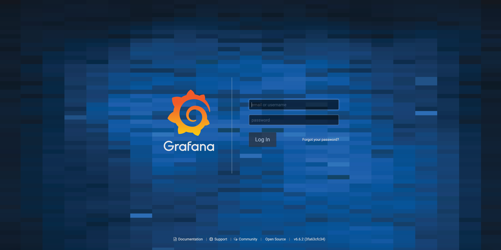

[Grafana](https://grafana.com/docs/grafana/latest/guides/what-is-grafana/) is an open source analytics and monitoring solution with a focus on accessibility for metric visualization. You can use Grafana to create, monitor, store, and share metrics with your team to keep tabs on your infrastructure. Grafana is very lightweight and does not use a lot of memory and CPU resources.

## Deploy Grafana with One-Click Apps



### Grafana Options

The Grafana One-Click form includes a field for your Grafana admin's password. After your app is deployed, visit the [Getting Started After Deployment](#getting-started-after-deployment) section.

| **Field**&nbsp;&nbsp;&nbsp;&nbsp;&nbsp;&nbsp;&nbsp;&nbsp;&nbsp;&nbsp;&nbsp;&nbsp;&nbsp;&nbsp;&nbsp;&nbsp;&nbsp;&nbsp;&nbsp;&nbsp;&nbsp;&nbsp;&nbsp;&nbsp;&nbsp;&nbsp;&nbsp;&nbsp;&nbsp;&nbsp;&nbsp;&nbsp;&nbsp; | **Description** |
|-----------|-----------------|
| **Grafana Password** | Set your Grafana instance's admin password. You will use this password when first logging into Grafana. |

### Linode Options

After providing the app-specific options, provide configurations for your Linode server:

| **Configuration** | **Description** |
|-------------------|-----------------|
| **Select an Image** | Debian 9 is currently the only image supported by the Grafana One-Click App, and it is pre-selected on the Linode creation page. *Required* |
| **Region** | The region where you would like your Linode to reside. In general, it's best to choose a location that's closest to you. For more information on choosing a DC, review the [How to Choose a Data Center](/docs/platform/how-to-choose-a-data-center) guide. You can also generate [MTR reports](/docs/networking/diagnostics/diagnosing-network-issues-with-mtr/) for a deeper look at the network routes between you and each of our data centers. *Required*. |
| **Linode Plan** | Your Linode's [hardware resources](/docs/platform/how-to-choose-a-linode-plan/#hardware-resource-definitions). You can use any size Linode for your Grafana App as it uses minimal system resources. The minimum recommended memory is 255 MB and the minimum recommended CPU is 1. You can always [resize your Linode](/docs/platform/disk-images/resizing-a-linode/) to a different plan later if you feel you need to increase or decrease your system resources. *Required* |
| **Linode Label** | The name for your Linode, which must be unique between all of the Linodes on your account. This name will be how you identify your server in the Cloud Manager’s Dashboard. *Required*. |
| **Add Tags** | A tag to help organize and group your Linode resources. [Tags](/docs/quick-answers/linode-platform/tags-and-groups/) can be applied to Linodes, Block Storage Volumes, NodeBalancers, and Domains. |
| **Root Password** | The primary administrative password for your Linode instance. This password must be provided when you log in to your Linode via SSH. The password must meet the complexity strength validation requirements for a strong password. Your root password can be used to perform any action on your server, so make it long, complex, and unique. *Required* |

When you've provided all required Linode Options, click on the **Create** button. **Your Grafana app will complete installation anywhere between 2-5 minutes after your Linode has finished provisioning**.

## Getting Started after Deployment

### Access Your Grafana Client

Now that your Grafana One-Click App is deployed, you can log into Grafana to access all of its monitoring and visualization features.

1. Open a browser and navigate to your [Linode's IP address](/docs/quick-answers/linode-platform/find-your-linodes-ip-address/) and port `3000`, for example, `http://192.0.2.0:3000/`. By default, Grafana will listen to port `3000`.

    
The Grafana One-Click App will install and enable the [UFW firewall](/docs/security/firewalls/configure-firewall-with-ufw/) allowing TCP traffic on port `3000`.
    

1. Viewing Grafana's log in page, enter in `admin` as the *username* and the Grafana password you set in the [Grafana Options](#grafana-options) section of the Cloud Manager, as the *password*. Click on the **Log In** button.

    

1. Once you are logged into Grafana, complete your configurations by [adding a data source](https://grafana.com/docs/grafana/latest/features/datasources/add-a-data-source/#add-a-data-source), [creating dashboards](https://grafana.com/docs/grafana/latest/guides/getting_started/#create-a-dashboard), and [adding users](https://grafana.com/docs/grafana/latest/permissions/overview/).


