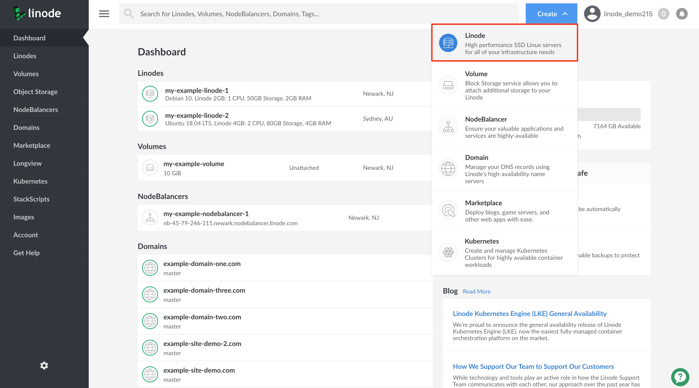
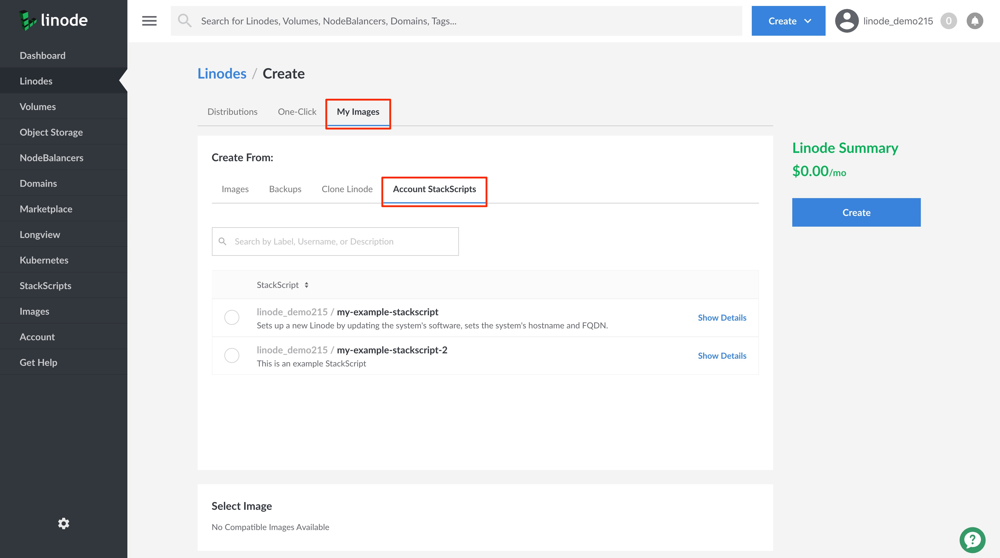
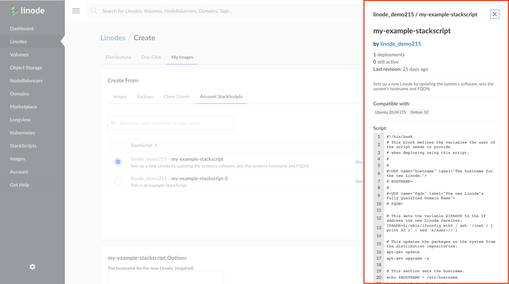
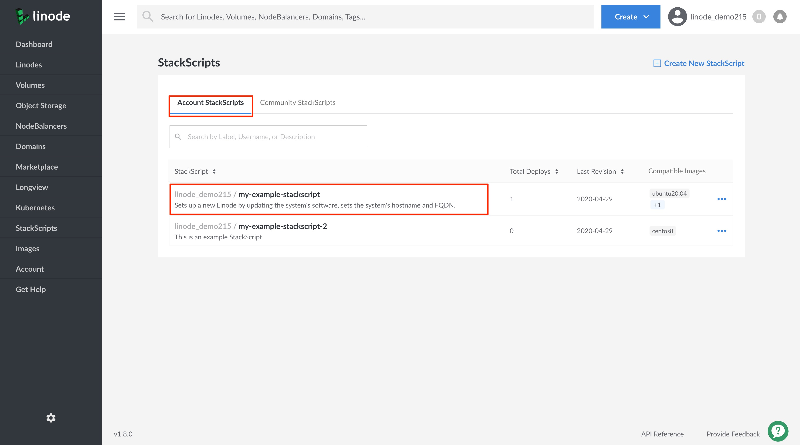
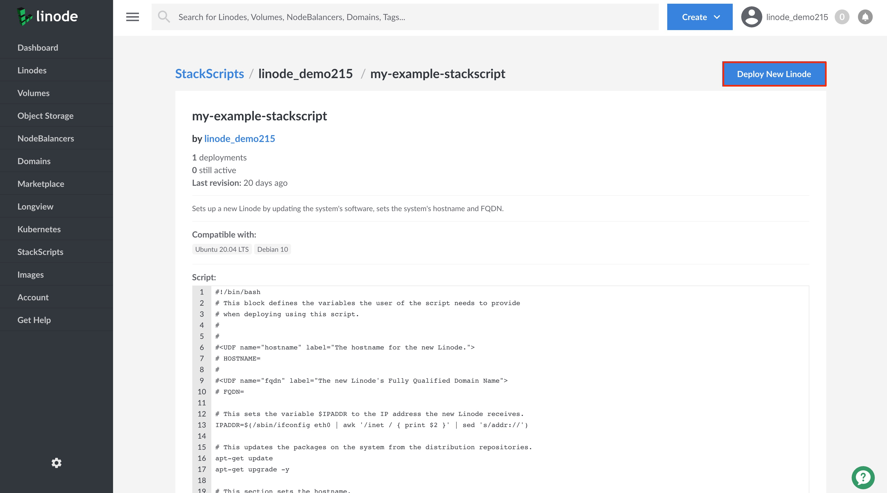
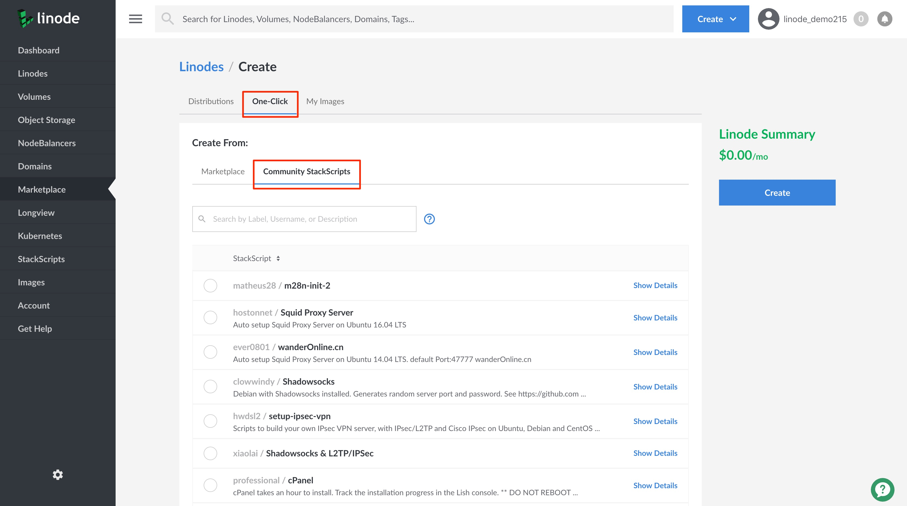
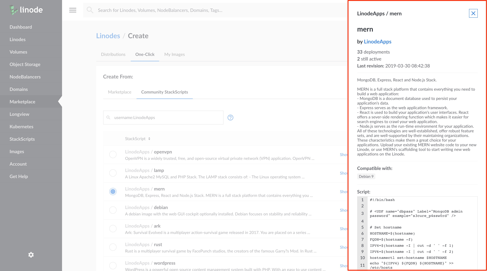
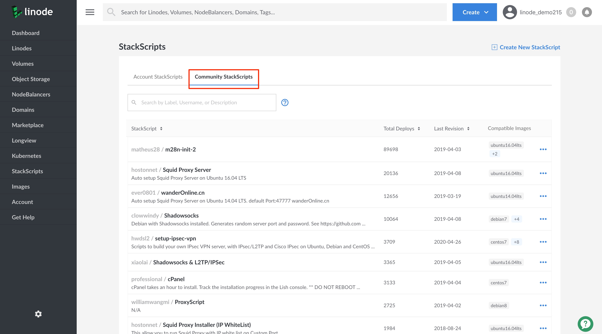
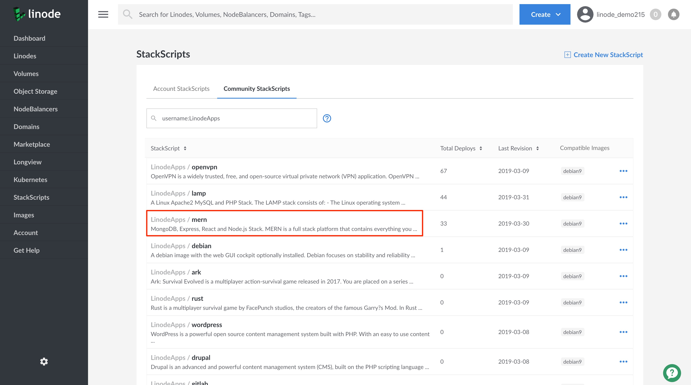
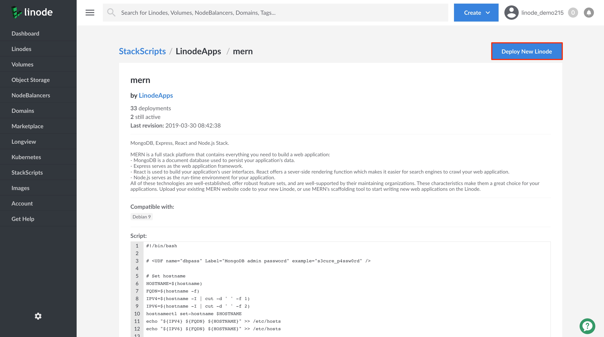

## What are StackScripts?

[StackScripts](http://linode.com/stackscripts/) provide Linode users with the ability to automate the deployment of custom systems on top of Linode's default Linux distribution images. For example, every time you deploy a new Linode you might execute the same tasks, like updating your system's software, installing your favorite Linux tools, and adding a limited user account. These tasks can be automated using a StackScript that will perform these actions for you as part of your Linode's first boot process.

All StackScripts are stored in the Linode Cloud Manager and can be accessed whenever you deploy a Linode. A StackScript authored by you is an *Account StackScript*. While a *Community StackScript* is a StackScript created by a Linode community member that has made their StackScript publicly available in the Linode Cloud Manager.

### In this Guide

This guide will show you how to do the following:

- [Deploy a new Linode using an Account StackScript.](#deploy-a-linode-from-an-account-stackscript)
- [Access the contents of an Account StackScript to view its underlying script and metadata.](#access-an-account-stackscript)
- [Deploy a new Linode using a Community StackScript.](#deploy-a-linode-from-a-community-stackscript)
- [Access the contents of a Community StackScript to view its underlying script and metadata.](#access-a-community-stackscript)


To learn how to create your own StackScript see the [Writing Scripts for Use with Linode StackScripts](/docs/platform/stackscripts/writing-scripts-for-use-with-linode-stackscripts-a-tutorial/) guide.


## Account StackScripts

An Account StackScript is any StackScript that you create. It will be stored in the Linode Cloud Manager where you can access it to use when deploying a new Linode. By default, your Account StackScripts are only visible on your account and can only be used by you to deploy a new Linode.

This section will show you how to deploy a new Linode using an Account StackScript and how to access your Account StackScripts.


To learn how to make your Account StackScript publicly available see the [A Tutorial for Creating and Managing StackScripts](/docs/platform/stackscripts/creating-and-managing-stackscripts-a-tutorial/#make-an-account-stackscript-public) guide for more details.


### Deploy a Linode from an Account StackScript

1. Log into the [Linode Cloud Manager](https://cloud.linode.com/).

1. Click on the **Create** button at the top of the Linode Cloud Manager and select **Linode**. This will take you to the *Linodes Create* page.

    

1. Click on the **My Images** tab to access different sources you can use from which to create a Linode.

1. Viewing the *My Images* page, click on the **Account StackScripts** tab. On this page you will be able to see a list of all of your account's StackScripts.

      

1. From the list, select the StackScript you would like to use to deploy your new Linode instance.

    
To view the details of a StackScript prior to using it to deploy your Linode, click on its **Show Details** link.

    

1. In the **StackScript Options** section, fill in values for your StackScript's Options. Not all StackScripts are written to accept option values, so your StackScript might not present this section.

    
When [writing a script to be used in a StackScript](/docs/platform/stackscripts/writing-scripts-for-use-with-linode-stackscripts-a-tutorial/), these option values are made available to users by including [user defined fields](/docs/platform/stackscripts/writing-scripts-for-use-with-linode-stackscripts-a-tutorial/#user-defined-fields-udfs) in your script.
    

1. From the **Select an Image** dropdown menu, select the Linux distribution to use. This list will be limited to the distributions your StackScript supports.

1. Choose the region where you would like your Linode to reside. If you’re not sure which to select, see our [How to Choose a Data Center](/docs/platform/how-to-choose-a-data-center) guide. You can also generate [MTR reports](/docs/networking/diagnostics/diagnosing-network-issues-with-mtr/) for a deeper look at the route path between you and a data center in each specific region.

1. Select a Linode plan.

1. Give your Linode a label. This is a name to help you easily identify it within the Cloud Manager’s Dashboard. If desired, assign a tag to the Linode in the **Add Tags** field.

1. Create a root password for your Linode in the **Root Password** field. This password must be provided when you log in to your Linode via SSH. The password must meet the complexity strength validation requirements for a strong password. Your root password can be used to perform any action on your server, so make it long, complex, and unique.

1. Click **Create**. You will be directed back to your new Linode's *Summary* page which will report the status of your Linode as it boots up.

### Access an Account StackScript

1. Log into the [Linode Cloud Manager](https://cloud.linode.com/).

1. Click on the **StackScripts** link in the left-hand navigation menu. You will be brought to the *StackScripts* page.

      

1. Viewing the **Account StackScripts** tab, you will see a list of all of your account's StackScripts.

1. To view the details and contents of an Account StackScript, click on the StackScript you would like to view to access its StackScript detail page.

    

1. If you would like to deploy a new Linode from the Account StackScript you are viewing, click on the **Deploy New Linode** at the top of the StackScript detail page.

    

    You will be brought to the *Linodes Create* page which will have your Account StackScript selected. Continue to provide the rest of the required configurations to create your Linode. See *step 6* in the [Deploy a Linode from an Account StackScript](#deploy-a-linode-from-an-account-stackscript) section for details on the remaining configurations.

## Community StackScripts

Community StackScripts are any scripts that have been created by a Linode community member and are publicly available via the Linode Cloud Manager. You can deploy a new Linode using any Community StackScript.

This section will show you how to deploy a new Linode using a Community StackScript and how to access the contents of a Community StackScript.


Linode does not verify the accuracy of any Linode Community member submitted StackScripts. Prior to deploying a Linode using a Community StackScript, you should ensure you understand what the script will execute on your Linode.


### Deploy a Linode from a Community StackScript

1.  Log in to your [Linode Cloud Manager](https://cloud.linode.com) account.

1.  At the top of the page, click **Create** and select **Linode**.

      

1.  Click on the **Marketplace** tab to access the *Create From* options.

1.  Viewing the *Create From:* options, click on the **Community StackScripts** tab. On this page, you will see a list of all available Community StackScripts.

    

    You can scroll through the list of StackScripts or you can use the **Search** field to locate the Community StackScript you'd like to use. You can search by StackScript username, label or description. For example, to search for a Community StackScript by username, you can enter `username:LinodeApps` into the search field.

1. From the list, select the Community StackScript you would like to use to deploy your new Linode instance.

    
To view the details of a StackScript prior to using it to deploy your Linode, click on its **Show Details** link.

    

1. In the **StackScript Options** section, fill in values for your StackScript's Options. Not all StackScripts are written to accept option values, so your StackScript might not present this section.

    
When [writing a script to be used in a StackScript](/docs/platform/stackscripts/writing-scripts-for-use-with-linode-stackscripts-a-tutorial/), these option values are made available to users by including [user defined fields](/docs/platform/stackscripts/writing-scripts-for-use-with-linode-stackscripts-a-tutorial/#user-defined-fields-udfs) in your script.
    

1. From the **Select an Image** dropdown menu, select the Linux distribution to use. This list will be limited to the distributions your StackScript supports.

1. Choose the region where you would like your Linode to reside. If you’re not sure which to select, see our [How to Choose a Data Center](/docs/platform/how-to-choose-a-data-center) guide. You can also generate [MTR reports](/docs/networking/diagnostics/diagnosing-network-issues-with-mtr/) for a deeper look at the route path between you and a data center in each specific region.

1. Select a Linode plan.

1. Give your Linode a label. This is a name to help you easily identify it within the Cloud Manager’s Dashboard. If desired, assign a tag to the Linode in the **Add Tags** field.

1. Create a root password for your Linode in the **Root Password** field. This password must be provided when you log in to your Linode via SSH. The password must meet the complexity strength validation requirements for a strong password. Your root password can be used to perform any action on your server, so make it long, complex, and unique.

1. Click **Create**. You will be directed back to your new Linode's *Summary* page which will report the status of your Linode as it boots up.

### Access a Community StackScript

1. Log into the [Linode Cloud Manager](https://cloud.linode.com/).

1. Click on the **StackScripts** link in the left-hand navigation menu. You will be brought to the *StackScripts* page.

      

1. Click on the **Community StackScripts** tab. You will see a list of all available Community StackScripts.

      

      You can scroll through the list of StackScripts or you can use the **Search** field to locate the Community StackScript you'd like to use. You can search by StackScript username, label or description. For example, to search for a Community StackScript by username, you can enter `username:LinodeApps` into the search field.

1. To view the details and contents of a Community StackScript, click on the StackScript you would like to view to access its StackScript detail page.

    

1. If you would like to deploy a new Linode from the Account StackScript you are viewing, click on the **Deploy New Linode** at the top of the StackScript detail page.

    

    You will be brought to the *Linodes Create* page which will have your Community StackScript selected. Continue to provide the rest of the required configurations to create your Linode. See *step 6* in the [Deploy a Linode from a Community StackScript](#deploy-a-linode-from-a-community-stackscript) section for details on the remaining configurations.

## Next Steps

- After deploying a new Linode using a StackScript you can [connect to your Linode via SSH](/docs/getting-started/#connect-to-your-linode-via-ssh) and verify that the StackScript has executed as expected. These steps will vary depending on the StackScript that you used when deploying your Linode.

    
Depending on the contents of your StackScript, it may take a few minutes for the script to finish executing.
    

- To learn how to create your own StackScript see the [A Tutorial for Creating and Managing StackScripts](/docs/platform/stackscripts/creating-and-managing-stackscripts-a-tutorial/#make-an-account-stackscript-public) guide.
