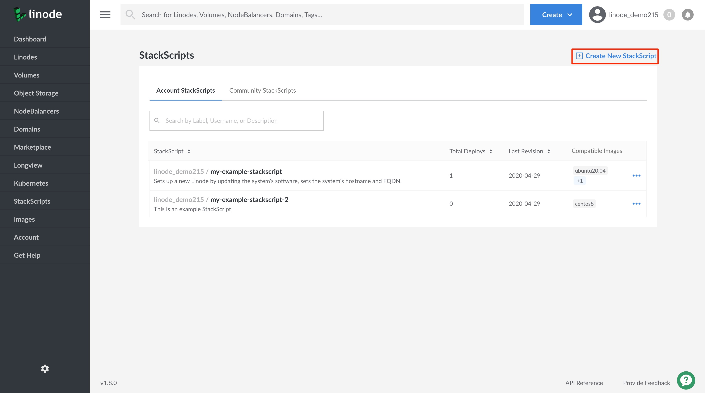
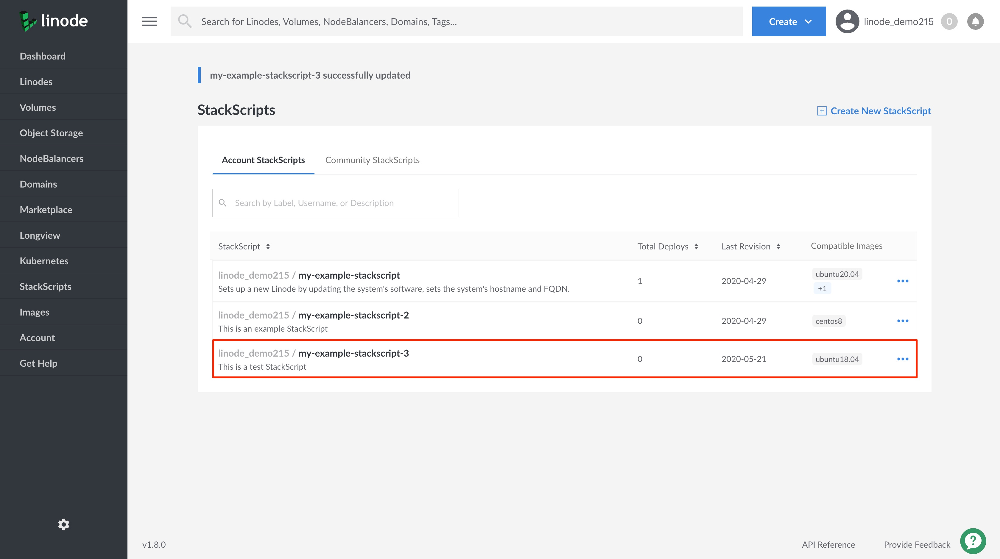

1. Log into the [Linode Cloud Manager](https://cloud.linode.com/).

1. Click on the **StackScripts** link in the left-hand navigation menu. You are brought to the *StackScripts* page.

      

1. Viewing the **Account StackScripts** section, click on the **Create New StackScript** link at the top of the page.

      

1. On the **Create New StackScript** page, provide the required configurations to create your StackScript.

    | **Field**| **Description** |
    |:-----------------|:---------------------|
    | **StackScript Label** | The name with which to identify your StackScript. *Required*. |
    | **Description** | An overview of what your StackScript does. |
    | **Target Images** | The Linux distributions that can run this StackScript. *Required*.|
    | **Script** | The body of the script. See the [Writing Scripts for Use with Linode StackScripts](/docs/platform/stackscripts/writing-scripts-for-use-with-linode-stackscripts-a-tutorial/) section for more details. *Required*. |
    | **Revision Note** | A short description of the updates made to your StackScript in this version of your script.|

    
The file below displays an example of a simple script that executes some basic set up steps on a Linode. Review the example's comments for details on what each line of the script does.


#!/bin/bash
# This block defines the variables the user of the script needs to provide
# when deploying using this script.
#
#
#<UDF name="hostname" label="The hostname for the new Linode.">
# HOSTNAME=
#
#<UDF name="fqdn" label="The new Linode's Fully Qualified Domain Name">
# FQDN=

# This sets the variable $IPADDR to the IP address the new Linode receives.
IPADDR=$(/sbin/ifconfig eth0 | awk '/inet / { print $2 }' | sed 's/addr://')

# This updates the packages on the system from the distribution repositories.
apt-get update
apt-get upgrade -y

# This section sets the hostname.
echo $HOSTNAME > /etc/hostname
hostname -F /etc/hostname

# This section sets the Fully Qualified Domain Name (FQDN) in the hosts file.
echo $IPADDR $FQDN $HOSTNAME >> /etc/hosts

    

1. Click **Save** when you are done (and you can always edit your script later if needed). You are brought back to the **StackScripts** page, where your new StackScript is visible and ready to use with a new Linode deployment.

    
To deploy a new Linode with your StackScript, follow the steps in the [Deploying a New Linode Using a StackScript](/docs/platform/stackscripts/how-to-deploy-a-new-linode-using-a-stackscript/#deploy-a-linode-from-an-account-stackscript) guide.
    

    
