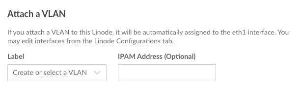
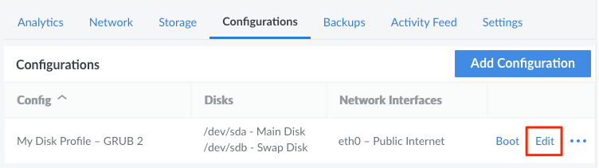
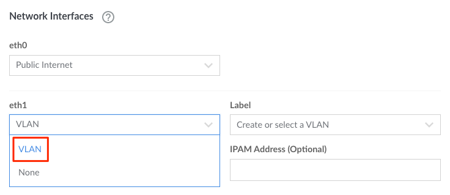
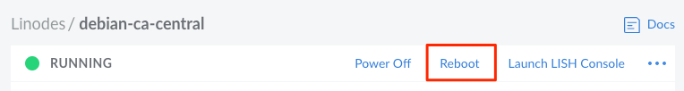

Linode VLANs (Virtual Local Area Network) are a completely free solution available to Linode Services used for enabling private networking in the cloud. Here are a few key features of VLANs:

- **Privacy and Security.** Linodes on the same account and in the same region can be added to a VLAN, allowing for private and secure communications between those Linodes. The public internet can also be disabled on a Linode to provide even more security.

    
VLANs are separate from [Private IP Addresses](https://www.linode.com/docs/guides/remote-access/#adding-private-ip-addresses). Private IPs are accessible to all Linodes in that same data center and can only be further restricted by firewall rules or additional internal configuration.


- **Performance.** A VLAN is configured as a Layer 2 networking device on a Linode and provides low latency for latency-sensitive applications.

- **No additional charges.** VLANs are available at no cost and network transfer over a VLAN does not count towards monthly transfer quotas.

## Configuring VLANs

VLANs are relatively simple to manage and do not require much configuration beyond attaching (or detaching) a VLAN to a Linode. VLANs can be configured when creating new Linodes or by modifying the network interfaces on the [Configuration Profile](/docs/guides/linode-configuration-profiles/) of an existing Linode.

### Configuring the Network Interface

VLANs are managed within the network interfaces on a Linode. Each Linode has 3 configurable network interfaces, which are referred to as *eth0*, *eth1*, and *eth2*. The purpose of a network interface is to provide access to either the public internet or a VLAN:

- **Public Internet:** Configuring a network interface for the **Public Internet** enables the public (and private) IP address(es) for that Linode. If no network interface is configured as **Public Internet**, the Linode will not be able to access the internet or other Linodes within the data center's main private network.

- **VLAN:** Configuring a network interface for a VLAN enables the Linode to communicate over a specified VLAN.

- **None:** Selecting **None** will deactivate that network interface.


The Public Internet must always be set to use the network interface `eth0`.


### Selecting a VLAN

When configuring a network interface, a VLAN can be selected by entering its **Label**. VLANs that already exist on an account can be quickly selected through a drop down list. If the label doesn't correspond with an existing VLAN, a new VLAN is created.

### Assigning an IPAM Address

IPAM (IP Address Management) is the system that allows users to assign and manage IP addresses for each VLAN configured on a Linode. When attaching a VLAN to a Linode, an **IPAM Address** can be specified in address/netmask format. This should be a unique IP address that doesn't already exist within the VLAN or on the public internet. It is common to use an address within the 10.0.0.0/8 range (10.0.0.0 – 10.255.255.255). For example, here are typical IPAM addresses for two Linodes connected to the same VLAN:

- Linode 1: `10.0.0.1/24`
- Linode 2: `10.0.0.2/24`

Just like public and private IP addresses, IPAM addresses for a VLAN are automatically configured on a Linode through [Network Helper](https://www.linode.com/docs/guides/network-helper/). If Network Helper is disabled or if no IPAM address is provided, the Linode will not automatically be able to communicate over the VLAN. In some cases, advanced users may disable Network Helper or refrain from providing an IPAM address. When doing so, the Linode's internal network configuration files must be manually adjusted with the desired settings. See [Manually configuring a VLAN on a Linode](/docs/products/networking/vlans/guides/manually-configuring-a-vlan/) for instructions.


The Linode must be rebooted for any changes within its network interfaces to take effect. This reboot allows Network Helper to run so it can automatically adjust the necessary network configuration files on the Linode.


## Attaching a VLAN When Creating a Linode

1. On the top left of the Linode [Cloud Manager](https://cloud.linode.com/dashboard), click **Create** and select **Linode**.

    

1. Fill out all desired configuration options in the form that appears, until reaching the **Attach a VLAN** section. See the [Getting Started with Linode](/docs/guides/getting-started/) guide for more information.

    
VLANs are not available in all regions. If the Attach a VLAN section isn't visible, see the Availability section on the [VLANs Overview](/docs/products/networking/vlans/) page.


1. Within the **Attach a VLAN** section, enter the *Label* of the VLAN or select from a list of the VLANs that currently exist on the account. If the VLAN does not yet exist, it is automatically created when creating the Linode.

    

1. Enter an *IPAM Address*. If this field left blank, the Linode will not be able to communicate with other Linodes on that VLAN until one of the following is true:

    - An IPAM address is added to the `eth1` interface within the Linode's [Configuration Profile](/docs/guides/linode-configuration-profiles/)
    - An IP address is manually assigned to the network interface within the Linode's internal configuration files.

    See the [Assigning an IPAM Address](#assigning-an-ipam-address) section on this page for more information about IPAM and examples of valid IPAM addresses.

1. Adjust any remaining configuration options as needed and select the **Create Linode** button to create the Linode.

By default, the public IP address (and, if added, the private IP address) of the Linode is configured on the *eth0* network interface. The VLAN, if one was attached, is configured on the *eth1* network interface. These network interfaces can be removed or modified by editing the [Configuration Profile](/docs/guides/linode-configuration-profiles/#editing-a-configuration-profile).

## Attaching a VLAN to an Existing Linode

1. Within the Linode [Cloud Manager](https://www.cloud.linode.com), click the **Linodes** link in the sidebar and select a Linode.

1. Navigate to the **Configurations** tab on the Linode's details page.

1. Click the **Edit** button next to the configuration profile you'd like to modify.

    

1. An **Edit Configuration** screen will appear. Scroll down to the **Network Interfaces** section.

1. Click the dropdown menu under the desired network interface and select **VLAN**. Typically `eth1` or `eth2` would be used when adding the first or second VLAN to a Linode, respectively - if the Linode's `eth0` network interface provides access to the public internet.

    

    A secondary menu will appear next to the selected interface for entering the VLAN's label and the IPAM address for the Linode.

1. Enter the *Label* of the VLAN or select an existing VLAN from the drop down menu. If a custom label is entered and the VLAN does not yet exist, it is automatically created when saving the configuration profile.

1. Enter an *IPAM Address*. If this field is left blank, the Linode will not be able to communicate with other Linodes on that VLAN until an IP address is manually assigned to the network interface within the Linode's internal configuration files.

    See the [Assigning an IPAM Address](#assigning-an-ipam-address) section on this page for more information about IPAM and examples of valid IPAM addresses.

1. Click on the **Save Changes** button towards the bottom of this form to save the changes.

1. Once the configuration profile has been updated, select the **Boot** or **Reboot** button next to the edited configuration profile on the following page. This will reboot using the edited configuration profile and apply the new VLAN configuration to the Linode.

    

## Testing connectivity

Once a VLAN has been attached to more than one Linode, verify that you can communicate between those Linodes over the VLAN's private network.

1. If the Linode has a public network configured, connect to your Linode via SSH

        ssh username@192.0.2.0

    If the Linode does not have a public network configured, connect to your Linode via Lish following the steps in the [Using the Linode Shell](/docs/platform/manager/using-the-linode-shell-lish/#use-a-terminal-application) guide.

1. Ping another Linode within the VLAN's private network using the IPAM address assigned to it.

        ping 10.0.0.1

    The output should display ICMP packets successfully transmitted and received from this Linode to the secondary Linode in the Private Network.

    
PING 10.0.0.1 (10.0.0.1) 56(84) bytes of data.
64 bytes from 10.0.0.1: icmp_seq=1 ttl=64 time=0.733 ms
64 bytes from 10.0.0.1: icmp_seq=2 ttl=64 time=0.294 ms
^C
--- 10.0.0.1 ping statistics ---
2 packets transmitted, 2 received, 0% packet loss, time 18ms
rtt min/avg/max/mdev = 0.294/0.513/0.733/0.220 ms
    

