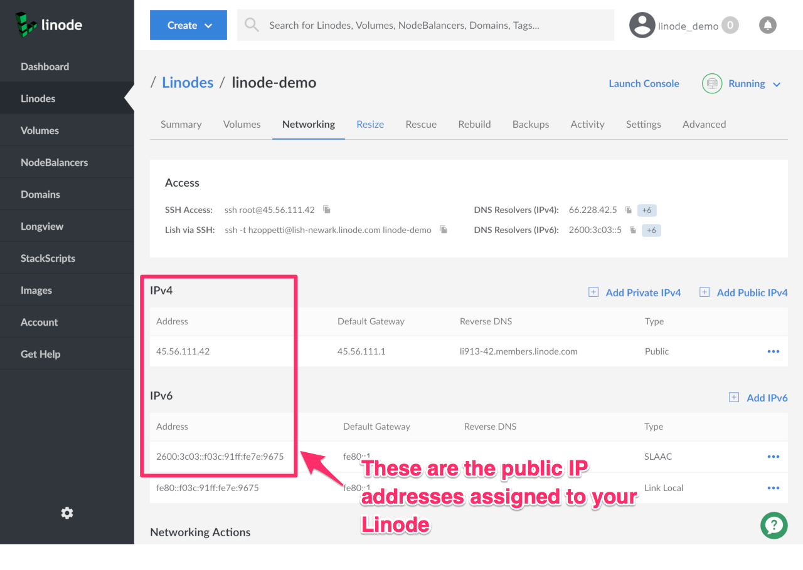
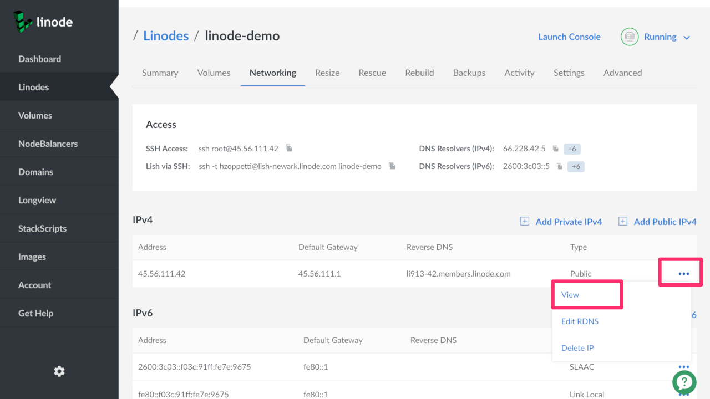
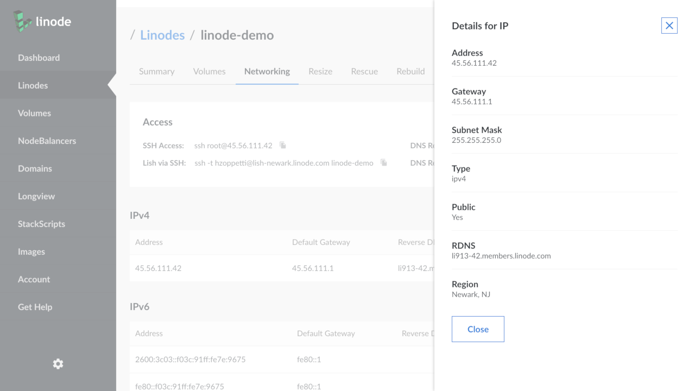

Finding your Linode's IP address (or addresses) is easy and can be done in two different ways.

## From the Cloud Manager

1.  Log in to the Cloud Manager.

2.  From the **Linodes** tab of your account, select the Linode you want to work with.

3.  Click the **Networking** tab.

 - You will see sections for IPv4 and IPv6.
 - Your public IPs are listed under the Address columns in these sections.

4.  View more information about the IP by clicking the more options ellipsis to the right, then click **View** in the exposed dropdown menu.

5.  A side panel opens to reveal more networking information including the [subnet mask](https://en.wikipedia.org/wiki/Subnetwork).

## From an SSH Session

Use the command below to view your Linode's IP addresses:

    ip addr | grep inet

An example of the output:

    root@localhost:~# ip addr | grep inet
        inet 127.0.0.1/8 scope host lo
        inet6 ::1/128 scope host
        inet 45.56.111.42/24 brd 45.56.111.255 scope global eth0
        inet 97.107.134.191/24 scope global eth0:1
        inet 192.168.192.154/17 scope global eth0:2
        inet6 2600:3c03::f03c:91ff:fe73:9675/64 scope global mngtmpaddr noprefixroute
        inet6 fe80::f03c:91ff:fe26:7e8e/64 scope link

The output shows:

- Two public IPv4 addresses, `45.56.111.42` and `97.107.134.191`
- One private IPv4 address, `192.168.192.154`
- One public IPv6 address, `2600:3c03::f03c:91ff:fe73:9675`
- One private IPv6 address, `fe80::f03c:91ff:fe26:7e8e`


DHCP will only recognize one IPv4 address. If you have more than one IPv4 address assigned to your Linode, you must either set those addresses statically or enable Network Helper. Otherwise, those addresses will not be usable to the system, nor will they display in `ip` commands. See the following guides for more information:

[Linux Static IP Configuration](/docs/guides/linux-static-ip-configuration/)

[Network Helper](/docs/guides/network-helper/)

