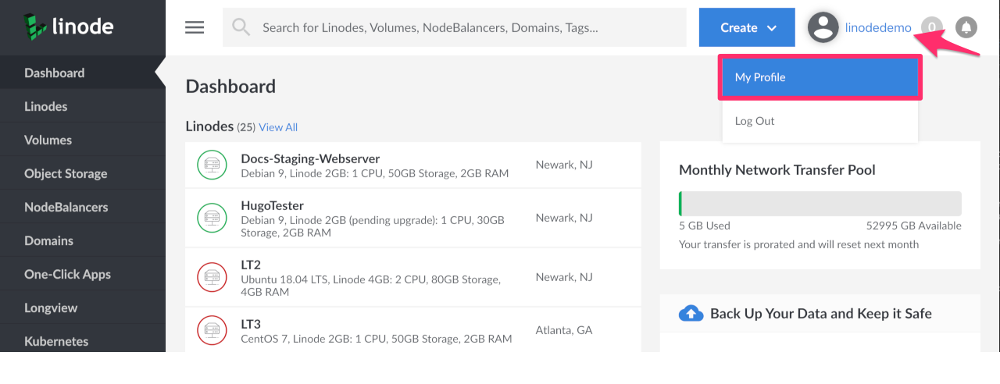
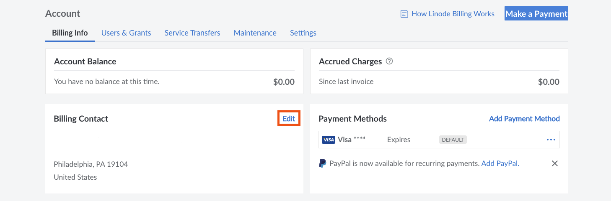
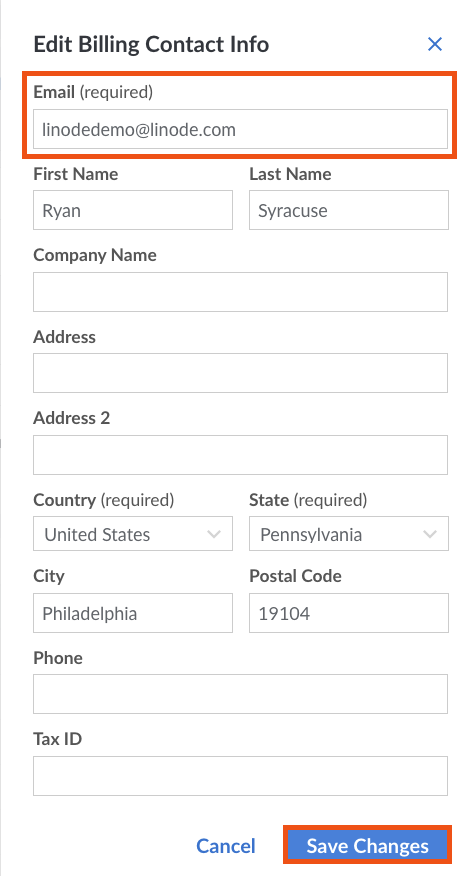
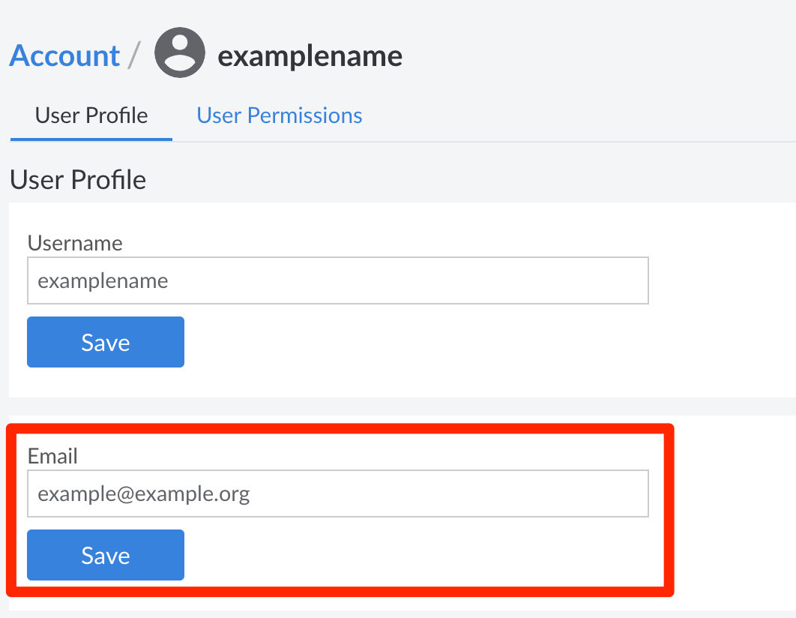

## Changing Billing Email From the Cloud Manager

1.  Log in to the [Cloud Manager](http://cloud.linode.com).

1.  Click on your username and choose **Billing and Contact Information** from the drop down menu.

    

1.  On the Billing and Contact Information page, in the **Billing Contact** field, click the edit button to open the Billing Contact Info sidebar menu.

    

1. In the **Email** field, enter the email you would like to associate with your account.

1.  Click the **Save** button to complete the change.

    

## Changing Account Email from the Cloud Manager

Use the **Users & Grants** page to modify the email address associated with a user account. The email addresses listed on this page receive IP whitelist warnings, password reset messages, and support tickets for services that their associated users have permission to access. Users with limited account access can also receive invoices and receipts if granted access to that information.


Only full account access users can receive threshold notification emails.


Here's how to change a user's email from the **Users & Grants** page:

1.  Click the **Account** link in the sidebar.
1.  Click the **Users & Grants** tab.
1.  Click the **User Profile** link for the desired user.
1.  Enter the updated email address in the **Email** field.

    

1.  Click **Save**.

The user's email address is now updated.


If you do not have full account access, you can view your user profile settings and update your email address by clicking on your username at the top of the Cloud Manager screen and selecting **Display**.


## Using the API

You can also use the [Linode API](https://developers.linode.com/api/v4) to view and update your account's email address.

1.  Use the [View Account](https://developers.linode.com/api/v4/account) endpoint to view your account information including your email address:

        curl -H "Authorization: Bearer $TOKEN" \
        https://api.linode.com/v4/account

1.  An example of the output:

    
{
  "active_promotions": [
    {
      "credit_monthly_cap": "10.00",
      "credit_remaining": "50.00",
      "description": "Receive up to $10 off your services every month for 6 months! Unused credits will expire once this promotion period ends.",
      "expire_dt": "2018-01-31T23:59:59",
      "image_url": "https://www.linode.com/10_a_month_promotion.svg",
      "summary": "$10 off your Linode a month!",
      "this_month_credit_remaining": "10.00"
    }
  ],
  "active_since": "2018-01-01T00:01:01",
  "address_1": "123 Main Street",
  "address_2": "Suite A",
  "balance": 200,
  "balance_uninvoiced": 145,
  "capabilities": [],
  "city": "Philadelphia",
  "credit_card": {
    "last_four": 1111,
    "expiry": "11/2022"
  },
  "company": "Linode LLC",
  "country": "US",
  "email": "john.smith@example.com",
  "first_name": "John",
  "last_name": "Smith",
  "phone": "215-555-1212",
  "state": "Pennsylvania",
  "tax_id": "ATU99999999",
  "euuid": "E1AF5EEC-526F-487D-B317EBEB34C87D71",
  "zip": 19102
}


1.  To update your email address, use the [Update Account](https://developers.linode.com/api/v4/account/#put) endpoint:

        curl -H "Content-Type: application/json" \
        -H "Authorization: Bearer $TOKEN" \
        -X PUT -d '{
        "email": "jsmith@example.com"
        }
        }' \
        https://api.linode.com/v4/account

1.  The output will be mostly the same, but this time, the email field will be updated with your new email address:

    
{
  "active_promotions": [
    {
      "credit_monthly_cap": "10.00",
      "credit_remaining": "50.00",
      "description": "Receive up to $10 off your services every month for 6 months! Unused credits will expire once this promotion period ends.",
      "expire_dt": "2018-01-31T23:59:59",
      "image_url": "https://www.linode.com/10_a_month_promotion.svg",
      "summary": "$10 off your Linode a month!",
      "this_month_credit_remaining": "10.00"
    }
  ],
  "active_since": "2018-01-01T00:01:01",
  "address_1": "123 Main Street",
  "address_2": "Suite A",
  "balance": 200,
  "balance_uninvoiced": 145,
  "capabilities": [],
  "city": "Philadelphia",
  "credit_card": {
    "last_four": 1111,
    "expiry": "11/2022"
  },
  "company": "Linode LLC",
  "country": "US",
  "email": "jsmith@example.com",
  "first_name": "John",
  "last_name": "Smith",
  "phone": "215-555-1212",
  "state": "Pennsylvania",
  "tax_id": "ATU99999999",
  "euuid": "E1AF5EEC-526F-487D-B317EBEB34C87D71",
  "zip": 19102
}
