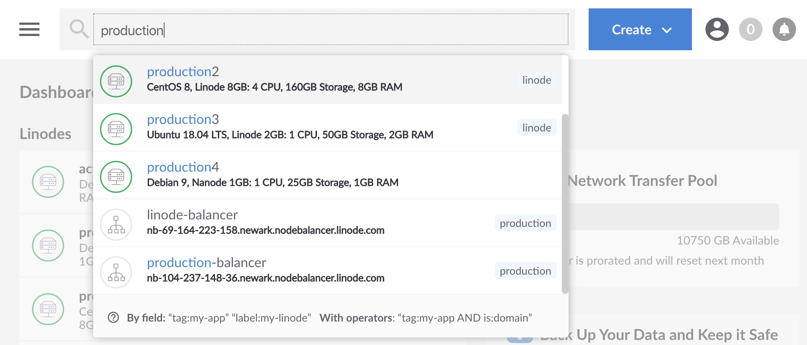
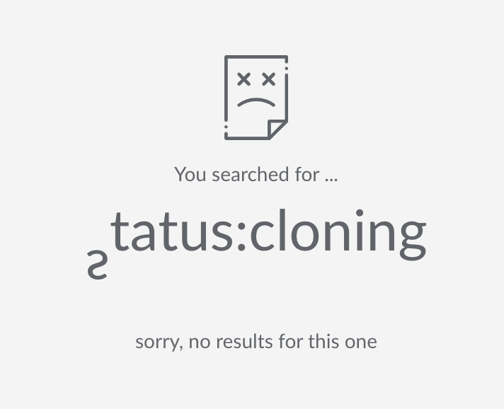

The Linode Cloud Manager includes a search tool at the top of the dashboard which can be used to search for a large number of active services on your account, including Linodes, Volumes, NodeBalancers, Domains, Tags, and more.

This guide will cover the capabilities of this search tool so that you and your team can leverage it to find and access your resources quickly and efficiently.

## Standard Search

A standard search without the use of any keywords or operators will default to searching for active labels, tags, and IP addresses. In the following example, the search for the string "production" is used to pull up all of the resources which match this string, including both tags and labels.

This kind of search is sufficient if you only have a few resources. However, if you have a large number of resources, the number of returned values can become difficult to parse. The following, more advanced tools, can be more helpful in these situations.

## Keywords

The search tool can also be used with keywords to help filter and refine the results. Here is a list of common keywords and their definitions:

| Keyword   | Definition   |
|:--------------|:------------|
| type | Type of resource. Linode, image, NodeBalancer, etc.  |
| tag  | Tag applied to your resources. See the guide on [Tags and Groups](/docs/guides/tags-and-groups/). |
| label | The label or identifier for your Linode. |
| region | The region for your resources, such as `us-east`. For a full list of regions, see the return values from the API or CLI [List Regions](https://developers.linode.com/api/v4/regions) endpoint. |
| IP | The IP address of your resource. |
| created | The date your resource was created. |
| status | A brief description of a Linode's current state. See the API [View Linode](https://developers.linode.com/api/v4/linode-instances-linode-id) endpoint status field for all possible values. |

The syntax for using keywords is:

    keyword:string defined by the keyword to limit your search

For example, to search for all images on your account, you would enter the following:

    type:image

To find all applicable resources created in the year 2020:

    created:2020

You can make this more focused by combining the standard search with the keywords. For example, the following query searches for NodeBalancers with the label or tag ecommerce:

    type:NodeBalancer ecommerce

## Standard Logical Operators

The Cloud Manager includes support for standard logical operators `OR`, `AND`, and `-` (NOT) which can help to filter the results of your search further.

### OR

`OR` can be used to search for multiple different keywords in a single query. For example, use the following query to display all Linodes and Images on your account:

    type:linode OR type:image

### AND

`AND` will allow you to narrow your search more precisely for additional qualifiers. The following search finds all of the Linodes which also match the `production` tag:

    type:linode AND tag:production

### NOT

The **NOT**, or negate, operator is used by preceding the keyword with a `-` symbol. A negate operator can be used to return all values that are **NOT** defined by the negate operator. For example, this query will return everything except Linodes:

    -type:linode

## Aliases

Some operators and keywords include one or more aliases that you can use as an alternative to standard usage. Aliases and their standard equivalent(s) are in the chart below.

| Standard | Alias(es) |
|:--------------|:------------|
| **AND** | **&&** |
| **OR** |  **&#124;****&#124;** |
| **tag** | **tags** or **group** |
| **label** | **name** or **title** |
| **type** | **is** |

## Nested Queries

You can nest queries using parentheses for an even higher level of control. For example, if you want to search for all of your domains created in 2010, as well as all of your Linodes that match the tag `my-tag`, you can use the following nested query:

    (type:domain AND created:2010) OR (type:linode AND tag:my-tag)

## Combining Queries

The most robust functionality of the search tool can be used by combining and grouping queries to create compound queries. For example, you can see all of the advanced features outlined in this guide in a single query:

    type:linode AND -group:production || (type:NodeBalancer && tag:mytag)

## Invalid Search Results

If you search for an invalid keyword, a string that doesn't match a keyword like an invalid status, or a search that comes up empty, the Cloud Manager will display an error screen.

