Linode's [Cloud Manager](https://cloud.linode.com) and [API](https://developers.linode.com) allow you to create tags to help organize and group your Linode resources. Tags can be applied to Linodes, [Block Storage Volumes](/docs/products/storage/block-storage/), [NodeBalancers](/docs/guides/getting-started-with-nodebalancers/), and [Domains](/docs/guides/dns-manager/).

This guide will show you how to perform the following actions with the Cloud Manager:

-   Create and apply tags to your Linode resources
-   Search and group your Linode resources by tag
-   Import tags from the Classic Manager

## Tagging a Linode

### Tag a Linode at Creation

To tag a Linode at the time of its creation:

1.  In the **Create New Linode** form, click the dropdown menu labeled **Add Tags** located below the **Linode Label** field.

1.  Select one or more tags from the menu. To create a new tag, type in the desired tag name and click the **Create "new-tag"** option that appears:

    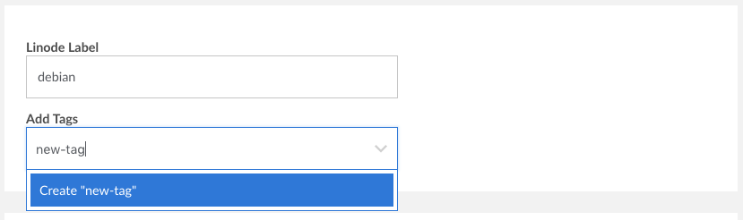

1.  Your tag will be applied when you finish creating the Linode.

### Tag an Existing Linode

To tag an existing Linode:

1.  Navigate to the Linode's detail page.

1.  Click on the **Summary** tab.

1.  Locate the **Tags** pane and click on the **Add New Tag** option.

1.  Select one or more tags from the dropdown menu that appears. To create a new tag, type in the desired tag name and click the **Create "new-tag"** option that appears:

    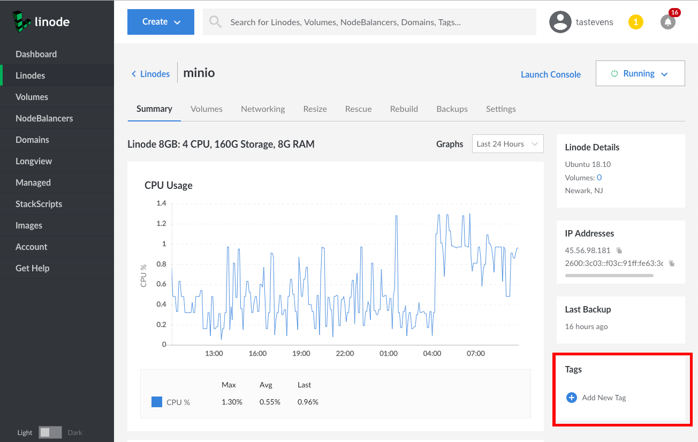

### Remove a Tag from a Linode

To remove a tag from a Linode:

1.  Navigate to the Linode's detail page.

1.  Click on the **Summary** tab.

1.  Locate the **Tags** box. A list of your tags for the Linode will be displayed.

1.  Click on the **X** icon attached to the tag you would like to remove from your Linode.

## Tagging a Volume

### Tag a Volume at Creation

To tag a Volume at the time of its creation:

1.  In the **Create a Volume** form, select the dropdown menu labeled **Tags**.

1.  Select one or more tags from the menu. To create a new tag, type in the desired tag name and click the **Create "new-tag"** option that appears.

    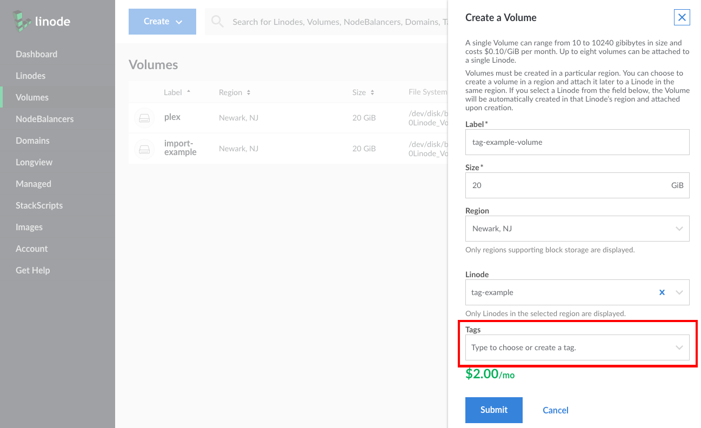

1.  Once you are done configuring the Volume, click **Submit**.

### Tag an Existing Volume

To tag an existing Volume:

1.  Navigate to the Volumes page of the Cloud Manager.

1.  Select the more options **ellipsis (...)** corresponding to the Volume you would like to tag.

1.  Select **Edit Volume** from the menu that appears.

1.  The **Edit volume** form will appear. Click on the dropdown menu labeled **Tags**.

1.  Select one or more tags from the form. To create a new tag, type in the desired tag name and click the **Create "new-tag"** option that appears.

1.  When you are done, click **Submit**:

    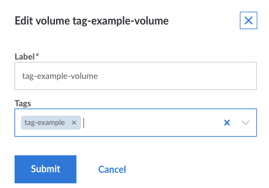

### Remove a Tag from a Volume

To remove a tag from a Volume:

1.  Navigate to the Volumes page of the Cloud Manager.

1.  Select the more options **ellipsis (...)** corresponding to the Volume whose tags you would like to edit.

1.  Select **Edit Volume** from the menu that appears.

1.  The **Edit volume** form will appear. A list of your tags for the Volume will be displayed in the **Tags** field.

1.  Click on the **x** icon attached to the tag you would like to remove from your Volume.

## Tagging a NodeBalancer

### Tag a NodeBalancer at Creation

To tag a NodeBalancer at the time of its creation:

1.  In the **Create a NodeBalancer** form, click the dropdown menu labeled **Add Tags** under the **NodeBalancer Label** field.

1.  Select one or more tags from the menu. To create a new tag, type in the desired tag name and click the **Create "new-tag"** option that appears.

    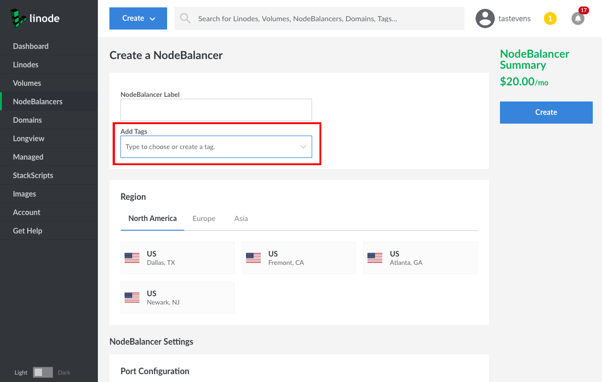

1. Once you are done configuring the NodeBalancer, click **Create**.

### Tag an Existing NodeBalancer

To tag an existing NodeBalancer:

1.  Navigate to the NodeBalancer's detail page.

1.  Click on the **Summary** tab.

1.  Locate the **Tags** pane and click on the **Add New Tag** option.

1.  Select one or more tags from the dropdown menu that appears. To create a new tag, type in the desired tag name and click the **Create "new-tag"** option that appears:

    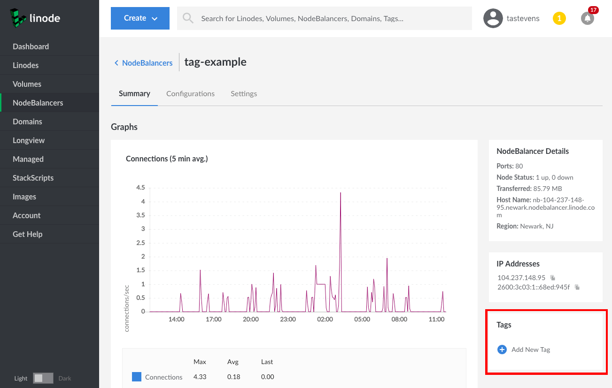

### Remove a Tag from a NodeBalancer

To remove a tag from a NodeBalancer:

1.  Navigate to the NodeBalancer's detail page.

1.  Click on the **Summary** tab.

1.  Locate the **Tags** pane. A list of your tags for the NodeBalancer will be displayed.

1.  Click on the **x** icon attached to the tag you would like to remove from your NodeBalancer.

## Tagging a Domain

### Tag a Domain at Creation

To tag a domain at the time of its creation:

1.  In the **Add a new Domain** form, click the dropdown menu labeled **Add Tags**.

1.  Select one or more tags from the menu. To create a new tag, type in the desired tag name and click the **Create "new-tag"** option that appears:

    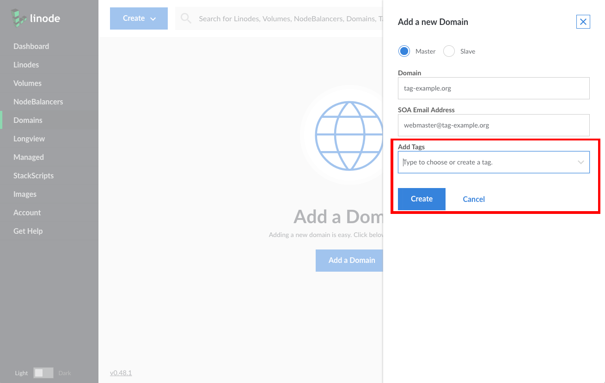

### Tag an Existing Domain

To tag an existing domain:

1.  Navigate to the domain's detail page.

1.  Click on the **DNS Records** tab.

1.  Locate the pane labeled **Tags** and click on the **Add New Tag** option.

1.  Select one or more tags from the dropdown menu that appears. To create a new tag, type in the desired tag name and click the **Create "new-tag"** option that appears:

    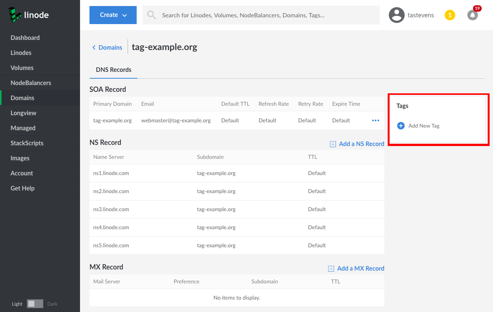

### Remove a Tag from a Domain

To remove a tag from a domain:

1.  Navigate to the domain's detail page.

1.  Click on the **DNS Records** tab.

1.  Locate the **Tags** pane. A list of your tags for the Domain will be displayed.

1.  Click on the **x** icon attached to the tag you would like to remove from your domain.

## Tagging an LKE Cluster

### Tag an LKE Cluster at Creation

1. Navigate to the **Kubernetes** section of the Linode Cloud Manager and [create your LKE cluster](/docs/kubernetes/deploy-and-manage-a-cluster-with-linode-kubernetes-engine-a-tutorial/#create-an-lke-cluster).

1. After the cluster is created, your cluster's summary page will appear. Click on the **Add a tag** link to begin adding tags to your cluster.

      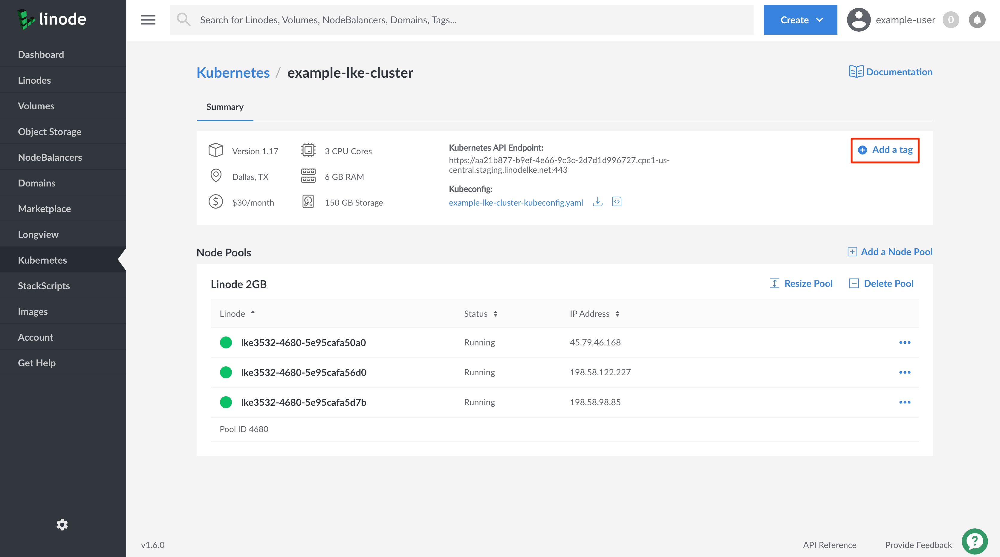

1. You can create a new tag and assign it to your cluster by typing the tag into the text entry box and clicking on the **Create my-new-tag** entry that appears.

      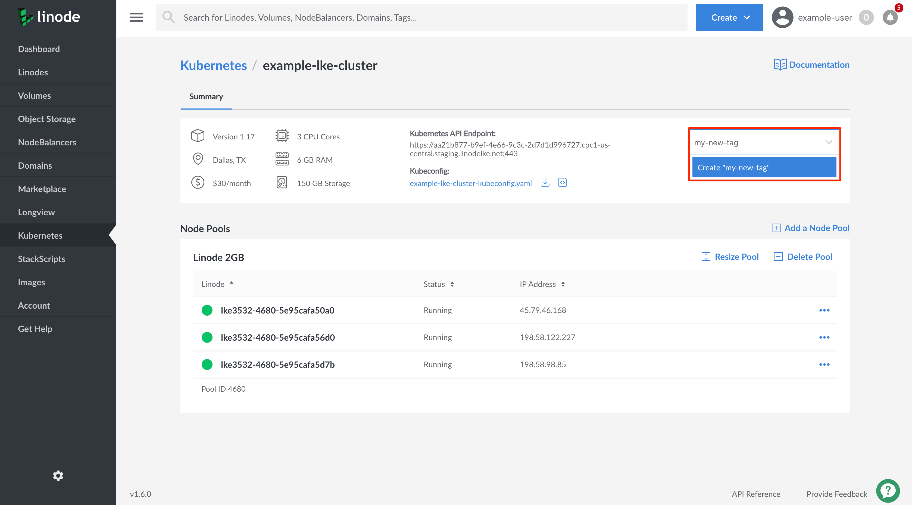

    If you'd like to use an existing tag, select it from the dropdown list that appears.

      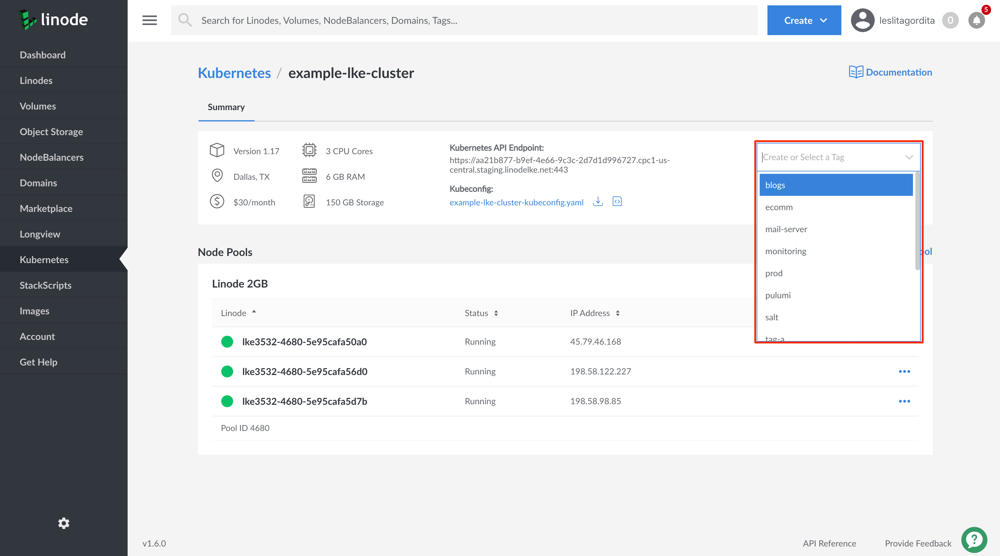

    When your tag has been added to your cluster, you will see it appear on your cluster's summary page.

      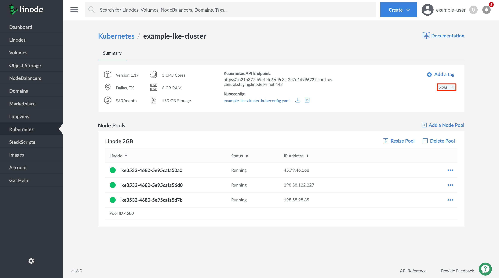

### Tag an Existing LKE Cluster

1. Navigate to the **Kubernetes** section of the Linode Cloud Manager and select the cluster you'd like to add a tag to.

1. Viewing your cluster's summary page, click on the **Add a tag** link to begin adding tags to your cluster.

    

1. You can create a new tag and assign it to your cluster by typing the tag into the text entry box and clicking on the **Create my-new-tag** entry that appears.

    

    If you'd like to use an existing tag, select it from the dropdown list that appears.

      

    When your tag has been added to your cluster, you will see it appear on your cluster's summary page.

      

### Remove a Tag from an LKE Cluster

1. Navigate to the **Kubernetes** section of the Linode Cloud Manager and select the cluster from which you'd like to remove a tag.

1. Viewing the cluster's summary page, you will see a list of all of your cluster's tags. To remove a tag, click on the **x** next to the tag you'd like to remove.

      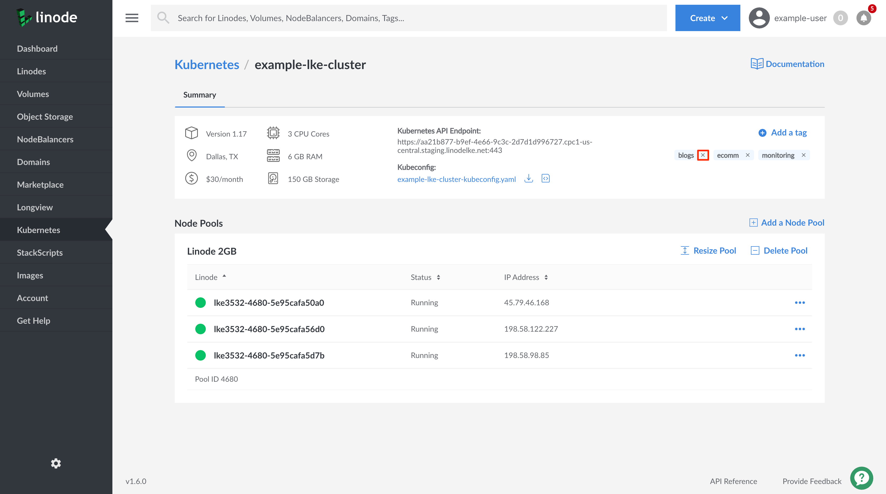

## Grouping by Tag

You can group the following resources by tag: Linodes, Volumes, NodeBalancers, and Domains.

1. To group by tag, navigate to the resource's page and toggle the **Group by Tag** switch at the top of the page:

    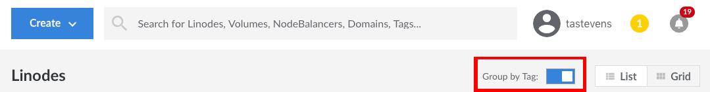

1. You will now be able to view your resources grouped by tag:

    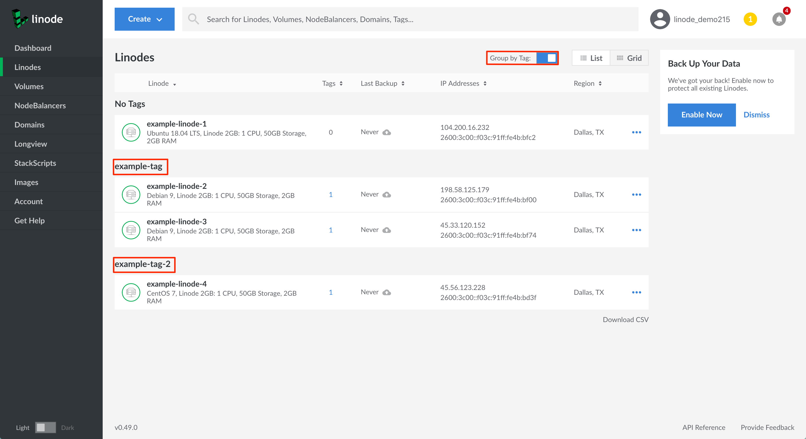

## Searching by Tag

You can search your Linode resources by a tag's name:

1.  Type the tag name into the search bar at the top of the Cloud Manager and the results will be populated in a dropdown list that appears:

    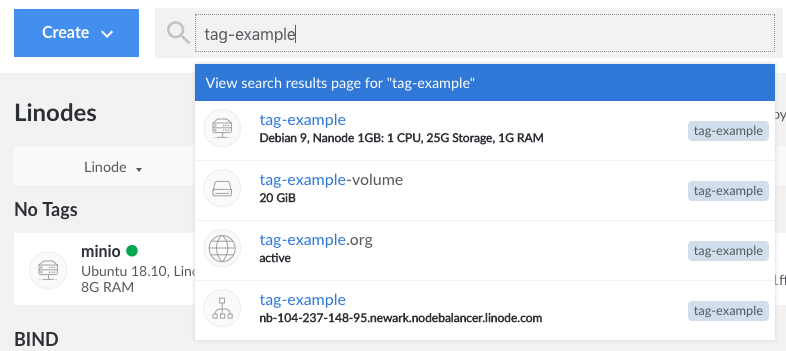

1.  To see a more organized view of your tagged resources, click on the blue **View search results page** banner inside the dropdown list, or hit the **Enter** key on your keyboard. You will be taken to the search results page:

    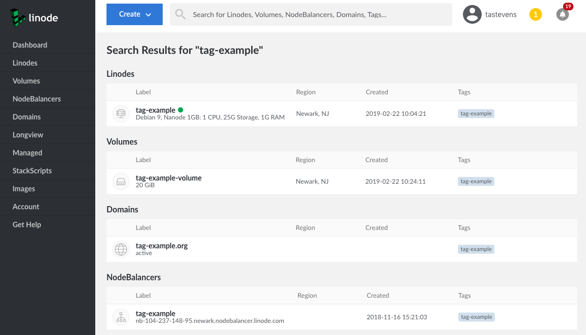

1.  A second way to search by tag is to click on a tag wherever it appears in the Cloud Manager. For example, if you previously applied a tag named `tag-example` to one of your Linodes, clicking on that tag where it is displayed in the Linode's detail page will take you to the search results page for `tag-example`.

## Importing Groups as Tags

If you have used the Display Groups feature in the Classic Manager, you can import your Display Groups to the Cloud Manager as tags:

1.  Navigate to the **Account** page in the sidebar links menu, then click on the **Settings** tab.

1.  Expand the panel labeled **Import Display Groups as Tags** and then click **Import Display Groups**:

    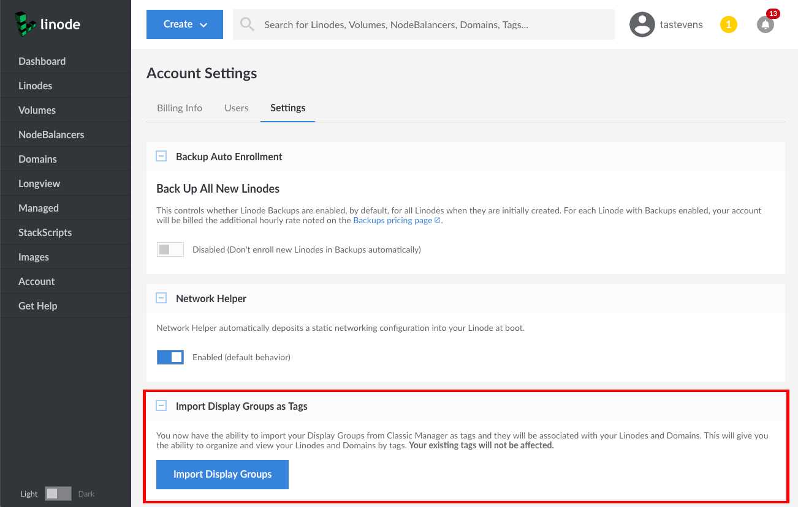

1.  A form will appear that lists your Display Groups and asks you to confirm the import action. To proceed, click the **Import Display Groups Now** button in this form.

    
Importing your Display Groups is a **one-time** operation. If you don't have any Display Groups configured in the Classic Manager this feature will not appear in the Cloud Manager.
