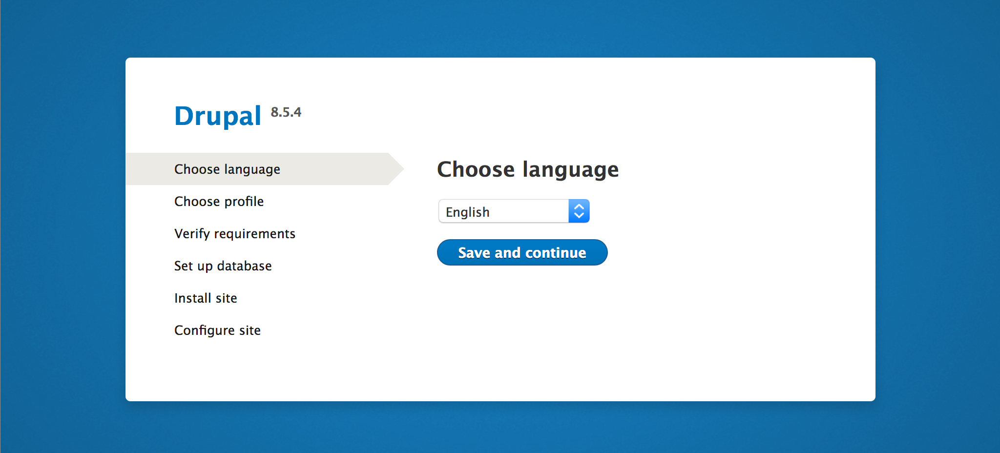
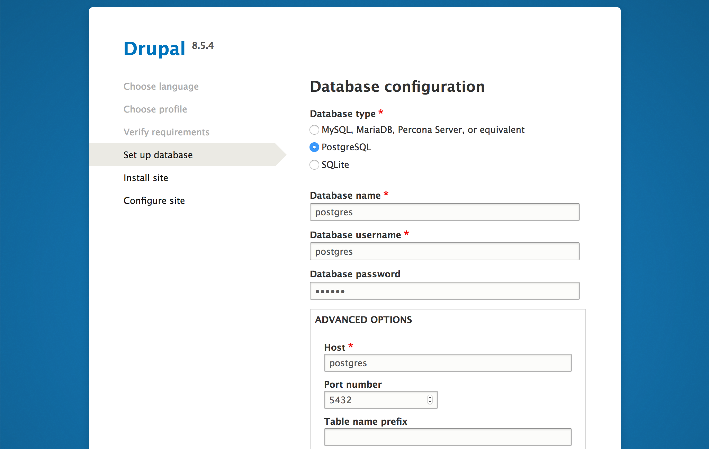

## What Are Docker and Docker Compose?

**Docker** is a system that provides pre-configured, self-contained applications, frameworks, and software stacks, such as WordPress, Golang, or LAMP. Even entire Linux distributions can be run in Docker. When deployed, these software packages are referred to as *containers*. Docker also allows you to create your own containers that include any custom software you'd like.

**Docker Compose** is a complementary system which helps you link together individual Docker containers so they can work together. This guide walks through the deployment of a Drupal container and another PostgreSQL container that Drupal will use to store its data. Docker Compose will facilitate the networking between them.

Containers for Drupal and PostgreSQL are available from [Docker Hub](https://hub.docker.com/) in the form of *images*. A Docker image is a static snapshot of a container which is used to create new container instances. Docker Hub is an official repository where individuals and organizations can upload Docker images for public consumption.

## Why Use Docker to Run Drupal?

Using the Drupal and PostgreSQL images from Docker Hub offers the following benefits:

-  The configuration of the software has been done for you, which means that you don't need to follow a step-by-step process for each application to get them running on your system.
-  Updating your software is as simple as downloading the latest images from Docker Hub.
-  Images and containers are self-contained, which means that they are easy to clean up if you decide to remove them.

## Installation

### Install Docker



### Install Docker Compose



## Set Up Drupal

1.  Create a new directory in your home folder called `my_drupal` and `cd` into it:

        mkdir ~/my_drupal/
        cd ~/my_drupal/

2.  Create a file named `docker-compose.yml` in this folder and add the following contents. Set your own password for the `POSTGRES_PASSWORD` option.

    
version: '3.3'

services:
  drupal:
    image: drupal:latest
    ports:
      - 80:80
    volumes:
      - drupal_modules:/var/www/html/modules
      - drupal_profiles:/var/www/html/profiles
      - drupal_themes:/var/www/html/themes
      - drupal_sites:/var/www/html/sites
    restart: always

  postgres:
    image: postgres:10
    environment:
      POSTGRES_PASSWORD: your_postgres_password
    volumes:
        - db_data:/var/lib/postgresql/data
    restart: always

volumes:
  drupal_modules:
  drupal_profiles:
  drupal_themes:
  drupal_sites:
  db_data:


3.  From the `my_drupal` directory, start your Docker containers:

        docker-compose up -d

4.  The Docker containers will take a minute or two to start up Drupal and PostgreSQL. Afterwards, you can visit your Linode's IP address in your web browser and you should be directed to the Drupal setup form.

    

5.  On the *Set up database* page, select `PostgreSQL` as the *Database type* and enter the following values:

    -   Database name: `postgres`

    -   Database username: `postgres`

    -   Database password: *The password you set in the docker-compose.yml file*

    -   Host (under Advanced Options): `postgres`

    

6.  Complete the other screens in the setup guide. When creating your Drupal user, be sure to enter a password that is different from your PostgreSQL password.

## Usage and Maintenance

You do not need to manually start your containers if you reboot your Linode, because the option `restart: always` was assigned to your services in your `docker-compose.yml` file. This option tells Docker Compose to automatically start your services when the server boots.

To stop your Drupal application:

    cd ~/my_drupal/
    docker-compose stop

This will stop the running Drupal and PostgreSQL containers, but will not remove them.

To restart your Drupal application:

    cd ~/my_drupal/
    docker-compose start

To stop and remove containers, networks and images created by the `docker-compose.yml` file:

    cd ~/my_drupal/
    docker-compose down

When a Docker container is taken down, it is also deleted; this is how Docker is designed to work. However, your Drupal files and data will be preserved, as the `docker-compose.yml` file was configured to create persistent volumes for that data.

If you want to remove this data and start over with your Drupal site, you can add the `--volumes` flag to the previous command. **This will permanently delete the Drupal customizations you've made so far.**

    docker-compose down --volumes

### Update Drupal

The `docker-compose.yml` specifies the `latest` version of the Drupal image, so it's easy to update your Drupal version:

    docker-compose down
    docker-compose pull && docker-compose up -d

## Next Steps

More extensive documentation on Docker is available in the [Containers](/docs/applications/containers/) section of the Linode Guides & Tutorials site.
