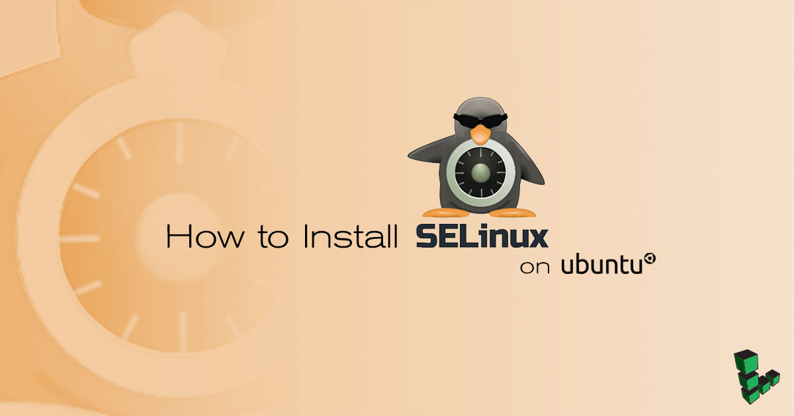

Ubuntu has a Mandatory Access Control (MAC) system similar to [SELinux](https://en.wikipedia.org/wiki/Security-Enhanced_Linux), named [AppArmor](https://wiki.ubuntu.com/AppArmor). Both SELinux and AppArmor provide a set of tools to isolate applications from each other to protect the host system from being compromised. AppArmor offers Ubuntu users mandatory access control options, without the perceived difficulty or learning curve that SELinux may have. However, if you are switching to Ubuntu 18.04, are already familiar with SELinux, and would like to use it to enforce security on your system, you can install it by following the steps in this guide.

## Before You Begin

1.  Ensure that you have followed the [Getting Started](/docs/getting-started) and [Securing Your Server](/docs/security/securing-your-server) guides.
    
This guide is written for a non-root user. Commands that require elevated privileges are prefixed with `sudo`. If you're not familiar with the `sudo` command, you can check our [Users and Groups](/docs/tools-reference/linux-users-and-groups) guide.
    

1.  Update your system:

        sudo apt update

    
The Linode kernel does not support SELinux by default. If your system is running a Linode kernel, you will need to change to an upstream kernel in order to use SELinux. See the [How to Change Your Linode's Kernel](/docs/platform/how-to-change-your-linodes-kernel/) for more steps. Once you're kernel is set to the upstream kernel, continue on with the steps in this guide.
    

### Remove AppArmor

1.  Stop AppArmor using systemctl:

        sudo systemctl stop apparmor

1.  Purge AppArmor from the system:

    
Do not purge AppArmor if you believe you may reuse it in the future.  If you would like to preserve your AppArmor configuration files, use the `remove` command, instead:

      sudo apt remove apparmor
    

        sudo apt purge apparmor

1.  Update your system:

        sudo apt update && sudo apt upgrade -yuf

1. Reboot your Linode:

        sudo reboot

### Install SELinux

1.  Install the SELinux package along with supporting packages to help you manage your installation.

        sudo apt install selinux selinux-utils selinux-basics auditd audispd-plugins

    
During the installation, a prompt will remind you to reboot your system for the changes to take effect. Select **Yes** in order to continue.


1. Verify your SELinux installation's status. The status of your SELinux installation should be `disabled`.

        sudo sestatus

1. Reboot your Linode for the installation to complete:

        sudo reboot

    
After rebooting your system, SELinux should be enabled, but in *permissive mode*. Permissive mode means any actions that would have been disallowed are allowed, but logged in your system's audit log located in the `/var/log/audit/audit.log` file.
   

1. Log back into your Linode via SSH. Replace `192.0.2.0` with your own Linode's IP address.

        ssh username@192.0.2.0

1. Verify the status of your SELinux installation:

        sudo sestatus

    You should see a similar output:

    
SELinux status:                 enabled
SELinuxfs mount:                /sys/fs/selinux
SELinux root directory:         /etc/selinux
Loaded policy name:             default
Current mode:                   permissive
Mode from config file:          permissive
Policy MLS status:              enabled
Policy deny_unknown status:     allowed
Memory protection checking:     requested (insecure)
Max kernel policy version:      31
    

1. To put SELinux into *enforcing mode*, use the `setenforce` command. When in enforcing mode, any actions not permitted by your system are blocked and the corresponding event is logged in the audit log.

        sudo setenforce 1

1.  To maintain `enforcing` mode after reboot, edit the SELinux configuration file in `/etc/selinux/config` from the default `SELINUX=permissive` to `SELINUX=enforcing`.

    
# This file controls the state of SELinux on the system.
# SELINUX= can take one of these three values:
# enforcing - SELinux security policy is enforced.
# permissive - SELinux prints warnings instead of enforcing.
# disabled - No SELinux policy is loaded.
SELINUX=enforcing
    

    
If you have set SELinux to enforcing mode, ensure that your SSH port has access before logging out of your session.

    sudo semanage port -l | grep 'ssh'

You should see a similar output if TCP is allowed on port 22.


ssh_port_t                     tcp      22


If you do not see the this entry, open the port with the following command:

    sudo semanage port -a -t ssh_port_t -p tcp 22
    

## Next Steps
After installing SELinux on your system, use our [Getting Started with SELinux Guide](/docs/security/getting-started-with-selinux/) to learn the basics of SELinux security.
