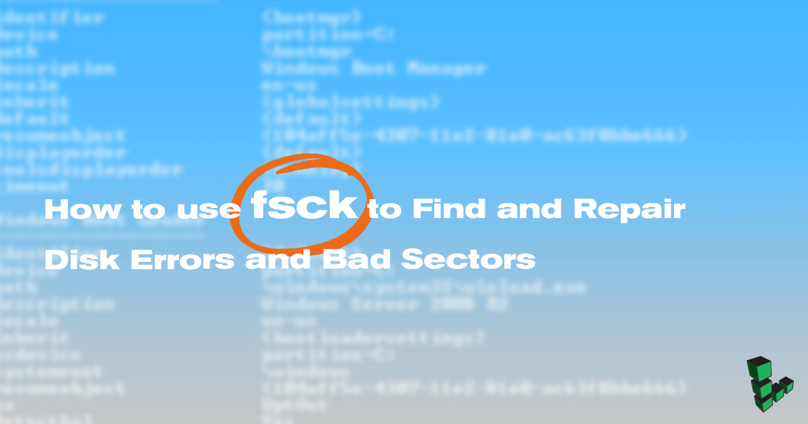

This guide is part of a series on Linux commands and features. Not all commands may be relevant to Linode-specific hardware, and are included here to provide an easy to access reference for the Linux community. If you have a command or troubleshooting tip that would help others, please submit a pull request or comment.

## What is fsck?

fsck, short for file system consistency check, is a utility that examines the file system for errors and attempts to repair them if possible. It functions as a frontend utility for a combination of built-in tools to check the disk and generates a report of its findings.

On some systems, fsck runs automatically after an unclean shutdown or after a certain number of reboots.


`fsck` is not installed by default when using Linode's rescue mode, and instead the `e2fsck` tool, which fsck functions as a frontend for, will need to be called directly for standard `ext` filesystems. Please see our [Troubleshooting Guide: Booting into Rescue Mode](/docs/guides/rescue-and-rebuild/#booting-into-rescue-mode) for guidance.


## When to Use fsck

Use fsck to check your file system if your system fails to boot, if files on a specific disk become corrupt, or if an attached drive does not act as expected.
Unmount the disks you intend to work on before attempting to check or repair them.


Unmount the target disk first. You risk corrupting your file system and losing data if you run fsck on an active disk.


## fsck Options and Arguments

| Option | Action |
| ------:|:------------------ |
| `-a`   | Attempt to fix errors automatically. Use with caution. |
| `-f`   | Force fsck to check a file system even if it thinks it's clean.  |
| `-A`   | Check all disks listed in `/etc/fstab`.  |
| `-C`   | Show progress bar (ext2 and ext3 file systems only).  |
| `-M`   | Skip mounted file systems.  |
| `-N`   | Test run. Describes what would happen without executing the check itself. |
| `-P`   | Use with the `-A` option to run multiple checks in parallel.  |
| `-R`   | If using the `-A` option, do not check the root filesystem.  |
| `-t`   | Check only a specific type of filesystem.  |
| `-T`   | Skip the title on startup.  |
| `-y`   | Interactive repair mode.  |

## Unmount the Disk

### Boot into Rescue Mode

If you are using fsck on a Linode, the easiest and safest way to unmount your disk is to use Rescue Mode. Visit our [Rescue and Rebuild](/docs/troubleshooting/rescue-and-rebuild/#booting-into-rescue-mode) guide for instructions on how to boot your Linode into Rescue Mode. If you're working on a local machine, consider using the distribution's recovery mode or a live distribution to avoid working on a mounted disk. fsck should be run only as a user with root permissions.

### View Mounted Disks and Verify Disk Location

1.  Run `df` to view a list of currently mounted disks. If you are using Rescue Mode, the disk you want to check should not be listed:

        df -h

2.  Use `fdisk` to view disk locations:

        fdisk -l

    Copy the location of the target disk to use with the fsck command.

### Configuration Profile

If you are working on a Linode but do not wish to use Rescue Mode, shut down the Linode from the Linode Manager. Unmount the disk from the [Configuration Profile](/docs/guides/linode-configuration-profiles). Apply the changes and reboot the Linode.

### Manual Unmount

If you are working on a local machine, unmount the disk manually.

1.  Use `umount` to unmount the disk location copied in the [previous step](#view-mounted-disks-and-verify-disk-location):

        umount /dev/sda

2.  If the disk is declared in `/etc/fstab`, change the `mount point` to `none` there as well.

## How to Check for Errors on a Disk

Run fsck on the target disk, using the desired options. This example checks all file systems (`-A`) on `/dev/sda`:

    fsck -A /dev/sda

### Understand fsck Error Codes

The error codes that fsck returns can be understood with the following table from [man7.org](http://man7.org/linux/man-pages/man8/fsck.8.html):

| Code | Error Code Meaning |
| ----:|:------------------ |
|   0 | No errors  |
|   1 | Filesystem errors corrected  |
|   2 | System should be rebooted  |
|   4 | Filesystem errors left uncorrected  |
|   8 | Operational error  |
|  16 | Usage or syntax error  |
|  32 | Checking canceled by user request  |
| 128 | Shared-library error  |

## Use fsck to Repair File System Errors

Use the `-r` option to use the interactive repair option.

This example uses fsck to check all file systems except the root, and will attempt repair using the interactive feature:

    fsck -AR -y

To check and attempt to repair any errors on `/dev/sda`, use this format:

    fsck -y /dev/sda

## What if fsck got interrupted?

If fsck gets interrupted, it will complete any checks in process, but will not attempt to repair any errors it finds.
