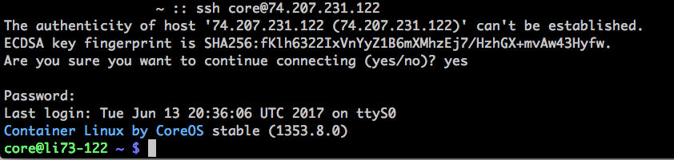
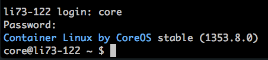

The `root` user is not active by default in Container Linux, so root login is not available. Instead, log in as the `core` user.

## Log in to CoreOS Over SSH

1.  From your local terminal, enter:

        ssh core@<your_Linode_IP>

2.  At the `password:` prompt, enter the `core` user's password you assigned when first having deployed Container Linux.

## Log in to CoreOS Through the Console (Lish or Glish)

1.  At the `login:` prompt, enter `core`.

2.  At the `password:` prompt, enter the `core` user's password you assigned when first having deployed Container Linux.


If you are not already familiar with the serial and graphical Linode shells, see the [Using the Lish Console](https://techdocs.akamai.com/cloud-computing/docs/access-your-system-console-using-lish) and [Access Your Linux Desktop Using Glish](https://techdocs.akamai.com/cloud-computing/docs/access-your-desktop-environment-using-glish) guides.

