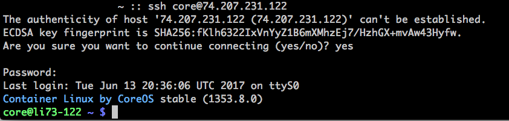
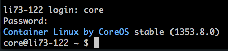

The `root` user is not active by default in Container Linux, so root login is not available. Instead, log in as the `core` user.

<iframe src="//fast.wistia.net/embed/iframe/5vtavtxheq?videoFoam=true" allowtransparency="true" frameborder="0" scrolling="no" class="wistia_embed" name="wistia_embed" allowfullscreen mozallowfullscreen webkitallowfullscreen oallowfullscreen msallowfullscreen width="100%" height="100%"></iframe>

## Log in to CoreOS Over SSH

1.  From your local terminal, enter:

        ssh core@<your_linode's_IP>

2.  At the `password:` prompt, enter the `core` user's password you assigned when first having deployed Container Linux.

## Log in to CoreOS Through the Console (Lish or Glish)

1.  At the `login:` prompt, enter `core`.

2.  At the `password:` prompt, enter the `core` user's password you assigned when first having deployed Container Linux.


If you are not already familiar with the serial and graphical Linode shells, see the [Using the Lish Console](/docs/guides/using-the-lish-console/) and [Use the Graphic Shell, Glish, to Manage Graphic Environments on Your Linode](/docs/guides/using-the-linode-graphical-shell-glish/) guides.

