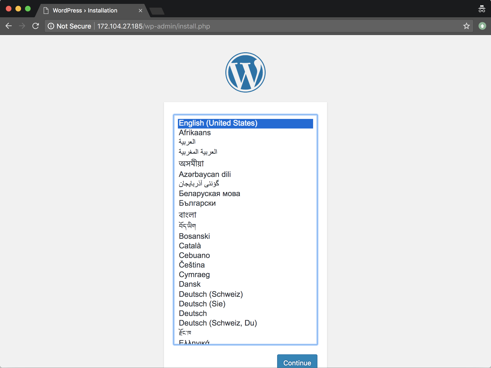

## What Are Docker and Docker Compose?

**Docker** is a system that provides pre-configured, self-contained applications, frameworks, and software stacks, such as WordPress, Golang, or LAMP. Even entire Linux distributions can be run in Docker. When deployed, these software packages are referred to as *containers*. Docker also allows you to create your own containers that include any custom software you'd like.

**Docker Compose** is a complementary system which helps you link together individual Docker containers so they can work together. This guide walks through the deployment of a WordPress container and another MySQL container that WordPress will use to store its data. Docker Compose will facilitate the networking between them.

Containers for WordPress and MySQL are available from [Docker Hub](https://hub.docker.com/) in the form of *images*. A Docker image is a static snapshot of a container which is used to create new container instances. Docker Hub is an official repository where individuals and organizations can upload Docker images for public consumption.

## Why Use Docker to Run WordPress?

The WordPress and MySQL images are maintained on Docker Hub by their respective organizations, and using them offers the following benefits:

-  The configuration of the software has been done for you, which means that you don't need to follow a step-by-step process for each application to get them running on your system.
-  Updating your software is as simple as downloading the latest images from Docker Hub.
-  Images and containers are self-contained, which means that they are easy to clean up if you decide to remove them.

## Installation

### Install Docker



### Install Docker Compose



## Set Up WordPress

1.  Create a new directory in your home folder called `my_wordpress` and `cd` into it:

        mkdir ~/my_wordpress/
        cd ~/my_wordpress/

2.  Create a file named `docker-compose.yml` in this folder and add the following contents. Set your own passwords for the `WORDPRESS_DB_PASSWORD`, `MYSQL_ROOT_PASSWORD`, and `MYSQL_PASSWORD` environment options. The password entered for `WORDPRESS_DB_PASSWORD` and `MYSQL_PASSWORD` should be the same.

    
version: '3.3'

services:
   wordpress:
     depends_on:
       - db
     image: wordpress:latest
     volumes:
       - wordpress_files:/var/www/html
     ports:
       - "80:80"
     restart: always
     environment:
       WORDPRESS_DB_HOST: db:3306
       WORDPRESS_DB_USER: wordpress
       WORDPRESS_DB_PASSWORD: my_wordpress_db_password
       WORDPRESS_DB_NAME: wordpress

   db:
     image: mysql:5.7
     volumes:
       - db_data:/var/lib/mysql
     restart: always
     environment:
       MYSQL_ROOT_PASSWORD: my_db_root_password
       MYSQL_DATABASE: wordpress
       MYSQL_USER: wordpress
       MYSQL_PASSWORD: my_wordpress_db_password
volumes:
    wordpress_files:
    db_data:



3.  From the `my_wordpress` directory, start your Docker containers:

        docker-compose up -d

4.  The Docker containers will take a minute or two to start up WordPress and MySQL. Afterwards, you can visit your Linode's IP address in your web browser and you should be directed to the WordPress setup form.

    

5.  You can optionally set up a domain for your WordPress site. Our [DNS Manager Overview](/docs/products/networking/dns-manager/) guide includes instructions for associating your domain with your Linode's IP address.

    Once you set up your DNS records, you should also replace your IP address with your domain in the WordPress Settings screen:

    

## Usage and Maintenance

You do not need to manually start your containers if you reboot your Linode, because the option `restart: always` was assigned to your services in your `docker-compose.yml` file. This option tells Docker Compose to automatically start your services when the server boots.

To stop your WordPress application:

    cd ~/my_wordpress/
    docker-compose down

When a Docker container is stopped, it is also deleted; this is how Docker is designed to work. However, your WordPress files and data will be preserved, as the `docker-compose.yml` file was configured to create persistent named volumes for that data.

If you want to remove this data and start over with your WordPress site, you can add the `--volumes` flag to the previous command. **This will permanently delete the WordPress posts and customizations you've made so far.**

    docker-compose down --volumes

### Update WordPress

The `docker-compose.yml` specifies the `latest` version of the WordPress image, so it's easy to update your WordPress version:

    docker-compose down
    docker-compose pull && docker-compose up -d

## Next Steps

More extensive documentation on Docker is available in the [Containers](/docs/guides/applications/containers/) section of the Linode Guides & Tutorials site.
