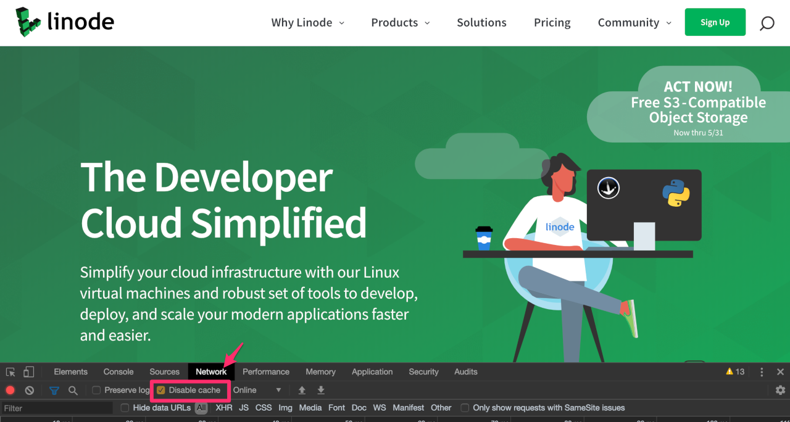
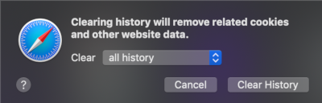

A browser's cache improves website loading performance by reducing the data processing and fetching.  When a sizeable amount of cached content is  stored, it slows down the system and reduces the performance of the application.

When you clear the cache the performance of the system and application is enhanced.

## Clear the Cache in Chrome

### Keyboard Shortcut

> **On Windows or Linux**
>
> While in the browser press **Ctrl** + **Shift** + **Delete** keys.

> **On MacOS**
>
> While in the browser press **command** + **shift** + **delete** keys.

### In the Browser
1.  Click the Chrome menu and select **Delete Browsing Data...**.

1.  In the **Delete browsing data** window.

1.  Select the following:
 - Browsing history
 - Download history
 - Cookies and other site data
 - Cached images and files

      Choose the period of time for which you want to clear cached information. To clear your entire cache, select **All time** from the **More** timerange drop-down menu.

1.  Click the **Delete data** button.
1.  Close all windows in the browser and re-open the browser.

### Disable Cache with Developer Tools

Chrome has a Developer tools dashboard built in. Within this you have the ability to disable caching in a specific tab.

1.  To open the Web Developer tools panel, click on the **View** menu, then click **Developer**, and **Developer Tools**.

1.  The dashboard will open at the bottom of the screen.

1.  Click the **Network** tab, and select the **Disable Cache** checkbox.

      

1.  Reload the page. This will load the page with the cache disabled.

### Incognito Browsing in Chrome

Chrome allows you to browse in Incognito Mode.

- This is a private browser window which allows you to surf the web without the browser saving your cookies or site history.
- However, it does not mean that your browsing is private to your network, ISP, or search engines.
- You must exit the browser window to clear the history, cookies, and data created during the session.

1.  To create an Incognito window, click the **File** menu and select **New Incognito Window**.

      - You can also open an Incognito window with the keyboard shortcut **Ctrl** + **Shift** + **N** (Windows and Linux) or **command** + **shift** + **N** (MacOS).

## Clear the Cache in FireFox

### Keyboard Shortcut

> **On Windows or Linux**
>
> While in the browser press **Ctrl** + **Shift** + **Delete** keys.

> **On MacOS**
>
> While in the browser press **command** + **shift** + **delete** keys.

### In the Browser

1. Click the **Application Menu** (three horizontal lines in the top-right corner) and select **Settings**.
1. From the left sidebar, click on **Privacy & Security**.
1. Scroll down to the **Cookies and Site Data** section and click the **Clear browsing data...** button.
1. In the overlay window, locate the **When:** drop-down menu and select your desired timeframe; to clear your entire cache, select **Everything**.
1. In the list below, ensure **Cached Web Content** is checked.
1. Click the **Clear** button.
1. Close all windows in the browser and re-open the browser.

### Disable Cache with Web Developer Tools

Firefox has a Web Developer tools dashboard built in. Within this, you have the ability to disable caching in a specific tab.

1. To open the Web Developer tools panel, click on the **Application Menu** (three horizontal lines), hover over **More tools**, and select **Web Developer Tools** (or press **F12**).

2. The dashboard will open at the bottom or side of the screen.

3. Click the **Network** tab, and select the **Disable Cache** checkbox.

4. Reload the page. This will load the page with the cache disabled.

### Private Browsing in Firefox

A private browser window can be opened in Firefox.

- Private browsing allows you to surf the web without saving cookies, site data, or browsing history.
- It does not mean you can mask your identity on the web or your activity online to your network or ISP.
- Data is cleared upon exiting the browser window.

1. To open a private browsing session, click the **Application Menu** (three horizontal lines) and select **New Private Window**.

      - You can also open a private window with the keyboard shortcut **Ctrl** + **Shift** + **P** (Windows and Linux) or **command** + **shift** + **P** (macOS).

## Clear the Cache in Safarihift** + **P** (MacOS).

## Clear the Cache in Safari

1. From the **Safari** menu, select **Clear History**.
   
2. Select the desired time range option in the **Clear** drop-down menu.

      To clear all the cache select **all history**, and then click **Clear History**.

3. Go to the **Safari** menu and click **Quit Safari** to exit the browser.

      On MacOS, press **command** + **Q** to exit the browser completely.

### Disable Cache with Developer Tools

Safari has a Developer tools dashboard built in, but you may need to enable it. Within this you have the ability to disable caching in a specific tab.

1.  First, to enable it, click the **Safari** menu, **Settings**. Then in the **Advanced** tab, choose **Show features for web developers**.

1.  Close the preference panel. The **Develop** menu should now appear on the menu bar.

1.  To open the Developer tools panel, click on the **Develop** menu, then click **Show Web Inspector**.

1.  The dashboard will open at the bottom of the screen.

1.  Click the **Network** tab, and select the **Disable Caches**.

1.  Reload the page. This will load the page with the cache disabled.

### Private Browsing in Safari

A private browser window can be opened in Safari.

- Private browsing allows you to surf the web without saving cookies or browsing history.
- It does not mean you can mask your identity on the web or your activity online.
- Additionally, tabs in a private browser window are isolated from each other and private browsing windows can not be passed to other Apple devices via Handoff.
- Data is cleared upon exiting the browser window.

1.  To open a private browsing session, click the **File** menu and select **New Private Window**.

      - You can also open a private window with the keyboard shortcut **Ctrl** + **Shift** + **N** (Windows and Linux) or **command** + **shift** + **N** (MacOS).

## Clear the Cache in Edge

### Keyboard Shortcut

> **On Windows or Linux**
>
> While in the browser press **Ctrl** + **Shift** + **Delete** keys.

> **On MacOS**
>
> While in the browser press **command** + **shift** + **delete** keys.

### In the Browser

1. Click the **Settings and more** menu (three horizontal dots in the top-right corner) and select **Settings**.
2. In the left-hand sidebar, click on **Privacy, search, and services**.
3. Scroll down to the **Clear browsing data** section and click the **Choose what to clear** button next to *Clear browsing data now*.
4. In the **Time range** drop-down menu, choose the period of time for which you want to clear cached information. To clear your entire cache, select **All time**.
5. Select the checkboxes for the following:
   - Browsing history
   - Download history
   - Cookies and other site data
   - Cached images and files
6. Click the **Clear now** button.
7. Close all windows in the browser and re-open the browser.

### Disable Cache with Developer Tools

Edge has a Developer tools dashboard built in. Within this, you have the ability to disable caching in a specific tab.

1. To open the Developer tools panel, click on the **Settings and more** menu (three dots), hover over **More tools**, and select **Developer tools**. Simply press **F12** or **Ctrl + Shift + I** (Windows) and  **command + option + I** in MacOS.

1. The dashboard will open at the side or bottom of the screen. You can change the location of this panel to your preference.

1. Click the **Network** tab, and select the **Disable cache** checkbox.

1. Reload the page. This will load the page with the cache disabled.

### InPrivate Browsing in Edge

Edge allows you to browse in InPrivate Mode.

- This is a private browser window which allows you to surf the web without the browser saving your cookies, site data, or browsing history.
- However, it does not mean that your browsing is private to your network, ISP, or search engines.
- You must exit the browser window to clear the history, cookies, and data created during the session.

1. To create a new InPrivate window, click the **Settings and more** menu (three dots) and select **New InPrivate window**.

      - You can also open an InPrivate window with the keyboard shortcut **Ctrl** + **Shift** + **N** (Windows and Linux) or **command** + **shift** + **N** (macOS).
