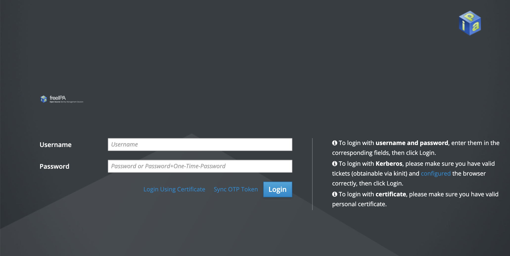

## What is FreeIPA

FreeIPA is a free and open source identity management system, it is the upstream open-source project for Red Hat Identity Management.

FreeIPA is the Linux version or implementation of Active Directory, which features the following:

- Integrated security information management solution combining Linux (Fedora), 389 Directory Server, MIT Kerberos, NTP, DNS, SSSD and others.
- Built on top of well known Open Source components and standard protocols.
- Strong focus on ease of management and automation of installation and configuration tasks.
- Full multi master replication for higher redundancy and scalability.
- Extensible management interfaces (CLI, Web UI, XMLRPC and JSONRPC API) and Python SDK.

## Before you Begin

This guide assumes:

- Two fully functional Linodes equal to a [2GB Plan](https://www.linode.com/pricing/) or greater must be created using CentOS 7 or later. One will host the FreeIPA server, while the other will host the client.
- You have followed the [Getting Started](/docs/products/platform/get-started/) and [Securing Your Server](/docs/products/compute/compute-instances/guides/set-up-and-secure/) guides. One will host the FreeIPA server, while the other will host the client.
- You are familiar with the [command line](/docs/guides/introduction-to-linux-concepts/#so-youre-staring-at-a-shell-prompt)
- FreeIPA requires that the user has possession of their own fully qualified domain name (FQDN) with an active subdomain for both the client and server. Before proceeding, ensure that each Linode has A/AAAA records configured using a [Unique Subdomain](/docs/products/networking/dns-manager/) for both the server and client Linode respectively.
- [Set up Reverse DNS](/docs/products/compute/compute-instances/guides/configure-rdns/) for each Linode using their full unique subdomain.

## Prepare the Client and Server

First, the FreeIPA Server and Client Linodes must be prepared for the installation. Follow the pre-installation steps below on **both** the Client and Server Linodes:

1. Set the hostname to match the domain you will be using for the FreeIPA server or client:

    ```command
    sudo hostname ipa.example.com
    ```

1. [Edit the systems hosts file](/docs/guides/using-your-systems-hosts-file/) to reflect the new hostname.

    ```file {title="/etc/hosts" lang="conf"}
    127.0.0.1 localhost.localdomain localhost
    203.0.113.10 server.example.com example-hostname
    ```

1. FreeIPA requires access to the following ports for the services listed below:

    | Ports | Service | Protocol |
    | -- | -- | -- |
    | 80, 443     | HTTP/HTTPS | TCP |
    | 389, 636   | LDAP/LDAPS | TCP |
    | 88, 464 | Kerberos | TCP/UDP|
    | 53 | DNS | TCP/UDP |
    | 123 | NTP | UDP |

    All of the above ports can be opened using the commands in[firewalld cmd list](/docs/guides/introduction-to-firewalld-on-centos/). Type the following command:

    ```command
    firewall-cmd --permanent --add-port={80/tcp,443/tcp,389/tcp,636/tcp,88/tcp,464/tcp,53/tcp,88/udp,464/udp,53/udp,123/udp}
    ```

1. Reload the firewall rules to save and activate them:

    ```command
    firewall-cmd --reload
    ```

1. If installing on CentOS 8 or CentOS Stream, the DL1 module stream must be manually installed and synced to be able to install the FreeIPA server and client in a later step:

    ```command
    dnf module enable idm:DL1
    dnf distro-sync
    ```

### Set Up the FreeIPA Server

On the server Linode, install and set up the FreeIPA server with the following commands:

1. Download the FreeIPA server software:

    ```command
    yum install ipa-server
    ```

1. Once the software has been downloaded, begin the installation process by entering the following command:

    ```command
    sudo ipa-server-install
    ```

1. Respond to the prompts with your desired FreeIPA configuration. Below are explanations on the configuration options and what options should be entered.

    | Prompt | Response |
    | -- | -- |
    | Do you want to configure integrated DNS (BIND)? | Bind can be set up to provide additional DNS support to the FreeIPA sever. Since the FreeIPA configuration being used as part of this tutorial is relying on external DNS using Linode's DNS Manager, `no` is the recommended choice. |
    | Server host name | ipaserver.example.com |
    | Please confirm the domain name. | example.com |
    | Please provide a realm name. | When used with Kerberos, a `Realm` represents the domain that the server has authority over. The realm name should be the same as the primary domain being used for the FreeIPA server. |
    | Directory Manager Password | Enter a secure Password of your choice for the Directory Manager. The Directory Manager is an administrative user with full access permissions to the directory server. The password must be at least 8 characters long. |
    | IPA Admin Password | The password of the administrative user account for the IPA server. |
    | Continue to configure the system with these values? | After reviewing your settings, enter `yes` to continue. |

1. The installation process will begin, and you should see every step being outlined in your terminal. This process can take between 3-5 minutes to complete.

1. Once the installation is complete, you will you will be provided with instructions on how to create a Kerberos ticket for the admin user, allowing you to begin working with Kerberos. This can be done by running the following command:

    ```command
    kinit admin
    ```

    
The admin ticket created with `kinit admin` is set to expire in 24 hours following ticket creation. To re-create another admin ticket, enter `kinit admin` again at any time.


1. At the prompt, enter the `IPA Admin Password` to proceed.

1. To view all active Kerberos tickets along with statistics, enter the following command:

    ```command
    klist
    ```

1. Create a new user by entering the following command and following the prompts that appear in the terminal:

    ```command
    ipa user-add --password
    ```

New users can be created with the above command at any time.


Kerberos tickets associated with these users will expire similarly to admin users. Basic syntax for creating new kerberos tickets is `kinit username`.


### Set up the FreeIPA Client

On the client Linode, install and set up the FreeIPA client with the following commands:

1. Download the FreeIPA client software:

    ```command
    sudo yum install freeipa-client
    ```

1. Once the software has been downloaded, begin the installation process by entering the following command:

    ```command
    sudo ipa-client-install --mkhomedir
    ```

1. Respond to the prompts with your desired FreeIPA client configuration. Below are explanations on the configuration options and what options should be entered.

    | Prompt | Response |
    | -- | -- |
    | Provide the domain name of your IPA server (ex: example.com) | The primary domain used for the server installation. |
    | Provide your IPA server name (ex: ipa.example.com). | The full domain used for the server installation including the subdomain. |
    | If you proceed with the installation, services will be configured to always access the discovered server for all operations and will not fail over to other servers in case of failure.
    Proceed with fixed values and no DNS discovery? |  This option is informing the user that the server is _not_ configured with high availability, and it is safe to proceed by entering `yes`. More information on high availability on FreeIPA can be found in FreeIPA's [Official Documentation](https://www.freeipa.org/page/V4/Replica_Setup) |
    | Client Hostname | The full domain, including the subdomain of the Client server currently being configured. |
    | Continue to configure the system with these values? | The values for this freeIPA client installation appear in the terminal. Review these configuration options and enter `yes` to approve them and proceed with the installation. |
    | User authorized to enroll computers. | Enter the username of a Kerberos user able to enroll new computers. The `admin` user may be entered. |
    | Password for user@example.com. | The Password for the Kerberos user entered at the previous step. This will be the same password set on the FreeIPA server. |

FreeIPA is now successfully installed as both a client and server. To confirm this, authenticate to the server as a user created previously by entering the following command to switch to your user:

```command
su - username
```

Provided a kerberos ticket has been created for the user using the `kinit username` command, you will additionally be able to authenticate to any client using kerberos tickets. Enter the following command to open an ssh session from the server Linode to the client to confirm:

```command
ssh -k user@client.example.com
```

Kerberos tickets enable you to authenticate to any client using tickets instead of providing credentials. In this case,you will be able to log in to the FreeIPA client via SSH without providing any credentials, as the identity of both hosts has already been validated via FreeIPA and Kerberos.

## Next Steps

The kerberos admin server will be freely accessible via it's domain in a web browser. Credentials created during installation can then be used to log in as the admin user via FreeIPA's web ui. Enter the admin server domain into your browser and you will see a page similar to the following:



Once logged in, you will have access to many of the tools and utilities available to FreeIPA from the command line directly on a more user friendly web interface.


The steps in this guide rely on a self-signed SSL certificate, and users may see an error message in their web browser claiming that the SSL certificate is not valid. While the self-signed certificate will not be recognized by any certificate authority, it will still provide TLS/SSL encryption. Due to this, the error message can be ignored.


Following installation, users can add additional clients and users, create more fine tuned Kerberos tickets, adjust security policies, and more.