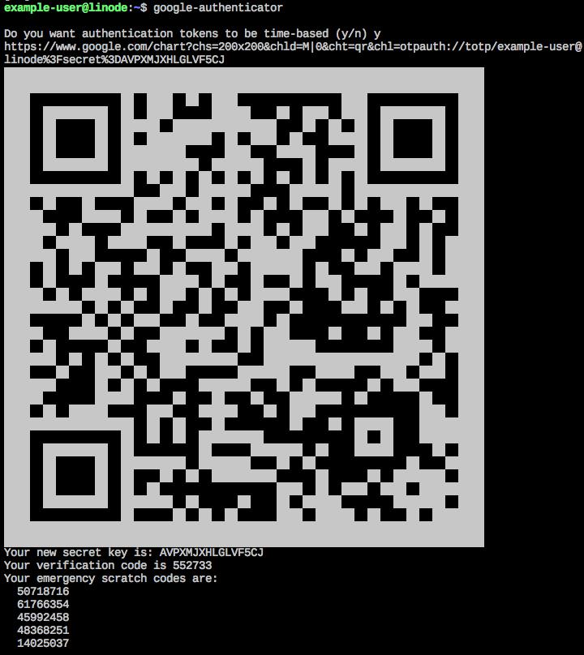

In this guide, you'll learn how to use one-time passwords for two-factor authentication with SSH on Ubuntu 18.04 LTS. No matter what kind of data you're hosting, securing access to your Linode is a critical step in preventing your information from being compromised. By default, you will need a password to log in, and you may also configure an authentication key-pair for even greater security. However, another option exists to complement these methods: [time-based one-time passwords](https://en.wikipedia.org/wiki/Time-based_One-time_Password_algorithm) (*TOTPs*).

TOTPs allow you to enable two-factor authentication for SSH with single-use passwords that change every 30 seconds. By combining this method with a regular password or publickey (or both), you can add an extra layer of security, further ensuring your server is sufficiently protected.

This guide will explain how to install the necessary software, configure your system to use two-factor authentication (2FA), and use your new time-based one-time password (TOTP) in combination with existing security features.

## Before You Begin

1.  This guide is meant to be used with a Linode running Ubuntu 18.04 LTS. Familiarize yourself with our [Getting Started](/docs/getting-started) guide and complete the steps for [setting your Linode's hostname](/docs/guides/set-up-and-secure/#configure-a-custom-hostname), [updating your system's hosts file](/docs/guides/set-up-and-secure/#update-your-systems-hosts-file), and setting the [timezone](/docs/guides/set-up-and-secure/#set-the-timezone).

1.  Complete the sections of our [Securing Your Server](/docs/security/securing-your-server) guide to [create a standard user account](/docs/guides/set-up-and-secure/#add-a-limited-user-account), and [remove unnecessary network services](/docs/guides/set-up-and-secure/#remove-unused-network-facing-services). This guide will explain a different way to harden SSH access, but you can also [use public key authentication](/docs/guides/set-up-and-secure/#create-an-authentication-key-pair) in addition for even greater protection. That method will be covered in the optional section, [Combine Two-Factor and Public Key Authentication](#combine-two-factor-and-public-key-authentication-optional).

    
If you plan on [combining two-factor and public key authentication](#combine-two-factor-and-public-key-authentication-optional), ensure you [upload your computer's public key](/docs/guides/set-up-and-secure/#create-an-authentication-key-pair) to your Linode's [standard user account](/docs/guides/set-up-and-secure/#add-a-limited-user-account) before beginning the steps in this guide.
    

1.  You will need a smartphone or another client device with an authenticator application such as [Google Authenticator](https://en.wikipedia.org/wiki/Google_Authenticator) or [Authy](https://www.authy.com/). Many other options exist, and this guide should be compatible with nearly all of them.

1.  Update your system:

        sudo apt-get update && sudo apt-get upgrade

    
This guide is written for a non-root user. Commands that require elevated privileges are prefixed with `sudo`. If you’re not familiar with the `sudo` command, you can check our [Users and Groups](/docs/tools-reference/linux-users-and-groups) guide.


## Install Google Authenticator

In this section, we'll install the Google Authenticator package, which is included in the default repository of Ubuntu 18.04 LTS. This software will generate keys on your Linode, which will then be paired with an app on a client device (often a smartphone) to generate single-use passwords that expire after a set period of time.

1. Install Google Authenticator:

        sudo apt-get install libpam-google-authenticator

    Although we are using the Google Authenticator package, the keys it generates are compatible with other authentication apps.

## Generate a Key

Now that you've installed the Google Authenticator package, you'll use it to generate keys. These keys are then used by software on client devices to generate time-based one-time passwords (TOTPs). To understand the difference between these passwords and the ones you already use, let's break down the concept of a TOTP:

-   **Time-based** - The generated password will change every 30-60 seconds. This means that if an attacker tries to use brute force, they'll almost certainly run out of time before new credentials are needed to gain access.
-   **One-time** - The password will be valid for a single authentication only, thus minimizing the risk of a replay attack. Even if your TOTP is intercepted upon sending it to the server, it will no longer be valid after you've logged in.

The following instructions will generate a password for the user running the commands. If you are configuring two-factor authentication for multiple users, perform these steps for each user.


Be sure to have your phone or mobile device ready, since this is where you'll add the password to your authenticator app. If you haven't [downloaded an authenticator app](#before-you-begin), do so before proceeding.


1.  Run the `google-authenticator` program. A prompt will appear asking you to specify whether you'd like to use a time-based authentication (as opposed to one-time or counter-based). Choose "yes" by entering `y` at the prompt.

        google-authenticator

1.  You should see a [QR code](https://en.wikipedia.org/wiki/QR_code) in your terminal:

    

    Using the authenticator app on your phone or mobile device, scan the code. A new entry should be added to your authenticator app in the format `username@hostname`.

    You'll also see a "secret key" below the QR code. You may enter this into the app manually, instead of scanning the QR code, to add your account.

1.  Record your emergency scratch codes in a secure location. These codes can be used for authentication if you lose your device, but be aware that each code is only valid **once**.

1.  You'll be prompted to answer the following questions:

    
Do you want me to update your "/home/exampleuser/.google_authenticator" file (y/n)
    

    This specifies whether the authentication settings will be set for this user. Answer `y` to create the file that stores these settings.

    
Do you want to disallow multiple uses of the same authentication
token? This restricts you to one login about every 30s, but it increases
your chances to notice or even prevent man-in-the-middle attacks (y/n)
    

    This makes your token a true one-time password, preventing the same password from being used twice. For example, if you set this to "no," and your password was intercepted while you logged in, someone may be able to gain entry to your server by entering it before the time expires. We **strongly recommend** answering `y`.

    
By default, a new token is generated every 30 seconds by the mobile app.
In order to compensate for possible time-skew between the client and the server,
we allow an extra token before and after the current time. This allows for a
time skew of up to 30 seconds between authentication server and client. If you
experience problems with poor time synchronization, you can increase the window
from its default size of 3 permitted codes (one previous code, the current
code, the next code) to 17 permitted codes (the 8 previous codes, the current
code, and the 8 next codes). This will permit for a time skew of up to 4 minutes
between client and server.
Do you want to do so (y/n)
    

    This setting accounts for time syncing issues across devices. Unless you have reason to believe that your phone or device may not sync properly, answer `n`.

    
If the computer that you are logging into isn't hardened against brute-force
login attempts, you can enable rate-limiting for the authentication module.
By default, this limits attackers to no more than 3 login attempts every 30s.
Do you want to enable rate-limiting (y/n)
    

    This setting prevents attackers from using brute force to guess your token. Although the time limit should be enough to prevent most attacks, this will ensure that an attacker only has three chances per 30 seconds to guess your password. We recommend answering `y`.

1.  **Before you log out**, review the [next section](#configure-authentication-settings) carefully to avoid getting locked out of your Linode.

You have finished generating your key and adding it to your client, but some additional configuration is needed before these settings will go into effect. Carefully read the following section in this guide for instructions on how to require two-factor authentication for all SSH login attempts.

## Configure Authentication Settings

The TOTP authentication methods in this guide use *PAM*, or Pluggable Authentication Modules. [PAM](http://www.linux-pam.org/) integrates low-level authentication mechanisms into modules that can be configured for different applications and services. Because you're using additional software (i.e., programs that aren't built into the Linux distro), you'll need to configure PAM to properly authenticate users.


- It is strongly recommended that you have another terminal session open while configuring your authentication settings. This way, if you disconnect to test authentication and something is not properly configured, you won't be locked out of your Linode. You can also use [Lish](/docs/platform/manager/using-the-linode-shell-lish) to regain access.

- If you or a user on your system use this method, be sure that the SSH key and authenticator app are on different devices. This way, if one device is lost or compromised, your credentials will still be separate and the security of two-factor authentication will remain intact.


1.  Open `/etc/pam.d/sshd` with sudo privileges, and add the following lines to the end of the file:

    
auth    required      pam_unix.so     no_warn try_first_pass
auth    required      pam_google_authenticator.so



    The first line tells PAM to authenticate with a normal Unix user password before other methods. The second line specifies an additional method of authentication, which in this case, is the TOTP software we installed earlier.

1.  Edit `/etc/ssh/sshd_config` to include the following lines, replacing `example-user` with any system user for which you'd like to enable two-factor authentication. Comments (preceded by #) are included here, but should not be added to your actual configuration file:

    
# This line already exists in the file, and should be changed from 'no' to 'yes'
ChallengeResponseAuthentication yes

...

# These lines should be added to the end of the file
Match User example-user
    AuthenticationMethods keyboard-interactive



    If you created TOTPs for multiple users, and you'd like to have them all use two-factor authentication, create additional `Match User` blocks for each  user, duplicating the command format shown above.

    
If you want to enforce two-factor authentication globally, you can use the `AuthenticationMethods` directive by itself, outside of a `Match User` block. However, this should not be done until two-factor credentials have been provided to all users.


1.  Restart the SSH daemon to apply these changes:

        sudo systemctl restart ssh

    Two-factor authentication is now enabled. When you connect to your Linode via SSH, the authentication process will proceed as shown in the diagram.

    

1. Open a new terminal session and test your configuration by connecting to your Linode via SSH. You will be prompted to enter in your standard user account's password and then, you will be prompted to enter in a `Verification Code`. Open your authorization app, select the account you created in the [Generate a Key](#generate-a-key) section and enter in the password that is displayed. You should authenticate successfully and gain access to your Linode.


If your SSH client disconnects before you can enter your two-factor token, check if PAM is enabled for SSH. You can do this by editing `/etc/ssh/sshd_config`: look for `UsePAM` and set it to `yes`. Don't forget to restart the SSH daemon.


## Combine Two-Factor and Public Key Authentication (Optional)

This section is optional. If you'd like to use [public key authentication](/docs/security/authentication/use-public-key-authentication-with-ssh) instead of a password authentication with TOTP, follow the steps in this section.


Before completing this section, ensure that your computer's [public key has been uploaded to your Linode](/docs/guides/set-up-and-secure/#create-an-authentication-key-pair). Public keys are normally stored in your home directory's `authorized_keys` file.

    cat ~/.ssh/authorized_keys


1.  Set `PasswordAuthentication` to `no` and modify the `AuthenticationMethods` line in `/etc/ssh/sshd_config` to include `publickey`:

    
PasswordAuthentication no
...
Match User example-user
    AuthenticationMethods publickey,keyboard-interactive



    Configure this setting in the `AuthenticationMethods` directive for each user as appropriate. When any of these users log in, they will need to provide their SSH key and they will be authenticated via TOTP, as well.

1. Restart your SSH daemon to apply these changes.

        sudo systemctl restart ssh

1.  Next, you'll need to make changes to your PAM configuration. Comment out or omit the following lines in your `/etc/pam.d/sshd` file:

    
# @include common-auth
...
# auth    required      pam_unix.so     no_warn try_first_pass



    You should now be able to log in using your SSH key as the first method of authentication and your verification code as the second. To test your configuration, log out and try to log in again via SSH. You should be asked for your 6-digit verification code only, since the key authentication will not produce a prompt.

## Next Steps

First, be sure you have followed our guide to [Securing Your Server](/docs/security/securing-your-server). Although there is no single, foolproof method to protecting your data, firewalls and services like [Fail2Ban](/docs/guides/using-fail2ban-to-secure-your-server-a-tutorial/) are a great way to minimize risk.

When you use two-factor authentication with TOTPs, an important point to consider is the physical security of the device on which you've configured your authenticator app. Be sure your phone or device is secured with a passphrase, so that even if it falls into the wrong hands, it can't easily be used to compromise your server. If you lose the phone or device that stores your credentials, you can use [Lish](/docs/platform/manager/using-the-linode-shell-lish) to access your Linode and disable two-factor authentication. If this happens, you should switch to a different, hardened method of SSH access, such as [public key authentication](/docs/security/authentication/use-public-key-authentication-with-ssh), in the interim.

While two-factor authentication may be a valuable security feature, total security is an ongoing process, not an end goal that can be achieved by adding extra layers of authentication. To provide the best protection for your data, take care to follow security best practices at all times.
