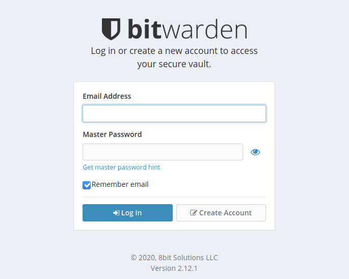
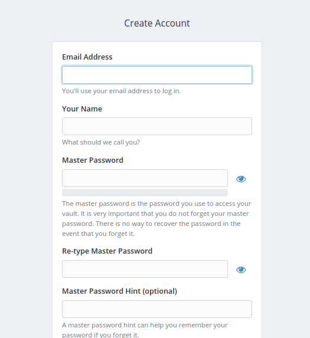
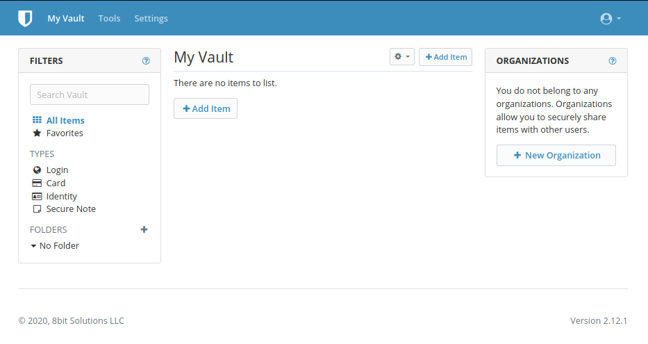

[Bitwarden](https://bitwarden.com/) is an open source password management application that can be self-hosted and run on your infrastructure. The [bitwarden_rs](https://github.com/dani-garcia/bitwarden_rs) project provides a lightweight, single-process, API-compatible service ideal for running personal instances. By running the bitwarden_rs service, you can use Bitwarden browser extensions and mobile applications backed by your server.


By self-hosting your password manager, you are assuming responsibility for the security and resiliency of sensitive information stored within bitwarden_rs. Before storing important information and credentials within the application, ensure that you are confident with the security of the server. Also, take the necessary backup measures mentioned in this tutorial.


## In this Guide

This guide uses the official bitwarden_rs [Docker image](https://github.com/dani-garcia/bitwarden_rs/wiki/Which-container-image-to-use). A reverse proxy ([Caddy](https://caddyserver.com/)) is configured in front of the Docker container. This provides TLS termination for both the web-based vault interface and the websocket server.

This configuration of bitwarden_rs also uses the default SQL backend for the application (sqlite3). The SQL datastore for bitwarden_rs contains the user data of the application and is therefore the primary concern for a backup scheme. Backing up this datastore ensures that sensitive data stored within bitwarden_rs is saved in the event of a data loss scenario.

This guide references the latest version of the bitwarden_rs Docker image that is available, which is 1.19 at the time of writing. As part of regular maintenance, follow the [upgrade instructions](https://github.com/dani-garcia/bitwarden_rs/wiki/Updating-the-bitwarden-image) provided by the project regularly. Following these instructions ensures your deployment is up to date with current upstream releases. This also ensures that any relevant security updates are applied to the application.

Ubuntu 20.04 is the distribution used in this guide. Generally speaking, any Linux distribution that supports running Docker containers should be equally compatible with the steps explained in this guide.

### Before You Begin

1. Familiarize yourself with our [Getting Started](/docs/getting-started) guide and complete the steps for setting the hostname and timezone.

1. Follow the [How to Secure Your Server](/docs/security/securing-your-server/) guide in order to harden the Linode against malicious users. This step is important to ensure bitwarden_rs is secured.

   
If you choose to configure a firewall, remember to open ports 80 and 443 for the Caddy server. The [Configure a Firewall](/docs/security/securing-your-server/#configure-a-firewall) section of the guide outlines different firewall software options.


1. Make sure you have registered a Fully Qualified Domain Name (FQDN) and set up [A and AAAA](/docs/networking/dns/dns-records-an-introduction/#a-and-aaaa) DNS records that point to the public [IPv4 and IPv6 addresses](/docs/getting-started/#find-your-linode-s-ip-address) of the Linode. Consult the [DNS Records: An Introduction](/docs/networking/dns/dns-records-an-introduction/) and [DNS Manager](/docs/platform/manager/dns-manager/) guides for help with setting up a domain. A proper domain name is important to acquire a certificate for HTTPS connectivity.

## Install Docker

1. Uninstall any potentially previously-installed packages.

        sudo apt-get remove docker docker-engine docker.io containerd runc

   If `apt-get` indicates that no packages were found, continue to the next step.

1. Install package prerequisites for compatibility with the upstream Docker repository.

        sudo apt-get install apt-transport-https ca-certificates curl gnupg-agent software-properties-common

1. Add the official Docker GPG repository key.

        sudo curl -fsSL https://download.docker.com/linux/ubuntu/gpg | sudo apt-key add -

1. Add the Docker upstream repository.

        sudo add-apt-repository "deb [arch=amd64] https://download.docker.com/linux/ubuntu $(lsb_release -cs) stable"

1. Update the `apt` package cache.

        sudo apt-get update

1. Install the required Docker packages.

        sudo apt-get install docker-ce docker-ce-cli containerd.io

1. Start and enable the `docker` daemon.

        sudo systemctl enable --now docker

1. Confirm that you can run `docker` commands. The following command should return without errors and show zero running containers.

        sudo docker ps

## Install bitwarden_rs

This section outlines how to download the bitwarden_rs Docker image, setup volume persistence, and manage the Docker container.

1. Pull the bitwarden_rs image.

        sudo docker pull bitwardenrs/server:latest

1. Select the desired file system path to store application data. In this guide, the path `/srv/bitwarden` is used. Create the directory if necessary, and enforce strict permissions for the root user only.

        sudo mkdir /srv/bitwarden
        sudo chmod go-rwx /srv/bitwarden

1. Create the Docker container for bitwarden_rs.

        sudo docker run -d --name bitwarden -v /srv/bitwarden:/data -e WEBSOCKET_ENABLED=true -p 127.0.0.1:8080:80 -p 127.0.0.1:3012:3012 --restart on-failure bitwardenrs/server:latest

    This command uses the following flags to establish a persistent container to serve the bitwarden_rs application:

    - `-d` daemonizes the container to run in the background.
    - Using `--name bitwarden` gives the container a human-readable name to avoid the need to reference the running container by a temporary identifier.
    - By passing the host path `/srv/bitwarden` to the volume (`-v`) flag, data is persisted outside of the container whenever it is stopped.
    - The environment variable `WEBSOCKET_ENABLED` enables the extra websocket server for bitwarden_rs.
    - Each `-p` flag forwards the respective host ports to the container (port 8080 for the main bitwarden_rs web service and port 3012 for websocket traffic). Normal HTTP and HTTPS ports are served with Caddy.
    - `--restart=on-failure` ensures that the container remains up in the event of container failure or host restart.

   As part of these steps, note that the container listens for traffic on the local loopback interface (`127.0.0.1`) and _not_ a publicly reachable IP address. This is to ensure that any traffic originating from outside the host must connect to the Caddy server, which enforces encrypted TLS connections.

## Configure Caddy as a Reverse Proxy

External clients communicate with Caddy, which automatically manages reverse proxying websocket traffic. Caddy also provisions and renews TLS certificates via Let's Encrypt automatically.

1. Pull the Caddy `alpine` image.

        sudo docker pull caddy/caddy:alpine

1. Create the following Caddyfile. Be sure to replace `example.com` with the name of the domain that you set up in the [Before You Begin](#before-you-begin) section of this guide, and confirm that the domain points to the IP address of the Linode. This domain serves the web interface for bitwarden_rs hosted and secured by Caddy's automatic TLS.

   
example.com {
  encode gzip

  # The negotiation endpoint is also proxied to Rocket
  reverse_proxy /notifications/hub/negotiate 0.0.0.0:8080

  # Notifications redirected to the websockets server
  reverse_proxy /notifications/hub 0.0.0.0:3012

  # Send all other traffic to the regular bitwarden_rs endpoint
  reverse_proxy 0.0.0.0:8080
}


   
The site name you choose in this file must match the desired URL that bitwarden_rs is served under. When navigating to the web interface later in this guide, ensure that you type the same hostname chosen in this configuration file (in this example, `example.com`).


1. Prepare a directory for Caddy in `/etc` to store state information such as Let's Encrypt certificates.

        sudo mkdir /etc/caddy
        sudo chmod go-rwx /etc/caddy

1. Start another Docker container to run a persistent `caddy` daemon.

        sudo docker run -d --name caddy -v /etc/Caddyfile:/etc/caddy/Caddyfile -v /etc/caddy:/root/.local/share/caddy --net host --restart on-failure caddy/caddy:alpine

   Many of these flags passed to the `docker` command are similar to those used in the `bitwarden_rs` instructions, with one notable difference. The `--net host` flag runs Caddy bound to the host machine's networking interface rather than constrained to the container. This flag simplifies access to other containers and to the necessary ports for Caddy to operate over HTTP and HTTPS.

1. View the logs of the Caddy container in order to confirm that a Let's Encrypt certificate has been provisioned for the chosen domain.

        sudo docker logs caddy

   There are likely to be many logs that are returned from this command. Take a moment to read through the logs to verify that lines similar to the following are included in your log output. These lines indicate that certificate provisioning has been successful.

   
2020/02/24 04:40:50 [INFO][example.com] Obtain certificate
2020/02/24 04:40:50 [INFO][example.com] Obtain: Waiting on rate limiter...
2020/02/24 04:40:50 [INFO][example.com] Obtain: Done waiting
2020/02/24 04:40:50 [INFO] [example.com] acme: Obtaining bundled SAN certificate
2020/02/24 04:40:50 [INFO] [example.com] AuthURL: <url>
2020/02/24 04:40:50 [INFO] [example.com] acme: Could not find solver for: tls-alpn-01
2020/02/24 04:40:50 [INFO] [example.com] acme: use http-01 solver
2020/02/24 04:40:50 [INFO] [example.com] acme: Trying to solve HTTP-01
2020/02/24 04:40:50 [INFO][example.com] Served key authentication (distributed)
2020/02/24 04:40:53 [INFO] [example.com] The server validated our request
2020/02/24 04:40:53 [INFO] [example.com] acme: Validations succeeded; requesting certificates
2020/02/24 04:40:54 [INFO] [example.com] Server responded with a certificate.


   If you find any log lines similar to the following, which indicate failure, double check that the server is reachable from the chosen domain.

   
2020/02/23 05:46:19 [INFO] Unable to deactivate the authorization: <url>
2020/02/23 05:46:19 [ERROR][example.com] failed to obtain certificate: acme: Error -> One or more domains had a problem:


   In order to avoid rate limiting problems, you should stop the `caddy` server if you find any certificate provisioning issues with `sudo docker stop caddy`. You may start the server again with `sudo docker start caddy` after resolving any issues found in the aforementioned container logs.

## Initial Setup

1. Navigate to the chosen domain in a local web browser (in this tutorial, `example.com`). Verify that the browser renders the Bitwarden web vault login page, and that the page is served over TLS/SSL.

   

   If you see the login page, congratulations! bitwarden_rs is running and operational. The first step in using the password manager is to create an account. Do so by clicking on the **Create Account** button on the login page.

   
Remember to navigate to the same name configured in your `Caddyfile` defined in the previous section of this guide. A mismatched hostname in your browser can cause TLS errors.


1. A new page appears with several fields.

   

   Fill each field with the appropriate information, choosing a strong and secure master password.

   
Although a user email is required at time of registration, by default, the deployment of bitwarden_rs cannot send email without additional configuration. If you would like to configure SMTP in order to enable bitwarden_rs to send email, follow [these instructions on the bitwarden_rs wiki](https://github.com/dani-garcia/bitwarden_rs/wiki/SMTP-configuration). Use SMTP information from an SMTP provider when following the instructions.


1. After registering, the system redirects you to the login screen. Log in with the credentials. The web vault view appears.

   

   At this point, the bitwarden_rs installation is functional.

### Disable Anonymous User Sign Up

As an additional security precaution, you may elect to disable user registration. This is recommended on servers that are publicly reachable to avoid abuse of the service.

1. Stop the running bitwarden_rs container and remove it.

        sudo docker stop bitwarden
        sudo docker rm bitwarden

1. Start a new bitwarden container, but with the `SIGNUPS_ALLOWED` environment variable set to `false`.

        sudo docker run -d --name bitwarden -v /srv/bitwarden:/data -e WEBSOCKET_ENABLED=true -e SIGNUPS_ALLOWED=false -p 127.0.0.1:8080:80 -p 127.0.0.1:3012:3012 --restart on-failure bitwardenrs/server:latest

1. If you attempt to create a new account after these changes, the following error appears on the account creation page.

   

   This deployment of bitwarden_rs does not permit any additional user registrations. You may still want to invite users without needing to change the bitwarden_rs container environment variable flags. This is possible by following the upstream documentation to [enable the admin panel](https://github.com/dani-garcia/bitwarden_rs/wiki/Enabling-admin-page). The admin panel provides user invitation functionality.

## Backup bitwarden_rs SQLite Database

Before relying on this service for any important data, you should take additional steps to safeguard the data stored within bitwarden_rs. Encrypted data is stored within a flat file sqlite3 database. In order to reliably backup this data, you should *not* simply copy the file. Instead, use the sqlite3 `.backup` command. This command ensures that the database is in a consistent state when the backup is taken.

1. Review the [Backing Up Your Data](/docs/security/backups/backing-up-your-data/) guide in order to determine the best location to store the backups. In this example, a local file system path is used.

    
In a more resilient setup, these local backups should be replicated onto another service or host to guard against single-host failure.


1. Install the `sqlite3` package, which provides the `sqlite3` command for the backup script.

        sudo apt-get install sqlite3

1. Create a directory for backups.

        sudo mkdir /srv/backup
        sudo chmod go-rwx /srv/backup

1. Create the following systemd service.

   
[Unit]
Description=backup the bitwarden sqlite database

[Service]
Type=oneshot
WorkingDirectory=/srv/backup
ExecStart=/usr/bin/env sh -c 'sqlite3 /srv/bitwarden/db.sqlite3 ".backup backup-$(date -Is | tr : _).sq3"'
ExecStart=/usr/bin/find . -type f -mtime +30 -name 'backup*' -delete


   This service unit creates a timestamped file and cleans up any backups older than 30 days.

1. To take an initial backup and verify the systemd service works, start the backup service.

        sudo systemctl start bitwarden-backup.service

1. Verify that a backup file is present:

        sudo ls -l /srv/backup/

   This command returns with one backup sqlite3 file.

   
total 136
-rw-r--r-- 1 root root 139264 Feb 24 18:16 backup-2020-02-24T18_16_50-07_00.sq3


1. To schedule regular backups using this backup service unit, create the following systemd timer unit.

   
[Unit]
Description=schedule bitwarden backups

[Timer]
OnCalendar=04:00
Persistent=true

[Install]
WantedBy=multi-user.target


   This schedules the backup to occur at 4:00 in the time zone set for the Linode. You may alter this time to trigger at a desired time of day.

   
The `Persistent=true` line instructs systemd to fire the timer if the timer was unable to trigger at its previous target time. For example, this could happen if the system was being rebooted.


1. Start and enable this timer unit.

        sudo systemctl enable bitwarden-backup.timer
        sudo systemctl start bitwarden-backup.timer

1. Finally, to view the timer's next execution time, check the status of the timer.

        systemctl status bitwarden-backup.timer

   You should see output similar to the following:

   
● bitwarden-backup.timer - schedule bitwarden backups
  Loaded: loaded (/etc/systemd/system/bitwarden-backup.timer; enabled; vendor preset: enabled)
  Active: active (waiting) since Mon 2020-02-24 22:09:44 MST; 7s ago
  Trigger: Tue 2020-02-25 04:00:00 MST; 5h 50min left


   This indicates that a backup is taken in 5 hours and 50 minutes.


Ensure that the backups are kept on a volume or host independent of the Linode in case of a disaster recover recovery scenario. Consider using [Linode Block Storage](/docs/platform/block-storage/how-to-use-block-storage-with-your-linode/) as one potential solution for permanent backup storage and archival.


## Using bitwarden_rs

bitwarden_rs provides a compatible API for many [Bitwarden apps and browser extensions](https://bitwarden.com/). In order to configure these applications to use a hosted instance, you may need to configure the mobile application or browser extension. Specifically, you may need to enter a custom domain and API endpoint:

1. As an example, this is the initial login screen for the Firefox Bitwarden browser extension. In order to configure a custom server, click the gear in the upper left corner.

   

1. On the next page, type your custom domain under the **Server URL** field, such as `https://example.com`. Similar steps can be taken on the iOS and Android mobile applications. Edit the settings of the application before login to use a custom Server URL, and you can log in to a custom instance of bitwarden_rs.

## Additional Reading

With bitwarden_rs running securely over TLS and regularly backed up, you may choose to follow [additional documentation provided by the bitwarden_rs project](https://github.com/dani-garcia/bitwarden_rs/wiki). This documentation helps add more functionality to your installation. Some of these features include:

- [Support for U2F authentication](https://github.com/dani-garcia/bitwarden_rs/wiki/Enabling-U2F-authentication)
- [SMTP configuration to support sending emails](https://github.com/dani-garcia/bitwarden_rs/wiki/SMTP-configuration) for features like account creation invitation.
