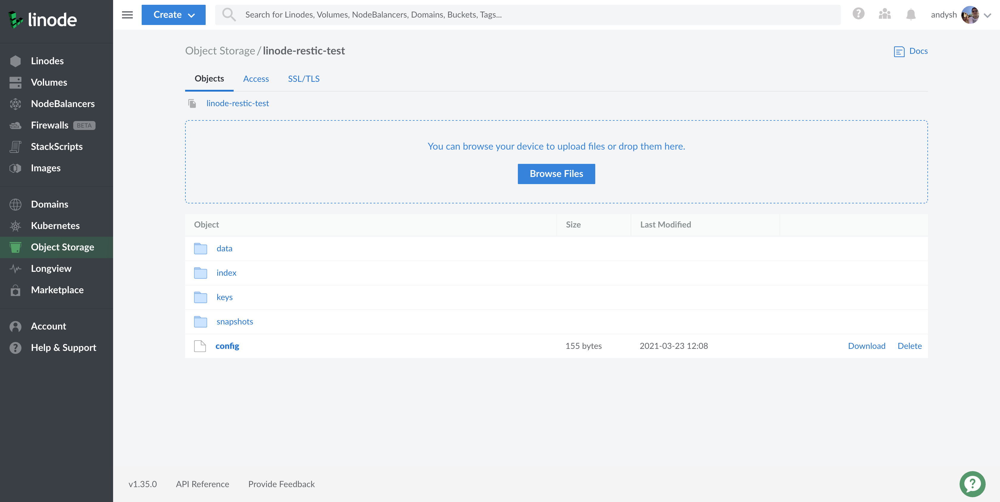

## Introduction

It is vital to have backups of your Linode's filesystem to allow you to restore in the event of a server fault, a user error or —worst-case— a hacking or defacing of your website or applications.

To be successful, backups should be automatic, reliable, and secure. This guide explains how to configure [Restic](https://restic.net/) on your Linode to backup your filesystem onto [Linode Object Storage](https://www.linode.com/products/object-storage/), so any of your files can be recovered even if your Linode is no longer accessible.

Restic is a backup utility written in Go. It is cross-platform and works on most Linux distributions with a kernel newer than 2.6.23. Each backup is stored as a *snapshot* in a *repository*. The repository can be stored on most cloud storage providers, or even in a separate directory on your Linode (not recommended.) This guide explains how to use Linode Object Storage to hold your backup repository.


The steps in this guide require root privileges, and commands are run with `sudo` unless otherwise noted. For more information on privileges, see our [Users and Groups](/docs/tools-reference/linux-users-and-groups/) guide.


## Before You Begin

1. Ensure that you have followed the [Getting Started](/docs/getting-started/) and [Securing Your Server](/docs/security/securing-your-server/) guides.

1.  Create an Object Storage bucket to hold your backup repository. Follow the [Create a Bucket](/docs/platform/object-storage/how-to-use-object-storage/#create-a-bucket) section of the [How to Use Linode Object Storage](/docs/platform/object-storage/how-to-use-object-storage/) guide if you do not already have one.

    

1.  [Generate Object Storage access keys](/docs/guides/how-to-use-object-storage/#generate-a-key-pair).

1.  Ensure your Linode has the `wget` and `bzip2` utilities installed. Install them with the following commands:

    **CentOS / Fedora**

    ```command
    yum install wget bzip2
    ```

    **Ubuntu / Debian**

    ```command
    apt install wget bzip2
    ```

## Install Restic



## Create the Restic Repository



## Backup All Files


In this section's commands, remember to replace `your-bucket-name` and `us-east-1.linodeobjects.com` with the name of your Object Storage bucket and its cluster hostname.


This section's example script instructs Restic to backup all files on the filesystem, starting from the root filesystem. If you have mounted block storage devices, these will also be backed up.

1.  Create a file in your `/usr/local/bin` directory:

    ```command
    sudo nano /usr/local/bin/backup_files
    ```

1.  Copy the following contents into the file:

    ```file {title="/usr/local/bin/backup_files"}
    #!/bin/bash
    PATH="/usr/local/bin:$PATH"
    source /root/restic_params
    restic -r s3:us-east-1.linodeobjects.com/your-bucket-name -p /root/restic_pw -q backup --exclude={/dev,/media,/proc,/run,/sys,/tmp,/var/tmp} /
    ```

1.  Make the script executable:

    ```command
    sudo chmod u+x /usr/local/bin/backup_files
    ```

1.  Run your first backup using the script you created:

    ```command
    sudo backup_files
    ```

    You should see a similar output:

    ```output
    repository 64962280 opened successfully, password is correct
    created new cache in /root/.cache/restic
    no parent snapshot found, will read all files

    Files:       26065 new,     0 changed,     0 unmodified
    Dirs:         3182 new,     0 changed,     0 unmodified
    Added to the repo: 947.676 MiB

    processed 26065 files, 979.212 MiB in 0:47
    snapshot be80fb7c saved
    ```

1.  Executing the script creates a snapshot in your Restic repository. Use Restic's `snapshot` command to view it:

    ```command
    sudo /bin/bash -c "source /root/restic_params; restic -r s3:us-east-1.linodeobjects.com/your-bucket-name -p /root/restic_pw snapshots"
    ```

    Restic returns a similar output:

    ```output
    repository 64962280 opened successfully, password is correct
    ID        Time                 Host        Tags        Paths
    ------------------------------------------------------------
    be80fb7c  2021-03-23 12:17:00  li269-232               /
    ------------------------------------------------------------
    1 snapshots
    ```

## Set Up Automated Backups

Linux has several ways of running a job on a defined schedule. This section outlines several common methods that you can use to configure the backup script to run periodically. Read through the methods and select one that suits your needs.


When choosing how often to run your script, consider your Linode's usage, how much data you could potentially lose, and the storage space required.


### Cron

System Cron jobs exist as entries in the `/etc/crontab` file. Open your systems `crontab` file for editing with the following command:

```command
sudo crontab -e
```

Add a line pointing to your backup script. This example runs the backup at 12am every day. See the [Schedule tasks with Cron](/docs/tools-reference/tools/schedule-tasks-with-cron/) article for additional scheduling options.

```command
0 0 * * * /usr/local/bin/backup_files > /tmp/backup-log.txt 2>&1
```

### Systemd

Systemd can run commands (known as *units*) on a periodic basis using *timers*. You can use systemd commands to monitor when the timers and commands last ran, and the output from running the commands.

To schedule a command, you need two configuration files: the service file which includes the commands to run and a timer file which defines when to run the service.

Create the service configuration file and copy and paste the contents of the example:

```command
sudo nano /etc/systemd/system/backup-files.service
```

```file {title="/etc/systemd/system/backup-files.service"}
[Unit]
Description=Backup local filesystems
[Service]
ExecStart=/usr/local/bin/backup_files
Environment=USER=root HOME=/root
```

Create the timer configuration file and copy and paste the contents of the example. The `OnCalendar` line instructs Systemd when to execute the service file's commands. In the example, the service file's commands are run at 12am every day.

```command
sudo nano /etc/systemd/system/backup-files.timer
```

```file {title="/etc/systemd/system/backup-files.timer"}
[Unit]
Description=Backup local filesystems
[Timer]
OnCalendar=*-*-* 00:00:00
[Install]
WantedBy=timers.target
```

When you are satisfied with your timer's configurations, enable the timer:

```command
sudo systemctl enable --now backup-files.timer
```

You can monitor all your system's timers with the following command:

```command
sudo systemctl list-timers
```

You should see a similar output:

```output
NEXT                         LEFT     LAST  PASSED  UNIT                ACTIVATES
Wed 2021-03-24 00:00:00 UTC  11h left n/a   n/a     backup-files.timer  backup-files.service
```

The `NEXT` and `LEFT` column tells you the exact time and how long until the timer executes the service file next. The `LAST` and `PASSED` columns display information on when the timer last executed the service file.

## Finishing Up

Log into your [Linode Cloud Manager](https://cloud.linode.com/) account and view the Object Storage bucket you created to store your Restic backups. You should see a set of files like the ones displayed in the screenshot below. These files collectively make up the Restic repository; you will not see your individual files.

To explore the backups and files held within the Restic repository, you must issue the `restic` command from the machine that you installed Restic on when following the steps in the [Before You Begin](#before-you-begin) section.



### Create an Alias

It can get tedious typing out the arguments to the Restic command. To make life easier for maintenance and daily management, create an alias for the command with the arguments you need.


Because the credentials that Restic uses were created under the root user's home folder, the example alias in this section only works for the root user.


In your `root` user's `.profile` file, add the lines in the example. For example, on an Ubuntu system this file is located in `/root/.profile`. To learn more about creating reusable aliases, see the [How to Add the Linux alias Command in the .bashrc File](/docs/guides/how-to-add-linux-alias-command-in-bashrc-file/) guide.

```file {title="/root/.profile"}
...
source /root/restic_params
alias myrestic='restic -r s3:us-east-1.linodeobjects.com/your-bucket-name -p /root/restic_pw'
```

After logging out of your system and back in again, you can run restic using your aliased command:

```command
myrestic snapshots
```

### Restore a Backup

Backups are not useful if you cannot restore them. It's a good idea to test out your backups once in a while. To restore the latest useable backup from Restic, run the `restore latest` command:

```command
restic -r s3:us-east-1.linodeobjects.com/your-bucket-name -p /root/restic_pw restore latest -t /root
```


The `-t` option tells Restic where to restore your backup. Restic restores your backup's files and recreates the full directory structure that existed at the time the backup was taken.

For example, consider the backup file `/etc/network/interfaces`. Restoring a backup containing this file to a target of `/home/myuser` results in the file being restored as:

```command
/home/myuser/etc/network/interfaces
```


To restore a backup from a particular point-in-time, issue the example command to find the snapshot ID for the specific backup.

```command
sudo /bin/bash -c "source /root/restic_params; restic -r s3:us-east-1.linodeobjects.com/your-bucket-name -p /root/restic_pw snapshots"
```

The output resembles the example, where the first column displays the snapshot ID:

```output
repository 64962280 opened successfully, password is correct
ID        Time                 Host        Tags        Paths
------------------------------------------------------------
be80fb7c  2021-03-23 12:17:00  li269-232               /
------------------------------------------------------------
1 snapshots
```

Pass the selected ID to the restore command instead of `latest`. Replace `be80fb7c` in the example with your own snapshot ID:

```command
sudo /bin/bash -c "source /root/restic_params; restic -r s3:us-east-1.linodeobjects.com/your-bucket-name -p /root/restic_pw restore be80fb7c -t /root"
```

The above commands restore all files taken in the backup. Usually, you'll only want a single file or directory.

To restore a single file, pass the file path using the `-i` option, along with either `latest` or the snapshot ID:

```command
sudo /bin/bash -c "source /root/restic_params; restic -r s3:us-east-1.linodeobjects.com/your-bucket-name -p /root/restic_pw restore be80fb7c -i /etc/network/interfaces -t /root"
```

To restore a directory, pass the directory path using the `-i` option, along with either `latest` or the snapshot ID:

```command
sudo /bin/bash -c "source /root/restic_params; restic -r s3:us-east-1.linodeobjects.com/your-bucket-name -p /root/restic_pw restore be80fb7c -i /home -t /root"
```

### Maintain your Repository

Your backup repository's size can grow very quickly, especially if you backup a large filesystem every day.

Restic can automatically clean-up your backup snapshots according to a flexible policy using [snapshot policies](https://restic.readthedocs.io/en/stable/060_forget.html#removing-snapshots-according-to-a-policy).

Consider automatically running a policy using the `forget` command on a frequent basis (e.g. daily) to keep your backup repository's size down. Refer to the [snapshot policies](https://restic.readthedocs.io/en/stable/060_forget.html#removing-snapshots-according-to-a-policy) article for more details.


Don't forget to pass the `--prune` option to the `forget` command or the space won't actually be freed from your repository.

Pruning a repository can take significant time and stops new backups from taking place while it is being run, so it is best to run it often and non-interactively.
