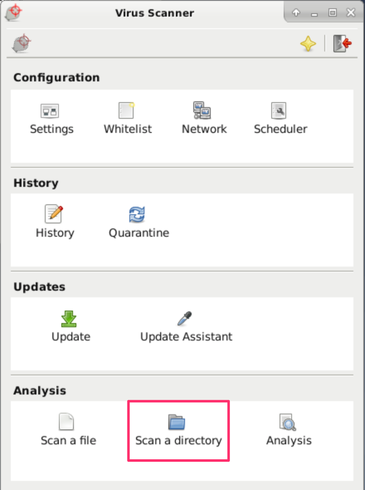
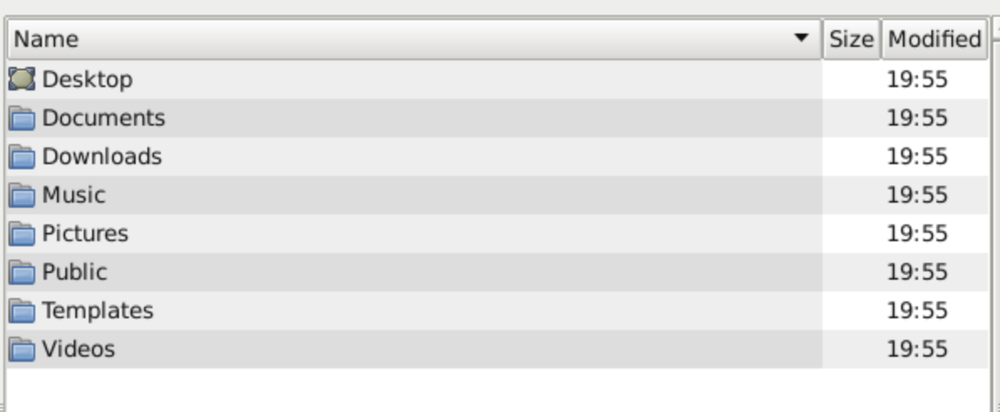
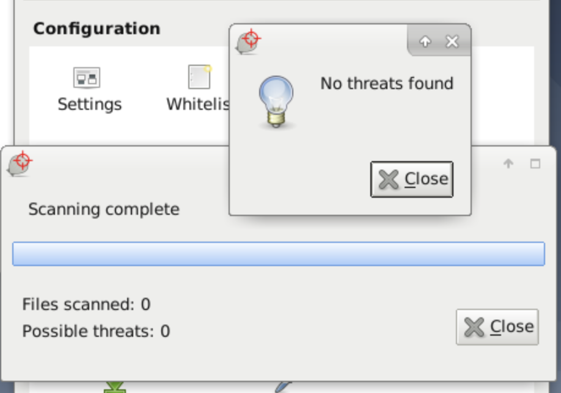

## Anti-virus and Rootkit Detection

This guide teaches you how to use ClamAV, ClamTK, and rkhunter for anti-virus and rootkit detection to secure your server.

## ClamAV

[ClamAV](https://www.clamav.net) is an open source anti-virus toolkit that is available for Linux, MacOS, and Windows.

### Installing ClamAV

You can install ClamAV with the aptitude package manager on Debian and Ubuntu or with the yum package manager on CentOS. The instructions in this guide show `apt` examples and can be adapted for CentOS with `yum`. ClamAV requires the `clamav` utility and the `clamav-daemon` for management.

1.  Install the ClamAV utilities by running the following command:

        sudo apt install clamav clamav-daemon

1.  After the installation, you can check the version of ClamAV installed by running the following command:

        clamscan --version

### Update the ClamAV Signature Database

Before you can get started with any scanning, you need to ensure that all the relevant ClamAV services and daemons are running. The first service you want to start is the `freshclam` service which is responsible for updating the signature database.

In order to perform scans with ClamAV, you must have an active and updated signature database. It is recommended to keep your database up to date on a regular basis.

1.  To update your signature database you need to stop the `freshclam` service. Do this by running the following command:

        sudo systemctl stop clamav-freshclam

1.  You can now update the signature database by running the freshclam command:

        sudo freshclam

1.  After the signature database has been updated you can now start the freshclam service by running the following command:

        sudo systemctl start clamav-freshclam

### Scanning with ClamAV

Scanning with ClamAV is simple and can be invoked by running the `clamscan` command in the terminal. You can get started by scanning a particular directory.

1.  For example, if you want to scan the `/etc/` directory for infected files, run the following command:

        sudo clamscan -i -r --remove /etc

    - `-i`: prints only infected files
    - `--remove`: removes infected files
    - `--r`: recursive scan, all the subdirectories in the directory are scanned

    To learn more about the commands you can use with `clamscan` check the [manual](http://manpages.ubuntu.com/manpages/xenial/man1/clamscan.1.html).

1.  If you want to scan the entire system, run the following command:

        sudo clamscan -i -r --remove /

1.  After the scan is completed, a summary is displayed.

    
----------- SCAN SUMMARY -----------
Known viruses: 8930484
Engine version: 0.102.4
Scanned directories: 150
Scanned files: 439
Infected files: 0
Data scanned: 2.15 MB
Data read: 0.93 MB (ratio 2.32:1)
Time: 100.447 sec (1 m 40 s)


## ClamTK

[ClamTK](https://dave-theunsub.github.io/clamtk/) is a GUI for ClamAV and is designed to streamline the scanning process for systems with a desktop manager or window manager. ClamTK does not work in a terminal as it is a GUI wrapper for ClamAV.

### Install ClamTK

ClamTK can be installed by running the following command:

    sudo apt-get install clamtk

### Scanning With ClamTK

Scanning with ClamTK is simpler than with ClamAV.

1.  Launch it by running the following command in the terminal:

        clamtk

1.  The graphical interface appears. To start a scan, in the **Analysis** panel, click on the  **Scan a directory**  icon.

    

1.  Select the directory you want to scan.

    

1.  ClamTK scans the directory and displays a summary of the scan when it's finished.

    

## Rkhunter

[rkhunter](http://rkhunter.sourceforge.net) (Rootkit Hunter) is a Unix-based tool that scans for rootkits, back doors and possible local exploits. It does this by comparing SHA-1 hashes of important files with known good ones in online databases, searching for default directories (of rootkits), wrong permissions, hidden files, suspicious strings in kernel modules, and special tests for Linux and FreeBSD. Rkhunter is available as a package in most Linux distribution repositories.

### Install rkhunter

1.  Install rkhunter by running the following command:

        sudo apt install rkhunter

1.  Ensure that rkhunter database is updated by running the following command:

        sudo rkhunter --propupd

### Scanning with rkhunter

Running a scan with rkhunter is simple and can be started by running the following command:

    sudo rkhunter --check

After the scan has been completed a scan summary is displayed along with the path to the log files that contain useful output.


System checks summary
=====================

File properties checks...
    Files checked: 144
    Suspect files: 4

Rootkit checks...
    Rootkits checked : 497
    Possible rootkits: 0

Applications checks...
    All checks skipped

The system checks took: 1 minute and 22 seconds

All results have been written to the log file: /var/log/rkhunter.log

One or more warnings have been found while checking the system.
Please check the log file (/var/log/rkhunter.log)

