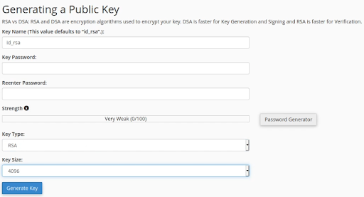

## What is cPanel?

[cPanel](https://cpanel.net/) is a web hosting control panel that provides the simple and effective management of a web hosting server and typically runs on Linux. It is primarily used and employed by web hosting companies as it makes web hosting economical through the concept of shared hosting.

With the help of cPanel, you can control administrative tasks of hosting such as:

- creating a website
- creating and managing emails
- resetting passwords
- setting mail forwards
- managing add-on domains and subdomains
- uploading and managing files

## Prerequisites & Requirements

In order to secure your cPanel account, you need to have a Linux server with the following services running:

- cPanel

For a quick an easy way to install cPanel on Linode, check out our guide on [How to Deploy cPanel with Marketplace Apps](/docs/products/tools/marketplace/guides/cpanel/).

Otherwise, you can find instructions on how to manually install cPanel in our guide on [How to Install cPanel on CentOS](/docs/guides/install-cpanel-on-centos/).

This guide provides instructions on how to secure a cPanel account. Once cPanel is installed, log in as the `root` user and complete the steps to [Create a New Account](https://docs.cpanel.net/whm/account-functions/create-a-new-account/). If you are running cPanel on a Linode as a reseller, you can provide this guide to your account holders to assist them in managing their accounts securely.


This demonstration has been performed on a cPanel Linode application running on CentOS. All techniques demonstrated are distribution agnostic with the exception of package names and package managers.


## Password Security

The first security configuration to change is your account's default cPanel password. This can be done by following the procedures outlined below:

1.  Click on your account profile on the top right of the navigation bar and select **Password & Security** from the drop-down menu.

    

1.  You are directed to the password management wizard that allows you to change your account password.

    

1.  It is recommended to use the password generator to create a secure password.

    

## Directory Privacy

To act as a deterrent for attackers, the directory privacy option allows you to configure Apache2 username and password authentication for your website or a particular directory on your web server.

Follow the instructions below to password-protect your cPanel website:

1.  Under the **FILES** section of the cPanel home page, select **Directory Privacy**.

    

1.  Click the **Edit** button for `public_html` or the directory you want to secure. Check the box to password protect the directory and enter a directory name, then click the **Save** button.

    

1.  Click **Go Back**, enter a username and password to protect your directory, and click the **Save** button.

    

1.  After creating the user and password credentials, test your directory privacy configuration by attempting to navigate to it in your browser. If protected, a password prompt appears as shown below.

    

## File & Directory Permissions

File and directory permissions allow you to specify and provide access to files and directories in your web server. You can modify these permissions in the File Manager.

1.  Under the **FILES** section of the cPanel home page, select **File Manager**.

1.  Right-click on a file or directory in the File Manager to bring up a menu and select the **Change Permissions** option as illustrated in the image below.

    

1.  Adjust the permissions to limit and restrict access to files and directories on your web server, then click **Change Permissions** to save the settings.

    

## SSH Access

You can specify SSH access through the use of SSH keys for authentication. This can be done by using the SSH access option. It is recommended to disable SSH access unless required.

1.  Under the **SECURITY** section of the cPanel home page, select **SSH Access**.

1.  Click **Manage SSH Keys**.

1.  You have the options of importing an already created key generating your own key pair. For guidance and information on using and creating SSH Keys, see [SSH add keys](/docs/guides/use-public-key-authentication-with-ssh/).

    

1.  If you choose to generate a new key using cPanel, set the **Key Size** to `4096` for adequate security.

    

## IP Blocking

IP blocking allows you to restrict or block IPs and IP ranges from accessing your web server. This can be useful if you are experiencing persistent brute force attacks on your server.

1.  Under the **SECURITY** section of the cPanel home page, select **IP Blocker**.

1.  Under **IP Address or Domain**, enter a single IP, subnet, or IP range, then click **Add** to block access.

    

## Hotlink Protection

Hotlink protection protects your web server from hotlink abuse by preventing other websites from using or hotlinking resources on your web server.

1.  Under the **SECURITY** section of the cPanel home page, select **Hotlink Protection**.

1.  Click **Enable** to turn hotlink protection on. You can then specify the URLs to exempt from protection and the file extensions to protect. You also have the ability to redirect requests to another URL or file. Click **Submit** to save your changes.

    

## Custom PHP INI Configuration

You also have the ability to modify or add custom PHP configurations.

1.  Under the **SOFTWARE** section of the cPanel home page, select **MultiPHP INI Editor**.

1.  From the dropdown menu, select the `php.ini` file to modify.

1.  Ensure that the `display_errors` option is disabled. Make any other desired adjustments and click **Apply** to save them.

    

## Directory Indexing

You also have the option of specifying the level of directory indexing to use. This can prevent Apache from listing the content of your web server root.

1.  Under the **ADVANCED** section of the cPanel home page, select **Indexing**.

1.  Click the **Edit** button for `public_html` or the directory you want to secure.

1.  The recommended option is to specify `No Indexing`.

    

1.  Access attempts to the web server root now return a 403 Forbidden error.
