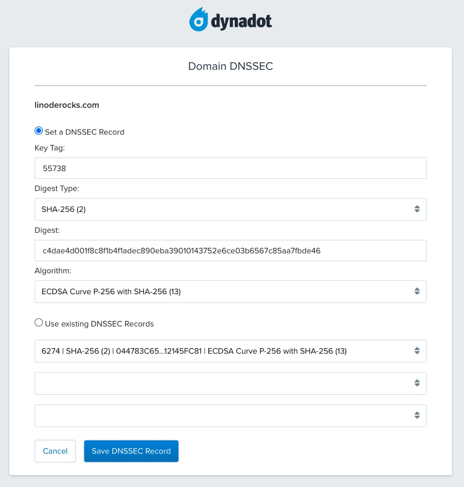
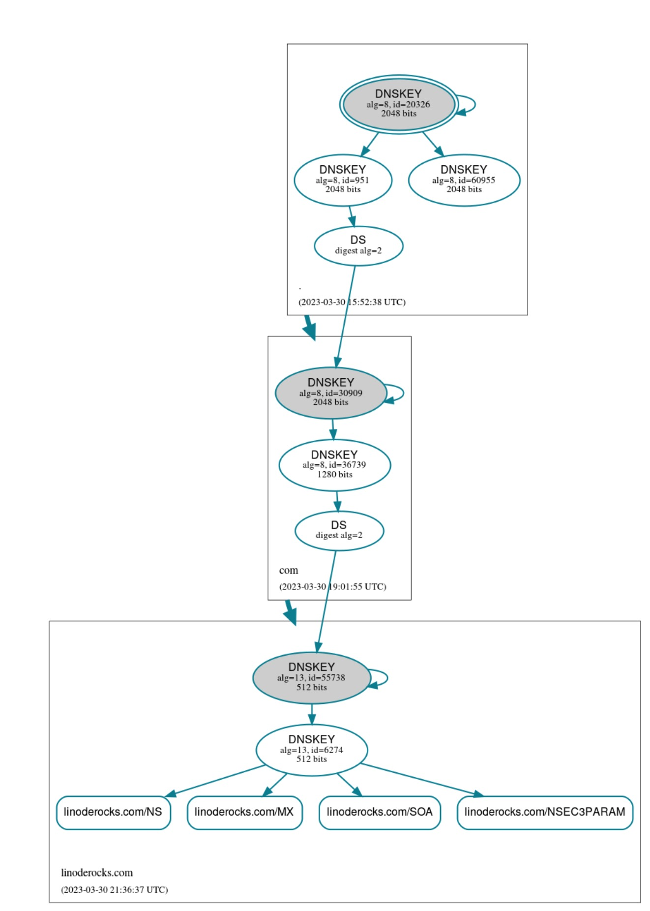

The Domain Name System (DNS) is the directory that underlies the global Internet. However, it provides no assurance that online sites are what they claim to be, or that the information they provide is valid. Recognizing this shortcoming, the Internet Engineering Task Force (IETF) developed Domain Name System Security Extensions (DNSSEC). This adds authentication and integrity protection to the DNS protocol.

This guide explains what DNSSEC is, how it works, and under what circumstances to deploy it. It provides step-by-step procedures for enabling DNSSEC on name servers.

## What is DNSSEC?

DNSSEC is a set of security extensions to authenticate and validate requested DNS data. DNSSEC uses public-key cryptography to sign DNS data, verifying the identity of each zone and the integrity of records within that zone.

## Why Use DNSSEC?

Strong authentication wasn’t a design goal of the original DNS protocol. After all, it dates from a time when the Internet was a relatively small research network with high trust among users.

As a result, attackers can easily fool DNS clients into interacting with unauthorized sites. When a DNS query is sent, the resolver only verifies that the response came from the IP address that the original query was sent to. Since it’s easy to spoof IP addresses, an attacker can pose as an authoritative name server and send fake DNS data.

A forged response could also affect more than one user. Most recursive name servers maintain a cache of responses. This allows for quicker responses to queries than contacting origin name servers for every lookup. However, an attacker can cause *cache poisoning* by placing one or more fraudulent entries in a cache.

For example, many ISP customers could be given fraudulent DNS responses for a bank, all because one customer went to a rogue name server, which poisoned the cache.

DNSSEC’s digital signatures address this problem in two ways:

-   Data origin authentication cryptographically verifies the source of zone information.
-   Data integrity protection cryptographically signs all resource records within each zone to ensure data can’t be modified in transmission.

## Why Should You Not Use DNSSEC?

For all its benefits, there are reasons to not proceed with DNSSEC. Configuration and maintenance of DNSSEC keys is entirely manual in most major DNS server implementations.

Setup is somewhat complex, and finite key lifetimes have serious connectivity implications. Incorrectly configuring keys, or failing to perform key rollover before older keys expire, makes the entire domain unreachable on the public Internet. While there are workarounds, they involve starting over with both the name servers and domain registrar. To run DNSSEC, keys must be rotated before they expire.

DNSSEC signing also means that name servers disclose all domain and subdomain records, whether intended or not.

DNSSEC provides new record types, Next Secure (NSEC) and Next Secure 3 (NSEC3), that provide signed evidence of the nonexistence of fraudulent records. For example, if a zone file has records for `r.example.com` and `t.example.com`, an attacker could not pose as `s.example.com`. This is because the NSEC or NSEC3 records provide cryptographic evidence that there is no record between `r` and `t`.

However, because NSEC records work by pointing to the next legitimate record in the zone, they disclose the names of any legitimate records within that space. For example, the NSEC response would also reveal the information about a "private" unadvertised host called `secret.example.com` in a query for `r.example.com`.

DNS records aren’t supposed to hide anything, it is, after all, a public directory. However, the reality is that some users have non-advertised records, and DNSSEC could pose a problem for them. Its design provides cryptographic proof of the existence of all records, not just the ones intended for the general public.

## Terminology and DNSSEC Resource Records

DNSSEC introduces a few new terms and record types. The resource record set (**RRset**) describes all resource records of a given type within a zone. For example, all A records within the zone `example.com` comprise a single RRset.

DNSSEC also provides these other new record types:

-   **RRSIG**: DNSSEC signs RRsets, not individual records. An RRSIG is a cryptographic signature of an RRset.
-   **DNSKEY**: A public signing key.
-   **DS**: (Delegation Signer) records contain the hash of a DNSKEY record.
-   **NSEC and NSEC3**: Next Secure records, which provide proof-of-nonexistence of DNS records. NSEC records are in plaintext and NSEC3 records provide a hash of the record name.

## How Does DNSSEC Work?

Every DNSSEC-enabled zone has a zone-signing key (ZSK) with public and private components. The private portion of a ZSK signs the contents of a zone. The public portion validates that signature to resolvers making queries. When enabling DNSSEC, the ZSK’s private portion is used to sign RRsets, then store the signatures as RRSIG records. In effect, RRSIGs say to anyone asking "this DNS name is legitimate, and no one has altered its records".

When a DNSSEC-enabled resolver makes a query for some resource (e.g. an A record), the name server returns three items: the RRset for that record, its RRSIG, and the zone’s DNSKEY record (which contains the public ZSK). The resolver uses all three items to validate the record.

A key-signing key (KSK) verifies the ZSK, validating the DNSKEY record just as the ZSK validates RRsets. The private portion of the KSK signs the public portions of both the ZSK and KSK. Resolvers use the public KSK to validate the public ZSK.

Thus far, all DNSSEC does is establish trust within a zone, but there isn’t any external verification yet. This is where delegation signer (DS) records come in. This is an algorithmic hash created from the zone’s public KSK. Next, that hash is listed in the parent zone (typically at the domain registrar).

The parent zone’s owner uses its private key to sign that DS key. It's essentially says "I vouch for this child zone, and all the records within it". In turn, the parent zone lists its DS key in its parent zone. This establishes the chain of trust. Every child zone relies on the validation of its parent, all the way up to the root DNS zone (".").

There is no parent to sign the root zone, but there is a very public and highly audited Root Signing Ceremony. It takes place every quarter to ensure the integrity of the entire chain.

The chain of trust is a key concept in DNSSEC. It establishes that each DNSSEC-enabled server is authenticated, and that no one has altered the records each server provides.

## Before You Begin

1.  If you have not already done so, create a Linode account and Compute Instance. See our [Getting Started with Linode](/docs/products/platform/get-started/) and [Creating a Compute Instance](/docs/products/compute/compute-instances/guides/create/) guides. This guide is for Ubuntu 22.04 LTS instances.

1.  Follow our [Setting Up and Securing a Compute Instance](/docs/products/compute/compute-instances/guides/set-up-and-secure/) guide to update your system. Set the timezone, configure your hostname, and create a limited user account. To follow along with this guide, give your server the hostname `ns1.yourdomainhere.com`, replacing `yourdomainhere.com` with your own domain name. Also be sure to configure the hosts file with your hostname and external IP addresses.

1.  Follow our Introduction to [DNS on Linux](/docs/guides/introduction-to-dns-on-linux) guide to set up a functional primary name server.


This guide is written for a non-root user. Commands that require elevated privileges are prefixed with `sudo`. If you’re not familiar with the `sudo` command, see the [Users and Groups](/docs/guides/linux-users-and-groups/) guide.


## How to Enable DNSSEC Using NSD

This guide uses the `yourdomianhere.com` domain as an example. Replace this address with your own domain in the steps that follow. It is authoritative for the zone `yourdomainhere.com`.

1.  Remove any previously installed keys and certificates in `/etc/nsd`, then generate new ones:

    ```command
    cd /etc/nsd
    sudo rm *pem *key
    sudo nsd-control-setup
    ```

    ```output
    setup in directory /etc/nsd
    Certificate request self-signature ok
    subject=CN = nsd-control
    removing artifacts
    Setup success. Certificates created.
    ```

1.  Restart NSD to ensure the server loads the new keys and certificates:

    ```command
    sudo systemctl restart nsd
    ```

1.  Install the `ldnsutils` suite, needed for key generation and signing:

    ```command
    sudo apt install ldnsutils
    ```

1.  Switch to the root user for export commands because `sudo` won’t work here:

    ```command
    sudo su - root
    ```

1.  Move to the `zones` directory and generate ZSK and KSK files.

    ```command
    cd /etc/nsd/zones/master
    export ZSK=`/usr/bin/ldns-keygen -a ECDSAP256SHA256 -b 1024 yourdomainhere.com`
    export KSK=`/usr/bin/ldns-keygen -k -a ECDSAP256SHA256 -b 2048 yourdomainehere.com`
    ```

1.  **Optional**: Capture the ZSK and KSK variables for later reuse in the [Zone Maintenance](/docs/guides/dnssec#Zone-Maintenance) section.

    ```command
    echo $ZSK > yourdomainhere.com.zsk
    echo $KSK > yourdomainhere.com.ksk
    ```

    Note the use of the ECDSAP256SHA256 algorithm, also known as algorithm 13. Although DNSSEC accommodates many algorithms, this one is a current best practice. It uses the very strong Elliptic Curve Digital Signal Algorithm (ECDSA) with the P-256 curve and computes hashes with SHA-256. Currently, it is not computationally feasible to defeat this algorithm within a key’s lifetime.

1.  The KSK command above generated a delegation signing (DS) record, but we'll soon create a separate DS record, and can delete this one:

    ```command
    rm *ds
    ````

1.  While still logged in as root, sign the `yourdomainhere.com` zone using the ZSK and KSK variables you previously created:

    ```command
    ldns-signzone -n -s $(head -n 1000 /dev/urandom | sha256sum | cut -b 1-16) yourdomainhere.com.zone $ZSK $KSK
    ```

1.  In addition to keys, the zones directory now contains a signed zone file.

    ```command
    ls
    ```

    ```output
    Kyourdomainhere.com.+013+06274.key
    Kyourdomainhere.com.+013+06274.private
    Kyourdomainhere.com.+013+55738.key
    Kyourdomainhere.com.+013+55738.private
    yourdomainhere.com.ksk
    yourdomainhere.com.zone
    yourdomainhere.com.zone.signed
    yourdomainhere.com.zsk
    ```

1.  Open the main `/etc/nsd/nsd.conf` configuration file:

    ```command
    nano /etc/nsd/nsd.conf
    ```

1.  Modify the `zonefile:` value in the `zone:` section to point to the signed zone file:

    ```file {title="/etc/nsd/nsd.conf" hl_lines="7"}
    zone:
            name: "yourdomainhere.com"
            # you can give a pattern here, all the settings from that pattern
            # are then inserted at this point
            # include-pattern: "master"
            # You can also specify (additional) options directly for this zone.
            zonefile: "zones/master/yourdomainhere.com.zone.signed"
    ```

    When finished, press <kbd>CTRL</kbd>+<kbd>X</kbd> then <kbd>Y</kbd> and <kbd>Enter</kbd> to save and close the file.

1.  Reload the NSD configuration and signed zone file.

    ```command
    nsd-control reconfig
    nsd-control reload yourdomainhere.com
    ```

    ```output
    reconfig start, read /etc/nsd/nsd.conf
    ok
    ok
    ```

1.  Exit as the root user:

    ```command
    exit
    ```

1.  A `dig` query for the zone using DNSKEY now return records with DNSSEC signatures:

    ```command
    dig DNSKEY @ns1.yourdomainhere.com yourdomainhere.com +multiline +norec
    ```

    ```output
    ..
    yourdomainhere.com.	3600 IN	DNSKEY 256 3 13 (
                        LWaVmaC8mVyGlrU1uF+tOsO8od6HCy21owPW+k5EDUI0
                        T0MGJietjPQ2akcOuyfixZ3h0DGeCdCByfsrGD4t3w==
                        ) ; ZSK; alg = ECDSAP256SHA256 ; key id = 6274
    yourdomainhere.com.	3600 IN	DNSKEY 257 3 13 (
                        ebKStT/78jf0NVrKm5qVrTrSLWRoGIqmvgNYKgdzTAgv
                        Wxjfjh4P3JPEgwlMxLHmb3liZd+8De2FwJEWy7m0Yg==
                        ) ; KSK; alg = ECDSAP256SHA256 ; key id = 55738
    ..
    ```

1.  Generate DS records for the zone, and save the results to a text file or to the clipboard. These are needed for the final step of zone signing at your domain registrar.

    ```command
    cd /etc/nsd/zones/master
    sudo ldns-key2ds -n -f -2 yourdomainhere.com.zone.signed
    ```

    ```output
    yourdomainhere.com.	3600	IN	DS	6274  13 2 044783c65c032a0ae25a1de626e341c483a89601c766e812a001bc512145fc81
    yourdomainhere.com.	3600	IN	DS	55738 13 2 c4dae4d001f8c8f1b4f1adec890eba39010143752e6ce03b6567c85aa7fbde46
    ```

1.  Your server does not return valid responses until these DS records are uploaded at your registrar. For each DS record, add this information at the registrar:

    -   **Key Tag**: A number that identifies the DS record. The tags in these examples are `6274` and `55738`.
    -   **Digest Type**: The hashing function used to create a message digest. SHA-256 was used in the command above (identified as **2** at the registrar)
    -   **Digest**: The message digest (the long string in each record) contained in the `.ds` file.
    -   **Algorithm**: The method used to produce the message digest. `ECDSA/SHA-256` (identified as **13** at the registrar) was used in the example above.

    Putting this all together, here are the DS fields entered at domain registrar `dynadot.com`:

    

    Save both DS records at your registrar, and the DNSSEC chain of trust is complete.

1.  Next, verify the configuration with a DNSSEC test site such as [dnsviz.net](https://dnsviz.net). The site analyzes a domain and produces a visual "map" of your DNSSEC authentication chain.

    The following is an example [dnsviz.net](https://dnsviz.net) diagram for the example domain `linoderocks.com`. Each rectangle represents a different level in the chain of trust, with one each for the root (`.`), `.com`, and `linoderocks.com` domains. The green arrows along the path indicate that a complete chain of trust extends from the root (`.`) on through to `linoderocks.com`.

    

    If any zone is missing valid DS records for the zone under it, or has a corrupt or expired ZSK, the website displays red arrows. If you see red arrows anywhere in your diagram, do not proceed until resolving those. DNSSEC does not work unless the chain of trust is complete. It may also show warnings, which do not prevent DNSSEC from functioning, but highlight areas to improve.

## Zone Maintenance

DNSSEC requires extra steps when updating records and keys.

1.  Anytime changes are made within a zone, the entire zone must be resigned:

    ```command
    ldns-signzone -n -s $(head -n 1000 /dev/urandom | sha256sum | cut -b 1-16) yourdomainhere.com.zone $ZSK $KSK
    ```

    For the `$ZSK` and `$KSK` variables in this command, enter the names of your current ZSK and KSK files, without the filename extensions.

1.  Then reload the zone:

    ```command
    sudo nsd-control reload yourdomainhere.com
    ```

    Wait for the zone’s default time-to-live (TTL) timer (typically one hour) to expire before testing the zone at [dnsviz.net](https://www.dnsviz.net) or similar sites. Until the TTL expires and name servers refresh their caches, other name servers may hold old records in their caches that don’t match your newly signed zone. After the TTL expires, all sources should agree on your zone’s contents.

As for key rotation, zone signatures expire after 30 days by default. If not renewed, your zone becomes unreachable on the public Internet. Neither of the two most common DNS server distributions (Bind and NSD) include tools for automated key rollover. The open source [dnssec-reverb](https://github.com/northox/dnssec-reverb) project does automate key rollover, and works with both Bind and NSD.

Whether you use `dnssec-reverb`, some other tool, or write your own shell scripts, it’s essential to automate and test key rollover before putting a server into production.

## Conclusion

DNSSEC corrects a major shortcoming of the original DNS design: it authenticates that every server really is what it claims to be. It verifies that no one has tampered with zone data. It provides affirmative proof of the nonexistence of fraudulent hosts and subdomains. Given the critical role DNS plays in networking, DNSSEC not only protects your name servers, but virtually all applications running across all your servers.
