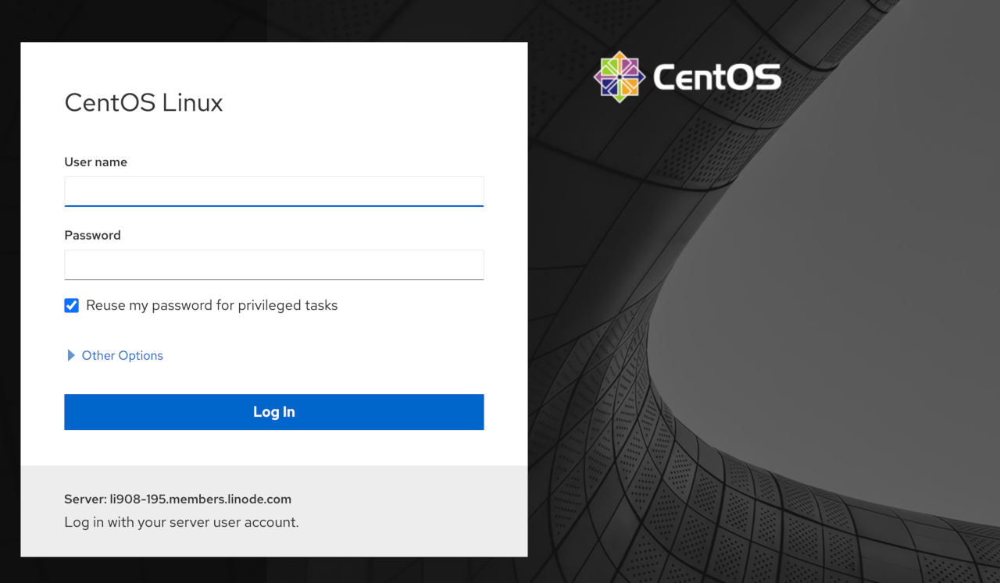
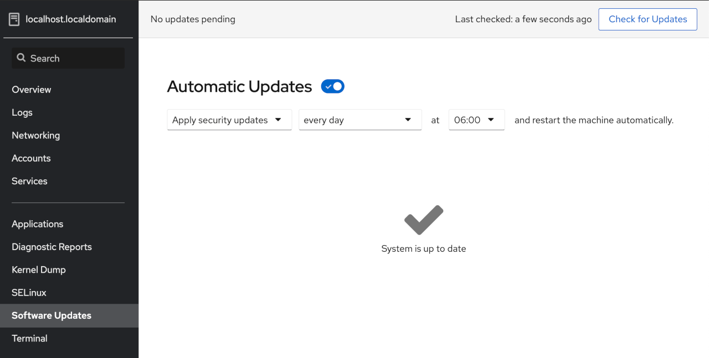

Keeping your system up-to-date with the latest packages and security updates can be a tedious task. Most users forget to do it, leaving them vulnerable to countless threats. Automate security (or other package) updates with the dnf-automatic command line utility or the Cockpit web application on CentOS.

## Before You Begin

1.  Complete the [Getting Started](/docs/products/platform/get-started/) guide.

1.  Follow the [Setting Up and Securing a Compute Instance](/docs/products/compute/compute-instances/guides/set-up-and-secure/) guide to create a standard user account, and harden SSH access.

1.  Log into your Linode via SSH and update.

        sudo yum update


This guide is written for a non-root user. Commands that require elevated privileges are prefixed with `sudo`. If you’re not familiar with the `sudo` command, see our [Users and Groups](/docs/guides/linux-users-and-groups) guide.


## Install dnf-automatic

The first step is to install the `dnf-automatic` utility package.

1.  Use the yum package manager to run the following command:

        sudo yum install dnf-automatic

1.  You can configure the dnf-automatic updates. The default configuration file is located at `/etc/dnf/automatic.conf`. Use the text editor of your choice to edit the configuration file:

    
[commands]
#  What kind of upgrade to perform:
# default                            = all available upgrades
# security                           = only the security upgrades
upgrade_type = security
random_sleep = 0

# To just receive updates use dnf-automatic-notifyonly.timer

# Whether updates should be downloaded when they are available, by
# dnf-automatic.timer. notifyonly.timer, download.timer and
# install.timer override this setting.
download_updates = yes

# Whether updates should be applied when they are available, by
# dnf-automatic.timer. notifyonly.timer, download.timer and
# install.timer override this setting.
apply_updates = yes

...


  - Change the **upgrade_type** from `default` to `security` to only receive important security updates. If you leave it at `default`, all available upgrades are applied.
  - Change the **apply_updates** field from `no` to `yes`.

1.  To start and enable the dnf-automatic service, run the following commands:

        sudo systemctl enable --now dnf-automatic.timer

        sudo systemctl start --now dnf-automatic.timer

## Install Cockpit

Cockpit is a web console with an easy-to-use web-based interface that enables you to carry out administrative tasks on your servers. Cockpit is not installed by default.

1.  Install Cockpit and its required dependencies with the following command:

        sudo yum install cockpit

1.  You need to enable and start the `cockpit.socket` service to be able to connect to the system through the web console. Do this by running the following commands:

        sudo systemctl enable --now cockpit.socket

        sudo systemctl start cockpit.socket

1.  You can now access the Cockpit web console on by navigating to `203.0.113.0:9090` in a web browser, replacing `203.0.113.0` with the IP address of your server.

    

1.  Cockpit uses system credentials, so you can login with any user account credentials that are present on the system.

1.  In the left navigation pane, click **Software Updates**.

1.  You can then choose to apply all or only security automatic updates, and specify the days and times you wish the updates to be installed.

    
