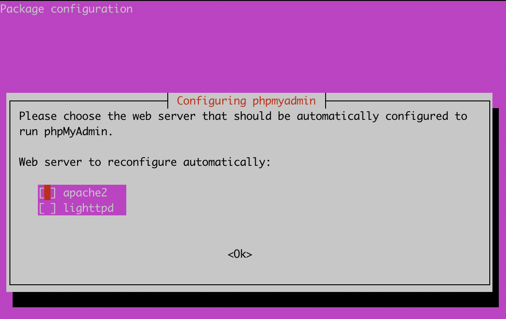
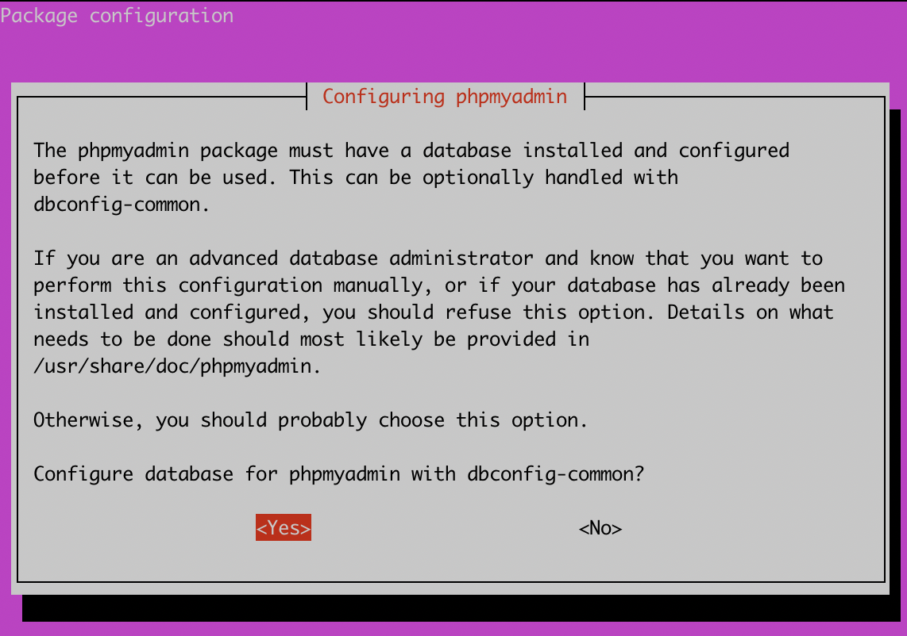
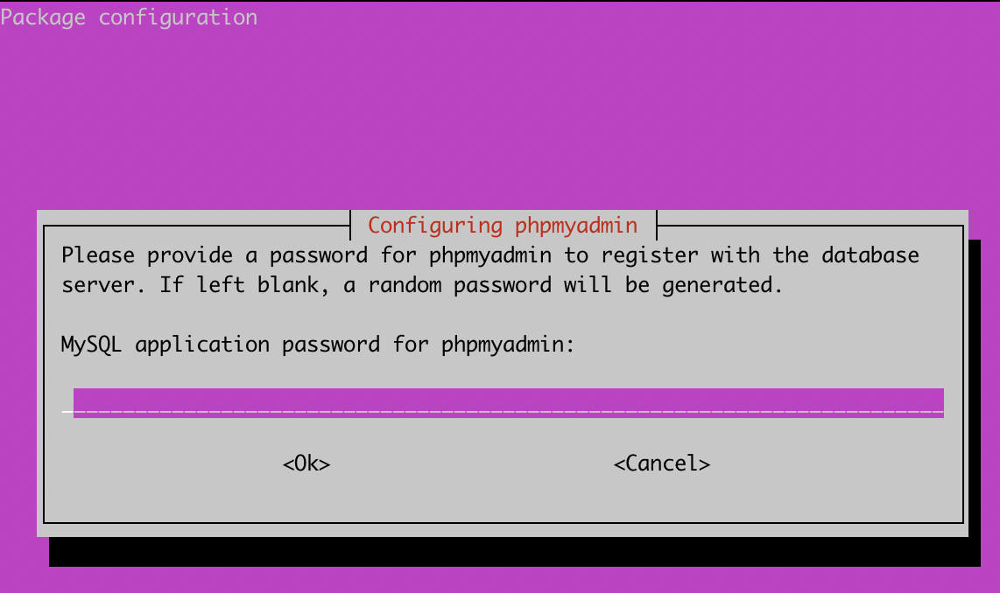

## What is phpMyAdmin?

**phpMyAdmin** is a free, open source, and cross platform PHP-based web application that offers a simple, powerful and convenient browser based GUI for interacting and working with MySQL databases.
It makes the process of creating, modifying and configuring MySQL databases simpler and much more efficient.

## Why Secure phpMyAdmin?

phpMyAdmin is widely adopted and used in both production and development environments by developers and system administrators. It is therefore a vital component to secure given the nature of data it is used to create and manage.

## phpMyAdmin Features

These are some of the core features of phpMyAdmin:

- Execute standard SQL queries.
- Create, modify and remove users and user permissions.
- Create, modify and remove databases, tables, rows and fields.
- Search for objects in databases and tables.
- Backup your MySQL databases.

## Before you Begin

In order to install and secure phpMyAdmin, you need to have a Linux server with the following services running:

- Apache2
- MySQL 8 or above
- PHP

The three pieces of software required are also commonly referred to as a LAMP stack. The following steps can be used on Ubuntu 20.04 to install all of the required prerequisite software:

1.  Install Apache 2.4 from the Ubuntu repository:

        sudo apt install apache2

1.  Install the `mysql-server` package:

        sudo apt install mysql-server

1.  Install PHP, the PHP Extension and Application Repository, Apache support, and MySQL support:

        sudo apt install php libapache2-mod-php php-mysql

    Optionally, install additional cURL, JSON, and CGI support:

        sudo apt install php-curl php-json php-cgi


This steps in this guide were tested only on Ubuntu 20.04. Different distros may require additional steps to successfully complete installation.


## Creating a MySQL User

It is always recommended to create a separate database user for each application and to avoid using the root user account.

1.  To create a new MySQL user, you can login to MySQL with the following command:

        sudo mysql -u root

1.  Create a new user by entering the following command, replacing the variables `user` and `password` with your own values.

        CREATE USER 'user'@'localhost' IDENTIFIED WITH caching_sha2_password BY 'password';

1.  After creating the user, assign administrative privileges. This can be done by running the following command:

        GRANT ALL PRIVILEGES ON *.* TO 'user'@'localhost' WITH GRANT OPTION;

1. Exit MySQL by running the following command:

        exit


It is additionally recommended that root logins are disabled.


### Install phpMyAdmin

1.  phpMyAdmin can be installed by running the following command in your terminal:

        sudo apt-get install phpmyadmin php-json php-curl php-mbstring php-zip php-gd

1. Specify the web server technology you are using, ensure that you specify apache as the default web server.

  

1. During the installation process, you will be prompted to Configure the database for phpMyAdmin with dbconfig-common. Select `yes` to proceed.

  

1. You will also be prompted to specify an application password for phpMyAdmin. Enter a strong unique password to access phpMyAdmin as an administrator, and select `OK`.

  

1. After installing phpMyAdmin you will need to enable the PHP `mbstring` module, this can be done by running the following command in the terminal:

        sudo phpenmod mbstring

1.  After enabling the `mbstring` module, you will need to restart the apache2 service. To restart the service, run the following command in the terminal:

        sudo systemctl restart apache2

### Configuring phpMyAdmin To Work With Apache2

To enable phpMyAdmin access with Apache2, a symlink will need to be created for some configuration files so that phpMyAdmin will be able to access them. This can be completed by entering the following command:

    sudo ln -s /etc/phpmyadmin/apache.conf /etc/apache2/conf-available/phpmyadmin.conf

Once the symlinks have been created, phpMyAdmin will need to have the configuration files enabled, and apache2 will need to be restarted:

    sudo a2enconf phpmyadmin

    sudo systemctl reload apache2

After restarting Apache2, the homepage for phpMyAdmin, will be freely accessible in your web browser using the following syntax:

    http://<SERVER IP>/phpmyadmin

Login can be completed using the credentials that were created at the prompt when installing phpMyAdmin.


While not included in this guide or a base installation of phpMyAdmin, it is strongly recommended that [SSL/TLS is installed](/docs/guides/ssl-apache2-debian-ubuntu/) before entering any credentials over `http`, using only `https` on port `443` instead.


## Changing phpMyAdmin Alias

The first step in securing phpMyAdmin is to change the default directory alias that is used to access phpMyAdmin. By default, any user can access phpMyAdmin by accessing the server URL: https://<SERVER IP/DOMAIN>/phpmyadmin.

This poses a security threat as attackers are aware of the directory name and can access it without restriction.
To mitigate this, you can perform the following actions to create a new alias to change the URL where the login page is accessed:

1. Open the  /etc/phpmyadmin/apache.conf file and use a text editor of your choice to find the `Alias` section, which appears as below by default:

   

# phpMyAdmin default Apache configuration

Alias /phpmyadmin /usr/share/phpmyadmin

<Directory /usr/share/phpmyadmin>
    Options SymLinksIfOwnerMatch
    DirectoryIndex index.php



1. It is recommended to append the first phpmyadmin `Alias` entry with characters generated by a random string generator to edit and generate a suffix for the alias name as illustrated in the following file:

    

 phpMyAdmin default Apache configuration

Alias /phpmyadmin-jwef82r68662b /usr/share/phpmyadmin

<Directory /usr/share/phpmyadmin>
    Options SymLinksIfOwnerMatch
    DirectoryIndex index.php



1. Once the alias has been created, restart apache:

        sudo systemctl reload apache2

The Alias will now be used as the directory used to access the phpMyAdmin home page.

## Setting Up Password Based Authentication

As an added layer of security, you can also leverage the apache2 authentication functionality to integrate a username and password authentication form that will be configured to provide an additional layer of protection over the phpMyAdmin directory/URL.

1. First, add the `AllowOverride` option under the directory configuration in the phpMyAdmin apache2 configuration file found in `/etc/phpmyadmin/apache.conf`. This will allow you to override any apache2 configurations that are specified in the .htaccess file. Your `apache.conf` file should reflect the following:

    

# phpMyAdmin default Apache configuration

Alias /phpmyadmin-jwef82r68662b /usr/share/phpmyadmin

<Directory /usr/share/phpmyadmin>
    Options SymLinksIfOwnerMatch
    DirectoryIndex index.php
    AllowOverride All
  

1. You can now set up apache2 authentication by creating the .htaccess configuration file in the default phpMyAdmin directory. The file that must be created is `/usr/share/phpmyadmin/.htaccess`. After creating the file, you can create the authentication configuration as listed below:

    
AuthType Basic
AuthName "Stay Away"
AuthUserFile /etc/phpmyadmin/.htpasswd
Require valid-user


1. After creating the configuration, you now need to create the user and password for the authentication form. As specified in the `/usr/share/phpmyadmin/.htaccess` file, the .htaccess file that contains the credentials will be stored under `/etc/phpmyadmin/.htpasswd`. To create the user and password, the `htpasswd` utility can be used as follows, replacing `<user>` with the username of your choice:

       sudo htpasswd -c /etc/phpmyadmin/.htpasswd <user>

    You will be prompted to specify a new secure password. It is recommended that this password is unique from the phpMyAdmin password.

1. You can now restart apache2 to apply the configuration and activate the additional layer of authentication.

        sudo systemctl reload apache2

## Restricting Access to a Specific IP Address

An additional security measure you can take, is to restrict phpMyAdmin access to a specific IP or a set of IP addresses, this is a great security configuration if you have a static IP that does not change, however, if you use a dynamic IP configuration you may find yourself locked out as the IP address changes.

To configure IP based restriction, follow the procedures outlined below:

1.  IP based access and restriction can be configured in the `/etc/phpmyadmin/apache.conf` file, under the `/usr/share/phpmyadmin` directory configuration. To deny access to all IPs and grant access to a specific IP or subnet, add the following configuration illustrated below to the file while taking precaution to substitute the IP address with your own IP or IPs:

    
    Order Deny,Allow
    Deny from All
    Allow from 192.168.1.1
    

    The full configuration file should now be similar to the following:

    

Alias /phpmyadmin-jwef82r68662b /usr/share/phpmyadmin

<Directory /usr/share/phpmyadmin>
    Options SymLinksIfOwnerMatch
    DirectoryIndex index.php
    AllowOverride All
    AllowOverride All
    # limit libapache2-mod-php to files and directories necessary by pma
    <IfModule mod_php7.c>
        php_admin_value upload_tmp_dir /var/lib/phpmyadmin/tmp
        php_admin_value open_basedir /usr/share/phpmyadmin/:/etc/phpmyadmin/:/var/lib/phpmyadmin/:/usr/share/php/php-gettext/:/usr/share/php/php-php-gettext/:/usr/share/javascript/:/usr/share/php/tcpdf/:/usr/share/doc/phpmyadmin/:/usr/share/php/phpseclib/:/usr/share/php/PhpMyAdmin/:/usr/share/php/Symfony/:/usr/share/php/Twig/:/usr/share/php/Twig-Extensions/:/usr/share/php/ReCaptcha/:/usr/share/php/Psr/Container/:/usr/share/php/Psr/Cache/:/usr/share/php/Psr/Log/:/usr/share/php/Psr/SimpleCache/
    </IfModule>
    Order Deny,Allow
    Deny from All
    Allow from 192.168.1.1
</Directory>

# Disallow web access to directories that don't need it
<Directory /usr/share/phpmyadmin/templates>
    Require all denied
</Directory>
<Directory /usr/share/phpmyadmin/libraries>
    Require all denied
</Directory>
    

1. After adding your IP address configuration, restart apache2 to apply it:

        sudo systemctl reload apache2

This configuration will deny access to all except those that have or match the IP address you have specified. If an unspecified IP address attempts to access phpMyAdmin, they will receive a `Forbidden` response.

## Custom PHP Configuration

You can also add specific PHP configurations to make phpMyAdmin much more secure by stripping all server or system information and by modifying the cookie authentication parameters.

1. To add our custom PHP options, you will need to modify the `/etc/phpmyadmin/config.inc.php` file. Within the file, you will need to create a section for a custom configuration which contains the below:

    
/* Custom Security Configuration */

$cfg['LoginCookieValidity'] = 14400;
$cfg['LoginCookieRecall'] = false;
$cfg['AllowUserDropDatabase'] = false;
$cfg['ShowServerInfo'] = false;
$cfg['RestrictPaths'] = yes;
    

 These configuration options will change the default cookie validity time, automatically logging users out after a predefined period of time. It will also prevent users from deleting databases and will omit server information from phpMyAdmin.

1. After adding the configurations, restart apache2 to apply the changes:

        sudo systemctl reload apache2
