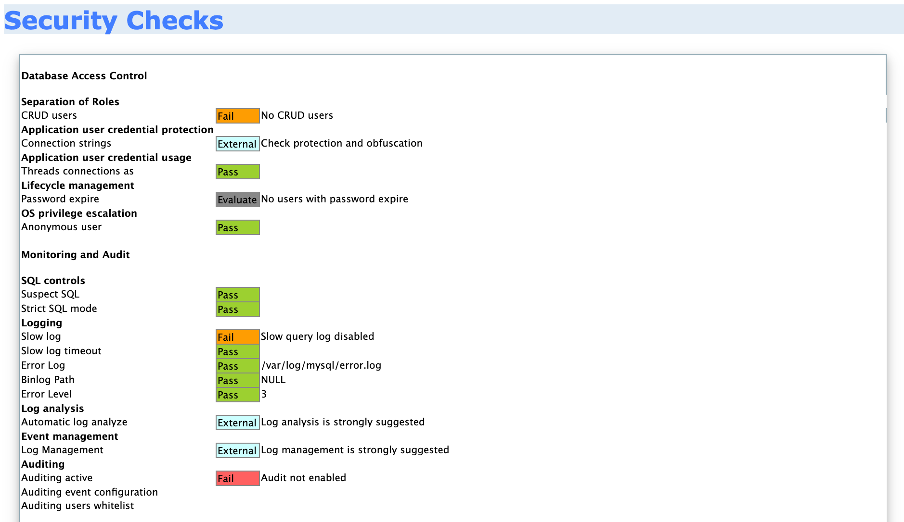

## What is a LAMP Stack?

LAMP is a very common example of a web service stack, named as an acronym of the names of its original four open-source components: the Linux operating system, the Apache HTTP Server, the MySQL relational database management system, and the PHP programming language.

Because LAMP is the most commonly deployed web service stack, it is vitally important to learn how to secure and audit each individual technology that makes up the stack.

## Prerequisites and Requirements

In order to secure a LAMP stack, you need to have a Linux server with the following services running:

- Apache2
- MySQL
- PHP

For a quick an easy way to install a LAMP stack on Linode, check out our guide on [How to Deploy a LAMP Stack with Marketplace Apps](/docs/products/tools/marketplace/guides/lamp-stack/).

Otherwise, you can find instructions on how to manually install a LAMP stack in our guide on [How to Install a LAMP Stack on Ubuntu 18.04](/docs/guides/how-to-install-a-lamp-stack-on-ubuntu-18-04/). Installation instructions for several other Linux distributions are also accessible from this guide.


This demonstration has been performed on Ubuntu 18.04. However, all techniques demonstrated are distribution agnostic with the exception of package names and package managers.


## Creating a User Account

The first step to securing your LAMP stack is to add and configure the necessary user accounts on your system. You then need to set up the various groups that are used to assign permissions to particular users with specific roles. Next, you can specify the various file permissions and assign ownership of particular files and directories. This helps you set up a system of accountability and defense in depth.

Linux has multi-user support and as a result, multiple users can access the system simultaneously. This can be seen as both an advantage and disadvantage from a security perspective, in that multiple accounts offer multiple access vectors for attackers and therefore increase the overall risk of the server.

To counter this, you must ensure that user accounts are setup and sorted accordingly in terms of their privileges and roles. For example, having multiple users on a Linux server with root privileges is extremely dangerous as an attacker only needs to compromise one account to get root access on the system. This issue can be solved by segregating permissions for users based on their roles.

To create a new user account, log in as the `root` user, then follow these steps:

1.  Create a user account on Linux with the following command:

        useradd <arguments> <username>

1.  Here are some useful arguments to use with the above command:

    - `-c`: Comments for the user account, such as the user's full name.
    - `-m`: Create the user's home directory if it does not exist.
    - `-s`: Specify the user's login shell.

1.  Using the above arguments, you can create an example user `john` with the following command:

        useradd -c "John Doe" -m -s /bin/bash john

1.  In the above command, the `-c` argument specifies the name of the user and the `-s` argument specifies the default shell to use. The `-m` argument creates the home directory for the user. Finally, end the statement with the username of the account.

1.  Next, specify the password for the user account:

        passwd john

1.  You are then prompted to enter a password for the user. Make sure to use a strong password that follows the specification of a security policy.

    
Enter new UNIX password:
Retype new UNIX password:
passwd: password updated successfully
    

### Setting up SUDO Access

When setting up access on a Linux server, some users may require sudo access to perform tasks like updating packages and installing software. By default, users do not have sudo access, which means they are unable to perform any tasks that require root privileges.

Giving a user sudo access simply involves adding the user to the `sudo` group with the following command:

        usermod -aG sudo john

## Disabling "root" Logins


Before completing this section, make sure that you have created a limited user with sudo access. If you disable root logins without having first created a user account, you may lock yourself out of your system.


The first step in setting up local authentication security is to disable root logins. This prevents any authorized or unauthorized users from gaining access to the `root` user account and consequently the server.

This is important because the `root` user has complete power over the system. These privileges can be abused to run any commands provided (malicious or otherwise), including modifying the passwords of other users on the system and consequently locking them out.

Common Linux security practices recommend disabling root logins and creating a separate administrative account which can be assigned sudo privileges to run certain commands with root privileges. This helps mitigate the threats to the `root` account and reduces the overall attack surface for attackers.

### Changing the "root" Default Shell

You can disable root logins in various ways. The first method of disabling root logins is by changing the `root` user's default shell from `/bin/bash` or `/bin/sh` to `/usr/sbin/nologin`, which is invalid. This can be done by using the `chsh` (Change Shell) utility on Linux or by modifying the `/etc/passwd` file.

1.  Use the `chsh` utility to change the `root` user's shell with the following command:

        sudo chsh root

1.  When prompted to enter a new value for the root login shell, enter `/usr/sbin/nologin`:

    
Changing the login shell for root
Enter the new value, or press ENTER for the default
        Login Shell [/bin/bash]: /usr/sbin/nologin
    

1.  Login attempts as the `root` user now fail due to the invalid shell with the following message:

    
This account is currently not available.
    

While root logins are disabled using this method, users with sudo access are still able to run commands with root privileges, provided that those privileges are not constrained to certain commands.

### Locking the "root" Password

The second method of preventing root logins is by locking the password of the `root` account with the `passwd` utility. This adds an additional layer of security as users are unable to log in to the account with any password, correct or not.

Locking the password of an account on Linux does not disable the account. Rather, it simply disables local password authentication for the account. Users are still be able to login to the account remotely via [SSH keys](#setting-up-key-based-authentication-with-ssh) if they have been set up.

1.  Lock the password of the `root` account by running the following command:

        sudo passwd -l root

1.  If you wish to unlock the password for a specific account, you can do this by using the unlock option with the `passwd` command:

        sudo passwd -u root

## Installing & Configuring UFW (Uncomplicated Firewall)

Uncomplicated Firewall is an easy-to-use program for managing a netfilter firewall. It uses a command-line interface consisting of a small number of simple commands and uses iptables for configuration.

1.  While UFW comes prepackaged with Ubuntu, it is disabled by default. Check the status of UFW with the following command:

        sudo ufw status

1.  Next, set rules allowing Apache and SSH traffic with the following commands:

        sudo ufw allow in ssh
        sudo ufw allow in 80/tcp
        sudo ufw allow in 443/tcp

1.  Now that you have your desired rules, enable UFW to have it start immediate on startup:

        sudo ufw enable

1.  Check to ensure that your firewall is active with your rules:

        sudo ufw status

    
Status: active

To                         Action      From
--                         ------      ----
22/tcp                     ALLOW       Anywhere
443/tcp                    ALLOW       Anywhere
80/tcp                     ALLOW       Anywhere
22/tcp (v6)                ALLOW       Anywhere (v6)
443/tcp (v6)               ALLOW       Anywhere (v6)
80/tcp (v6)                ALLOW       Anywhere (v6)
    

## Securing SSH

Similar to local authentication, the `root` account must be secured as it can run any command without restrictions. By default, any user can access the `root` account via SSH with the correct password. This poses a big threat as attackers can perform password brute-force attacks on the SSH protocol directly targeting the `root` account.

To remove this threat entirely, you can disable root login via SSH by modifying the OpenSSH server configuration file found in `/etc/ssh/sshd_config`.

1.  Open the file `/etc/ssh/sshd_config` with a text editor such as vim. You are greeted with extensive configuration options that you can use to modify how the SSH server functions:

    
#       $OpenBSD: sshd_config,v 1.101 2017/03/14 07:19:07 djm Exp $

# This is the sshd server system-wide configuration file.  See
# sshd_config(5) for more information.

# This sshd was compiled with PATH=/usr/bin:/bin:/usr/sbin:/sbin

# The strategy used for options in the default sshd_config shipped with
# OpenSSH is to specify options with their default value where
# possible, but leave them commented.  Uncommented options override the
# default value.

#Port 22
#AddressFamily any
#ListenAddress 0.0.0.0
#ListenAddress ::

#HostKey /etc/ssh/ssh_host_rsa_key
#HostKey /etc/ssh/ssh_host_ecdsa_key
#HostKey /etc/ssh/ssh_host_ed25519_key

# Ciphers and keying
#RekeyLimit default none

# Logging
#SyslogFacility AUTH
#LogLevel INFO
...
    

1.  To disable root login with SSH, set the `PermitRootLogin` configuration from `yes` to `no`. The authentication configurations can be found under the `# Authentication` section. Ensure that you uncomment the configuration to activate it.

    
...
# Authentication:

#LoginGraceTime 2m
PermitRootLogin no
#StrictModes yes
#MaxAuthTries 6
#MaxSessions 10
...
    

1.  Save the file, then restart the SSH service by running the following command:

        sudo systemctl restart ssh

1.  After restarting the SSH daemon on the server, attempted logins to root receive a "Permission Denied" error. This confirms that you have successfully disabled root logins via SSH.

    
root@192.0.2.0's password:
Permission denied, please try again.
    

### Setting Up Key-Based Authentication with SSH

Key-based authentication utilizes asymmetric encryption to generate two keys that are used for the encryption and decryption of data. These two keys are called the public key and the private key. Together, they are called a public-private key-pair.

The public key is used to encrypt data which only the corresponding private key can decrypt. This process can also be repeated vice versa. As a result, the private key must be kept private and secure, whereas the public key can be shared. For more information, see [SSH add keys](/docs/guides/use-public-key-authentication-with-ssh/).

SSH key-pairs can be generated on your local machine by using the `ssh-keygen` utility, Then, you can upload the public key to your LAMP stack machine.

1.  Generate a secure, 4096-bit key-pair to use with your LAMP stack user by running the following command:

    
**This command will overwrite an existing RSA key pair, potentially locking you out of other systems.**

If you've already created a key pair, skip this step. To check for existing keys, run `ls ~/.ssh/id_rsa*`.

If you accidentally lock yourself out of the SSH service on your Linode, you can still use the [Lish](/docs/guides/using-the-linode-shell-lish) console to login to your server. After you've logged in via Lish, update your `authorized_keys` file to use your new public key. This should re-establish normal SSH access.


        ssh-keygen -b 4096

1.  Enter the default names and directories for the private key `id_rsa` and the public key `id_rsa.pub`. You can optionally set a [private key passphrase](/docs/guides/use-public-key-authentication-with-ssh/#ssh-private-key-passphrases) for an additional layer of security.

1.  The key-pair is generated and saved in your ssh directory in  `~/.ssh`.

1.  Copy the public key to your LAMP stack Linode with the `ssh-copy-id` utility by running the following command, replacing `<username>` with the limited user you created on your LAMP stack Linode and `<SERVER-IP>` with your LAMP stack Linode's IP address:

        ssh-copy-id <username>@<SERVER-IP>

1.  You are now able to login directly without entering a login password. If you chose to set a passphrase for your SSH private key, you are prompted to enter that passphrase.

        ssh <username>@<SERVER-IP>

### Disabling Password Authentication

Now that you can login with your private key, you can disable password authentication for your LAMP stack limited user completely. This ensures that no user can authenticate remotely without the key-pair you created in the previous section.

1.  Using a text editor such as vim, open the OpenSSH configuration file located at `/etc/ssh/sshd_config` on your LAMP stack Linode and modify it by uncommenting the `PasswordAuthentication` option and setting it to `no`:

    
...
# To disable tunneled clear text passwords, change to no here!
PasswordAuthentication no
#PermitEmptyPasswords no
...
    

1.  Save the new changes to the OpenSSH configuration file, then restart the SSH daemon:

        sudo systemctl restart sshd

    Both your limited user and `root` user accounts are now secured from unauthorized remote access as you are only able to login to your user account with the unique private key from your SSH key-pair.

    
Now, you can only authenticate to your LAMP stack Linode via SSH using your unique private key. Accordingly, it is important to keep it safe and secure. Make a backup of your private key to ensure you are able to re-establish access to your Linode in the event of data loss.
    

## Brute-Force Protection with Fail2Ban

Fail2Ban is an intrusion prevention framework written in Python that protects Linux systems and servers from brute-force attacks. Setting up Fail2Ban provides brute-force protection for SSH on your Linode. It also allows you to monitor the strength of brute-force attacks in regards to the number of authentication attempts.

Brute-force attacks can be extremely powerful and may result in thousands of failed authentication attempts per day. It is therefore vital to understand how to protect your server from these attacks and how to block attacking IP addresses.

Fail2Ban allows you to automate the process of blocking brute-force attacks by limiting the number of failed authentication attempts a user can make before being blocked. This is extremely useful for servers that have user accounts that utilize passwords for remote authentication as opposed to SSH key-pair authentication.


Fail2Ban only works if your authentication method is set to password based authentication as opposed to key based authentication. If you opt to use key based authentication and have disabled password based authentication, you do not need brute force protection as only users with the private key can authenticate to the server.


### Installing And Configuring Fail2Ban

Fail2Ban is free to use and can be installed through most of the popular package managers.

1.  Install Fail2Ban on Ubuntu/Debian by running the following command:

        sudo apt-get install fail2ban

1.  Ensure that Fail2Ban runs on system startup:

        sudo systemctl enable fail2ban.service

1.  You can now begin configuring Fail2Ban to set up a jail for your LAMP stack Linode. Enter the following command to display the Fail2Ban configuration files located in the `/etc/fail2ban` directory:

        ls -alps /etc/fail2ban

    
total 64
 4 drwxr-xr-x  6 root root  4096 Mar  5 13:33 ./
 4 drwxr-xr-x 83 root root  4096 Mar  5 13:33 ../
 4 drwxr-xr-x  2 root root  4096 Mar  5 13:33 action.d/
 4 -rw-r--r--  1 root root  2328 Dec  9  2016 fail2ban.conf
 4 drwxr-xr-x  2 root root  4096 Apr 17  2017 fail2ban.d/
 4 drwxr-xr-x  3 root root  4096 Mar  5 13:33 filter.d/
24 -rw-r--r--  1 root root 21284 Dec  9  2016 jail.conf
 4 drwxr-xr-x  2 root root  4096 Mar  5 13:33 jail.d/
 4 -rw-r--r--  1 root root  2375 Dec  9  2016 paths-common.conf
 4 -rw-r--r--  1 root root   642 Dec  9  2016 paths-debian.conf
 4 -rw-r--r--  1 root root   975 Dec  9  2016 paths-opensuse.conf
    

    Fail2Ban uses the default configuration in the `jail.conf` file. However, we do not recommended using the default configuration files as they can be overwritten by newer updates to the Fail2Ban package.

    The preferred approach to creating configurations for a particular service is by creating a new configuration file in the `/etc/fail2ban` directory with the `.local` extension.

### Creating SSH Jails With Fail2Ban

1.  Begin by creating a new file within `/etc/fail2ban` called `jail.local`:

        sudo vim /etc/fail2ban/jail.local

1.  Here are a list of options for Fail2Ban that you can customize for security and blocking of the SSH service:

    | **Configuration** | **Function** |
    |:--------------|:------------|
    | `enabled` | Jail status (`true` or `false`). This enables (`true`) or disables (`false`) the jail. |
    | `port` | Port specification. |
    | `filter` | Service specific filter (Log filter). |
    | `logpath` | The name and location of the log file. |
    | `maxretry` | Number of login attempts before a ban is applied. |
    | `findtime` | Amount of allowed time between failed login attempts. |
    | `bantime` | Number of seconds an IP is banned for. |
    | `ignoreip` | IP to be allowed. |

1.  With the information in the table above, create a jail configuration for OpenSSH server (sshd) by entering the following values in the `jail.local` file:

    
[sshd]
enabled = true
port = ssh
filter = sshd
logpath = /var/log/auth.log
maxretry = 3
findtime = 300
bantime = 3600
ignoreip = 127.0.0.1
    

1.  Save the file, then restart the Fail2Ban service with the following command:

        sudo systemctl restart fail2ban.service

    You now have Fail2Ban active and protecting your LAMP stack Linode from SSH brute force attacks.

### Monitoring With Fail2Ban

One of the greatest advantages of using Fail2Ban the ability to monitor all the failed authentication attempts and the various blocked IP addresses. This information is extremely helpful as it can help you understand the scale of attacks you are facing. It also allows you to understand the geolocation of the attacks by analyzing the origins of banned IP addresses.

1.  Use the Fail2Ban-client tool to check the status of Fail2Ban and the active jails:

        sudo fail2ban-client status

    
Status
|- Number of jail:      1
`- Jail list:   sshd
    

1.  As shown above, the active jail list is displayed with the names of the respective jails. In this case, the `sshd` jail is active.

1.  To view the status and information regarding a particular jail like `sshd`, use the following command:

        sudo fail2ban-client status sshd

    
Status for the jail: sshd
|- Filter
|  |- Currently failed: 0
|  |- Total failed:     4
|  `- File list:        /var/log/auth.log
`- Actions
   |- Currently banned: 1
   |- Total banned:     1
   `- Banned IP list:   192.168.1.101
    

## Installing ClamAV (Anti-Virus Protection)

You can install ClamAV with the `apt` package manager on Debian or the `yum` package manager on CentOS.

1.  Install the `clamav` package by running the following command:

        sudo apt install clamav

1.  After the installation is complete, check the version of ClamAV by running the following command:

        clamscan --version

### Scanning with ClamAV

Scanning with ClamAV is simple and can be invoked by running the `clamscan` command in the terminal.

1.  Get started by scanning a particular directory. For example, scan the `/etc` directory for infected files with the following command:

    
Performing a scan can take several minutes to complete.
    

        sudo clamscan -i -r --remove /etc

    - `-i`: prints only infected files
    - `--remove`: removes infected files
    - `--r`: recursive scan; all the subdirectories in the directory will be scanned

1.  To scan your entire system, i can run the following command:

        sudo clamscan -i -r --remove /

1.  After the scan is completed, a summary of all infected files found is displayed.

    
----------- SCAN SUMMARY -----------
Known viruses: 8507334
Engine version: 0.102.4
Scanned directories: 150
Scanned files: 439
Infected files: 0
Data scanned: 2.41 MB
Data read: 0.95 MB (ratio 2.55:1)
Time: 68.775 sec (1 m 8 s)
    

For more instructions on using ClamAV, see our guide on [Scanning for Vulnerabilities with ClamAV](/docs/guides/scanning-your-linode-for-malware/).

## Configuring ModSecurity on Apache2

### Installing ModSecurity

1.  ModSecurity can be installed by running the following command in your terminal:

        sudo apt install libapache2-mod-security2 -y

1.  Alternatively, you can also build ModSecurity manually by cloning the official [ModSecurity Github repository](https://github.com/SpiderLabs/ModSecurity).

1.  After installing ModSecurity, enable the Apache2 `headers` module by running the following command:

        sudo a2enmod headers

After installing ModSecurity and enabling the header module, you need to restart the apache2 service, this can be done by running the following command:

        sudo systemctl restart apache2

You should now have ModSecurity installed. The next steps involves enabling and configuring ModSecurity and the OWASP-CRS.

### Configuring ModSecurity

ModSecurity is a firewall and therefore requires rules to function. This section shows you how to implement the OWASP Core Rule Set. First, you must prepare the ModSecurity configuration file.

1. Remove the `.recommended` extension from the ModSecurity configuration file name with the following command:

        sudo cp /etc/modsecurity/modsecurity.conf-recommended /etc/modsecurity/modsecurity.conf

1.  With a text editor such as vim, open `/etc/modsecurity/modsecurity.conf` and change the value for `SecRuleEngine` to `On`:

    
# -- Rule engine initialization ----------------------------------------------

# Enable ModSecurity, attaching it to every transaction. Use detection
# only to start with, because that minimises the chances of post-installation
# disruption.
#
SecRuleEngine On
...
    

1.  Restart Apache to apply the changes:

        sudo systemctl restart apache2

ModSecurity should now be configured to run. The next step in the process is to set up a rule set to actively prevent your web server from attacks.

### Setting Up the OWASP ModSecurity Core Rule Set

The [OWASP ModSecurity Core Rule Set (CRS)](https://github.com/coreruleset/coreruleset) is a set of generic attack detection rules for use with ModSecurity or compatible web application firewalls. The CRS aims to protect web applications from a wide range of attacks, including the OWASP Top Ten, with a minimum of false alerts. The CRS provides protection against many common attack categories, including SQL Injection, Cross Site Scripting, and Local File Inclusion.

To set up the OWASP-CRS, follow the procedures outlined below.

1.  First, delete the current rule set that comes prepackaged with ModSecurity by running the following command:

        sudo rm -rf /usr/share/modsecurity-crs

1.  Ensure that git is installed:

        sudo apt install git

1.  Clone the OWASP-CRS github repository into the `/usr/share/modsecurity-crs` directory:

        sudo git clone https://github.com/coreruleset/coreruleset /usr/share/modsecurity-crs

1.  Rename the `crs-setup.conf.example` to `crs-setup.conf`:

        sudo mv /usr/share/modsecurity-crs/crs-setup.conf.example /usr/share/modsecurity-crs/crs-setup.conf

1.  Rename the default request exclusion rule file:

        sudo mv /usr/share/modsecurity-crs/rules/REQUEST-900-EXCLUSION-RULES-BEFORE-CRS.conf.example /usr/share/modsecurity-crs/rules/REQUEST-900-EXCLUSION-RULES-BEFORE-CRS.conf

You should now have the OWASP-CRS setup and ready to be used in your Apache configuration.

### Enabling ModSecurity in Apache2

To begin using ModSecurity, enable it in the Apache configuration file by following the steps outlined below:

1.  Using a text editor such as vim, edit the `/etc/apache2/mods-available/security2.conf` file to include the OWASP-CRS files you have downloaded:

    
<IfModule security2_module>
        SecDataDir /var/cache/modsecurity
        Include /usr/share/modsecurity-crs/crs-setup.conf
        Include /usr/share/modsecurity-crs/rules/*.conf
</IfModule>
    

1.  In `/etc/apache2/sites-enabled/000-default.conf` file `VirtualHost` block, include the `SecRuleEngine` directive set to `On`.

    
<VirtualHost *:80>
        ServerAdmin webmaster@localhost
        DocumentRoot /var/www/html

        ErrorLog ${APACHE_LOG_DIR}/error.log
        CustomLog ${APACHE_LOG_DIR}/access.log combined

        SecRuleEngine On
</VirtualHost>
    

    If you are running a website that uses SSL, add `SecRuleEngine` directive to that website's configuration file as well. See our guide on [SSL Certificates with Apache on Debian & Ubuntu](/docs/guides/ssl-apache2-debian-ubuntu/#configure-apache-to-use-the-ssl-certificate) for more information.

1.  Restart the apache2 service to apply the configuration:

        sudo systemctl restart apache2

ModSecurity should now be configured and running to protect your web server from attacks. You can now perform a quick test to verify that ModSecurity is running.

### Testing ModSecurity

Test ModSecurity by performing a simple local file inclusion attack by running the following command:

    curl http://<SERVER-IP/DOMAIN>/index.php?exec=/bin/bash

If ModSecurity has been configured correctly and is actively blocking attacks, the following error is returned:


<!DOCTYPE HTML PUBLIC "-//IETF//DTD HTML 2.0//EN">
<html><head>
<title>403 Forbidden</title>
</head><body>
<h1>Forbidden</h1>

You don't have permission to access this resource.

<address>Apache/2.4.25 (Debian) Server at 96.126.105.75 Port 80</address>
</body></html>


## Securing MySQL

### Using the Secure MySQL Installer

The `mysql-server` package comes pre-configured with a utility called `mysql_secure_installation` that is used to set up a secure starting point for your MySQL server. It does this by deleting anonymous users and allowing you to specify the desired password strength policy.

`mysql_secure_installation` is a shell script available on Unix systems, and enables you to improve the security of your MySQL installation in the following ways:

- You can set a password for root accounts.
- You can remove root accounts that are accessible from outside the local host.
- You can remove anonymous-user accounts.
- You can remove the test database, which by default can be accessed by anonymous users.

Begin the security process by running this utility immediately after installing mysql-server.

1.  The utility can be invoked by running the following command:

        sudo mysql_secure_installation

1.  The setup process begins with a prompt to enable the validate password plugin that is used to test passwords and improve security. Enter `y` to enable this feature.

    
Securing the MySQL server deployment.

Connecting to MySQL using a blank password.

VALIDATE PASSWORD PLUGIN can be used to test passwords
and improve security. It checks the strength of password
and allows the users to set only those passwords which are
secure enough. Would you like to setup VALIDATE PASSWORD plugin?

Press y|Y for Yes, any other key for No: y
    

1.  Specify your password validation policy based on the level of the strength of the desired passwords.

    
There are three levels of password validation policy:

LOW    Length >= 8
MEDIUM Length >= 8, numeric, mixed case, and special characters
STRONG Length >= 8, numeric, mixed case, special characters and dictionary                  file

Please enter 0 = LOW, 1 = MEDIUM and 2 = STRONG:
    

1.  After specifying the password validation policy, you are prompted to remove anonymous users. This is an important security option as anonymous users can be leveraged by attackers to gain access to your database server. It is therefore recommended to remove anonymous users.

    
By default, a MySQL installation has an anonymous user,
allowing anyone to log into MySQL without having to have
a user account created for them. This is intended only for
testing, and to make the installation go a bit smoother.
You should remove them before moving into a production
environment.

Remove anonymous users? (Press y|Y for Yes, any other key for No) : y
    

1.  You are now prompted to disable root login remotely. This is an extremely important security configuration as it prevents attackers from remotely authenticating to the mysql server as root or performing password brute-force attacks. Remote authentication can also be disabled completely by following the steps in the next section.

    
Normally, root should only be allowed to connect from
'localhost'. This ensures that someone cannot guess at
the root password from the network.

Disallow root login remotely? (Press y|Y for Yes, any other key for No) : y
    

1.  You can also choose to delete the test database created during the mysql-server installation process. This database is created for testing purposes. As good practice, it is recommended to delete this database.

    
By default, MySQL comes with a database named 'test' that
anyone can access. This is also intended only for testing,
and should be removed before moving into a production
environment.

Remove test database and access to it? (Press y|Y for Yes, any other key for No) : y
    

1.  The final step is to reload the privilege tables to ensure that all changes are applied and are in effect.

    
Reloading the privilege tables will ensure that all changes
made so far will take effect immediately.

Reload privilege tables now? (Press y|Y for Yes, any other key for No) : y
    

### Modifying the "root" MySQL User

By default, MySQL servers come predefined with the `root` superuser/admin account that has access to all privileges and functionality regarding the databases and database users. Given this unparalleled control and access, it is important to lock down and secure the root account as attackers usually target the `root` account on a MySQL server.

The first step in securing the `root` user is by changing the username from `root` to something more unyielding. The objective is to make the `root` username as hard to guess or brute-force for attackers. After this, it is also recommended to change the `root` account password regularly as good practice.

1.  Login to the mysql server with the following command:

        sudo mysql -u root

1.  After logging in, change the `root` account username by running the following query:

        rename user 'root'@'localhost' to '<new-username>'@'localhost';

1.  Change the `root` account password to something strong and hard to guess. We recommend using a password generator. If you  enabled the verify password plugin during the secure installation process, the password must meet the policy requirements in terms of strength.

        alter user '<new-username>'@'localhost' IDENTIFIED WITH mysql_native_password BY '<new-password>';

1.  Reload the privilege table to ensure that all changes are saved and activated:

        flush privileges;

1.  To confirm whether the "root" username and password are changed, run the following query:

        use mysql;
        select user,host,authentication_string from mysql.user;

    This displays the user tables stored under the mysql database and should reflect the changes made:

    
+------------------+-----------+-------------------------------------------+
| user             | host      | authentication_string                     |
+------------------+-----------+-------------------------------------------+
| new-username     | localhost | *DA2C67ADB3F07DF8FBE55B006BD722E61CE8DB9B |
| mysql.session    | localhost | *THISISNOTAVALIDPASSWORDTHATCANBEUSEDHERE |
| mysql.sys        | localhost | *THISISNOTAVALIDPASSWORDTHATCANBEUSEDHERE |
| debian-sys-maint | localhost | *3AD267E180BF69227068045DFDCB1FFB3322C6F6 |
+------------------+-----------+-------------------------------------------+
    

### Creating a New MySQL User

A good security practice is segregation by duties or role. This means that for every database or application that uses the database, a new user is created that has CRUD permissions for that particular database.

This ensures that at any time, only one user has access to one database at a time and users cannot access other databases.

1.  First, log into the MySQL server with your new `root` account username and password:

        sudo mysql -u <new-username> -p

1.  Begin by creating a `Test` database for this demonstration with the following query:

        create database Test;

1.  Create the user responsible for managing this Test database:

        CREATE USER '<test-username>'@'localhost' IDENTIFIED BY '<password>';

1.  Assign the appropriate CRUD permissions to the user for the Test database:

        GRANT SELECT,UPDATE,DELETE ON Test.* TO '<test-username>'@'localhost';

1.  It is important to note that these privileges are only applicable to the Test database. If you are creating a user for an application like phpMyAdmin, you need to provide the user with `root` permissions.

1.  If you decide to delete a particular user, run the following query:

        drop user '<username>'@'localhost';

1.  Reload the privilege table to ensure the changes are applied and activated by running the following query:

        flush privileges;

### Custom MySQL Configuration

You can now begin the process of setting up a secure custom configuration for MySQL that provides additional security configuration options.

1.  The global MySQL configuration file is `/etc/mysql/my.cnf`. All custom global configurations are set up here.

1.  The custom configuration needs to be specified for `mysqld` (MySQL daemon). Using a text editor such as vim, edit the `/etc/mysql/my.cnf` file and add the following configurations to the end of the file:

    
[mysqld]                  # MySQL Daemon
user = mysql
bind-address = 127.0.0.1  # Disables remote authentication
port = 3360               # Custom port bilding for remote authN
local-infile = 0          # Disables infile
skip-symbolic-links = 1   # Prevents file drop or rename outside of data directory
    

1.  After adding the custom configurations, restart the mysql service to ensure all changes are applied:

        systemctl restart mysql

### Auditing MySQL Security

You can now audit the security of your MySQL server by using a tool called MySAT. MySAT performs several test to analyze database configurations and security policies. MySAT can help to assess and therefore increase MySQL database security.

MySAT is a simple SQL script, so it is easy to understand and maintain. MySAT results are output in HTML format.

1.  Clone the MySAT Github repository by running the following command:

        git clone https://github.com/meob/MySAT.git

1.  Navigate into the MySAT directory, which contains the `mysat.sql` file is used in conjunction with the MySQL server to output the results into a `MySAT.htm` file.

        cd MySAT

1.  Begin the audit by running the following command, entering your `root` user password when prompted:

        sudo mysql --user=<root-user> -p --skip-column-names -f < mysat.sql > MySAT.htm

    As indicated, MySAT requires `root` access to MySQL to run the required tests. After running the command, the `MySAT.htm` file is generated with the audit results.

1.  Copy the `MySAT.htm` and `mysat.css` files to your Apache server directory:

1.  In a web browser, navigate to `http://<SERVER-IP/DOMAIN>/MySAT.htm` to view the MySAT audit results.

    

    The results are formatted in a simple to read and understand format. Configurations are checked and results are color coded based on their current configuration security impact. For example, a failed configuration check is color coded in orange and a passed check is color coded in green.

    The audit report reveals what configurations need to be changed or modified and presents you with a top level picture of the overall security of your MySQL server.

## Security Auditing with Lynis

### Installing Lynis

Lynis is an extensible security audit tool for computer systems running Linux, FreeBSD, macOS, OpenBSD, Solaris, and other Unix derivatives. It assists system administrators and security professionals with scanning a system and its defenses, with the final goal being system hardening.

To ensure that you have the latest version of Lynis installed it's important to manually set up the [CISOfy repository](https://packages.cisofy.com/). While a version of Lynis is available in most repositories by default, the CISOfy repositories are always the most up to date, ensuring that any auditing performed is based on the best information available. To add the CISOfy repository to your list of repos, enter the following command:

    echo "deb https://packages.cisofy.com/community/lynis/deb/ stable main" | sudo tee /etc/apt/sources.list.d/cisofy-lynis.list

Then, import a public GPG key for a secure Lynis installation:

    sudo wget -O - https://packages.cisofy.com/keys/cisofy-software-public.key | sudo apt-key add -


You may need to manually install gnupg2 on some systems in order for GPG to successfully import keys. This can be completed with the following command:

    sudo apt-get install gnupg2


Update and upgrade to ensure that your system is prepared to use all packages available in the CISOfy repository:

    sudo apt-get update && sudo apt-get upgrade

Install Linus by running the following command:

    sudo apt install lynis

To display all the options and commands available, run the following command:

    lynis show options

Before scanning, ensure that Lynis is up to date. To check if the latest version is running, enter the following command:

    sudo lynis update info



 == Lynis ==

  Version            : 3.0.1
  Status             : Up-to-date
  Release date       : 2020-10-05
  Project page       : https://cisofy.com/lynis/
  Source code        : https://github.com/CISOfy/lynis
  Latest package     : https://packages.cisofy.com/

2007-2020, CISOfy - https://cisofy.com/lynis/



### System Auditing With Lynis

To perform a system audit with Lynis, run the following command:

    sudo lynis audit system

Lynis outputs a lot of information that it stores under the `/var/log/lynis.log` file for easier access. The summary of the system audit reveals important information about your system's security posture and various security misconfigurations and vulnerabilities.

Lynis also generates output on how these vulnerabilities and misconfigurations can be fixed or tweaked.


  Lynis security scan details:

  Hardening index : 61 [############        ]
  Tests performed : 233
  Plugins enabled : 0

  Components:
  - Firewall               [V]
  - Malware scanner        [X]

  Scan mode:
  Normal [V]  Forensics [ ]  Integration [ ]  Pentest [ ]

  Lynis modules:
  - Compliance status      [?]
  - Security audit         [V]
  - Vulnerability scan     [V]

  Files:
  - Test and debug information      : /var/log/lynis.log
  - Report data                     : /var/log/lynis-report.dat



The output also contains a hardening index score that is rated out of 100, this is used to give you a trackable tangible score of your system's current security posture.

Also found in the report, Linus displays any potential warnings that indicate a severe security vulnerability or misconfiguration that needs to be fixed or patched. In this case, add rules to the firewall:


      -[ Lynis 3.0.1 Results ]-

      Warnings (1):
  ----------------------------
      ! iptables module(s) loaded, but no rules active [FIRE-4512]
          https://cisofy.com/lynis/controls/FIRE-4512/


To increase our hardening index score, Lynis provides us with helpful suggestions that detail the various security configurations to be made.

After following the suggestions and making the necessary changes, run the system audit with Lynis again.

Once all the changes are made, you can expect to see a significant improvement in the hardening index score that confirms the changes and configurations we've applied are effective.

### Pentest With Lynis

Lynis also has the ability to simulate a privileged/internal pentest on the system, this can be invoked by using the following command:

    sudo lynis --pentest

This performs a pentest on the system and outputs a hardening index score that reflects the overall security posture of the system. It also outputs similar recommendations and patches that can be implied to improve the score.


  Lynis security scan details:

  Hardening index : 61 [############        ]
  Tests performed : 233
  Plugins enabled : 0

  Components:
  - Firewall               [V]
  - Malware scanner        [X]

  Scan mode:
  Normal [ ]  Forensics [ ]  Integration [ ]  Pentest [V] (running privileged)

  Lynis modules:
  - Compliance status      [?]
  - Security audit         [V]
  - Vulnerability scan     [V]

  Files:
  - Test and debug information      : /var/log/lynis.log
  - Report data                     : /var/log/lynis-report.dat

