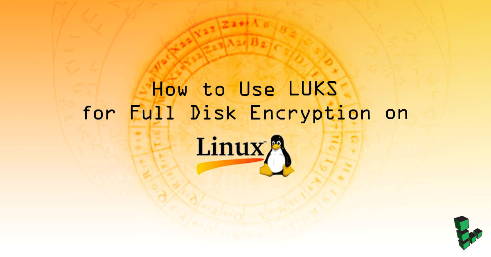

## Using LUKS encryption to Create a Secure Disk on Debian 8
Full disk encryption protects the information stored on your Linode's disks by converting it into unreadable code that can only be deciphered with a unique password. Nearly everything on the disk is encrypted, including the swap space and temporary files.

This guide will show you how to deploy a Linux distribution with [LUKS](https://en.wikipedia.org/wiki/Linux_Unified_Key_Setup) filesystem encryption. While this demonstration will use Debian 8 (Jessie), the process should be similar for any Linux distribution, provided that the respective distro's installer includes a LUKS encryption option.

The Debian 8 guided encryption option in this guide makes use of a process commonly referred to as *LVM on LUKS*, which allows you to create several logical volumes within an encrypted block device. This method offers advantages in terms of scalability and convenience, as your password only needs to be entered once to access all of the volumes within your encrypted disk.


Full disk encryption does a great job of keeping your data secure, but there are a few caveats. To decrypt and mount the disk, you'll need to enter the encryption passphrase in the console every time your Linode boots.

Since this setup makes use of raw disk images, it will not be possible to reduce the disk image space at a later date, and you'll need to manually increase the size of your filesystem should you choose to expand the raw disk size. You'll also need to implement your own backup solution since the [Linode Backup Service](/docs/products/storage/backups/) can't mount encrypted disks.

Please note that this is an non-standard configuration. Troubleshooting encrypted disk configurations falls outside the scope of [Linode Support](/docs/guides/support/).


## Before you Begin

1.  Create a Linode in the data center of your choice.
2.  [Delete the disks](/docs/guides/disks-and-storage/#deleting-a-disk) in the Linode that you created.
3.  Determine the installation media you'll be using to deploy your custom distribution, and take note of its size. In this example, we're using Debian's [network boot](http://ftp.debian.org/debian/dists/stable/main/installer-amd64/current/images/netboot/) option.

## Prepare Your Linode for Encrypted Debian Installation

1.  [Create two raw disk images](/docs/guides/disks-and-storage/#creating-a-disk) from the Linode's Dashboard:

    * A disk labeled **Installer**. The size of this disk will depend upon the size of your distribution's installer, but it's recommended to make it slightly larger than the space taken up by the install media itself. For this example, the installer disk will be 300MB in size, giving us plenty of room for the Debian network installer.
    * A disk labeled **Boot**. This will take up the rest of the free space available on your Linode.

2.  [Create two configuration profiles](/docs/guides/linode-configuration-profiles/#creating-a-configuration-profile) and disable the options under **Filesystem / Boot Helpers** for each of them, as well as the [Lassie](/docs/guides/monitor-and-maintain-compute-instance/#configuring-shutdown-watchdog) shutdown watchdog under the **Settings** menu. Both profiles will use the **Direct Disk** option from the **Kernel** drop down menu:

    **Installer profile**

    - Label: Installer
    - Kernel: Direct Disk
    - /dev/sda: *Boot* disk image.
    - /dev/sdb: *Installer* disk image.
    - root / boot device: Standard /dev/sdb

    **Boot profile**

    - Label: Boot
    - Kernel: Direct Disk
    - /dev/sda: *Boot* disk image.
    - root / boot device: Standard /dev/sda

3.  Boot into [Rescue Mode](/docs/guides/rescue-and-rebuild/#booting-into-rescue-mode) with your *Installer* disk mounted to `/dev/sda`, and connect to your Linode using the [Lish Console](/docs/guides/lish/).

4.  Once in Rescue Mode, download the Debian installation media and copy it to your *Installer* disk:

    
As an additional security step, you can use the keys provided in the same directory as the `iso` to [verify the authenticity](https://www.debian.org/CD/verify) of the image.


        wget http://ftp.debian.org/debian/dists/stable/main/installer-amd64/current/images/netboot/mini.iso
        dd if=mini.iso of=/dev/sda

5. Reboot into your *Installer* configuration profile, and open the [Glish](/docs/guides/glish/) graphical console from your Linode's Dashboard.

## Install the Operating System

1.  From the Glish console, you can view your distribution's installer. Select **Install** and press the Enter key:

    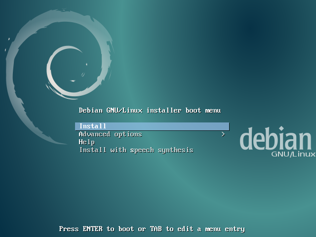

2.  Choose your language:

    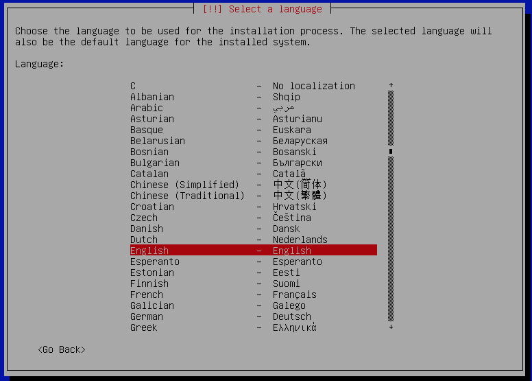

3.  Select your location. This will be used to determine your system locale and time zone:

    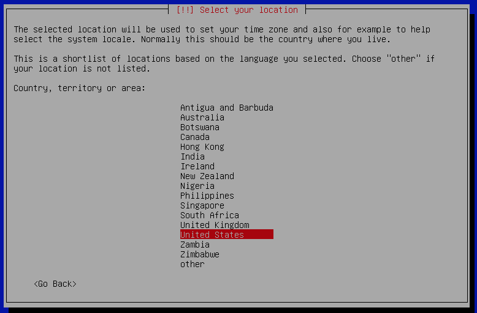

4.  After you select a keyboard layout, the installer will use DHCP to connect to the network. If you prefer, you'll have the option to configure your network settings manually:

    

5.  Assign your Linode's hostname and domain name. In this example we're using `fde-test` as the hostname, and `members.linode.com` for the domain:

    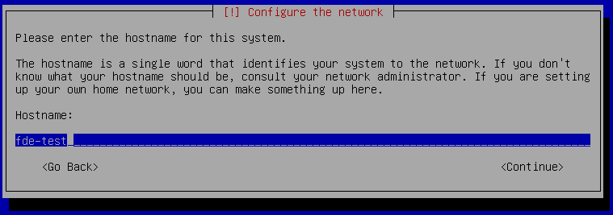
    

6.  Choose the Debian mirror that will be used to download packages. Select the appropriate location depending on which data center your Linode resides in:

    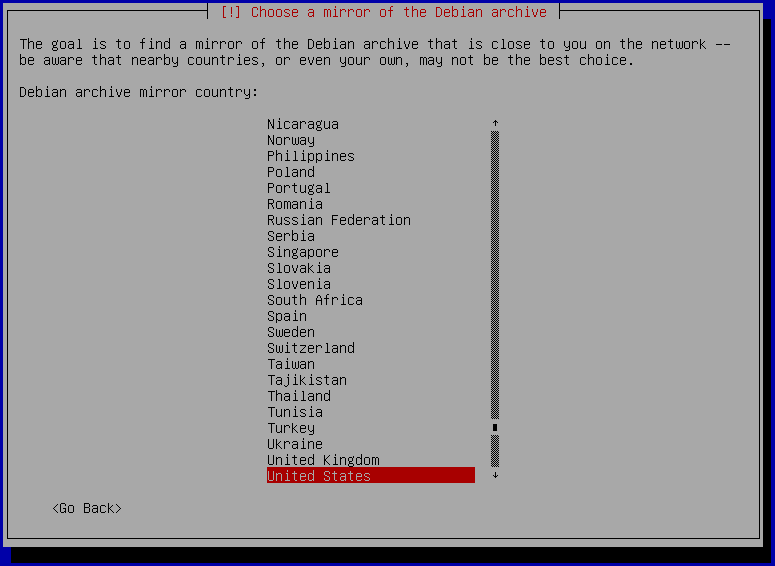
    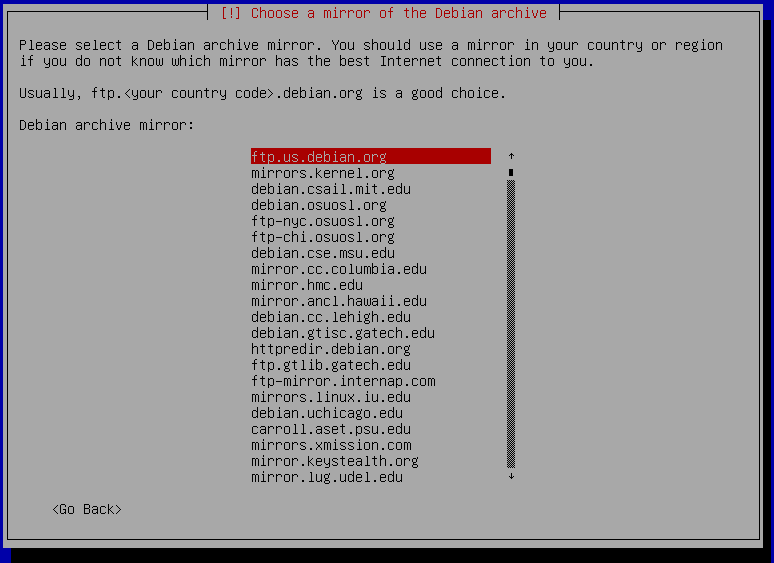

7.  Set the password for the `root` user:

    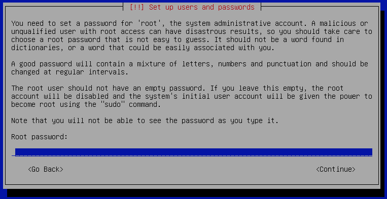

8.  Create a second, non-administrative user and password combination:

    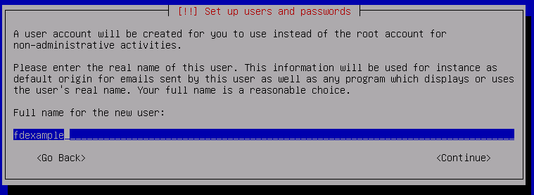

9.  Select the method to be used for partitioning your disk. Since we're encrypting the disk, choose **Guided - use entire disk and set up encrypted LVM**:

    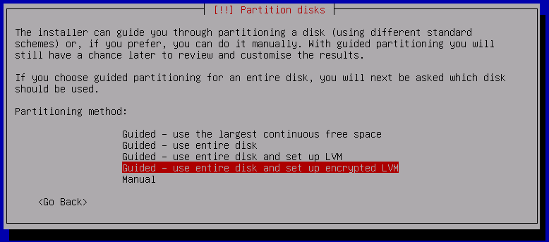

10. Select the volume on which you'll create partitions and install Debian. Since we previously mounted the *Boot* disk to `/dev/sda`, select it here:

    

11. Choose your partitioning scheme. For this example, we'll keep all files in a single partition, but you can select another option without affecting the rest of the process:

    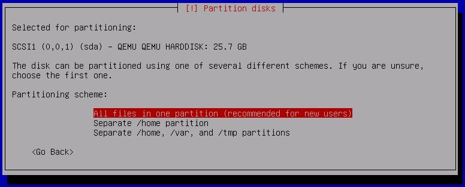

12. Confirm and apply your changes. This step may take awhile, as the volume is overwritten with random data to protect against [cryptanalysis](https://en.wikipedia.org/wiki/Cryptanalysis):

    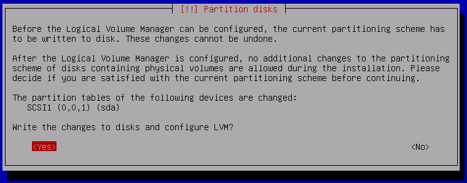

13. Once the partitioning process completes, create an encryption passphrase:

    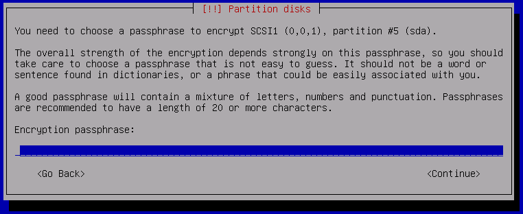

    It's recommended that you follow best practices for creating a secure password. If you enter a password with less than eight characters, you will receive a warning prompt:

    

    
If you lose or forget this password, the data on this disk image will be **irrecoverable**.


14. Next you'll receive a full overview of the partitioning scheme being applied to your disk. Once you've confirmed the changes, select **Finish partitioning and write changes to disk**:

    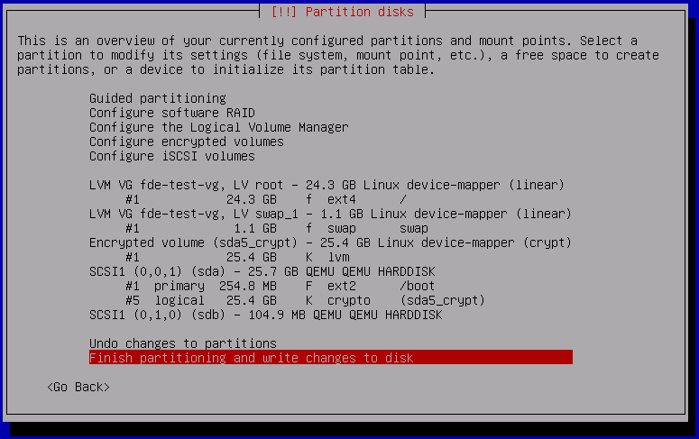

15. Confirm the new partitions you've created, and write your changes by selecting **Yes**:

    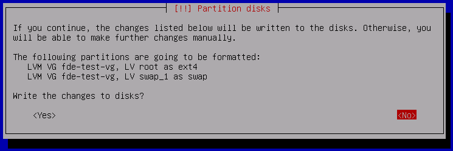

16. The installer will begin deploying the base system. Once it completes, you'll have the option to choose specific software packages. The only packages required for the server are `SSH server` and `standard system utilities`, but you can select additional options as needed. If you wish to make use of a graphical shell over [VNC](/docs/guides/install-vnc-on-ubuntu-16-04/) or the Glish console, select the desktop environment of your choice. Once you've confirmed your selections, hit **Continue**:

    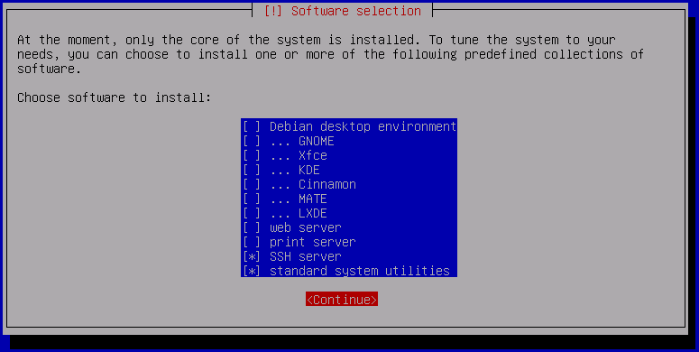

17. When the software installation completes, you'll be presented with the option to install the GRUB boot loader to the master boot record. Choose **Yes**:

    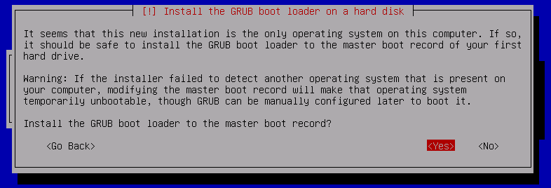

18. From the list of available target devices for GRUB installation, select `/dev/sda`:

    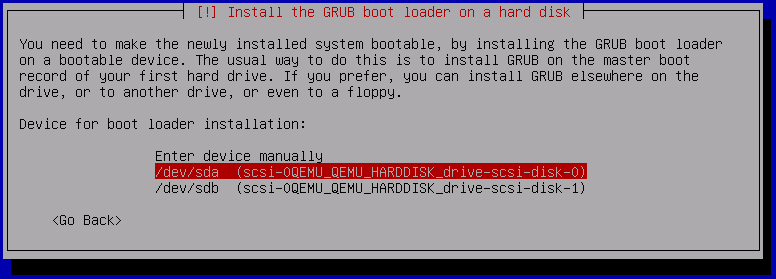

19. The installer will confirm once it has completed:

    

## Configure GRUB

By default the GRUB menu will only work with the Glish interface. This section enables terminal support for Lish.

1.  Now that you've completed the Debian installation, reboot your Linode into its *Boot* configuration profile, and connect to it from the Glish console. You will be prompted to enter your disk encryption passphrase:

    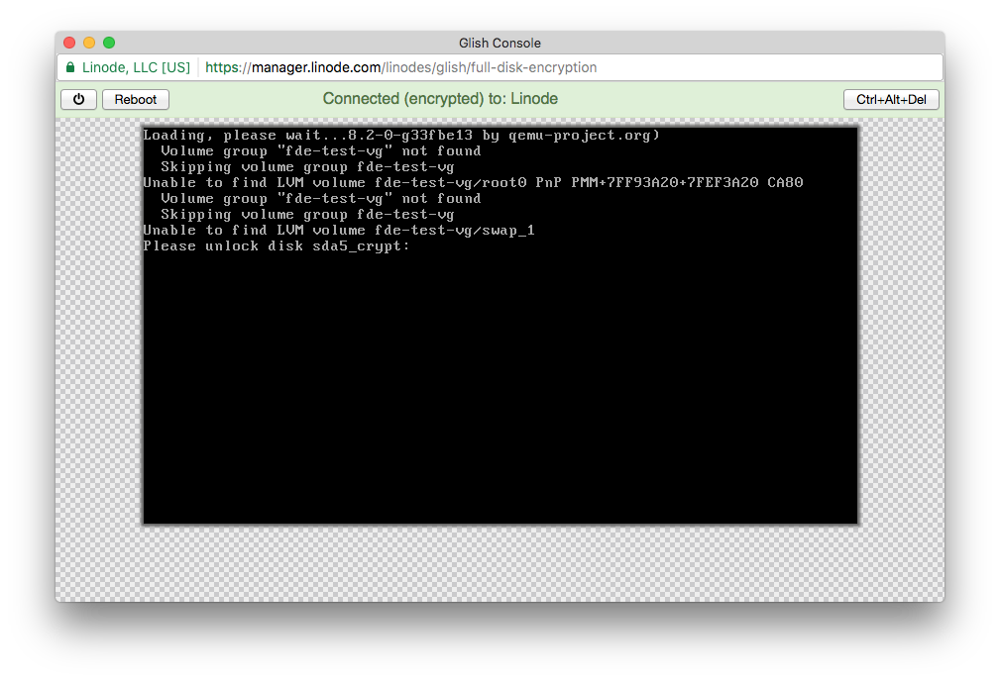

2.  Once you've entered your encryption passphrase, you'll have access to a login prompt for your Debian installation. Log in as the root user with the password created previously.

3.  Open the GRUB configuration file under `/etc/default/grub` with the text editor of your choice. Make the following changes to the appropriate directives:

    
GRUB_TIMEOUT=10
GRUB_CMDLINE_LINUX="console=ttyS0,19200n8"
GRUB_SERIAL_COMMAND="serial --speed=19200 --unit=0 --word=8 --parity=no --stop=1"
GRUB_TERMINAL=serial



4.  Save your changes, then apply them to your GRUB configuration:

        update-grub

5.  Reboot your Linode and open the Lish console. Now that we've configured the serial console in GRUB, you will receive a prompt to enter your decryption password in Lish:

    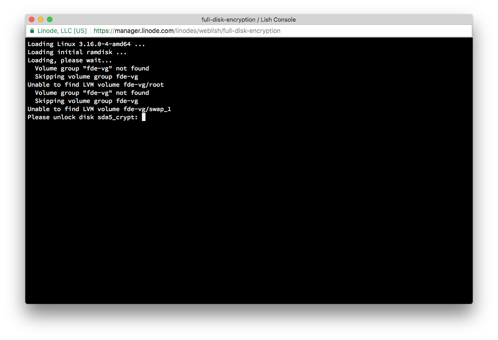

## Confirm Disk Encryption.

Once you've logged in, you can confirm your encryption settings by running the following command:

    cryptsetup status /dev/mapper/sda5_crypt

Your output will be similar to this:

    type:    LUKS1
    cipher:  aes-xts-plain64
    keysize: 512 bits
    device:  /dev/sda5
    offset:  4096 sectors
    size:    19972096 sectors
    mode:    read/write

You now have a securely LUKS-encrypted Debian installation. You can follow the steps in our [Creating a Compute Instance](/docs/guides/creating-a-compute-instance/) and [Setting Up and Securing a Compute Instance](/docs/guides/set-up-and-secure/) guide to begin configuring your Linode.
