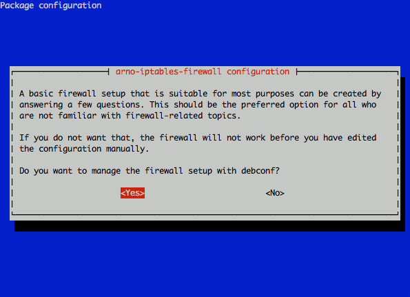
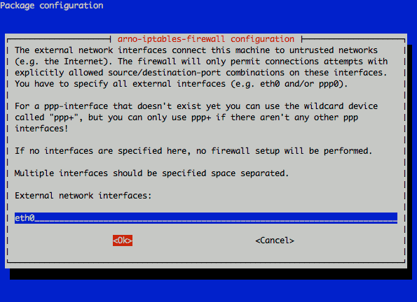
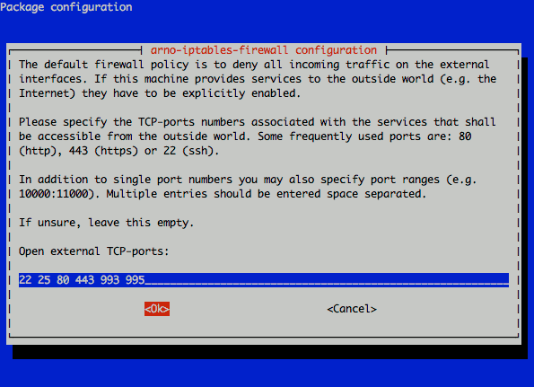
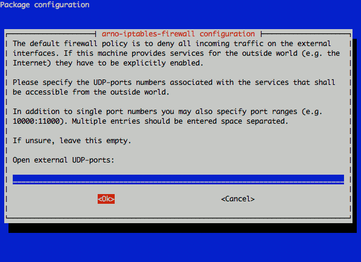
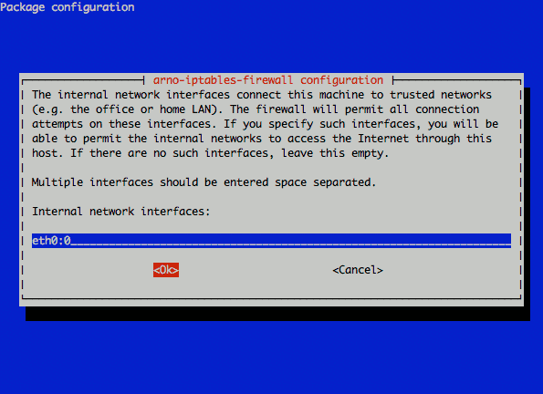
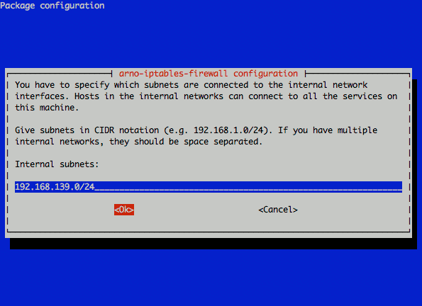
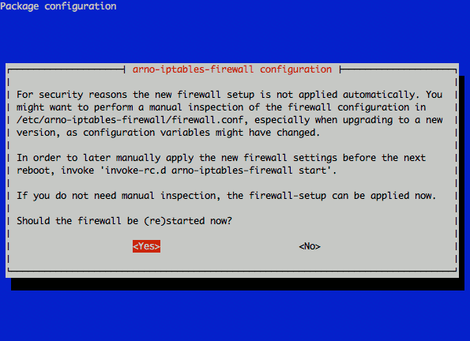

Firewall software is designed to limit access to network resources running on your Linode to authorized parties. Some services, such as a public web server, may be accessible to anyone. Others might be more restricted, such as an SSH daemon for remote system administration.

This guide will help you get the `arno-iptables-firewall` package installed and configured under Debian 5 (Lenny). For purposes of this tutorial, we assume the user is logged in as root via SSH, and that the prerequisite steps in the [Setting Up and Securing a Compute Instance](/docs/guides/set-up-and-secure/) have already been followed.

## Installing the Firewall

Make sure your package repositories and installed programs are up to date by issuing the following commands:

    apt-get update
    apt-get upgrade --show-upgraded

Issue the following command in your terminal:

    apt-get install arno-iptables-firewall

You will be led through a series of configuration dialogs. In the example below, we're assuming your Linode has one public IP address on `eth0` and one private IP address on the alias `eth0:0` (a private IP is not required). Please be sure to refer to the **Networking** tab in the Linode Cloud Manager for your specific settings.

## Configuring the Firewall

As part of the installation process, you'll be presented with a debconf dialog for configuration. Choose "Yes" to allow your configuration to be interactively managed by debconf:

Enter the name of your external network interface. Linodes have `eth0` by default.

Enter a list of TCP ports you'd like to be accessible through your Linode's public IP address, separated by spaces. In this example we've specified SSH, SMTP, HTTP, HTTPS, IMAPS and POP3S. You may wish to open additional ports if you run other public services on your Linode.

Specify the UDP ports you'd like to be open to the public in the same manner.

If you have a private IP address assigned to your Linode, you can specify the interface alias for it next. In this example, we're allowing all traffic from the private network range to the private interface alias `eth0:0`. You may fine-tune this later to only allow access from specific hosts on the backend network. If you don't have a private IP address configured, simply leave this field blank.

If required, specify the address range for the private network (expressed in [CIDR notation](http://en.wikipedia.org/wiki/Classless_Inter-Domain_Routing)).

You will be asked whether the firewall should be started now. Answer "Yes" here and continue.

After the initial debconf dialog exits, a few packages that arno-iptables-firewall depends upon will be configured. You will be prompted to restart the firewall after the configuration is complete.

Your firewall should be functioning correctly at this point. You can reference the file `/etc/arno-iptables-firewall/firewall.conf` for additional configuration beyond the scope of the debconf dialogs. To start/stop/restart the firewall from the shell, use the command `/etc/init.d/arno-iptables-firewall [start|stop|restart]`.

## More Information

You may wish to consult the following resources for additional information on this topic. While these are provided in the hope that they will be useful, please note that we cannot vouch for the accuracy or timeliness of externally hosted materials.

- [Arno's Projects: IPTABLES script home page](http://rocky.eld.leidenuniv.nl/)
- [Debian Firewalls](http://wiki.debian.org/Firewalls)

