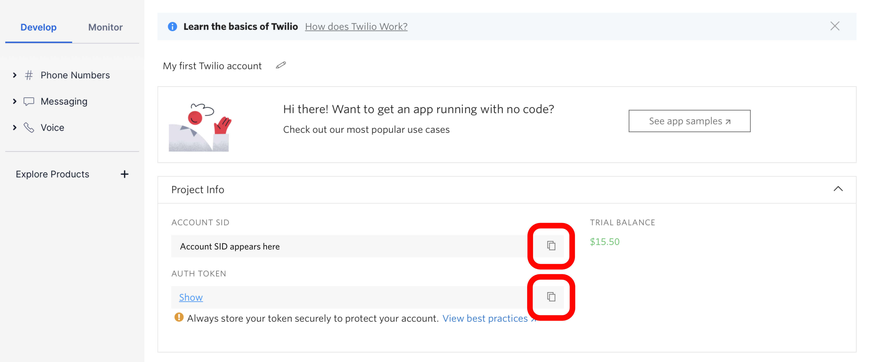

[Twilio](https://www.twilio.com/) links internet and telecom networks, creating connections using text messages, emails, phone calls, video, and intelligent chatbots. When you first explore the service, it may appear customer service-oriented, especially for marketing purposes. However, Twilio also has value to anyone who needs [operations support](https://www.twilio.com/solutions/operations), including network administrators.

Twilio's API makes it possible to programmatically contact people who should know about Linode events, such as employees, departments, and third parties. For example, if a system goes down or encounters another problem, you can send a text message to the people who need to respond.

## In this Guide

This guide shows a first example of how to send data from the Linode API to the Twilio API. Twilio's API is used to embed the Linode API data in a text message that is delivered to your personal phone number. The code example for this guide presents information about your Linode account's support tickets.

## Before You Begin

1. The code example in this guide uses Python 3. The examples were tested on version 3.6. Make sure you install Python 3.6 or newer on your workstation. Linode has guides that show how to install Python 3 or verify that you have it installed on several Linux distributions:

    - [How to Install Python 3 on Ubuntu 20.04](/docs/guides/how-to-install-python-on-ubuntu-20-04)

    - [How to Install Python 3 on Debian 10](/docs/guides/how-to-install-python-on-debian-10)

    - [How to Install Python 3 on CentOS 8](/docs/guides/how-to-install-python-on-centos-8)

    On Windows, Python can be downloaded [from the Windows Store](https://www.microsoft.com/en-us/p/python-39/9p7qfqmjrfp7?activetab=pivot:overviewtab).

1. This guide uses the [pip3](https://pip.pypa.io/en/stable/installation/) tool to install dependencies for the example code. Our [Managing Python Packages and Versions on Linux](/docs/guides/how-to-manage-packages-and-virtual-environments-on-linux/) guide shows how to install and use pip3 on Linux. On Windows, pip3 is automatically installed when you install Python [from the Windows Store](https://www.microsoft.com/en-us/p/python-39/9p7qfqmjrfp7?activetab=pivot:overviewtab). This guide does not use a [Python virtual environment](/docs/guides/how-to-manage-packages-and-virtual-environments-on-linux/#manage-virtual-environments-in-linux), but you can alter the instructions if you prefer to use one.

1. An active phone number is needed to sign up for a Twilio account, so be sure to have one if you want to implement the code example.

## Sign Up for Twilio

1. Visit Twilio's signup page and fill out the form to create an account: [Try Twilio](https://www.twilio.com/try-twilio). A credit card is not required for the free trial.

1. After completing the signup form, Twilio sends you a confirmation email. Locate the email and click the signup confirmation link inside it.

1. A form appears in your browser that asks to verify your phone number. This should be a number that you can receive texts on. The text messages sent by the code example later in this guide are delivered to this number:

    

    
Later in the onboarding process, Twilio assigns you a new number that Twilio's texts are delivered from.


1. After verifying your phone number, a new form appears with questions that personalize your Twilio experience:

    

    This guide recommends selecting the following answers:

    | Question | Answer |
    |----------|--------|
    | Which Twilio product are you here to use? | SMS |
    | What do you plan to build with Twilio? | Alerts & Notifications |
    | How do you want to build with Twilio? | With code |
    | What is your preferred coding language? | Python |
    | Would you like Twilio to host your code? | No, I want to use my own hosting service |

1. After completing the onboarding forms, visit the [Twilio console](https://console.twilio.com/) in your browser. A **Get a trial phone number** button appears on this page. Click on this button.

    

1. A dialog appears with a new trial phone number displayed. Click the **Choose this Number** button to confirm the trial number. The text messages sent by the code example in this guide are delivered from this number.

    

## Locate your Twilio API Credentials

Before you can work with the Twilio API, you need access tokens that identify you or your organization. For the code examples in this guide, this means providing two kinds of information:

- An account [*String Identifier (SID)*](https://www.twilio.com/docs/glossary/what-is-a-sid)

- An [*auth* (authorization) *token*](https://support.twilio.com/hc/en-us/articles/223136027-Auth-Tokens-and-How-to-Change-Them)

To find your Twilio account SID and auth token, visit the [Twilio console](https://console.twilio.com/) in your browser. Your account SID and auth token are listed under the **Project Info** panel. Click the copy button next to one of them to add it to your computer's clipboard:

Later in this guide, you add these tokens to the example code. For now, you can copy them into a temporary text file or a password manager on your computer. Or, you can just revisit this page later.

## Install the Twilio Python Helper Library

[The Twilio Python Helper Library](https://www.twilio.com/docs/libraries/python) is used by the code example in this guide to interact with the Twilio API. Install it with pip3 by running:

    pip3 install twilio

## Get a Linode API Token

Before you can work with the Linode API, you need a personal access token that identifies you or your organization. This token also specifies which Linode resources that you can access with it, like Linode instances, Domains, and NodeBalancers. Your Linode account can have multiple personal access tokens, each associated with different resources. By limiting which resources are available with a token, you can keep your account more secure.

Your Linode account does not have any personal access tokens by default. To create a new token:

1. Follow our [Get an API Access Token](/docs/products/tools/api/guides/manage-api-tokens/) instructions. For the code example in this guide, you should create a token that has **Read Only** access to the **Account** resource.

1. When you have created the token, it is displayed in your browser. Unlike the Twilio access token, you are not able to view the token in your browser after you have closed this page. Be sure to copy the token into a temporary text file or a password manager on your computer. Later in this guide, you add this token to the example code.

## Install the Python Bindings for the Linode API

[An official Python binding for the Linode API](https://github.com/linode/linode_api4-python) is available. The code example in this guide uses this library to interact with the Linode API. Install it with pip3 by running:

    pip3 install linode_api4

## Send Linode API Data to Twilio

The code example for this guide sends information about your Linode account's support tickets in a text message to your phone. Using the Linode API, it gets the most recent support ticket from your account. The code embeds the title of that ticket in the message's contents. It also uses the ID of the support ticket to add a Cloud Manager link to the ticket.

This diagram depicts this interaction using pseudocode:

### Import Modules and Initialize Service Credentials

1. Create a new text file named `linode-api-twilio.py`.

1. Copy this snippet into the file:


import os
import sys
from linode_api4 import LinodeClient
from linode_api4 import SupportTicket
from twilio.rest import Client

try:
    twilio_account_sid = os.environ['TWILIO_ACCOUNT_SID']
    twilio_auth_token = os.environ['TWILIO_AUTH_TOKEN']
    twilio_from_phone_number = os.environ['TWILIO_FROM_PHONE_NUMBER']
    twilio_to_phone_number = os.environ['TWILIO_TO_PHONE_NUMBER']
    linode_api_token = os.environ['LINODE_API_TOKEN']
except KeyError:
    print("Please ensure that the following environment variables are set when running the script: ")
    print("TWILIO_ACCOUNT_SID")
    print("TWILIO_AUTH_TOKEN")
    print("TWILIO_FROM_PHONE_NUMBER")
    print("TWILIO_TO_PHONE_NUMBER")
    print("LINODE_API_TOKEN")
    sys.exit(1)



This code imports the relevant Twilio and Linode API modules. It also imports the `os` module, which can be used to read environment variables from your terminal. The module is used by the code example to load your API tokens and Twilio phone numbers. A later section in this guide shows how to set those environment variables before running the script.

Alternatively, you could directly list the token and phone number values in the script. However, it's a good practice to avoid doing this. For example, if you listed your secrets inside the code and then uploaded your code to a public code repository like GitHub, they would be publicly visible.

The `except KeyError` statement is executed if any of the environment variables are not set. A message is printed in the console that tells you which variables are expected by the script. The `sys.exit()` method immediately exits the script in this case.


### Create Linode API and Twilio API Python Clients

Copy and paste the code from this snippet to the bottom of your script:


# copy and paste to bottom of file:

linode_client = LinodeClient(linode_api_token)
twilio_client = Client(twilio_account_sid, twilio_auth_token)


These lines create new client objects that can interact with the Linode and Twilio APIs.

### Fetch Support Tickets from Linode API

Copy and paste the code from this snippet to the bottom of your script:


# copy and paste to bottom of file:

all_support_tickets = linode_client.support.tickets()
open_support_tickets = linode_client.support.tickets(SupportTicket.status == "open")



These lines query the Linode API to get a list of the support tickets on your account. The Python binding for the [Support Tickets List](/docs/api/support/#support-tickets-list) API endpoint is accessed. The documentation for this endpoint shows the `account:read_only` authorization is needed to access it. This is why the Account resource was chosen in the [Get a Linode API Token](#get-a-linode-api-token) section.

A support ticket can be open or closed. Tickets are open when they are still awaiting a response from the support team or from the Linode customer. The second line in the example code shows how to use the Linode API's [filtering syntax](/docs/api/#filtering-and-sorting) to only get the support tickets that are currently open on your account.

The list of tickets returned by `linode_client.support.tickets()` is ordered from most recent to oldest. The first element of this list is the most recent ticket on your account. The [Support Tickets List](/docs/api/support/#support-tickets-list) endpoint documentation shows the properties of each ticket object in the list.

In the next section, the message contents are customized according to whether or not you have any open tickets.


### Prepare Twilio Text Message Body

Copy and paste the code from this snippet to the bottom of your script:


# copy and paste to bottom of file:

if len(open_support_tickets) > 0:
    most_recent_ticket = open_support_tickets[0]
    message_text = 'You have %s open Linode support tickets. ' \
        'Your newest support ticket is: \n\n' \
        '%s\n' \
        'https://cloud.linode.com/support/tickets/%s' % \
        (len(open_support_tickets), most_recent_ticket.summary, most_recent_ticket.id)

elif len(all_support_tickets) > 0:
    most_recent_ticket = all_support_tickets[0]
    message_text = 'You currently have no open Linode support tickets. ' \
        'Your most recent support ticket was:\n\n' \
        '%s\n' \
        'https://cloud.linode.com/support/tickets/%s' % \
        (most_recent_ticket.summary, most_recent_ticket.id)

else:
    message_text = 'You do not have any Linode support tickets.'



The code in this snippet prepares the content that is used in the text message.

- Lines 3-9: If there are any open support tickets on your account, the content includes the total number of open tickets. It then includes the title of the most recent ticket (from the `summary` property). It also adds a Cloud Manager link to the ticket, which references the `id` property of the ticket object.

- Lines 11-17: This case checks whether there are any tickets on the account. Because the open ticket list was empty, all of the tickets in the unfiltered ticket list are closed. The message content is customized to tell the user that no open tickets exist. It then includes the title of the most recent closed ticket (from the `summary` property). It also adds a Cloud Manager link to the ticket, which references the `id` property of the ticket object.

- Lines 19-20: If the unfiltered ticket list is empty, a message is prepared to tell the user that they don't have any support tickets.

The `\n` character sequence appears in the message text strings. These characters [insert newlines in the message](https://support.twilio.com/hc/en-us/articles/223181468-How-do-I-Add-a-Line-Break-in-my-SMS-or-MMS-Message-).


### Create and Send a Text Message with Twilio

1. Copy and paste the code from this snippet to the bottom of your script:

    
# copy and paste to bottom of file:

text = twilio_client.messages.create(
    body = message_text,
    from_ = twilio_from_phone_number,
    to = twilio_to_phone_number
)

print("Twilio message created with ID: %s" % (text.sid))


    
The `create` method tells the Twilio API to create *and* immediately send a new text message:

- The text string from the last section is used as the body of the message.

- The `from_` phone number corresponds to the new number that you selected in the Twilio console earlier in the guide.

- The `to` number corresponds with your personal or testing phone number that you signed up to Twilio with.

The `create` method returns a reference to the Twilio [message resource](https://www.twilio.com/docs/sms/api/message-resource) that was created. The last line prints the unique ID of the message.


1. After appending the above snippet, save the file.

    
The code example is now complete. The completed example should look like the code in [this file](linode-api-twilio.py).


### Run the Code

1. Before you run the script, set the [environment variables](/docs/guides/how-to-set-linux-environment-variables/) that the script expects in your terminal:

    
On **Linux and macOS**, run the following commands. After the `=` symbol in each command, insert the corresponding value:

    export TWILIO_ACCOUNT_SID=
    export TWILIO_AUTH_TOKEN=
    export TWILIO_FROM_PHONE_NUMBER=
    export TWILIO_TO_PHONE_NUMBER=
    export LINODE_API_TOKEN=

For example, the filled-in commands could look like:


export TWILIO_ACCOUNT_SID=96af3vrYKQG6hrcYCC743mR27XhBzXb8wQ
export TWILIO_AUTH_TOKEN=LD9NWYXZzp3d3k7Mq7ME6L8QJJ8zu73r
export TWILIO_FROM_PHONE_NUMBER=+122233344444
export TWILIO_TO_PHONE_NUMBER=+15556667777
export LINODE_API_TOKEN=bKfoAoV8Awo8e9CVTFTYKEdojkpHdD8BNU6UvV66izq6KjduPikfQTGHYmo3vFv6



    
On **Windows**, run the following commands. After the `=` symbol in each command, insert the corresponding value:

    set TWILIO_ACCOUNT_SID=
    set TWILIO_AUTH_TOKEN=
    set TWILIO_FROM_PHONE_NUMBER=
    set TWILIO_TO_PHONE_NUMBER=
    set LINODE_API_TOKEN=

For example, the filled-in commands could look like:


set TWILIO_ACCOUNT_SID=96af3vrYKQG6hrcYCC743mR27XhBzXb8wQ
set TWILIO_AUTH_TOKEN=LD9NWYXZzp3d3k7Mq7ME6L8QJJ8zu73r
set TWILIO_FROM_PHONE_NUMBER=+122233344444
set TWILIO_TO_PHONE_NUMBER=+15556667777
set LINODE_API_TOKEN=bKfoAoV8Awo8e9CVTFTYKEdojkpHdD8BNU6UvV66izq6KjduPikfQTGHYmo3vFv6



    The values for each variable are as follows:

    | Variable | Value |
    |----------|-------|
    | TWILIO_ACCOUNT_SID | The Twilio account SID [located in your Twilio console](#locate-your-twilio-api-credentials) |
    | TWILIO_AUTH_TOKEN | The Twilio auth token [located in your Twilio console](#locate-your-twilio-api-credentials). The phone number needs to be entered using [E.164](https://www.twilio.com/docs/glossary/what-e164) formatting. |
    | TWILIO_FROM_PHONE_NUMBER | The new number that you selected in the Twilio console [when you first signed up](#sign-up-for-twilio) |
    | TWILIO_TO_PHONE_NUMBER | Your personal or testing phone number that you signed up to Twilio with. The phone number needs to be entered using [E.164](https://www.twilio.com/docs/glossary/what-e164) formatting. |
    | LINODE_API_TOKEN | [The Linode API token that you generated](#get-a-linode-api-token) and recorded |

1. Run the script:

        python3 linode-api-twilio.py

    If successful, the script generates output like the following:

    
Twilio message created with ID: 9FKgk3Vokgx4hVC4937nx2kAraiG7qXDx8


    A few moments later, you should receive a text message similar to one of the following examples:

    - 
Sent from your Twilio trial account - You have 2 open Linode support tickets. Your newest support ticket is:

Scheduled Maintenance
https://cloud.linode.com/support/tickets/1234567


    - 
Sent from your Twilio trial account - You currently have no open Linode support tickets. Your most recent support ticket was:

Linode Backup Maintenance
https://cloud.linode.com/support/tickets/1234567


    - 
Sent from your Twilio trial account - You do not have any Linode support tickets.


    If you receive an error message when you run the script, review the [Troubleshooting](#troubleshooting) section.

## Troubleshooting

If the script does not run successfully, review these possible issues and solutions:

### Environment Variables Not Set

You may see this error:


Please ensure that the following environment variables are set when running the script:
TWILIO_ACCOUNT_SID
TWILIO_AUTH_TOKEN
TWILIO_FROM_PHONE_NUMBER
TWILIO_TO_PHONE_NUMBER
LINODE_API_TOKEN


If this error appears, follow step 1 of the [Run the Code](#run-the-code) section to set your environment variables.

### Linode API Error: Your OAuth token is not authorized to use this endpoint

You may see the error `Your OAuth token is not authorized to use this endpoint`, as in the following example output:


Traceback (most recent call last):
  File "linode-api-twilio.py", line 25, in <module>
    all_support_tickets = linode_client.support.tickets()
  File "/home/username/.local/lib/python3.6/site-packages/linode_api4/linode_client.py", line 943, in tickets
    return self.client._get_and_filter(SupportTicket, *filters)
  File "/home/username/.local/lib/python3.6/site-packages/linode_api4/linode_client.py", line 1617, in _get_and_filter
    return self._get_objects(obj_type.api_list(), obj_type, filters=parsed_filters)
  File "/home/username/.local/lib/python3.6/site-packages/linode_api4/linode_client.py", line 1301, in _get_objects
    response_json = self.get(call_endpoint, model=model, filters=filters)
  File "/home/username/.local/lib/python3.6/site-packages/linode_api4/linode_client.py", line 1317, in get
    return self._api_call(*args, method=self.session.get, **kwargs)
  File "/home/username/.local/lib/python3.6/site-packages/linode_api4/linode_client.py", line 1286, in _api_call
    raise ApiError(error_msg, status=response.status_code, json=j)
linode_api4.errors.ApiError: 401: Your OAuth token is not authorized to use this endpoint.;


If this error is displayed, your Linode personal access token does not have access to the right resources. Follow the [Get a Linode API Token](#get-a-linode-api-token) section again to generate a new token with the right resource.