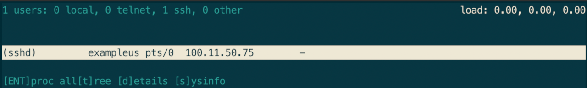
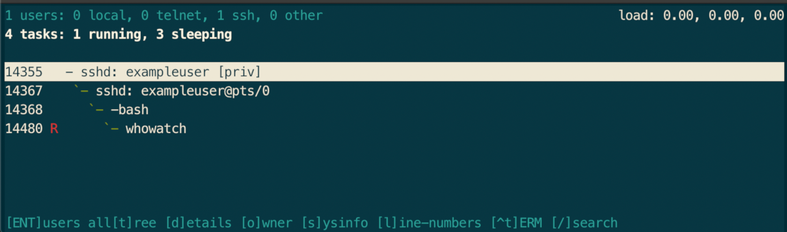

## Analyzing system logs

The following table highlights the most important log files and the data that is logged in them. These log files are particularly helpful/useful for monitoring and analyzing authentication attempts.

| Log File | Function |
| -------- | -------- |
| `/var/log/auth.log` | Contains information about security-related events, including authentication successes or failures and the IP addresses where the requests came from. |
| `/var/log/wtmp` | The wtmp log file contains all login and logout events. It shows each instance of user login and logouts, how long the session was active for, and which host the connection came from. |
| `/var/log/btmp` | Similar to wtmp, btmp is also a binary file you can touch to create if it doesn’t exist. This file can be used to find out bad login attempts. |

## Analyzing /var/log/auth.log

The `auth.log` file contains information about security-related events, including authentication successes or failures, and the IP addresses where the requests came from. You can use a utility like `grep` to display successful and failed SSH authentication attempts.

This can be done by running the following command:

    sudo cat /var/log/auth.log | grep -e "sshd"

Example output:


Oct 29 16:07:35 localhost sshd[406]: Server listening on 0.0.0.0 port 22.
Oct 29 16:07:35 localhost sshd[406]: Server listening on :: port 22.
Oct 29 16:07:35 localhost sshd[406]: Received signal 15; terminating.
Oct 29 16:07:37 localhost sshd[625]: Server listening on 0.0.0.0 port 22.
Oct 29 16:07:37 localhost sshd[625]: Server listening on :: port 22.
Oct 29 16:08:42 localhost sshd[646]: Connection closed by 203.0.113.0 port 54614 [preauth]
Oct 29 16:09:37 localhost sshd[648]: pam_unix(sshd:auth): authentication failure; logname= uid=0 euid=0 tty=ssh ruser= rhost=203.0.113.0  user=root
Oct 29 16:09:39 localhost sshd[648]: Failed password for root from 203.0.113.0 port 54840 ssh2
Oct 29 16:09:44 localhost sshd[648]: Accepted password for root from 203.0.113.0 port 54840 ssh2
Oct 29 16:09:44 localhost sshd[648]: pam_unix(sshd:session): session opened for user root by (uid=0)
Oct 29 16:10:10 localhost sshd[648]: Received disconnect from 203.0.113.0 port 54840:11: disconnected by user
Oct 29 16:10:10 localhost sshd[648]: Disconnected from user root 203.0.113.0 port 54840
Oct 29 16:10:10 localhost sshd[648]: pam_unix(sshd:session): session closed for user root
Oct 29 16:10:21 localhost sshd[686]: Accepted password for exampleuser from 203.0.113.0 port 55060 ssh2
Oct 29 16:10:21 localhost sshd[686]: pam_unix(sshd:session): session opened for user exampleuser by (uid=0)
Oct 29 16:52:53 localhost sshd[14049]: Invalid user admin from 192.0.2.0 port 45429
Oct 29 16:52:53 localhost sshd[14049]: pam_unix(sshd:auth): check pass; user unknown
Oct 29 16:52:53 localhost sshd[14049]: pam_unix(sshd:auth): authentication failure; logname= uid=0 euid=0 tty=ssh ruser= rhost=192.0.2.0

...


## Analyzing /var/log/wtmp

The wtmp log file contains all login and logout events. It shows each instance of user login and logouts, how long the session was active for, and which host the connection came from.

The `last` command shows a chronological history of user logins into the system since the `/var/log/wtmp` file was created. It’s a binary file, so you can’t `cat` or `grep` this file.

Instead, run the last command to view the output:

    last -aiF

Sample output:


exampleuser     pts/0        Thu Oct 29 20:10:17 2020   still logged in                       203.0.113.0
exampleuser     pts/0        Thu Oct 29 16:10:21 2020 - Thu Oct 29 16:53:29 2020  (00:43)     203.0.113.0
root            pts/0        Thu Oct 29 16:09:44 2020 - Thu Oct 29 16:10:10 2020  (00:00)     203.0.113.0
reboot          system boot  Thu Oct 29 16:07:33 2020   still running                         0.0.0.0

wtmp begins Thu Oct 29 16:07:33 2020


## Analyzing /var/log/btmp

Similar to wtmp, the `/var/log/btmp` log is also a binary file that can be used to view bad login attempts.

To access the contents of the file, use the `lastb` command:

    sudo lastb -adF

Sample output:


root     ssh:notty    Thu Oct 29 19:19:35 2020 - Thu Oct 29 19:19:35 2020  (00:00)     198.51.100.0
support  ssh:notty    Thu Oct 29 16:53:37 2020 - Thu Oct 29 16:53:37 2020  (00:00)     198.51.100.1
support  ssh:notty    Thu Oct 29 16:53:35 2020 - Thu Oct 29 16:53:35 2020  (00:00)     198.51.100.1
guest    ssh:notty    Thu Oct 29 16:53:34 2020 - Thu Oct 29 16:53:34 2020  (00:00)     198.51.100.2
ubnt     ssh:notty    Thu Oct 29 16:53:30 2020 - Thu Oct 29 16:53:30 2020  (00:00)     198.51.100.3
ubnt     ssh:notty    Thu Oct 29 16:53:28 2020 - Thu Oct 29 16:53:28 2020  (00:00)     198.51.100.3
guest    ssh:notty    Thu Oct 29 16:53:27 2020 - Thu Oct 29 16:53:27 2020  (00:00)     198.51.100.2
guest    ssh:notty    Thu Oct 29 16:53:25 2020 - Thu Oct 29 16:53:25 2020  (00:00)     198.51.100.2
root     ssh:notty    Thu Oct 29 16:53:23 2020 - Thu Oct 29 16:53:23 2020  (00:00)     198.51.100.0

btmp begins Thu Oct 29 16:09:39 2020


## List logged in users

You can list the active logged in users on the system by running the who command.

    who

Sample output:


exampleuser pts/0        2020-10-29 20:10 (203.0.113.0)


This displays the users logged in, their IP address, the time at which they logged in, and the duration of their session.

## Monitoring System Processes

You can monitor and analyze system processes on Linux with utilities like `top` or `htop`. Both of these tools provide a simple and effective view of the system processes and their resource consumption.

### top

To start the `top` utility, use the following command:

    top

Sample output:


top - 20:21:46 up  4:14,  1 user,  load average: 0.00, 0.00, 0.00
Tasks:  79 total,   1 running,  78 sleeping,   0 stopped,   0 zombie
%Cpu(s):  0.0 us,  0.3 sy,  0.0 ni, 99.7 id,  0.0 wa,  0.0 hi,  0.0 si,  0.0 st
MiB Mem :    987.2 total,    276.1 free,     74.6 used,    636.5 buff/cache
MiB Swap:    512.0 total,    512.0 free,      0.0 used.    761.2 avail Mem

  PID USER      PR  NI    VIRT    RES    SHR S  %CPU  %MEM     TIME+ COMMAND
    1 root      20   0   23008  10256   7832 S   0.0   1.0   0:02.41 systemd
    2 root      20   0       0      0      0 S   0.0   0.0   0:00.00 kthreadd
    3 root       0 -20       0      0      0 I   0.0   0.0   0:00.00 rcu_gp
    4 root       0 -20       0      0      0 I   0.0   0.0   0:00.00 rcu_par_gp
    6 root       0 -20       0      0      0 I   0.0   0.0   0:00.00 kworker/0:0H-kblockd
    8 root       0 -20       0      0      0 I   0.0   0.0   0:00.00 mm_percpu_wq
    9 root      20   0       0      0      0 S   0.0   0.0   0:00.14 ksoftirqd/0
   10 root      20   0       0      0      0 I   0.0   0.0   0:00.17 rcu_sched
   11 root      20   0       0      0      0 I   0.0   0.0   0:00.00 rcu_bh
   12 root      rt   0       0      0      0 S   0.0   0.0   0:00.06 migration/0
   14 root      20   0       0      0      0 S   0.0   0.0   0:00.00 cpuhp/0
   15 root      20   0       0      0      0 S   0.0   0.0   0:00.00 kdevtmpfs
   16 root       0 -20       0      0      0 I   0.0   0.0   0:00.00 netns
   17 root      20   0       0      0      0 S   0.0   0.0   0:00.00 kauditd
   18 root      20   0       0      0      0 S   0.0   0.0   0:00.00 khungtaskd
   19 root      20   0       0      0      0 S   0.0   0.0   0:00.00 oom_reaper
   20 root       0 -20       0      0      0 I   0.0   0.0   0:00.00 writeback
   21 root      20   0       0      0      0 S   0.0   0.0   0:00.00 kcompactd0
   22 root      25   5       0      0      0 S   0.0   0.0   0:00.00 ksmd
   23 root      39  19       0      0      0 S   0.0   0.0   0:00.14 khugepaged
   24 root       0 -20       0      0      0 I   0.0   0.0   0:00.00 crypto
   25 root       0 -20       0      0      0 I   0.0   0.0   0:00.00 kintegrityd
   26 root       0 -20       0      0      0 I   0.0   0.0   0:00.00 kblockd

...


Type `q` to quit out of the top utility.

### htop

You can also use `htop`. htop is a utility similar to top that offers much more functionality, like the ability to kill processes.

1.  Install htop by running the following command:

        sudo apt install htop

1.  Launch htop by running the htop command in the terminal.

        htop

1.  Htop lists out all processes and sorts out processes in terms of resource consumption.

    

    You can search for processes with the `F3` key and you can kill processes with the `F9` key. Exit htop by pressing `F10`.

## Monitoring SSH Connections

You can monitor active SSH connections with a utility called `whowatch`. Whowatch allows you to view all authenticated SSH sessions, their IP addresses, and what commands or processes they are running.

1.  Install whowatch with the following command:

        sudo apt install whowatch

1.  Run it by using the command:

        whowatch

1.  From the list, you can select any user account by navigating with the arrow keys and pressing `Enter` or `Return`.

    

1.  You can see information about all the programs that a user is running.

    
