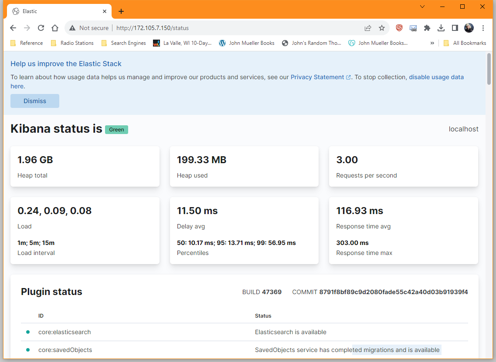
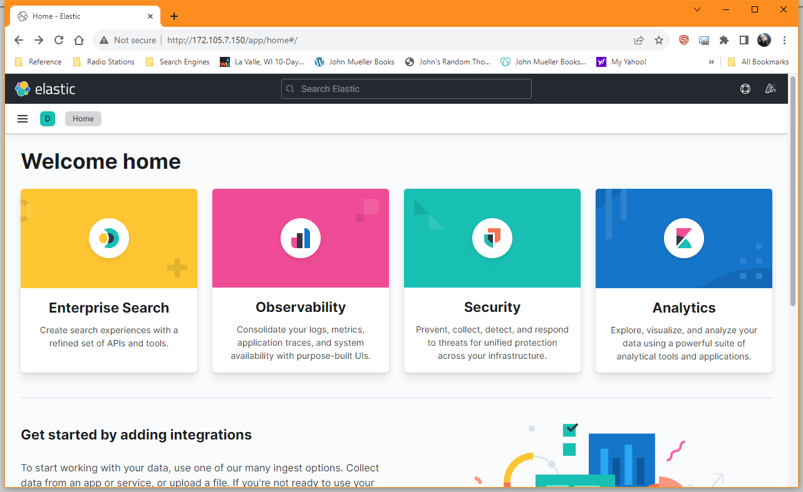
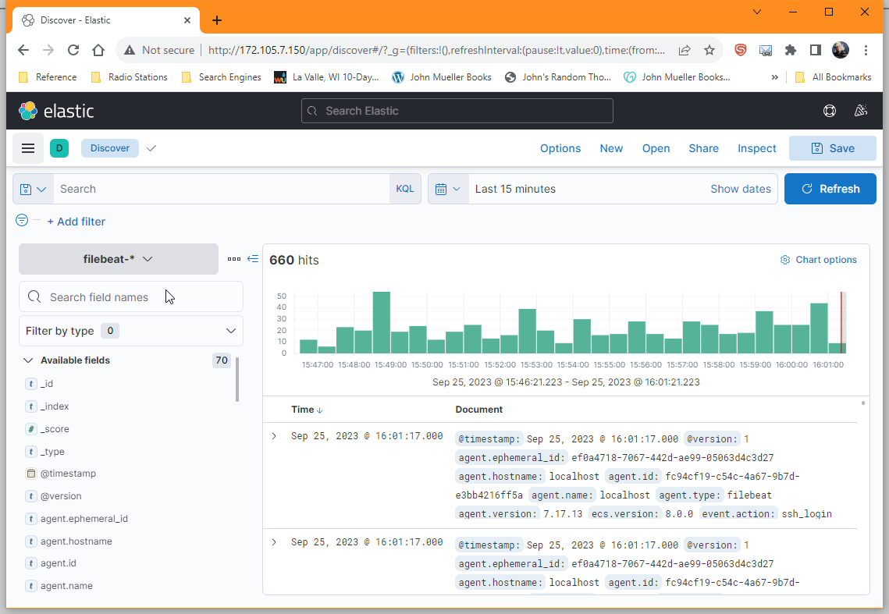

Monitoring your server requires that you look at more than just resource usage or user access. Various kinds of access, future use, environmental conditions, and other factors affect the server as well and are part of managing the server to maintain reliability, security, and scalability. [Beats](https://www.elastic.co/beats/) provides various kinds and levels of monitoring that help you determine how best to manage your servers. Even though Beats mainly monitors servers, you can use it for much more as this guide illustrates.

## What is Beats?

Beats is a product suite that allows you to perform the kind of monitoring needed without a lot of overhead. Instead of trying to wade through a single product containing widgets you don’t want, you get a single product that provides the widgets that you do. Each of these Beats specializes in monitoring a particular area so that you obtain a focus on just that area.

### Filebeat

[Filebeat](https://www.elastic.co/beats/filebeat) isn’t about files, it’s about logs. You use it to perform server log monitoring. The idea is to create a centralized location to manage the logs on your server no matter where those logs are, or which application, or device generates them. These log sources can include security devices, cloud-based applications, containers, hosts, or [Operational Technology (OT)](https://www.cisco.com/c/en/us/solutions/internet-of-things/what-is-ot-vs-it.html). When working with Filebeat understand that it focuses on common log formats and you need to ensure there is a [module](https://www.elastic.co/guide/en/beats/filebeat/current/filebeat-modules.html) available to handle your particular needs. This means that your traditional industrial application that produces custom logs designed to your specifications may not be recognized. On the other hand, Filebeat does work well with Kubernetes and Docker, and may also recognize other containers. When working with a container, you obtain full metadata about the container and its contents, so this is an optimal strategy when you’re working with newer applications or those in development.

### Metricbeat

[Metricbeat](https://www.elastic.co/beats/metricbeat) collects performance data from the various systems in your setup and makes viewing system metrics easier. Platforms, applications, and services normally provide you with statistics, however, you can’t collect statistics that the software doesn’t produce unless you have some means to add them. Metricbeat isn’t a magic bullet that solves all of your statistical problems; it simply collects all of the available statistics in one place so they’re easier to work with. Services that aren’t part of your platform also require special [modules](https://www.elastic.co/guide/en/beats/metricbeat/current/metricbeat-modules.html) to collect, which may mean you can’t collect some statistics even if the software provides them unless you’re willing to write a custom module using Go. When working with containers, you deploy Metricbeat in a separate container that monitors the other containers using the container’s API.

### Packetbeat

[Packetbeat](https://www.elastic.co/beats/packetbeat) is a network traffic analyzer that drills down into network traffic to see patterns in communication. This monitoring tracks data including application latency and errors, response times, [Service Level Agreement (SLA)](https://www.techtarget.com/searchitchannel/definition/service-level-agreement) performance, and user access patterns and trends. You also use Packetbeat for application layer protocol analysis that can include database transactions, key-value stores, HTTP metadata, and low-level protocol information. Creating a pull request allows you to dig deeper into custom data but you can’t use Packetbeat to perform tasks like break encryption to see the data contained in a data stream.

### Auditbeat

[Auditbeat](https://www.elastic.co/beats/auditbeat) is a Linux-specific replacement for [auditd](https://sematext.com/glossary/auditd/). It’s an easier-to-use product than auditd that monitors user activity and processes, analyzes event data, and provides analysis capabilities. You can use existing audit rules so that you don’t have to start from scratch. In addition, some Linux kernels allow side-by-side use of Auditbeat and auditd.

## An Overview of Beats Use Cases

The various Beats products have one thing in common. They collect data. Centralizing data makes it more accessible and easier to compare. When working with the various Beats products, you can combine products to obtain the information you need and ignore what you don’t. This information all ends up in [Elasticsearch](https://www.elastic.co/elasticsearch/). Adding [Logstash](https://www.elastic.co/logstash) to the picture allows you to preprocess the data from disparate sensors that use different data formats so that various kinds of statistical and machine-learning analysis are possible. The stored information appears on a [Kibana](https://www.elastic.co/kibana) dashboard when a graphic form of data interaction is desired.

The new [Elasticsearch Relevance Engine (ESRE)](https://www.elastic.co/elasticsearch/elasticsearch-relevance-engine) makes it possible to look for data patterns when the target of the search isn’t known. For example, you may not actually know that there is a problem with the automation used to produce widgets in your factory, but using ESRE can help you locate patterns that indicate problems are occurring now or occur in the future without remediation. The ability to predict future problems and fix them before they become an issue saves you time and money. This is where the benefit of working with a [Large Language Model (LLM)](https://www.elastic.co/what-is/large-language-models) comes into play. Natural Language Processing (NLP) asks the software questions so that you can monitor and interact with the system creatively without writing code yourself.

Because of the flexibility that this combination of applications provides, it’s best to not see it being used in a specific way. However, the Beats products are currently used in these industries:

- Financial
- Healthcare
- Manufacturing
- Public sector
- Retail and E-commerce
- Technology
- Telecommunications

These industries use often cross-categories. For example, [John Deere](https://www.elastic.co/elasticon/tour/2018/chicago/elastic-at-john-deere) currently relies on Beats products to perform precision farming. This means more than looking at the land or the machinery used to manage the land. Farming entails using processes that span a number of disciplines: Everything from ensuring that the farming data remains safe and untainted to various kinds of animal husbandry. Consequently, it’s not too difficult to imagine that Beats products could help anyone manage just about any kind of data in any sort of industry with the right combination of products and the implementation of specific procedures and processes.

## Run Filebeat from the Command Line and Kibana

To begin using the Beats products, create a simple setup and then experiment with it. Creating a Filebeat command line interface gives you an essential understanding of how the various Beats products work without investing a lot of time in configuration and setup. This section relies on a Linode 4 GB plan on an Ubuntu 22.04 LTS distribution, which is the smallest setup that works. The process works best with a [non-root user who has sudo access](/docs/guides/how-to-add-and-remove-sudo-access-in-ubuntu/). Before installing Filebeat, ensure you have logged in as a non-root user, and you install the following prerequisites:

- [OpenJDK](/docs/guides/how-to-install-openjdk-ubuntu-22-04/): Ensure you install Java 11, as newer versions may not be compatible.
- [Nginx](/docs/guides/how-to-install-and-use-nginx-on-ubuntu-20-04/): Ensure you stop after completing the **Install NGINX** section.
- [Elasticsearch](/docs/guides/a-guide-to-elasticsearch-plugins/#elasticsearch): There have been recent modifications to the standard installation procedure due to changes in the security setup for Ubuntu. Follow the updated command instead for step 1 for installing the signing key:

    ```command
    curl -fsSL https://artifacts.elastic.co/GPG-KEY-elasticsearch |sudo gpg --dearmor -o /usr/share/keyrings/elastic.gpg
    ```

    Because of the change in step 1, you must also change the step 3 command as follows:

    ```command
    echo "deb [signed-by=/usr/share/keyrings/elastic.gpg] https://artifacts.elastic.co/packages/7.x/apt stable main" | sudo tee -a /etc/apt/sources.list.d/elastic-7.x.list.
    ```

### Install Kibana

1.  Install a copy of [Kibana](https://www.elastic.co/kibana) to make working with Filebeat easier:

    ```command
    sudo apt install kibana -y
    ```

1.  Enable the Kibana service:

    ```command
    sudo systemctl enable kibana
    ```

1.  Start the Kibana service:

    ```command
    sudo systemctl start kibana
    ```

1.  Create an administrative user (the example uses `kibanaadmin`) and password using the [apr1 algorithm of OpenSSL](https://www.openssl.org/docs/manmaster/man1/openssl-passwd.html) (Apache variant of the BSD algorithm) and append it to `htpasswd.users`:

    ```command
    echo "kibanaadmin:`openssl passwd -apr1`" | sudo tee -a /etc/nginx/htpasswd.users
    ```

1.  Open the Nginx server block file as part of creating a reverse proxy:

    ```command
    sudo nano /etc/nginx/sites-available/<IP Address of Your Linode>
    ```

1.  Write the Nginx server block file and save it to disk:

    ```file
    server {
      listen 80;

      server_name <IP Address of Your Linode>;

      auth_basic "Restricted Access";
      auth_basic_user_file /etc/nginx/htpasswd.users;

      location / {
          proxy_pass http://localhost:5601;
          proxy_http_version 1.1;
          proxy_set_header Upgrade $http_upgrade;
          proxy_set_header Connection 'upgrade';
          proxy_set_header Host $host;
          proxy_cache_bypass $http_upgrade;
      }
    }
    ```

1.  Create a symbolic link from the sites-available directory to the sites-enabled directory to make the new server active:

    ```command
    sudo ln -s /etc/nginx/sites-available/<IP Address of Your Linode> /etc/nginx/sites-enabled/<IP Address of Your Linode>
    ```

1.  Check the configuration for errors. If the configuration has errors, go back to step 5 to reopen the file and correct the errors:

    ```command
    sudo nginx -t
    ```

1.  Make the new site accessible by reloading the Nginx service:

    ```command
    sudo systemctl reload nginx
    ```

1.  Test Kibana access in your browser. Enter the Kibana administrator name and password created in step 4. The Figure 1 below shows a typical example of the web page you see. The Kibana browser display shows the Kibana status, statistics, and plugin status:

    ```command
    http://<IP Address of Your Linode>/status
    ```

    

### Install Logstash

Install and configure Logstash to enable working with Filebeat.

1.  Install Logstash using the following command:

    ```command
    sudo apt install logstash
    ```

1.  Open a Filebeat-oriented configuration file.

    ```commmand
    sudo nano /etc/logstash/conf.d/02-beats-input.conf
    ```

1.  Add the Beats access port information and save the file:

    ```file {title="/etc/logstash/conf.d/02-beats-input.conf"}
    input {
      beats {
        port => 5044
      }
    }

    ```

1.  Open a configuration file that allows Filebeat to store information in ElasticSearch, which is currently running at `localhost:9200`. Use this same configuration file to enable other Beats package access.

    ```file
    output {
      if [@metadata][pipeline] {
        elasticsearch {
          hosts => ["localhost:9200"]
          manage_template => false
          index => "%{[@metadata][beat]}-%{[@metadata][version]}-%{+YYYY.MM.dd}"
          pipeline => "%{[@metadata][pipeline]}"
        }
      } else {
          elasticsearch {
            hosts => ["localhost:9200"]
            manage_template => false
            index => "%{[@metadata][beat]}-%{[@metadata][version]}-%{+YYYY.MM.dd}"
          }
        }
    }
    ```

1.  Test the Logstash Configuration. If there are configuration errors, go back to step 3 to open the configuration file and fix them. The testing process may take a while to complete but should result in a `Config Validation Result: OK. Exiting Logstash` message at the end.

    ```command
    sudo -u logstash /usr/share/logstash/bin/logstash --path.settings /etc/logstash -t
    ```

1.  Start Logstash using the following command:

    ```command
    sudo systemctl start logstash
    ```

1.  Enable Logstash using the following command:

    ```command
    sudo systemctl enable logstash
    ```

### Install Filebeat

At this point, you can install, configure, and use Filebeat.

1.  Install Filebeat using the following command:

    ```command
    sudo apt install filebeat
    ```

1.  Open the Filebeat configuration file using your preferred editor.

    ```command
    sudo nano /etc/filebeat/filebeat.yml
    ```

1.  Disable direct Elasticsearch interaction by commenting out these lines as shown below:

    ```command
    # ---------------------------- Elasticsearch Output ----------------------------
    #output.elasticsearch:
      # Array of hosts to connect to.
      #hosts: ["localhost:9200"]
    ```

1.  Connect to Logstash by uncommenting these lines as shown below:

    ```command
    # ------------------------------ Logstash Output -------------------------------
    output.logstash:
      # The Logstash hosts
      hosts: ["localhost:5044"]
    ```

1.  Save the Filebeat configuration file and close it.

1.  Enable Filebeat system modules.

    ```command
    sudo filebeat modules enable system
    ```

1.  Configure Filebeat to ingest data:

    ```command
    sudo filebeat setup --pipelines --modules system
    ```

1.  Install the Filebeat index template into Elasticsearch as an Elasticsearch index.

    ```command
    sudo filebeat setup --index-management -E output.logstash.enabled=false -E 'output.elasticsearch.hosts=["localhost:9200"]'
    ```

1.  Disable the Logstash output and enable the Elasticsearch output to activate the Filebeat dashboard.

    ```command
    sudo filebeat setup -E output.logstash.enabled=false -E output.elasticsearch.hosts=['localhost:9200'] -E setup.kibana.host=localhost:5601
    ```

1.  Start Filebeat using the following command:

    ```command
    sudo systemctl start filebeat
    ```

1.  Enable Filebeat to run on startup using the following command:

    ```command
    sudo systemctl enable filebeat
    ```

1.  Test the Filebeat configuration using the following command:

    ```command
    curl -XGET 'http://localhost:9200/filebeat-*/_search?pretty'
    ```

1.  Verify that the output shows that Filebeat is processing data by looking at hits, which should be above 0.

    ```output
    {
      "took" : 36,
      "timed_out" : false,
      "_shards" : {
        "total" : 2,
        "successful" : 2,
        "skipped" : 0,
        "failed" : 0
      },
      "hits" : {
        "total" : {
          "value" : 10000,
          "relation" : "gte"
        },
    ```
### View Filebeat in Kibana

View the Filebeat data in Kibana by visiting the URL, `http://<IP Address of Your Linode>` to display the home page shown in Figure 2. Click the Expand icon and choose **Discover from the list** to show the Filebeat data that appears in Figure 3. The timeline at the top shows the number of file system hits and the time they occurred. You can filter the data in various ways using features like **Available Fields** on the left side of the page.





## Monitor Logs Using Filebeat

Filebeat helps maintain control over server reliability, security, and performance through log monitoring. The files are ingested by Filebeat and the data output in a consistent format as shown in Figure 3.

### Relying on Automatic System Log Detection

Filebeat automatically detects and configures common logs for you as shown in Figure 3. It’s also possible to configure Filebeat to look in specific places for log inputs by adding entries to the [filebeat.inputs section](https://www.elastic.co/guide/en/beats/filebeat/current/configuration-filebeat-options.html) of the `/etc/filebeat/filebeat.yml` file. The paths subsection contains a list of places to look for log files of a specific type. The only configured log input for `Localhost` is of the `filestream` type in `/var/log/*.log`. You can monitor network traffic using the [TCP](https://www.elastic.co/guide/en/beats/filebeat/current/filebeat-input-tcp.html) and [UDP](https://www.elastic.co/guide/en/beats/filebeat/current/filebeat-input-udp.html) types.

### Searching for Specific Data

Something that is immediately apparent is that the Kibana dashboard displays too much information even with a minimal Filebeat configuration. You have three methods of reducing the data to a manageable level:

- **Search**: Display only the information you actually want at the moment using [Kibana Query Language (KQL)](https://www.elastic.co/guide/en/kibana/current/kuery-query.html).
- **Time Window**: Choose a display interval that displays enough information, but compresses it so there aren’t as many entries.
- **Filter by Type**: Display only specific types of information, which allows the discovery of new information without being overwhelmed.

### Interacting with Containers

Filebeat monitors the logs that containerized applications produce. To make this happen, you include a specific kind of `container` input entry in the `filebeat.inputs` section of the `/etc/filebeat/filebeat.yml` file. You must supply the `paths` setting so that Filebeat knows where to look for the container log.

## Check Activity Levels Using Metricbeat

Tracking your servers’ resource use and activity levels helps to determine server health and allows potential problem remediation before the server goes down. As with Filebeat, you can [install Metricbeat](https://www.elastic.co/guide/en/beats/metricbeat/current/metricbeat-installation-configuration.html#install) using a self-managed configuration (see the [Run Filebeat from the Command Line and Kibana](/docs/guides/monitor-server-activities-using-beats/#run-filebeat-from-the-command-line-and-kibana) section of this guide for details). The Metricbeat configuration information resides in the `/etc/metricbeat/metricbeat.yml` file. Metricbeat appears in your Kibana dashboard and you can use the filtering options to select the metrics you want to see.

### Understanding the Kinds of Metrics You Can Collect

Metricbeat collects most, but not all, system metrics by default. The `/etc/metricbeat/modules.d/system.yml` file contains a list of the default metrics and defines which of them are enabled. To change which metrics are monitored, comment or uncomment the requisite line in the metricsets section of the file. Commonly monitored system metrics are:

- `cpu`
- `load`
- `memory`
- `network`
- `process`
- `process_summary`
- `socket_summary`

### Using Modules to Collect Service Metrics

Metricbeat also works with modules so you can work with services. Each module provides its own configuration file where you comment or uncomment entries to disable or enable them. You obtain a list of currently installed modules using the `metricbeat modules list` command. [Configuring modules](https://www.elastic.co/guide/en/beats/metricbeat/current/configuration-metricbeat.html) requires the use of additional commands that are product-specific.

## Ensuring a Secure Environment with Auditbeat

Creating a paper trail of activities on your system helps show patterns that may indicate unwanted actions by actors who access the system. As with Filebeat, you can install Auditbeat as a [self-managed](https://www.elastic.co/guide/en/beats/auditbeat/current/auditbeat-installation-configuration.html#install) application (see the [Run Filebeat from the Command Line and Kibana](/docs/guides/monitor-server-activities-using-beats/#run-filebeat-from-the-command-line-and-kibana) section of this guide). Unlike the other Beats, Auditbeat always relies on modules to determine which information to collect and these modules are platform-specific. To modify the modules that Auditbeat uses, modify the contents of the `/etc/auditbeat/auditbeat.yml` file. Like Metricbeat, Auditbeat requires that you [configure modules individually](https://www.elastic.co/guide/en/beats/auditbeat/current/configuration-auditbeat.html).

### Using Auditbeat as a auditd Replacement

Auditbeat listens to the same input as `auditd` and can convert the rules found in `auditctl` into a format that allows it to perform the same tasks as `auditd`, but with the addition of the functionality that ElasticSearch and Kibana provide. In some cases, [Auditbeat and auditd clash](https://www.elastic.co/guide/en/beats/auditbeat/current/auditbeat-module-auditd.html), so it’s important to perform the required configuration tasks on your system.

### Performing File Integrity Monitoring

One of the most important tasks that Auditbeat can perform is as a file monitor, logging each create, update, or delete. To perform this task, you need to enable the [File Integrity Module](https://www.elastic.co/guide/en/beats/auditbeat/current/auditbeat-module-file_integrity.html) and configure it correctly for your system. This module depends on the underlying platform, so the features it provides vary by platform.

## Conclusion

It pays to simplify the view of a complex product like Beats when you can. What this guide does is create a process that entails: collecting data, shaping that data into a useful form, performing various kinds of analysis on the resulting data, and then looking for patterns. The Beats suite of products helps you perform the required tasks without investing in things like custom software or application developers with special skills.
