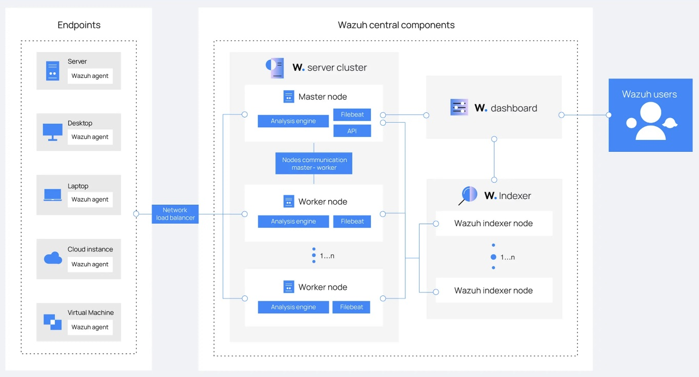
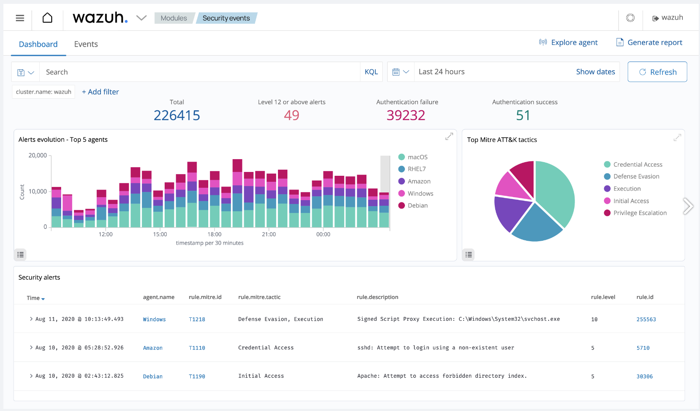

Wazuh is an open-source security platform that offers **unified extended detection and response (XDR)** and **security information and event management (SIEM)** protection for endpoints and cloud workloads.

Wazuh is an efficient way to secure your cloud computing processes, containers, and Kubernetes pods, as well as your client computers and devices. Wazuh can also help you meet government requirements such as PCI DSS, HIPAA, and GDPR, as well as configuration standards such as CIS hardening guides.

## How Does Wazuh Work?

Wazuh performs log data analysis, intrusion and malware detection, file integrity monitoring, configuration assessment, vulnerability detection, and supports regulatory compliance.

As displayed below, The Wazuh platform consists of: agents that monitor endpoints, servers that analyze the logs emitted by agents, indexers, and a dashboard. Wazuh users primarily interact with the dashboard.



## Wazuh Components

### The Wazuh Indexer

The **Wazuh indexer** is a scalable full-text search and analytics engine. It indexes and stores alerts that the Wazuh server generates, and provides near real-time data search and analytics capabilities. You can configure the Wazuh indexer as a single-node or multi-node cluster. It stores data as JSON documents, and its database is sharded.

Wazuh uses four different indices to store different event types: alerts, archives, monitoring, and statistics. You can interact with the Wazuh indexer cluster using the Wazuh indexer REST API.

### The Wazuh Server

The **Wazuh server** is a central component that analyzes the data received from the agents, triggering alerts when threats or anomalies are detected. You can also use it to manage and monitor agent configurations remotely.

The Wazuh server uses threat intelligence sources to improve its detection capabilities. It also enriches alert data by using the MITRE ATT&CK framework and regulatory compliance requirements such as PCI DSS, GDPR, HIPAA, CIS, and NIST 800-53, providing helpful context for security analytics. Additionally, the Wazuh server can be integrated with external software, including ticketing systems and instant messaging platforms.


### The Wazuh Dashboard

The **Wazuh dashboard** provides a web-based interface designed for mining, analyzing, and visualizing data related to: security events, alert data, platform management, and platform monitoring. It encompasses functionalities for role-based access control (RBAC) and single sign-on (SSO).

Wazuh features dashboards for exploring the MITRE ATT&CK framework and associated alerts, fostering enhanced situational awareness and threat analysis.



## How to Install and Configure Wazuh

There are a number of ways to install Wazuh, depending on where you want it to run, what other services you want to use with Wazuh, and the amount of traffic you need to handle:

- Use [our Wazuh Marketplace app](/docs/products/tools/marketplace/guides/wazuh/) for a fast deployment. This option fully deploys in about 15 minutes and requires minimal configuration information.

- Using [Wazuh's Quickstart instructions](https://documentation.wazuh.com/current/quickstart.html#installing-wazuh) along with their installation assistant, you can create an all-in-one, single node deployment. This deploys Wazuh on a single server that can monitor up to 100 endpoints.

  Below are the [Akamai plan types](https://www.linode.com/pricing/) and minimum hardware recommendations for handling various numbers of monitoring agents:

  | Agents       | Akamai Plan Type |
  | ------------ |------------------|
  | 1–25         | Shared, Dedicated, or Premium 8 GB with 4 CPUs |
  | 25–100       | Shared, Dedicated, or Premium 16 GB with 6-8 CPUs |

- For a customizable deployment, you can deploy Wazuh manually across multiple nodes (see [Multi-Node Wazuh Installation](#multi-node-wazuh-installation) below).

- For development environments, you can deploy via [Docker images](https://documentation.wazuh.com/current/deployment-options/docker/index.html#deployment-on-docker).

- For a scalable deployment, you have the option of installing Wazuh on [Kubernetes](https://documentation.wazuh.com/current/deployment-options/deploying-with-kubernetes/index.html#deployment-on-kubernetes').

### Multi-Node Wazuh Installation

For a flexible installation of Wazuh, you can install both the **Wazuh indexer** and **Wazuh server** components manually on a single node or across multiple nodes for a cluster deployment. The **Wazuh dashboard** can be installed on one of your nodes running the Wazuh indexer or on a separate node.

During manual installation, components should be installed in the following order on one or more nodes:

- The Wazuh indexer
- The Wazuh server
- The Wazuh dashboard

Once all the components are installed, you can install individual **Wazuh agents** on the servers, computers, or other devices you wish to monitor or protect.


While all services can be installed using step-by-step instructions, this guide uses Wazuh's installation assistant to install each component.


Follow the steps below to install Wazuh manually starting with the Wazuh indexer:

1. Prior to installing each component, create any Compute Instances you wish to serve as individual nodes and save their IP addresses. See Wazuh's documentation for hardware recommendations for nodes running the [Wazuh indexer](https://documentation.wazuh.com/current/installation-guide/wazuh-indexer/index.html#hardware-recommendations) and nodes running the [Wazuh server](https://documentation.wazuh.com/current/installation-guide/wazuh-server/index.html#hardware-requirements).

    Wazuh recommends the following distributions for installation: Red Hat Enterprise Linux 7, 8, 9; CentOS 7, 8; Amazon Linux 2; Ubuntu 16.04, 18.04, 20.04, 22.04

1. Once all of your nodes have been created, proceed by downloading the Wazuh installation assistant and the configuration file to a machine running one of the above operating systems. Note that installation requires root user access:

    ```command
    curl -sO https://packages.wazuh.com/4.7/wazuh-install.sh
    curl -sO https://packages.wazuh.com/4.7/config.yml
    ```

1. Using a text editor, edit the `config.yml` file and replace the placeholders with names of your nodes along with their corresponding IP addresses. This must be done for each Wazuh indexer, Wazuh server, and Wazuh dashboard nodes:

    ```file
    nodes:
      # Wazuh indexer nodes
      indexer:
        - name: node-1
          ip: "<indexer-node-ip>"
        #- name: node-2
        #  ip: "<indexer-node-ip>"
        #- name: node-3
        #  ip: "<indexer-node-ip>"

      # Wazuh server nodes
      # If there is more than one Wazuh server
      # node, each one must have a node_type
      server:
        - name: wazuh-1
          ip: "<wazuh-manager-ip>"
        #  node_type: master
        #- name: wazuh-2
        #  ip: "<wazuh-manager-ip>"
        #  node_type: worker
        #- name: wazuh-3
        #  ip: "<wazuh-manager-ip>"
        #  node_type: worker

      # Wazuh dashboard nodes
      dashboard:
        - name: dashboard
          ip: "<dashboard-node-ip>"
    ```

    
    When specifying the names of your nodes, it can be helpful to use the same names as your corresponding Compute Instances.
    

1. After editing your config file, execute the assistant with the `--generate-config-files` option to generate the Wazuh cluster key, certificates, and passwords necessary for installation. When running the installation script, you may need to use the `-i` option to ignore hardware system checks if you are using a distribution not recommended by Wazuh:

    ```command
    bash wazuh-install.sh --generate-config-files
    ```

    You can find the generated files in the `./wazuh-install-files.tar` archive.

1. Copy your `wazuh-install-files.tar` archive to all nodes in your deployment, including the Wazuh server, the Wazuh indexer, and the Wazuh dashboard nodes using the `scp` utility. Replace  with the IP of the node to which you are copying your `.tar` file:

    ```command
    scp wazuh-install-files.tar root@:root
    ```

1. If you haven't done so already, proceed to download the installation assistant on the node or nodes you designated for the [Wazuh indexer](https://documentation.wazuh.com/current/installation-guide/wazuh-indexer/installation-assistant.html):

    ```command
    curl -sO https://packages.wazuh.com/4.7/wazuh-install.sh
    ```

1. Execute the installation assistant with the `--wazuh-indexer` flag on each node. When specifying a name for the node (i.e. ), make sure it matches the name you used in your `config.yml` file in step 3:

    ```command
    bash wazuh-install.sh --wazuh-indexer 
    ```

1. On one of the nodes, rerun the installation script, this time adding the `--start-cluster` flag. This initiates the cluster:

    ```command
    bash wazuh-install.sh --start-cluster
    ```

Repeat steps 6 and 7 for the [Wazuh server](https://documentation.wazuh.com/current/installation-guide/wazuh-server/installation-assistant.html#installing-the-wazuh-server-using-the-assistant) and [Wazuh dashboard](https://documentation.wazuh.com/current/installation-guide/wazuh-dashboard/installation-assistant.html#installing-the-wazuh-dashboard-using-the-assistant) nodes, replacing the `--wazuh-indexer` flag with the `--wazuh-server` and `--wazuh-dashboard` flags and their respective node names. Remember that the Wazuh dashboard only needs to be installed on a single node.

To access the Wazuh interface in your browser, navigate to `https://`, replacing  with the IP of the node where you installed the Wazuh dashboard. Use the login credentials that were generated as output during the dashboard installation.

Once complete, install the [Wazuh agents](https://documentation.wazuh.com/current/installation-guide/wazuh-agent/index.html#wazuh-agent) on the endpoints you wish to monitor and protect. If you have a substantial number of endpoints, consider utilizing an automation tool such as Puppet, Chef, SCCM, or Ansible for agent deployment.

## Use Case Configuration

There are many different Wazuh use cases that require specific configurations, including blocking known malicious actors, detecting brute-force attacks, and more. See Wazuh's documentation on use cases, endpoint security options, and their respective configurations:

- [Wazuh Proof of Concept Guide](https://documentation.wazuh.com/current/proof-of-concept-guide/index.html)