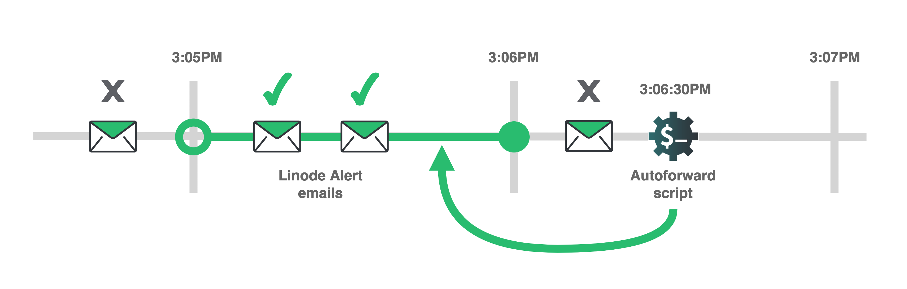

By default, Linode sends system notifications via email. For example, email notifications are delivered when Linode Compute Instances are rebooted, when they receive hardware maintenance, and when they exceed a CPU usage threshold. You may also want to receive these notifications via text message. This guide shows how to set up a custom script that auto-forwards email notifications to text message.

The auto-forwarding system leverages the API of Twilio, a cloud communications service, along with the POP protocol for email. The instructions in this guide focus on how to parse Linode email notifications, but they could be adapted to email from other services as well.


## In this Guide

- In the [Forward an Email to Text Message](#forward-an-email-to-text-message) section, a script is created that focuses on the fundamentals of parsing email in Python and how to interact with the Twilio API. This includes:

    - Fetching an email's contents with poplib

    - Parsing the contents with the Python email module

    - Using the `messages.create()` endpoint of the Twilio API client.

- In the [Auto-Forward Email to Text Message](#auto-forward-email-to-text-message) section, the script is updated to run periodically and check for all Linode system notification emails since the last time the script ran.

- In the [Search Email by Subject with Poplib](#search-email-by-subject-with-poplib) section, the script is updated to only forward emails that match a keyword in the emails' subject. This allows you to limit forwarding to specific kinds of notifications.


## Before You Begin

1. This guide shows how to set up the email-to-text forwarding system on a Linode instance. A Linode instance is used because it can remain powered on at all times.

    If you want to implement the notification system, [create a Linode in the Cloud Manager](/docs/products/compute/shared-cpu/get-started/). The lowest cost Shared CPU instance type is appropriate for this guide. If you already have a Linode instance that you want to set up the notification system on, you can use that instead of a new instance. This guide was tested with Ubuntu 20.04, but should also work with other Linux distributions and versions.

    After you create your Linode, follow our [Securing your Server](/docs/guides/set-up-and-secure/) guide to reduce the threat of a system compromise. Specifically, make sure you [Add a Limited User Account](/docs/guides/set-up-and-secure/#add-a-limited-user-account) to the Linode. The notification system in this guide should be installed under a limited Linux user.

1.  Another guide in our library, [How to Use the Linode API with Twilio](/docs/guides/how-to-use-the-linode-api-with-twilio/), shows the prerequisite steps for using the Twilio API. Follow this guide, starting with its [Before You Begin](/docs/guides/how-to-use-the-linode-api-with-twilio/#before-you-begin) section, up to and including the [Install the Twilio Python Helper Library](/docs/guides/how-to-use-the-linode-api-with-twilio/#install-the-twilio-python-helper-library) section.

    The guide instructs you to install the Twilio API client for Python. When following these instructions, run the commands under the limited Linux user on your Linode instance.

1. This guide instructs you to create a Python script from within an SSH session on your Linode. You need to install and use a terminal text editor to write the script on your Linode. Common text editors include [nano](/docs/guides/use-nano-to-edit-files-in-linux/) (the easiest option for terminal beginners), [emacs](https://www.gnu.org/software/emacs/), and [vim](https://www.vim.org/).

1. Your email service needs to support POP, and support for POP may need to be manually enabled. For example, [Gmail has an option to turn on POP access in its settings](https://support.google.com/mail/answer/7104828).


## Forward an Email to Text Message

This section provides a code example that connects to an email server with POP. The example retrieves a list of mail IDs from an email server with POP. It then shows how to fetch and parse the most recent Linode system notification email. The parsed information from the email is delivered in a text message via the Twilio API.

The script in this section is updated in the next section to incorporate auto-forwarding behavior.

### Import Modules and Initialize Service Credentials

1. Log into your Linode under your limited Linux user [using SSH](/docs/guides/connect-to-server-over-ssh/).

1. Create a new file named `forward-last-email-to-text-message.py` with your preferred terminal text editor. For example, when using `nano`, run:

        nano forward-last-email-to-text-message.py

1. Copy this snippet into the file:

    
import os
import sys
import poplib
import email
from twilio.rest import Client

try:
    twilio_account_sid = os.environ['TWILIO_ACCOUNT_SID']
    twilio_auth_token = os.environ['TWILIO_AUTH_TOKEN']
    twilio_from_phone_number = os.environ['TWILIO_FROM_PHONE_NUMBER']
    twilio_to_phone_number = os.environ['TWILIO_TO_PHONE_NUMBER']
    email_username = os.environ['EMAIL_USERNAME']
    email_password = os.environ['EMAIL_PASSWORD']
    email_server = os.environ['EMAIL_SERVER']
except KeyError:
    print("Please ensure that the following environment variables are set when running the script: ")
    print("TWILIO_ACCOUNT_SID")
    print("TWILIO_AUTH_TOKEN")
    print("TWILIO_FROM_PHONE_NUMBER")
    print("TWILIO_TO_PHONE_NUMBER")
    print("EMAIL_USERNAME")
    print("EMAIL_PASSWORD")
    print("EMAIL_SERVER")
    sys.exit(1)


    
This code imports several modules that are used later in the code:

- The `os` module, which can be used to read environment variables from your terminal. The module is used in the `try` block to load your API tokens, Twilio phone numbers, and email POP email server credentials. A later section in this guide shows how to set those environment variables before running the script.

    Alternatively, you could directly list the token and phone number values in the script. However, it's a good practice to avoid doing this. For example, if you listed your secrets inside the code and then uploaded your code to a public code repository like GitHub, they would be publicly visible.

    The `except KeyError` statement is executed if any of the environment variables are not set. A message is printed in the console that tells you which variables are expected by the script. The `sys` module an the `sys.exit()` method immediately exits the script in this case.

- [The `poplib` module](https://docs.python.org/3/library/poplib.html) is used to connect to a POP server, and [the `email` module](https://docs.python.org/3/library/email.html#module-email) is used to parse email messages. These are used in a later section in this guide.

- [The `twilio` module](https://www.twilio.com/docs/libraries/python) is used to interact with the Twilio API. This is used in a later section in this guide.


### Create the Twilio API Python Client

Copy and paste the code from this snippet to the bottom of your script:


# copy and paste to bottom of file:

twilio_client = Client(twilio_account_sid, twilio_auth_token)


This line creates a new client object that can interact with the Twilio API.

### Log into the POP Server with Poplib

Copy and paste the code from this snippet to the bottom of your script:


# copy and paste to bottom of file:

mail = poplib.POP3_SSL(email_server)
mail.user(email_username)
mail.pass_(email_password)



- The first line [configures a secure connection](https://docs.python.org/3/library/poplib.html#poplib.POP3_SSL) to your email server.

- The second line [specifies which user is connecting to the server](https://docs.python.org/3/library/poplib.html#poplib.POP3.user).

- The third line [sends the password to the server](https://docs.python.org/3/library/poplib.html#poplib.POP3.pass_), which establishes an authenticated connection.


### List Mail IDs with Poplib

Copy and paste the code from this snippet to the bottom of your script:


# copy and paste to bottom of file:

pop_list_response, pop_list_data, pop_list_size = mail.list()
num_messages = len(pop_list_data)
if num_messages == 0:
    print("No email retrieved by poplib.")
    sys.exit(0)



- Line 3 [retrieves a list of messages from the server](https://docs.python.org/3/library/poplib.html#poplib.POP3.list). The `list()` method sends the [`LIST` POP command](https://datatracker.ietf.org/doc/html/rfc1939#page-6) to the server and returns a tuple:

    1. The first member of the tuple (assigned to `pop_list_response`) is a byte string that contains a response status from the server. The string shows how many emails are on the server, and the total size of those emails. Here's an example response status:

        ```
        b'+OK 5 messages (80000 bytes)'
        ```

    1. The second member of the tuple (assigned to `pop_list_data`) is an array of byte strings. Each string contains a mail ID and the corresponding sizes of that email. Here's an example array:

        ```
        [b'1 10000', b'2 15000', b'3 10000', b'4 20000', b'5 25000']
        ```

        In this example, the sizes for each email adds up to the size in the example response message (80000 bytes). Note that the mail IDs start from an index of 1 (not 0). They follow the sequence 0, 1, 2, 3, 4, 5, and so on. ID 1 represents the oldest email on the server, and the emails in the array are ordered oldest to most recent.

    1. The third member of the tuple (assigned to `pop_list_size`) is a string that contains the total size of the server's response to the `LIST` command that follows the initial status message. This is equal to the sum of the size of the strings in the array in the second element of the tuple.

        Note that the server's response contains a `\r\n` character sequence at the end of those strings, and the size figure includes those characters. For example, the array in our example `pop_list_data` has five strings with 9 characters each. With the `\r\n` sequence in each string in the original response, each string is 11 characters long. So, the total in `pop_list_size` in this example would be `5 * 11 bytes`, or 55 bytes.

- Line 4 finds the length of the mail array, which is equal to the number of messages on the server.

- Lines 5-7 make sure that at least one email is available on the server. The script exits early if none are found.


### Fetch Email with Poplib

Copy and paste the code from this snippet to the bottom of your script:


# copy and paste to bottom of file:

message_text = ""
for i in range(num_messages):
    mail_id = num_messages - i
    pop_retr_response, pop_retr_data, pop_retr_size = mail.retr(mail_id)



- Line 3 initiates a string variable named `message_text`. This variable represents the contents of the text message that is sent later in the script. This string is populated with contents from a Linode Alert email in the next section.

- Lines 4-5 start a loop through the mail IDs on the email server. Line 5 subtracts the loop index `i` from the number of messages, which means that the loop iterates through the emails in reverse order, from newest to oldest.

- Line 6 [fetches the contents](https://docs.python.org/3/library/poplib.html#poplib.POP3.retr) of an email. An email ID is passed to the `retr()` method. This method sends the [`RETR` POP command](https://datatracker.ietf.org/doc/html/rfc1939#page-8) to the server and returns a tuple:

    1. The first member of the tuple (assigned to `pop_retr_response`) is a byte string that contains a response status from the server. Here's an example response status:

        ```
        b'+OK message follows'
        ```

    1. The second member of the tuple (assigned to `pop_retr_data`) is an array of byte strings. Each string represents a line in the contents of the email. Here's an example array:

        ```
        [b'Delivered-To: youremail@emaildomain.com',
        b'Received: ',
        b'X-Google-Smtp-Source: ',
        b'X-Received: ',
        b'ARC-Seal: ',
        b'ARC-Message-Signature: ',
        b'ARC-Authentication-Results: ',
        b'Return-Path: <noreply@linode.com>',
        b'Received: ',
        b'Received-SPF: ',
        b'Authentication-Results: ',
        b'Date: Tue, 7 Dec 2021 12:45:10 -0500 (EST)',
        b'DKIM-Signature: ',
        b'From: Linode Alerts <noreply@linode.com>',
        b'To: youremail@emaildomain.com',
        b'Message-ID: ',
        b'Subject: Linode Events Notification - yourlinodeusername',
        b'MIME-Version: 1.0',
        b'Content-Type: text/plain; charset=UTF-8',
        b'Content-Transfer-Encoding: 7bit',
        b'X-Mailer: ',
        b'',
        b'Hello yourlinodeusername! The following activity has recently occurred:',
        b'',
        b' * example-linode-instance - (100000001) System Shutdown - Completed Tue, 7 Dec 2021 17:35:20 GMT',
        b' * example-linode-instance - (100000002) System Boot - My Ubuntu 20.04 LTS Profile Completed Tue, 7 Dec 2021 17:35:32 GMT',
        b'',
        b'You can change your notification settings via https://cloud.linode.com/profile.',
        b'',
        b'---',
        b'',
        b'Reduce Deployment Times with Custom Images - https://www.linode.com/products/images/',
        b'Durable File Storage with S3-Compatible Object Storage - https://www.linode.com/products/object-storage/ ']
        ```

        Note that newlines have been inserted between each element of the array for better readability. As well, some of the header elements have been redacted.

    1. The third member of the tuple (assigned to `pop_retr_size`) is a string that contains the total size of the server's response to the `RETR` command.


### Parse Email with the Python Email Module

Copy and paste the code from this snippet to the bottom of your script. Make sure that it is indented so that it falls inside of the for-loop of the previous section:


# copy and paste to bottom of file, indented within for loop scope:

    email_as_string = b'\n'.join(pop_retr_data)
    parsed_email = email.message_from_bytes(email_as_string)

    email_from = parsed_email['from']
    if email_from == 'Linode Alerts <noreply@linode.com>':
        email_subject = parsed_email['subject']
        email_body = parsed_email.get_payload()
        message_text = 'New notification from Linode Alerts:\n\n' \
            'Message subject: \n%s\n\n' \
            'Message body: \n%s\n' % \
            (email_subject,
            email_body)
        break



This section of code parses the `pop_retr_data` array returned by the `retr()` method in the previous section. The code parses this array as follows:

- Lines 3 joins the array of strings into a single string, using the newline character between each string. The result is an [RFC-822](https://datatracker.ietf.org/doc/html/rfc822) formatted email.

- Line 4: to parse the information in the email headers and body, the [`email` module](https://docs.python.org/3/library/email.html) is used. The [`message_from_bytes` method in this module](https://docs.python.org/3/library/email.parser.html#email.message_from_bytes) parses the RFC-822 formatted email and returns an [email.message.Message object](https://docs.python.org/3/library/email.compat32-message.html#email.message.Message).

- Line 6: The Message object has a dictionary interface that can be used to query for different headers in the email. This interface is used to get the from address of the email.

- Line 7 checks to see if email is from the Linode events notification address. If it is, the next lines prepare the body of the text message.

- Line 8 uses the dictionary interface of the Message object to get the subject of the email.

- Line 9: The Message object has a [`get_payload` method](https://docs.python.org/3/library/email.compat32-message.html#email.message.Message.get_payload) that returns the content of the email. For emails that are *not* [multipart](https://en.wikipedia.org/wiki/MIME#Multipart_messages), this returns a string. Linode Alert emails are not multipart and consist of plain text. For multipart emails, this method returns a list of child Message objects. This is more complicated to parse, and is outside the scope of this guide.

- Lines 10-14 composes the message body that is sent via text message in the next section. The `\n` character sequence appears in this string. These characters [insert newlines in the message](https://support.twilio.com/hc/en-us/articles/223181468-How-do-I-Add-a-Line-Break-in-my-SMS-or-MMS-Message-).

- Line 15: This code example only forwards the most recent Linode Alert email. Because one was found, the `break` statement is used to exit the loop.


### Create and Send a Text Message with Twilio

1. Copy and paste the code from this snippet to the bottom of your script:

    
# copy and paste to bottom of file:

mail.close()

if message_text == "":
    print("No Linode Alert emails found.")
    sys.exit(0)

message = twilio_client.messages.create(
    body = message_text,
    from_ = twilio_from_phone_number,
    to = twilio_to_phone_number
)

print("Twilio message created with ID: %s" % (message.sid))


    
- Line 3 closes the connection to the email server.

- Lines 5-7 check to see if the `message_text` variable was populated with information from a Linode Alert email. If the string is still empty, then no such email was found on the server, and the script exits.

- Lines 10-13 sets up the text message notification:

    - The `create` method tells the Twilio API to create *and* immediately send a new text message:

    - The text string composed in the last section is used as the body of the message.

    - The `from_` phone number corresponds to the new number that you selected in the Twilio console earlier in the guide.

    - The `to` number corresponds with your personal or testing phone number that you signed up to Twilio with.

- Line 15: The `create` method returns a reference to the Twilio [message resource](https://www.twilio.com/docs/sms/api/message-resource) that was created. This last line prints the unique ID of the message to your console.


1. After appending the above snippet, save the file and exit your text editor.

    
The code example is now complete. Your script should now look like the code in [this file](forward-last-email-to-text-message.py).


### Run the Code

1. Before you run the script, set the [environment variables](/docs/guides/how-to-set-linux-environment-variables/) that the script expects in your terminal. In your SSH session with your Linode, run the following commands. After the `=` symbol in each command, insert the corresponding value:

        export TWILIO_ACCOUNT_SID=
        export TWILIO_AUTH_TOKEN=
        export TWILIO_FROM_PHONE_NUMBER=
        export TWILIO_TO_PHONE_NUMBER=
        export EMAIL_USERNAME=
        export EMAIL_PASSWORD=
        export EMAIL_SERVER=

    For example, the filled-in commands could look like:

    
export TWILIO_ACCOUNT_SID=96af3vrYKQG6hrcYCC743mR27XhBzXb8wQ
export TWILIO_AUTH_TOKEN=LD9NWYXZzp3d3k7Mq7ME6L8QJJ8zu73r
export TWILIO_FROM_PHONE_NUMBER=+122233344444
export TWILIO_TO_PHONE_NUMBER=+15556667777
export EMAIL_USERNAME=youremail@yourdomain.com
export EMAIL_PASSWORD=bKfoAoV8Awo8e9CVTFTYKEdo
export EMAIL_SERVER=pop.yourdomain.com


    The values for each variable are as follows:

    | Variable | Value |
    |----------|-------|
    | TWILIO_ACCOUNT_SID | The Twilio account SID [located in your Twilio console](/docs/guides/how-to-use-the-linode-api-with-twilio/#locate-your-twilio-api-credentials) |
    | TWILIO_AUTH_TOKEN | The Twilio auth token [located in your Twilio console](/docs/guides/how-to-use-the-linode-api-with-twilio/#locate-your-twilio-api-credentials). The phone number needs to be entered using [E.164](https://www.twilio.com/docs/glossary/what-e164) formatting. |
    | TWILIO_FROM_PHONE_NUMBER | The new number that you selected in the Twilio console [when you first signed up](/docs/guides/how-to-use-the-linode-api-with-twilio/#sign-up-for-twilio) |
    | TWILIO_TO_PHONE_NUMBER | Your personal or testing phone number that you signed up to Twilio with. The phone number needs to be entered using [E.164](https://www.twilio.com/docs/glossary/what-e164) formatting. |
    | EMAIL_USERNAME | Your email address. |
    | EMAIL_PASSWORD | Your password for your email. Note that some services may require you to create an app-specific password for the POP connection. For example, [Google requires you to create an app-specific password](https://support.google.com/accounts/answer/185833) if you use 2-step verification/2FA on your account. |
    | EMAIL_SERVER | The server you should connect to. Check with your email service for the correct value. For Gmail, `pop.gmail.com` is used. |

    
If you're a Gmail user, it's recommended that you use Gmail's [*recent mode*](https://support.google.com/a/answer/6089246?hl=en#zippy=%2Chow-does-normal-mode-work%2Chow-does-recent-mode-work) for POP. Otherwise, the script may not download the most recent emails in your account. To use this mode prefix your `EMAIL_USERNAME` with `recent:`.

For example, if your email address is `youremail@yourdomain.com`, then set `EMAIL_USERNAME` to `recent:youremail@yourdomain.com`.


1. Run the script:

        python3 forward-last-email-to-text-message.py

    If successful, the script generates output like the following:

    
Twilio message created with ID: 9FKgk3Vokgx4hVC4937nx2kAraiG7qXDx8


    A few moments later, you should receive a text message similar to:

    
Sent from your Twilio trial account - New notification from Linode Alerts:

Message subject:
Linode Events Notification - yourlinodeusername

Message body:
Hello yourlinodeusername! The following activity has recently occurred:

 * example-linode-instance - (100000001) System Shutdown - Completed Tue, 7 Dec 2021 17:35:20 GMT
 * example-linode-instance - (100000002) System Boot - My Ubuntu 20.04 LTS Profile - Completed Tue, 7 Dec 2021 17:35:32 GMT

You can change your notification settings via https://cloud.linode.com/profile.

---

Reduce Deployment Times with Custom Images - https://www.linode.com/products/images/
Durable File Storage with S3-Compatible Object Storage - https://www.linode.com/products/object-storage/


    If you receive an error message when you run the script, review the [Troubleshooting](#troubleshooting) section.

1. If you have not previously received an email from Linode Alerts, you can generate a new one by performing certain actions in the Cloud Manager. For example, if you reboot your Linode, a new Linode Event Notification email is sent after a few minutes. After receiving this email, re-run the script to verify that it works.


## Auto-Forward Email to Text Message

The code example from the last section sends the most recent Linode Alert email as a text message when you run the script. This section shows how to automatically deliver a text message whenever a new email is received, without having to manually run the script.

This auto-forwarding system has two parts:

- The example code is [updated to forward multiple recent Linode Alert emails](#forward-all-linode-alert-emails-within-last-minute), instead of stopping after the most recent email is found. Specifically, it fetches the content for any Linode Alert email from the previous minute and forwards it to Twilio.

- A [cron](/docs/guides/schedule-tasks-with-cron/) job is created to run the script every minute. This means that every time the script is run, it checks for emails that have been received since the last time the script was run.

The updated example code looks for email in the last full minute prior to when the script is run. The example code does *not* check for email in the 60 seconds that preceded the script's execution time. Consider this example:



- The script is run at 3:06:30PM (i.e. 30 seconds past 3:06PM).

- When run at this time, the script forwards to text message any Linode Alert emails it finds between 3:05:01 and 3:06:00. In the diagram above, the open circle at 3:05PM indicates that 3:05:00PM is not included in this interval. The closed circle at 3:06PM indicates that 3:06:00PM is included in the interval.

- If an email arrived at 3:04:45PM, it is retrieved from the email server by the script. Because it is older than the script's timing interval, it is not forwarded to text.

- If an email arrived at 3:06:15PM, it is retrieved from the email server by the script. However, it is not within the full minute that preceded the script's execution, so it is not forwarded to text.


The code is written in this way because cron jobs are not guaranteed to run at exactly the time they are scheduled. For example, a job that is scheduled every minute might run at 6 seconds past the minute at one iteration, and 9 seconds past the minute the next time. The amount of load that a system is under can affect this timing.

If the code only checked the 60 seconds prior to the script execution time, then some emails may be missed as a result of inconsistent timing. By standardizing the interval for every script run, all emails should be intercepted over time.


### Forward All Linode Alert Emails within Last Minute

1. In your SSH session with your Linode, create a new file named `autoforward-email-to-text-message.py` with your preferred terminal text editor. For example, when using `nano`, run:

        nano autoforward-email-to-text-message.py

1. Copy this snippet into the file. Then, save the file and exit your text editor.

    
import os
import sys
import poplib
import email
import datetime
from twilio.rest import Client

try:
    twilio_account_sid = os.environ['TWILIO_ACCOUNT_SID']
    twilio_auth_token = os.environ['TWILIO_AUTH_TOKEN']
    twilio_from_phone_number = os.environ['TWILIO_FROM_PHONE_NUMBER']
    twilio_to_phone_number = os.environ['TWILIO_TO_PHONE_NUMBER']
    email_username = os.environ['EMAIL_USERNAME']
    email_password = os.environ['EMAIL_PASSWORD']
    email_server = os.environ['EMAIL_SERVER']
except KeyError:
    print("Please ensure that the following environment variables are set when running the script: ")
    print("TWILIO_ACCOUNT_SID")
    print("TWILIO_AUTH_TOKEN")
    print("TWILIO_FROM_PHONE_NUMBER")
    print("TWILIO_TO_PHONE_NUMBER")
    print("EMAIL_USERNAME")
    print("EMAIL_PASSWORD")
    print("EMAIL_SERVER")
    sys.exit(1)

twilio_client = Client(twilio_account_sid, twilio_auth_token)

mail = poplib.POP3_SSL(email_server)
mail.user(email_username)
mail.pass_(email_password)

pop_list_response, pop_list_data, pop_list_size = mail.list()
num_messages = len(pop_list_data)
if num_messages == 0:
    print("No email retrieved by poplib.")
    sys.exit(0)

def send_message(message_text):
    message = twilio_client.messages.create(
        body = message_text,
        from_ = twilio_from_phone_number,
        to = twilio_to_phone_number
    )

    print("Twilio message created with ID: %s" % (message.sid))

end_of_email_interval_datetime = datetime.datetime.now().replace(second=0, microsecond=0)
end_of_email_interval_timestamp = end_of_email_interval_datetime.timestamp()
EMAIL_INTERVAL_LENGTH_IN_SECONDS = 60

for i in range(num_messages):
    mail_id = num_messages - i
    pop_retr_response, pop_retr_data, pop_retr_size = mail.retr(mail_id)
    email_as_string = b'\n'.join(pop_retr_data)
    parsed_email = email.message_from_bytes(email_as_string)

    received_header = parsed_email['received']
    try:
        received_header_parts = received_header.split('\n')
        email_received_datestring = received_header_parts[-1].strip(' \t')
        email_received_datetuple = email.utils.parsedate_tz(email_received_datestring)
        email_received_timestamp = email.utils.mktime_tz(email_received_datetuple)
    except:
        print("Could not parse date from received header for email:")
        print("From: %s" % parsed_email['from'])
        print("Subject: %s" % parsed_email['subject'])
        print("Date: %s" % parsed_email['date'])
        print("Received header: %s\n" % received_header)
        continue

    email_age = end_of_email_interval_timestamp - email_received_timestamp
    if email_age >= EMAIL_INTERVAL_LENGTH_IN_SECONDS:
        break
    if email_age < 0:
        continue

    email_from = parsed_email['from']
    if email_from == 'Linode Alerts <noreply@linode.com>':
        email_subject = parsed_email['subject']
        email_body = parsed_email.get_payload()
        message_text = 'New notification from Linode Alerts:\n\n' \
            'Message subject: \n%s\n\n' \
            'Message body: \n%s\n' % \
            (email_subject,
            email_body)
        send_message(message_text)

mail.close()



The example code is similar to the code from the previous section. The updated lines of code are:

- On line 5, the [`datetime` module](https://docs.python.org/3/library/datetime.html) is imported. This is used later in the code to search for email by date.

- Lines 39-46 create a `send_message` function that handles the creation of text messages with the Twilio API. This function accepts the message body text that should be sent.

- Lines 48-50 set up the interval of time that the script forwards Linode Alert emails from. Line 48 gets the end of the full minute window that precedes the script's execution time. Line 49 converts the datetime object from line 48 to a [Unix timestamp](https://en.wikipedia.org/wiki/Unix_time). Line 50 sets the length of the interval.

- Lines 58-63 parse the date the email was received by the server. Parsing the date in the `Received` header is more complex than parsing the date in the `Date` header of the email. The `Date` header only contains an [RFC-822 formatted datetime](https://datatracker.ietf.org/doc/html/rfc822#section-5). The `Received` header contains an RFC-822 date, and it contains other information about the email server. As well, there is no standard format for `Received` headers, so they vary between different email servers.

    The `Received` header is used because a POP connection orders emails by the date they were received by the server. As well, the date in the `Date` header can be much older than the date in the `Received` header. For example, a user's email client may hold a message in their outbox for a long period of time before sending it. In this case, the `Date` header may not be updated when the email is sent.

    This loop does not iterate over every email on your server, because there may be many thousands of messages. Instead, the loop is halted after an email is found that is older than the script's one-minute interval. If the `Date` header was used to halt the loop, a delayed email could stop the loop too soon. For example, a delayed email that was received by the server during the interval may have arrived later than a Linode Alert email.

    This guide assumes that the `Received` header has this form:

    ```
    Received: by 0:0:0:0:0:0:0:0 with SMTP id s76abnXMy7fxR9;
        Tue, 7 Dec 2021 12:45:10 -0500 (EST)
    ```

    - Line 58 retrieves the `Received` header. Note that an email usually has multiple `Received` headers, one for each email server that relayed the message. The `Received` headers in the email are generally ordered newest to oldest. The header returned by `parsed_email['received']` is the first `Received` header, which corresponds to your email server.

    - The example received header spans two lines. Line 60 splits the two lines into an array of two strings.

    - Line 61: The last (or second) element of the array is stripped of whitespace, leaving just the RFC-822 datetime string.

    - Line 62: The [parsedate_tz](https://docs.python.org/3/library/email.utils.html#email.utils.parsedate_tz) method of the Python email module is used to convert the datetime string to a 10-tuple representing the datetime that preserves timezone information.

    - Line 63: The [mktime_tz](https://docs.python.org/3/library/email.utils.html#email.utils.mktime_tz) method of the Python email module accepts the 10-tuple datetime and returns a [datetime.datetime object](https://docs.python.org/3/library/datetime.html#datetime.datetime).

- Lines 64-70 are executed if the code that parses the received date generates any errors. In this case, information about the email is printed to your terminal and the `continue` statement is used to skip that email in the loop.

- Line 72 computes how old the email is in relation to the end of the script's interval.

- Lines 73-74 checks if the email is older than the script's interval. If it is, the loop is broken. The loop breaks here so your entire email list is not processed each time the script is run.

- Lines 75-76 check to see if the email is newer than the script's interval. This can occur if an email was received between the script's interval and when the script is run. In this case, the `continue` statement is used to skip this email.


### Set Up a Cron Job

[Cron](/docs/guides/schedule-tasks-with-cron/) is a Linux tool that runs processes at different scheduled times that you specify. Follow these instructions to set up a cron job for the new script:

1. In your SSH session, start the *crontab* editor:

        crontab -e

1. A text file appears in your text editor. This file has some commented-out lines (which begin with `# `) that tell you to set up a new scheduled task in the file. Below these comments, copy and paste the following lines:

    
TWILIO_ACCOUNT_SID=
TWILIO_AUTH_TOKEN=
TWILIO_FROM_PHONE_NUMBER=
TWILIO_TO_PHONE_NUMBER=
EMAIL_USERNAME=
EMAIL_PASSWORD=
EMAIL_SERVER=

* * * * * python3 /home/exampleuser/autoforward-email-to-text-message.py


    The first seven lines define your environment variables. The last line represents the scheduled task. The `* * * * *` at the start of the line represents when the task should run. Specifically, this string says that the task should run [every minute](https://crontab.guru/#*_*_*_*_*).

1. After the `=` symbol in each of the first five lines, insert the corresponding value. The values are the same as they were in the previous [Run the Code](#run-the-code) section.

    For example, the filled-in crontab file could look like:

    
TWILIO_ACCOUNT_SID=96af3vrYKQG6hrcYCC743mR27XhBzXb8wQ
TWILIO_AUTH_TOKEN=LD9NWYXZzp3d3k7Mq7ME6L8QJJ8zu73r
TWILIO_FROM_PHONE_NUMBER=+122233344444
TWILIO_TO_PHONE_NUMBER=+15556667777
EMAIL_USERNAME=youremail@yourdomain.com
EMAIL_PASSWORD=bKfoAoV8Awo8e9CVTFTYKEdo
EMAIL_SERVER=pop.yourdomain.com

0 14 * * * python3 /home/exampleuser/autoforward-email-to-text-message.py


1. On the last line, update the file path to the Python script (e.g. `/home/exampleuser/autoforward-email-to-text-message.py`) so that it matches the path of the file on your server.

1. Save the crontab file in your text editor and exit the editor. The script now runs at the start of every minute on your server, and the auto-forwarding system is complete.

1. To test that the auto-forwarding system works, trigger a new Linode Alert email in the Cloud Manager. For example, if you reboot your Linode, a new Linode Event Notification email is sent after a few minutes. After the email arrives in your mailbox, the script is run within the next 60 seconds, and the text message is delivered.

    If you do not receive a text message after triggering a Linode Alert email, try visiting the [Troubleshooting](#troubleshooting) section of this guide for help. In particular, your email server may use a `Received` header that is not formatted like the example in this guide. In this case, review the [Errors from Parsing Received Header](#errors-from-parsing-received-header) troubleshooting section.


## Search Email by Subject with Poplib

Emails sent from Linode Alerts can feature several different kinds of notifications, including:

- Linode compute instance reboots, new compute instance configurations, and block storage attachments/detachments

- CPU usage alerts

- Disk IO rate alerts

- Outbound and inbound traffic rate alerts

You may only want to receive text messages for certain kinds of notifications. Each kind of Linode notification features specific keywords in the subject of the email. You can search for these keywords to filter your text message notifications.

Follow these steps to only forward CPU usage alerts to text:

1. In your `autoforward-email-to-text-message.py`, remove lines 78-87:

    
# remove the following lines:

#    email_from = parsed_email['from']
#    if email_from == 'Linode Alerts <noreply@linode.com>':
#        email_subject = parsed_email['subject']
#        email_body = parsed_email.get_payload()
#        message_text = 'New notification from Linode Alerts:\n\n' \
#            'Message subject: \n%s\n\n' \
#            'Message body: \n%s\n' % \
#            (email_subject,
#            email_body)
#        send_message(message_text)


1. Insert these new lines of code in the same position as the removed lines. When adding the lines, make sure they are indented so that they fall inside the scope of the for loop:

    
# Insert and indent so that the lines fall inside the scope of the for loop:

    email_from = parsed_email['from']
    email_subject = parsed_email['subject']
    if email_from == 'Linode Alerts <noreply@linode.com>' \
        and "CPU Usage" in email_subject:
        email_body = parsed_email.get_payload()
        message_text = 'New notification from Linode Alerts:\n\n' \
            'Message subject: \n%s\n\n' \
            'Message body: \n%s\n' % \
            (email_subject,
            email_body)
        send_message(message_text)


This new code moves the `email_subject` variable assignment outside of the if statement. The if statement is updated to also check that the text `CPU Usage` is in the email subject string.

1. After inserting the above snippet, save the file.

    
Your script should now look like the code in [this file](autoforward-email-with-matching-subject-to-text-message.py).


1. The updated script is automatically run by the cron job. CPU usage alerts are sent when a Linode on your account exceeds a threshold percentage. The Linodes on your account may or may not currently this threshold, so you may not receive any notifications.

    You can test that the update code works by temporarily [lowering the CPU usage alert threshold](/docs/products/tools/monitoring/guides/monitoring-email-alerts/) for one of your Linodes. By default, this value is set to 90%.


## Next Steps

The auto-forwarding system is now complete, and it includes email filtering by subject keyword. You can make adjustments to the search criterion to change this filtering behavior. For example, you could search for the string `traffic rate` to only forward notifications about spikes in your Linodes' networking. You can also tweak the [alert threshold values](/docs/products/tools/monitoring/guides/monitoring-email-alerts/) for different resources in the Cloud Manager.

In addition to forwarding emails to text, you may want to forward information from the Linode API to text. The [Using the Linode API with Twilio](/docs/guides/how-to-use-the-linode-api-with-twilio/) and [Monitor your Linode's Network Transfer Pool with Twilio](/docs/guides/monitor-linode-network-transfer-pool-with-twilio/) guides show how to combine the Linode and Twilio APIs.

Twilio's API offers many other features as well. For example, you can forward notifications to more than one phone number using the [Messaging Service resource](https://www.twilio.com/docs/messaging/services/api#messaging-services-resource). Twilio's [quick start guides](https://www.twilio.com/docs/quickstart) are helpful when exploring the Twilio API.


## Troubleshooting

Several troubleshooting scenarios are outlined in the [Troubleshooting](/docs/guides/how-to-use-the-linode-api-with-twilio/#troubleshooting) section of the [How to Use the Linode API with Twilio](/docs/guides/how-to-use-the-linode-api-with-twilio/) guide. Review that section for possible solutions.

When troubleshooting email forwarding, remember that you can trigger new Linode system notifications by:

- Rebooting a Linode in the Cloud Manager.

- Temporarily lowering [alert threshold values](/docs/products/tools/monitoring/guides/monitoring-email-alerts/).

As well, the following possible solutions may help:

### Incorrect Email Server Credentials

You may see this error:


Traceback (most recent call last):
  File "forward-last-email-to-text-message.py", line 30, in <module>
    mail.pass_(email_password)
  File "/usr/lib/python3.6/poplib.py", line 213, in pass_
    return self._shortcmd('PASS %s' % pswd)
  File "/usr/lib/python3.6/poplib.py", line 176, in _shortcmd
    return self._getresp()
  File "/usr/lib/python3.6/poplib.py", line 152, in _getresp
    raise error_proto(resp)
poplib.error_proto: b'-ERR [AUTH] Username and password not accepted.'


This indicates that your email password or username are incorrect. Verify that you have set these correctly in environment variables as described in the [Run the Code](#run-the-code) section. Some services may require you to create an app-specific password for the POP connection if you use 2-step verification/2FA on your account. (e.g. [Gmail](https://support.google.com/accounts/answer/185833))

### Errors from Parsing Received Header

If the auto-forwarding system does not forward your Linode Alert emails, try running the script manually:

    python3 autoforward-email-to-text-message.py


You need to set environment variables for the script in your terminal before running it. This is described in the [Run the Code](#run-the-code) section.


You may see this error:


Could not parse date from received header for email


The example code in this guide assumes that the `Received` header has this form:

```
Received: by 0:0:0:0:0:0:0:0 with SMTP id s76abnXMy7fxR9;
    Tue, 7 Dec 2021 12:45:10 -0500 (EST)
```

If you see the above error, then your email server uses a different format for its `Received` headers. To solve this issue, you need to alter the script to change how it parses the `Received` headers. The code that you need to alert is on lines 60-61 of your `autoforward-email-to-text-message.py`:


# lines 60 and 61:

        received_header_parts = received_header.split('\n')
        email_received_datestring = received_header_parts[-1].strip(' \t')


- The example received header spans two lines. Line 60 splits the two lines into an array of two strings.

- Line 61: The last (or second) element of the array is stripped of whitespace, leaving just the RFC-822 datetime string.

The `Could not parse date from received header for email` error from the script should also show the `Received` header that it attempted to parse. You can inspect this header and then change the logic of the script. For example, your header may look like this:

```
Received: by 0:0:0:0:0:0:0:0 with SMTP id s76abnXMy7fxR9; Tue, 7 Dec 2021 12:45:10 -0500 (EST)
```

In this scenario, the header is contained with one line, and a semicolon separates the date from the rest of the header data. You can change line 60 so that it instead uses a semicolon as the argument for the `split()` method. This is the updated line you would insert at line 60:


# replace line 60 with:

        received_header_parts = received_header.split(';')


### Enable Gmail Recent Mode

Consider this scenario:

- Your script does not show any errors when you manually run it.
- Your auto-forwarding system is not forwarding any emails to text.
- You use Gmail.

If these conditions are true for you, then you may not have enabled Gmail's *recent mode* for POP. Review the [Run the Code](#run-the-code) section for information about how to enable this mode.