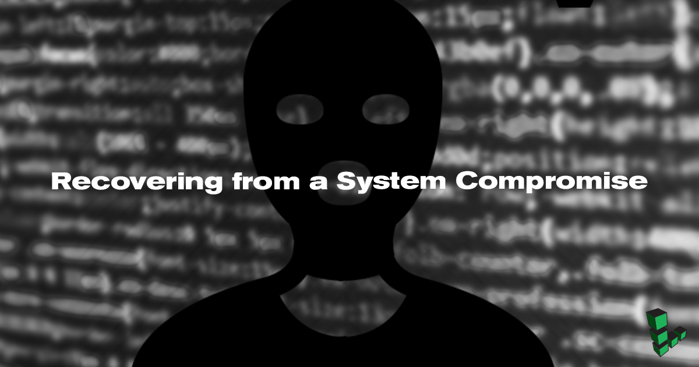

If you suspect that an unauthorized user has gained access to your Linode, your system should be considered **compromised**. Unfortunately, it's virtually impossible to determine the full scope of an attacker's reach into a compromised system. The server should not be trusted for production use and you should take immediate steps to secure your data and applications.

This guide describes several methods to recover from a system compromise:

-   **Rebuild**: Delete all of the data on your Linode and rebuild with a new disk image.
-   **Copy Data Offsite**: Access your data while your server is offline, and copy what you need before you wipe your Linode.
-   **Use a Second Linode**: This is the most involved approach, but provides the most seamless transition to your new system.

If you choose to keep your data, you will need to audit all the content on the affected system to prevent the transfer of malicious components to a new system.

## Rebuild

This is the easiest option, but also the most destructive. It will wipe all of the data from your Linode and start over with a fresh disk.

1.  Log in to the [Linode Manager](https://cloud.linode.com/).
2.  Select the **Linodes** tab.
3.  Select the compromised Linode.
4.  Select the **Rebuild** tab.
5.  Choose your new distribution, disk size, swap disk, and root password.
6.  Click **Rebuild**.

This will delete your current images and deploy fresh disks. All data that was stored on the Linode will be unrecoverable, but your system will be free of compromise. At this point, you should follow the instructions in the [Setting Up and Securing a Compute Instance](/docs/guides/set-up-and-secure/) guide to disable root logins via SSH and disable password logins for all accounts.

## Copy Data Offsite

If there is data on the compromised Linode that you need to retain, you can use the [Finnix rescue environment](/docs/guides/rescue-and-rebuild/) to examine your old disks first. Once you have verified the integrity of your data, copy it to the appropriate location on your new server or another offsite location. Our [SSH disk copy guide](/docs/guides/copying-a-disk-image-over-ssh/) explains how to copy your entire disk offsite.

## Use a Second Linode

You can use a second Linode for the most seamless transition to a new system.

1.  Add a new Linode to your account. See the [Getting Started](/docs/guides/getting-started/) guide for instructions.
2.  Set a strong password for **root** and all user accounts, making sure not to reuse any passwords from the compromised system.
3.  Upgrade all system packages:

    Debian/Ubuntu:

        sudo apt update && sudo apt upgrade

    CentOS/Fedora:

        sudo yum update

4.  Follow the instructions in the [Setting Up and Securing a Compute Instance](/docs/guides/set-up-and-secure/) guide to harden SSH access and activate the firewall.

### Rebuild Your Configuration

Rebuild your production server's configuration on the new Linode.

-   Install updated versions of all applications
-   Restrict access to all applications
-   Assign new administrative passwords for all web applications

### Copy and Audit Your Data

The next task is to copy your data to the new Linode, and make sure that all compromised portions have been purged.

1.  Create a temporary directory on the new Linode.
2.  Copy any needed user and configuration data from the compromised Linode using [rsync](/docs/guides/introduction-to-rsync/) or `scp`.

    
Do not log in to the new Linode from the compromised Linode. Files should be pulled from the compromised server to your new setup instead.


3.  Audit your data using tools such as `rkhunter` and [`clamav`](/docs/guides/scanning-your-linode-for-malware/). You can use additional malware scanners to be certain you aren't retaining tainted files. Examine all system scripts manually for contaminated code, and replace all suspicious executable files with known good copies.

If you're not comfortable copying from the compromised system prior to auditing the data, you can instead use the [Finnix rescue environment](/docs/guides/rescue-and-rebuild/) to examine your old disks. Once you have verified the integrity of your data, copy it to the appropriate location on your new server.

### Swap IP Addresses

Swap IP addresses so the new Linode uses the IP address assigned to the old Linode. If you have configured any network services to use the new Linode's IP address, you should modify their configurations to use the old Linode's IP instead. For instructions, see [Managing IP Addresses](/docs/guides/managing-ip-addresses/#transferring-ip-addresses).

 
To swap IP addresses, both Linodes must be located in the same data center.


Alternatively, you can [update your DNS entries](/docs/websites/hosting-a-website/#add-dns-records) to point to the new Linode's IP address instead. DNS propagation across the Internet may take some time. Boot the new Linode to resume normal operations.

### Preserving Data for Forensics and Linode Cancellation

You may want to download a complete copy of the compromised Linode's disk(s) for forensic analysis. To do this, follow the instructions in our [SSH disk copy guide](/docs/migrate-to-linode/disk-images/copying-a-disk-image-over-ssh). If you don't need a full copy of the affected disks, you may still want to make a copy of all system log files for later review.

When you no longer need the old Linode's disks, you should [remove the Linode](/docs/platform/billing-and-support/billing-and-payments/#removing-services). Your account will be issued a pro-rated credit for that Linode's charges in the current billing period.
