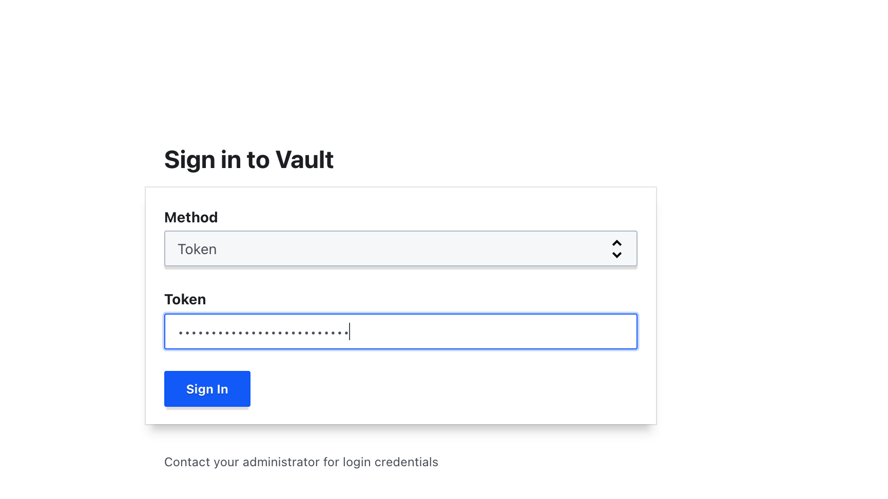
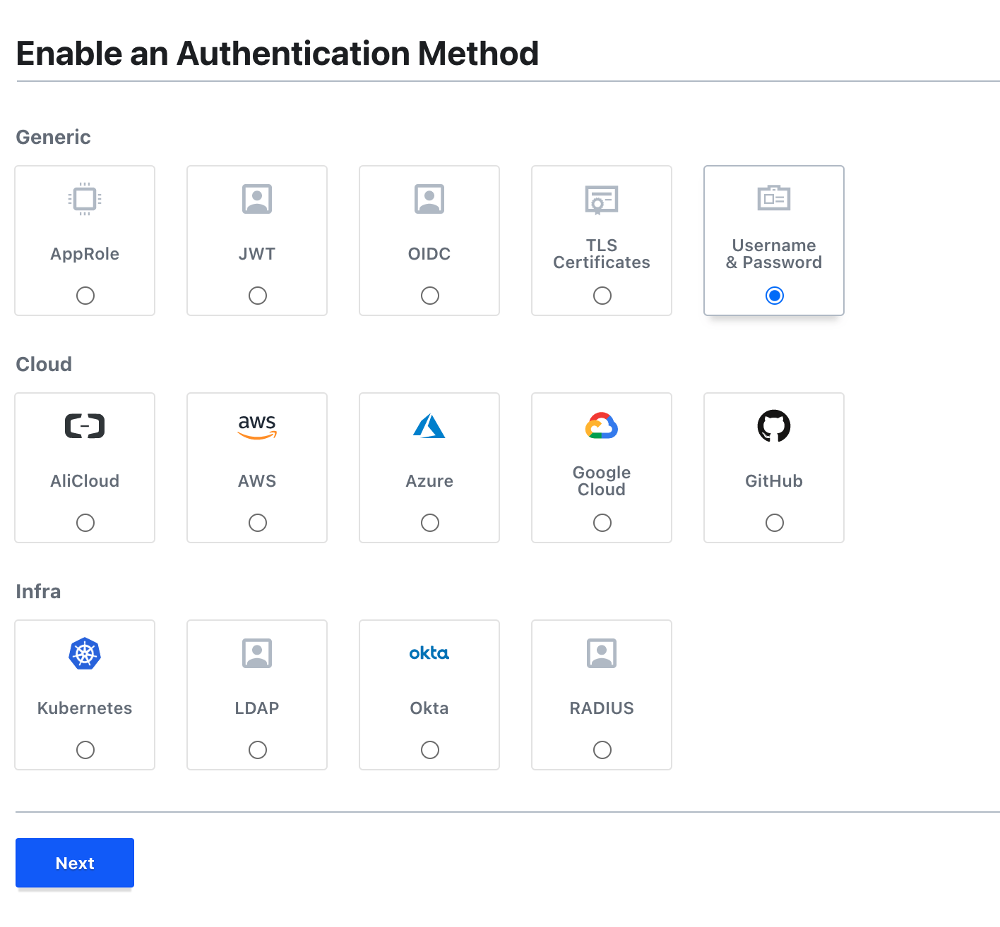

[HashiCorp Vault](https://www.vaultproject.io/) is an open source, centralized secrets management system. It provides a secure and reliable way of storing and distributing secrets like API keys, access tokens, and passwords.

The objective of Vault is to manage and protect secrets in a dynamic infrastructure. From a dynamic application standpoint, Vault provides dynamic secrets and implements access control lists (ACLs) where passwords are dynamic and are constantly changing in the event of a leak. Who has access to these passwords is set up and protected by the ACLs.

This guide covers the fundamentals of using Vault and the process of setting up a Vault server and client.

## What is a secret?

A secret is a credential or key that allows you to gain access to a particular resource or to a system, for example: a password, API key, access token, or database passwords.

## Before You Begin
1.  Ensure that you have followed the [Getting Started](/docs/products/platform/get-started/) and [Securing Your Server](/docs/products/compute/compute-instances/guides/set-up-and-secure/) guides. Ensure that the Linode's [hostname is set](/docs/products/platform/get-started/#set-the-hostname).

    Check your Linode's hostname. The first command should show your short hostname and the second should show your fully qualified domain name (FQDN).

    ```command
    hostname
    hostname -f
    ```

1.  Update your system:

    ```command
    sudo apt update
    ```

    
This guide is written for a non-root user. Commands that require elevated privileges are prefixed with `sudo`. If you're not familiar with the `sudo` command, you can check our [Users and Groups](/docs/guides/linux-users-and-groups/) guide.



The instructions in this guide are based the steps on Ubuntu 22.04, all the steps are distribution agnostic with the exception of package names and package managers.


## Installing Vault

1.  Download the Vault binary for the Linux operating system on the Linode server. You can find the latest version of the binary at the [Vault Project downloads page](https://www.vaultproject.io/downloads).

    ```command
    sudo wget https://releases.hashicorp.com/vault/1.12.2/vault_1.12.2_linux_amd64.zip
    ```

1.  Unzip the archive.

    ```command
    sudo unzip vault_1.12.2_linux_amd64.zip
    ```

1.  Add the binary to an accessible path in the terminal, by moving the binary to the Linux local binary directory.

    ```command
    sudo mv vault /usr/local/bin
    ```

1.  In the extracted directory there is a single vault binary that can be used without a setup or installation process. Execute the binary by running the following commands:

    ```command
    cd /usr/local/bin
    ./vault
    ```

You can now launch the Vault from any directory or user on the system.

## Starting the “dev” Server

To learn the functionality and syntax for using Vault, you need to set up a server. You can use the inbuilt dev server that is not designed to be production ready but used for learning the essentials and testing various pieces of functionality.


The dev server runs in the foreground. As a result, you need to open a new terminal session to run the consequent commands.


1.  Start the Vault dev server by running the following command:

    ```command
    vault server -dev
    ```

    By default, the development server stores all backend storage in memory making it a temporary solution. Therefore, any secrets that you create and store are lost once you stop the server.
    An output similar to the following appears:

    ```output
    ==> Vault server configuration:

                 Api Address: http://127.0.0.1:8200
                         Cgo: disabled
             Cluster Address: https://127.0.0.1:8201
                  Go Version: go1.15.8
                  Listener 1: tcp (addr: "127.0.0.1:8200", cluster address: "127.0.0.1:8201", max_request_duration: "1m30s", max_request_size: "33554432", tls: "disabled")
                   Log Level: info
                       Mlock: supported: true, enabled: false
               Recovery Mode: false
                     Storage: inmem
                     Version: Vault v1.7.0-rc1
                 Version Sha: 9af08a1c5f0f855984a1fa56d236675d167f578e

    ==> Vault server started! Log data will stream in below:

    2021-03-18T16:46:07.284+0530 [INFO]  proxy environment: http_proxy= https_proxy= no_proxy=
    2021-03-18T16:46:07.285+0530 [WARN]  no `api_addr` value specified in config or in VAULT_API_ADDR; falling back to detection if possible, but this value should be manually set
    2021-03-18T16:46:07.346+0530 [INFO]  rollback: starting rollback manager
    WARNING! dev mode is enabled! In this mode, Vault runs entirely in-memory
    and starts unsealed with a single unseal key. The root token is already
    authenticated to the CLI, so you can immediately begin using Vault.

    You may need to set the following environment variable:

        $ export VAULT_ADDR='http://127.0.0.1:8200'

    The unseal key and root token are displayed below in case you want to
    seal/unseal the Vault or re-authenticate.

    Unseal Key: M+9B2DU9YniT0oqp7PO32sk0XWfgHL0JHekpC6Ju1pA=
    Root Token: s.pOkS8XqKP5F7sAmgvHJPcaqF

    Development mode should NOT be used in production installations!
    ```

    
    The Unseal Key and Root Token values are displayed, these values are used to seal and unseal the vault and to authenticate with the vault. Ensure that you save these values for later use.
    

1.  Add the Vault address and the token as an environment variables in a new terminal, this ensures that Vault can connect to the vault server automatically without having to specify the address each time.

    ```command
    export VAULT_ADDR='http://127.0.0.1:8200'
    export VAULT_DEV_ROOT_TOKEN_ID=s.SHYYqfhBQm8vIcwjuXJcJ0yk
    ```

1.  To verify that the server is running use the following command:

    ```command
    vault status
    ```

    An output similar to the following appears:

    ```output
    Key             Value
    ---             -----
    Seal Type       shamir
    Initialized     true
    Sealed          false
    Total Shares    1
    Threshold       1
    Version         1.7.0-rc1
    Storage Type    inmem
    Cluster Name    vault-cluster-83efa92c
    Cluster ID      97f970c7-f4ef-71e2-1c7c-db97223296b3
    HA Enabled      false
    ```

You have now successfully started the dev server and can begin learning about the process of creating secrets.

## Creating Secrets

Now that the dev server is up and running, take a look at how to read and write your first secret.

1.  Write a secret to the Key/Value secrets engine on the dev server:

    ```command
    vault kv put secret/ssh alexis=password
    ```

    The command writes the key/value pair `alexis=password` In the path secret/ssh. Use the secret path because it is the predefined path on the dev server.

1.  To retrieve secrets run the following command:

    ```command
    vault kv get secret/ssh
    ```

    This displays all key/value secrets stored in the secret/ssh path:

    ```output
    ====== Metadata ======
    Key              Value
    ---              -----
    created_time     2021-03-18T11:49:20.888146913Z
    deletion_time    n/a
    destroyed        false
    version          1

    ==== Data ====
    Key      Value
    ---      -----
    rajie    password
    ```

1.  To delete a secret, run the following command:

    ```command
    vault kv delete secret/ssh
    ```

    An output similar to the following appears:

    ```output
    Success! Data deleted (if it existed) at: secret/ssh
    ```

Now that you have a grasp of how to create, retrieve and delete secrets, you can take a look at secrets engines.

## Secrets Engines
A secrets engine defines what type of secret can be stored in a path. For instance, Vault has more various secrets engines that can be used for storing various types of secrets such as key/value secrets, database credentials, and SSH keys.
In the case of the dev server, the secret engine configured for the secret path was of key/value type, which means that path could only store secrets that were in key/value format.

1.  To enable your own secrets engine with your own path, each path is isolated from other parts:

    ```command
    vault secrets enable -path=database-creds kv
    ```

    In this case, you create a path called database-creds that uses the key/value secrets engine.

1.  List out the secret paths that are on the server by running the command:

    ```command
    vault secrets list
    ```

    This displays all the secret paths and the secrets engines they have been configured to use.

    An output similar to the following appears:

    ```output
    Path               Type         Accessor              Description
    ----               ----         --------              -----------
    cubbyhole/         cubbyhole    cubbyhole_0fb3f4cb    per-token private secret storage
    database-creds/    kv           kv_c2460aa1           n/a
    identity/          identity     identity_fca9f3c8     identity store
    secret/            kv           kv_ca428525           key/value secret storage
    sys/               system       system_357b7655       system endpoints used for control, policy and debugging
    ```

1.  Create secrets in the newly created database-creds path by running:

    ```command
    vault kv put database-creds/dev alexis=password!
    ```

    This creates a path under database-creds/dev where the key/value secret `alexis=password!` is stored:

    ```output
    Success! Data written to: database-creds/dev
    ```

Up to this point, you have been interacting with the dev server which automatically unseals Vault and sets up in-memory storage. Now that you know the basics of Vault, you can take a look at how to deploy a Vault server into a real environment.

Before you start the deployment of a Vault server, ensure that you have terminated the dev server process. You can do this by using the keyboard combination CTRL+C. Also unset the `VAULT_TOKEN` environment variable using the command ```unset VAULT_TOKEN```.

## Deploying A Vault Server

To set up your own Vault server, you need to begin by setting up a configuration file that specifies what storage backend the server uses and what the API address among other options.

1.  Create a new config file:

    ```command
    nano config.hcl
    ```

1.  Add the following contents to the `config.hcl` file. Ensure that you replace `<LinodeIPaddress>` with the IP address of the Linode server and save the file.

    ```file {title="config.hcl"}
    storage "raft" {
      path    = "./vault/data"
      node_id = "node1"
    }

    listener "tcp" {
      address     = "<LinodeIPaddress>:8200"
      tls_disable = "true"
    }

    disable_mlock = true

    api_addr = "http://127.0.0.1:8200"
    cluster_addr = "https://127.0.0.1:8201"
    ui = true
    ```

    Where:

    -   `disable_mlock` - By default, Vault uses `mlock()` to lock its process memory pages, preventing them from being swapped to disk. You should always strive to have it enabled (it is enabled by default) as described in production hardening when operating Vault in production. However, this option is not supported on certain platforms like macOS or Windows, so for this to be a most portable and useful example, it disables `mlock()`.

    -   `ui` - By default, the Vault web UI is not enabled; this example enables it.

    -   `storage` - This is the physical backend that Vault uses for storage. Up to this point the dev server has used `inmem` (in memory), but the example above uses integrated storage (raft), a much more production-ready backend.

    -   `listener` - One or more listeners determine how Vault listens for API requests. The example above listens on localhost port 8200 without TLS. In your environment set `VAULT_ADDR=http://127.0.0.1:8200` so the Vault client connects without TLS.

    -   `api_addr` - Specifies the address to advertise to route client requests.

    -   `cluster_addr` - Indicates the address and port to be used for communication between the Vault nodes in a cluster.

1.  Create the backend storage directory that you specified in the `config.hcl` file:

    ```command
    mkdir -p vault/data
    ```

1.  Start the server by running the vault server command and specifying the configuration file to be used:

    ```command
    vault server -config=config.hcl
    ```

1.  In a new terminal, add the Vault address as an environment variables:

    ```command
    export VAULT_ADDR='http://<LinodeIPaddress>:8200'
    ```

1.  To initialize the server run the following command:

    ```command
    vault operator init
    ```

    The initialization process outputs two incredibly important pieces of information: the unseal keys and the initial root token. This is the only time ever that all of this data is known by Vault, and also the only time that the unseal keys should ever be so close together. It is therefore vitally important to keep these pieces of information secure.

1.  Unseal the vault, by running the following command:

    ```command
    vault operator unseal
    ```

    To unseal the vault, you need to enter this command three times and specify 3 of the 5 unseal keys generated during the initialization process.

    After entering 3 of the 5 unseal keys, the sealed value should be set to false.

    ```output
        Unseal Key (will be hidden):
    Key                     Value
    ---                     -----
    Seal Type               shamir
    Initialized             true
    Sealed                  false
    Total Shares            5
    Threshold               3
    Version                 1.7.0-rc1
    Storage Type            raft
    Cluster Name            vault-cluster-3abb9a8f
    Cluster ID              2591892a-c64a-24f8-1334-e12ce4cf67dd
    HA Enabled              true
    HA Cluster              n/a
    HA Mode                 standby
    Active Node Address     <none>
    Raft Committed Index    24
    Raft Applied Index      24
    ```

1.  Login to the vault by running the following command:

    ```command
    vault login <root-token>
    ```

## Web UI
Vault features a web-based user interface (UI) that enables you to unseal, authenticate, and manage policies and secrets engines much more easily.

1.  To login to the web UI navigate to the following URL in your browser after the vault is unsealed by typing `http:\\<LinodeIPaddress>:8200`.

    

1.  You are prompted to sign in with your root token, you can also use other means of authentication.

    

1.  Create a new user with the authentication method set to username & password.

You can also create a new path and specify the secrets engine to use.

## Configuring Vault Client

A Vault client requires the vault binary and authentication credentials. In this case, you have created custom credentials for your client, however the account does not have the required permissions to access any secrets.

Access in Vault is set up and managed by access policies that are configured to work like access control lists.

1. Modify the default policy to allow any users assigned to this policy permissions to access a particular path. in the UI go to **Policies** and click **default**.

    ```file {title="default.hcl"}
    path"alexis-passwords/*"{
        capabilities = ["create","update","read"]
    }
    # Allow tokens to look up their own properties
    path "auth/token/lookup-self" {
        capabilities = ["read"]
    }

    # Allow tokens to renew themselves
    path "auth/token/renew-self" {
        capabilities = ["update"]
    }

    # Allow tokens to revoke themselves
    path "auth/token/revoke-self" {
        capabilities = ["update"]
    }
    ```

1.  Add the vault address environment variable to the client by running the following command:

    ```command
    export VAULT_ADDR='<LinodeIPaddress>’
    ```

1.  Authenticate to the server with the client by running the following command:

    ```command
    ./vault login -method=userpass username=<USER> password=<PASSWORD>
    ```

    ```output
    Key               Value
    ---               -----
    token             s.ZXWpD0jVKBYHQwniSVxaB4yw
    token_accessor      XiuHMe8B5HyBrWQqa1W313fv
    token_duration      768h
    token _renewable    true
    token_policies      ['default"]
    identity_policies   []
    policies            ["default"]
    token_mets_username  alexis
    Cluster ID      97f970c7-f4ef-71e2-1c7c-db97223296b3
    HA Enabled      false
    ```

After authentication, your credentials are saved on the home directory of the user you are logged in as. You can now access the paths and functionality that was assigned in the default policy.