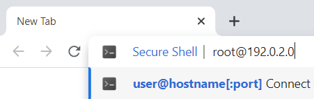

SSH (*secure shell*) is used for secure communication between devices. When most people refer to SSH, it is within the context of connecting from a local computer to a remote server. This is a common task when administering a website, hosting environment, or even a Raspberry Pi or Arduino system.

This article covers the basics of connecting to a remote server (such as a Linode) over SSH using the **Secure Shell** extension available on ChromeOS or any Chrome web browser running on Windows, Mac, and Linux.

## Before You Begin

1. Ensure you have a Linux system with an SSH server (like OpenSSH) installed. Most Linux distributions have an SSH server preinstalled. If you wish to deploy a new server, follow the [Creating a Compute Instance](/docs/products/compute/compute-instances/guides/create/) guide to create a Linode.

1. Install the [Chrome web browser](https://www.google.com/chrome/) on your local Windows, Mac, or Linux computer. You can skip this step if using ChromeOS.

## Installing the Secure Shell Extension

1.  Open the [Secure Shell](https://chrome.google.com/webstore/detail/secure-shell/iodihamcpbpeioajjeobimgagajmlibd) extension on the Chrome Web Store and click **Add to Chrome**.

1.  A confirmation window may appear notifying you of the actions and permissions the extension will use. Click **Add extension** to install it.

## Connecting to the Remote Server Over SSH

1.  Open Chrome and type the following into the URL/address bar, replacing *[username]* with the username of the remote user and *[ip-address]* with the IP address or domain name of the remote server.

    ```command
    ssh [username]@[ip-address]
    ```

    Press enter. The Secure Shell extension attempts to connect to the remote server over port 22 (the default SSH port).

    

    
    If the server's SSH port is something other than 22, it needs to be specified in the above command. To do this, append `[:port]` as shown in the example below, replacing *port* with the port number that the remote SSH server is using.

    ```command
    ssh user@192.0.2.0[:2022]
    ```
    

1.  When you connect with a server for the first time, the SSH client prompts you to check and verify the host key's fingerprint. This is normal, and results in output similar to:

    ```output
    The authenticity of host ‘example.com (192.0.2.0)’ can't be established.
    ECDSA key fingerprint is SHA256:d029f87e3d80f8fd9b1be67c7426b4cc1ff47b4a9d0a84.
    This key is not known by any other names
    Are you sure you want to continue connecting (yes/no/[fingerprint])?
    ```

    You can verify the fingerprint by following the instructions on the [Verifying the Authenticity of a Remote Server](/docs/guides/verifying-the-authenticity-of-remote-host/) guide.

    
    If you recently rebuilt your server, you might receive an error message when you try to connect. This happens when the remote host key changes. To fix this, revoke the key for that IP address.

    ```command
    ssh-keygen -R 198.51.100.4
    ```
    

1.  Accept the prompt by entering `yes`, which results in a one-time warning that is similar to:

    ```output
    Warning: Permanently added 'example' (ECDSA) to the list of known hosts.
    ```

1.  You are then prompted for your password. Type in the correct password for the remote user and press enter.

Once you have successfully connected, the Secure Shell extension displays a terminal that's using the remote shell environment for the server. The command prompt should show the username and hostname configured for the server. You can now run any commands that you have available on that server. This includes many of the basic Linux commands, such as `ls`, `cd`, `rm`, and those covered in [Using the Terminal](/docs/guides/using-the-terminal/) guide. Getting to know these commands will help you navigate around your server.

## Ending the SSH Session

After you are done, log out of the session by typing `exit`. The terminal then shows something similar to:

```output
logout
Connection to 192.0.2.0 closed.
NaC1 plugin existed with status code 0
(R)econnect, (C)hoose another connection, or E(x)it?
```

Type `x` to close the tab, `r` to reconnect to the same server, or `c` to be presented with the **Connection Dialog** window, allowing you to manually type in the details for a new connection.

## Going Further

### Troubleshooting SSH Connection Issues

If SSH isn't connecting you to your Linode, it is possible that it needs to be looked at on the server. See the guide [Troubleshooting SSH](/docs/products/compute/compute-instances/guides/troubleshooting-ssh-issues/) for assistance.

### Increasing Security

- Now that you can connect from your Linux machine to the Linode over SSH, save not only time but also make the connection even more secure by using SSH public key authentication. For more information, see [SSH add keys](/docs/guides/use-public-key-authentication-with-ssh/).

- See the "Harden SSH Access" section of [Setting Up and Securing a Compute Instance](/docs/products/compute/compute-instances/guides/set-up-and-secure/) guide to review how to secure SSH on the server's side, and the [Advanced SSH Server Security](/docs/guides/advanced-ssh-server-security/) for more information on making it even more secure.