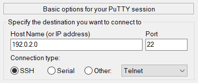
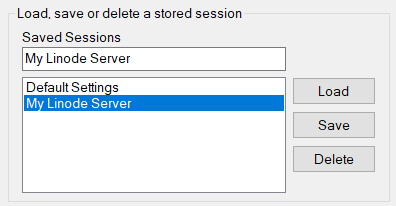
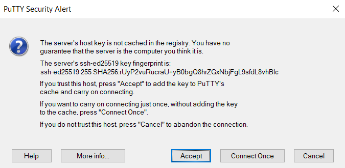

A *secure shell* (SSH) is used for secure communication between devices. When most people refer to SSH, it is within the context of connecting from a local computer to a remote server, commonly for administration tasks related to website hosting.

This article covers the basics of connecting to a remote server (such as a Linode) over SSH using the PuTTY application. PuTTY is a free and open source SSH client that provides a graphic interface for connecting to remote servers. It is compatible with Windows XP and later systems, including Windows Vista, 7, 8 and 10. It is also compatible with most UNIX systems.


While PuTTY is compatible with Windows 10, you may want to review the [Connecting to a Remote Server Over SSH on Windows](/docs/guides/connect-to-server-over-ssh-on-windows/) guide for alternatives to PuTTY that may better suit your needs and preferences.


## Before You Begin

1. Ensure you have a Linux server with an SSH server (like OpenSSH) installed. Most Linux distributions have an SSH server preinstalled. If you wish to deploy a new server, follow the [Creating a Compute Instance](/docs/products/compute/compute-instances/guides/create/) guide to create a Linode.

1. Install [PuTTY](http://www.chiark.greenend.org.uk/~sgtatham/putty/download.html) on your local Windows or Linux system.

## Connecting to the Remote Server Over SSH

1.  Open PuTTY. You can find PuTTY on your desktop, through the Start Menu, or by using Windows Search.

1.  Enter the following basic details about the destination host and the connection type.

    - **Host Name:** The domain name or IP address of the destination host.
    - **Port:** The SSH port on the destination host. The default port for most servers is 22, though you can change this port if needed.
    - **Connection type:** Select *SSH* for the connection type, though you can modify this if using a different protocol.

    

1.  Optionally, save your session to quickly reconnect in the future. Type in a unique name for the connection under **Saved Sessions** and press the **Save** button.

    

1.  Click the **Open** button at the bottom of the PuTTY window to open the connection.

1.  When you connect to a server for the first time, PuTTY prompts you to verify that the host key's fingerprint matches what you expect.

    

    If you trust this connection, press the **Accept** button to continue connecting to the remote server. You can verify the fingerprint by following the instructions under the [Verifying the Authenticity of a Remote Server](/docs/guides/verifying-the-authenticity-of-remote-host/) guide.

    
    If you recently rebuilt your server, you might receive an error message when you try to connect. This happens when the remote host key changes. To fix this, you must remove the IP addresses manually from the following registry entry:

    ```command
    HKEY_CURRENT_USER\Software\SimonTatham\PuTTY\SshHostKeys
    ```
    

1.  PuTTY now prompts you to enter the remote user and the password for that user.

Once you have successfully connected, your terminal should be using the remote shell environment for the server. Your command prompt should now show the username and hostname configured for the server. You can now run any commands that you have available on that server. This includes many of the basic Linux commands, such as `ls`, `cd`, `rm`, and those covered in [Using the Terminal](/docs/guides/using-the-terminal/) guide. Getting to know these commands will help you navigate around your server.

## Going Further

### Troubleshooting SSH Connection Issues

If SSH isn't connecting you to your Linode, you may need to investigate the state of your server. See the guide [Troubleshooting SSH](/docs/products/compute/compute-instances/guides/troubleshooting-ssh-issues/) for assistance.

### Increasing Security

- Now that you can connect from your Linux machine to the Linode over SSH, save not only time but also make the connection even more secure by using SSH public key authentication. For more information, see [SSH add keys](/docs/guides/use-public-key-authentication-with-ssh/).

- See the "Harden SSH Access" section of [Setting Up and Securing a Compute Instance](/docs/products/compute/compute-instances/guides/set-up-and-secure/) guide to review how to secure SSH on the server's side, and the [Advanced SSH Server Security](/docs/guides/advanced-ssh-server-security/) for more information on making it even more secure.

### Additional PuTTY Guides

- [Create an SSH Tunnel for MySQL Remote Access](/docs/guides/create-an-ssh-tunnel-for-mysql-remote-access/): This guide uses PuTTY to create a secure SSH tunnel to access the MySQL command prompt on remote server.