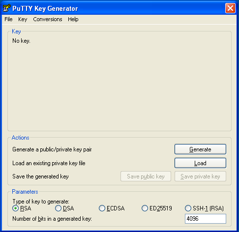
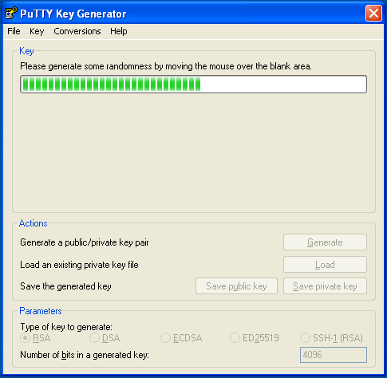
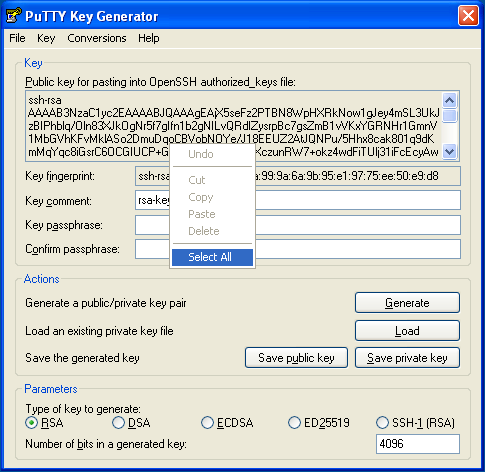
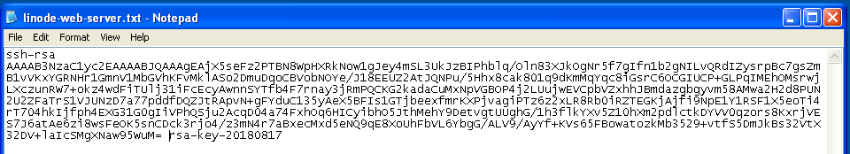
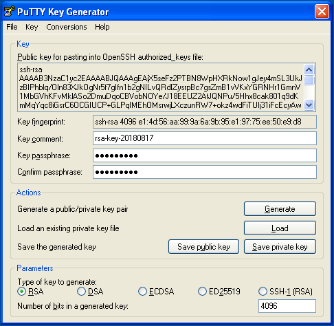
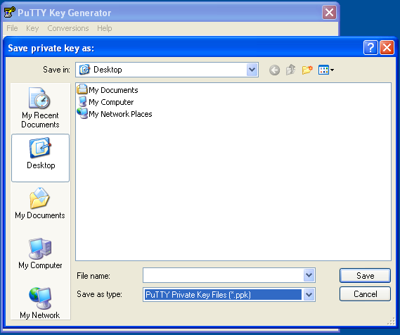
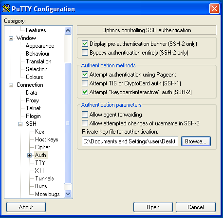
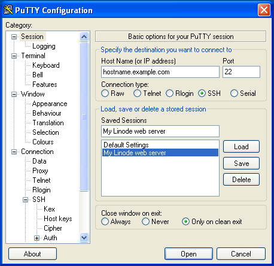

[Public key authentication](https://en.wikipedia.org/wiki/Key_authentication#Authentication_using_Public_Key_Cryptography) with SSH (Secure Shell) is a method in which you generate and store on your computer a pair of cryptographic keys and then configure your server to recognize and accept your keys. Password authentication is the default method most SSH clients use to authenticate with remote servers, but it suffers from potential security vulnerabilities like brute-force login attempts. Using key-based authentication offers a range of benefits, including:

- Key-based login is not a major target for brute-force hacking attacks.

- If a server that uses SSH keys is compromised by a hacker, no authorization credentials are at risk of being exposed.

- Since a password isn't required, you can log in to servers from within scripts or automation tools that you need to run unattended. For example, you can set up periodic updates for your servers with a configuration management tool like [Ansible](/docs/guides/running-ansible-playbooks/), and you can run those updates without having to be physically present.

This guide explains how the SSH key login scheme works, how to generate an SSH key, and how to use those keys with a Linode Linux server.


If you're unfamiliar with logging in to a remote machine with SSH, review the [Connecting to a Remote Server Over SSH](/docs/guides/connect-to-server-over-ssh/) guide that corresponds with the operating system of your local workstation. You can also review the instructions for connecting to a Compute Instance over SSH within our [Set Up and Secure](/docs/products/compute/compute-instances/guides/set-up-and-secure/#connect-to-the-instance) guide.


## How Does SSH Public Key Authentication Work?

SSH keys are generated in pairs and stored in plain-text files. The *key pair* (or *keypair*) consists of two parts:

-   A **private key**. The private key is stored on your local computer and should be kept secure, with permissions set so that no other users on your computer can read the file.

    
    Do not share your private key with others.
    

-   A **public key**. The public key is placed on the server you intend to log in to. You can freely share your public key with others. If someone else adds your public key to their server, you will be able to log in to that server.

When a site or service asks for your SSH key, they are referring to your SSH public key. For instance, services like [GitHub](https://github.com) and [Gitlab](https://gitlab.com) allow you to place your SSH public key on their servers to streamline the process of pushing code changes to remote repositories.

A public key and a private key play an important role in enabling secure access. But how? The best way to understand them is to understand that the following components in this authentication system are mathematically related to each other:

1. Public key
2. Private key
3. Authentication algorithm

When you use your public key to encrypt something, only your private key can decrypt it. To enable encrypted communication between machines, you would retain your private key on your workstation and share your public key with the remote machines you'd like to access.

To facilitate this encryption and decryption, an authentication algorithm is used. Here’s how it works:

1. **Signed communication**: Any message that goes out is signed using your private keys.

2. **Verification of communication**: Your server has a public key from the sender stored. A signed message is verified by using this public key to decrypt the message.

When you sign a message, you allow others to decrypt the message as well. But when the receiver decrypts this message, they can safely and securely validate that the communication is in fact from you. To match these keys and validate, you use an algorithm like [Diffie-Hellman](https://en.wikipedia.org/wiki/Diffie%E2%80%93Hellman_key_exchange).

### Other Components and Considerations

#### The Authorized Keys File

In order for your Linux server to recognize and accept your key pair, you must upload your public key to your server. More specifically, you must upload your public key to the home directory of the user you would like to log in as. If you would like to log in to more than one user on the server using your key pair, you must add your public key to each of those users.

To set up SSH key authentication for one of your server's users, add your public key to a new line inside the user's `authorized_keys` file. This file is stored inside a directory named `.ssh/` under the user's home folder. A user's `authorized_keys` file can store more than one public key, and each public key is listed on its own line. If your file contains more than one public key, then the owner of each key listed can log in as that user.

#### Granting Someone Else Access to Your Server

To give someone else access to your server's user, simply add their public key on a new line in your `authorized_keys` file, just as you would add your own. To revoke access for that person, remove that same line and save the changes.

#### Challenge-Response

When logging in to a server using SSH, if that server has a public key on file, the server creates a [*challenge*](https://en.wikipedia.org/wiki/Challenge–response_authentication). This challenge is crafted in such a way that only the holder of the private SSH key can decipher it.

This challenge-response action happens without any user interaction. If the person attempting to log in has the corresponding private key, then they can safely log in. If not, the login either fails or falls back to a password-based authentication scheme.

#### SSH Private Key Passphrases

You can optionally provide an additional level of security for your SSH private key by encrypting it locally with a *passphrase* at the time of creation. When you attempt to log in using an encrypted SSH key, you are prompted to enter its passphrase. This is not to be confused with a *password*, as this passphrase only decrypts the key file locally. A passphrase is not transferred over the Internet as a password might be.

If you'd like to set up your logins so that they require no user input, then creating a passphrase might not be desirable. Nevertheless, using a passphrase to protect your private key is strongly recommended.

#### Encryption Algorithms

When generating a key pair for use with SSH, there are a few encryption algorithms that can be used. The two most common and recommended values include **Ed25519** and **RSA**, but users can also use **ecdsa** and **dsa**.

- **Ed25519** *(recommended)*: Supported in OpenSSH v6.5+. This type provides the best security when compared with its relative key length and is generally the fastest to generate and use.

- **RSA**: This is the most commonly used algorithm and is supported by almost all systems and OpenSSH versions. RSA keys are generally much longer than those generated by other algorithms. To maintain secure systems, we recommend generating RSA keys using a length of 4096-bits.

## Generate an SSH Key Pair

This section covers using the [ssh-keygen](https://man7.org/linux/man-pages/man1/ssh-keygen.1.html) tool (included with OpenSSH) to generate an SSH key on your system. OpenSSH (and ssh-keygen) are included by default on Linux and macOS. Windows 10 and 11 users may need to first install OpenSSH before continuing. Users of Windows 7 and below should use the [PuTTY instructions](#public-key-authentication-with-putty-on-windows) at the bottom of this page.

1.  Run the command below to generate a new key using the [ssh-keygen](https://man7.org/linux/man-pages/man1/ssh-keygen.1.html) tool. Provided you are using relatively modern systems (both locally and remotely), we recommend generating keys using the Ed25519 algorithm.

    ```command
    ssh-keygen -t ed25519 -C "user@domain.tld"
    ```

    - `-t`: This defines the type of key you are generating (the algorithm that's used). Possible values include `ed25519` (recommended), `rsa` (recommended only for older systems), `ecdsa`, `dsa`, and two other types designated for security keys (`ed25519-sk` and `ecdsa-sk`).

    - `-C`: An optional comment to help you distinguish between SSH keys, especially on remote systems that may have multiple authorized keys. Commonly, email addresses are used in the comment fields.

    - `-b`: The bit length used when generating RSA, ECDSA, or DSA keys. For RSA keys, it is recommended that you specify a bit length of 4096.

1.  When prompted for the file name, press <kbd>Enter</kbd> to use the default name and path. Typically, SSH keys are stored in the `~/.ssh/` directory. Private keys using Ed25519 are saved with the name `id_ed25519` be default while RSA keys use the name `id_rsa` by default. Public keys use the same file name but are appended with `.pub`.

    ```output
    Generating public/private ed25519 key pair.
    Enter file in which to save the key (/Users/username/.ssh/id_ed25519):
    ```

    
    If you've already created a key pair using the default name (or a custom one that you've entered), **the file will be overwritten and you may be locked out of your remote systems**. For this reason, you may want to check for existing keys before continuing, run `ls ~/.ssh/id_ed25519*`.

    If you accidentally lock yourself out of the SSH service on your Compute Instance, you can still use the [Lish](/docs/products/compute/compute-instances/guides/lish/) console to login to your server. After you've logged in via Lish, update your `authorized_keys` file to use your new public key. This should re-establish normal SSH access.
    

1.  Next, enter a passphrase, which is used to encrypt (and decrypt) your private key locally. This is optional but is generally recommended unless you are using the key for automation purposes. Each time you log in using that key, you must enter the passphrase (unless you save that passphrase to your local machine's keychain manager or through the ssh-add tool). Leave this field blank if you don't want to use a passphrase.

    ```output
    Enter passphrase (empty for no passphrase):
    Enter same passphrase again:
    ```

1.  Once your key pair has been generated, you should see output similar to the following:

    ```output
    Your identification has been saved in /Users/username/.ssh/id_ed25519.
    Your public key has been saved in /Users/username/.ssh/id_ed25519.pub.
    The key fingerprint is: SHA256:AVF3XG5XtwxWmoECKC9xExnStF5JzpXYDfkieOejYJE user@domain.tld
    ```

## Upload the Public Key

To start using your newly generated SSH key pair, you first need to upload your public key to your remote system.



[ssh-copy-id](https://linux.die.net/man/1/ssh-copy-id) is a utility included with OpenSSH and is used to an SSH public key to a remote server over SSH.

1.  Enter the command below, replacing *[user]* with your remote username and *[ip-address]* with the IP address or fully qualified domain name of the server to which you wish to copy your public key.

    ```command
    ssh-copy-id [user]@[ip-address]
    ```

1.  You are presented with output similar to the following and then prompted to enter your remote user's password.

    ```output
    /usr/bin/ssh-copy-id: INFO: Source of key(s) to be installed: "/Users/username/.ssh/id_ed25519.pub"
    /usr/bin/ssh-copy-id: INFO: attempting to log in with the new key(s), to filter out any that are already installed
    /usr/bin/ssh-copy-id: INFO: 1 key(s) remain to be installed -- if you are prompted now it is to install the new keys
    user@192.0.2.17's password:
    ```

1.  After entering your password, your public key should be copied to the server's `authorized_keys` file. You can now verify you are able to [log in to the server](#connect-to-the-remote-server) with your key.

    ```output
    Number of key(s) added:        1

    Now try logging into the machine, with:   "ssh 'user@192.0.2.17'"
    and check to make sure that only the key(s) you wanted were added.
    ```


You can also manually add an SSH key to a server:

1.  Open the command line and view your public key by running the command below. If you have generated a key type other than Ed25519 or have used a non-default file name, replace the file name with the name for your key.

    ```command
    cat ~/.ssh/id_ed25519.pub
    ```

    If you have generated an Ed25519 key, the output should be similar to the following. RSA keys are significantly longer.

    ```output
    ssh-ed25519 AAAAC3NzaC1lZDI1NTE5AAAAIKKvT89hXliwRLVxTja/sBWdYXaAAcYCgOeQaXh+jPQq user@domain.tld
    ```

    Note that the public key begins with your key type (like **ssh-ed25519**) and ends with whatever comment you used when generating the key (such as "user@domain.tld").

1.  Copy this output and save it for a later step. Alternatively, open a new terminal session.

1.  Log in to your remote system through SSH using the command below, replacing *[user]* with your remote username and *[ip-address]* with the IP address or fully qualified domain name of the server to which you wish to copy your public key.

    ```command
    ssh [user]@[ip-address]
    ```

1.  Create the `~/.ssh` directory and `authorized_keys` file if they don't already exist:

    ```command
    mkdir -p ~/.ssh && touch ~/.ssh/authorized_keys
    ```

1.  Give the `~/.ssh` directory and `authorized_keys` files appropriate file permissions:

    ```command
    chmod 700 ~/.ssh && chmod 600 ~/.ssh/authorized_keys
    ```

1.  Open the `authorized_keys` file with the text editor of your choice ([such as nano](/docs/quick-answers/linux/use-nano-to-edit-files-in-linux/)).

    ```command
    nano ~/.ssh/authorized_keys
    ```

1.  Then, paste the contents of your public key (that you copied in a previous step) to a new line at the end of the file.

1.  Save and close the file.

    
    If you initially logged into the server as `root` but edited the `authorized_keys` file of another user, then the `.ssh/` folder and `authorized_keys` file of that user may be owned by `root`. Set that other user as the files' owner:

    ```command
    chown -R your_username:your_username /home/your_username/.ssh
    ```
    

1.  You can now verify you are able to [log in to the server](#connect-to-the-remote-server) with your key.


Secure Copy (`scp`) is a tool that copies files from a local computer to a remote server over SSH.


These instructions are only recommended if you do not yet have any authorized keys on the server as this process will overwrite the existing contents of the `authorized_keys` file.


1.  Log in to your remote system through SSH using the command below, replacing *[user]* with your remote username and *[ip-address]* with the IP address or fully qualified domain name of the server to which you wish to copy your public key.

    ```command
    ssh [user]@[ip-address]
    ```

1.  Create the `~/.ssh` directory and `authorized_keys` file if they don't already exist:

    ```command
    mkdir -p ~/.ssh && touch ~/.ssh/authorized_keys
    ```

1.  Give the `~/.ssh` directory and `authorized_keys` files appropriate file permissions:

    ```command
    chmod 700 ~/.ssh && chmod 600 ~/.ssh/authorized_keys
    ```

1.  In another terminal on your local machine, use `scp` to copy the contents of your SSH **public** key (`id_ed25519.pub`) into the `authorized_keys` file on your server. Substitute in your own username and your server's IP address:

    ```command
    scp ~/.ssh/id_ed25519.pub [user]@[ip-address]:~/.ssh/authorized_keys
    ```

1.  [Verify that you can log in](#connect-to-the-remote-server) to the server with your key.



## Connect to the Remote Server

1.  Within the terminal, enter the following command, replacing *[user]* with the username of the remote user and *[ip-address]* with the IP address or domain name of the remote server.

    ```command
    ssh [user]@[ip-address]
    ```

    For more in-depth instructions on using SSH to connect to a remote system, review the following guides:

    - [How to Connect to a Remote Server Over SSH on Linux](/docs/guides/connect-to-server-over-ssh-on-linux/)
    - [How to Connect to a Remote Server Over SSH on a Mac](/docs/guides/connect-to-server-over-ssh-on-mac/)
    - [How to Connect to a Remote Server Over SSH on Windows](/docs/guides/connect-to-server-over-ssh-on-windows/)

1.  By default, your SSH keys will be tried *before* defaulting back to a password. If everything is configured properly, the SSH key that you generated and uploaded in previous sections will be used. If you entered a passphrase for the key, you will be prompted for it.

    ```output
    Enter passphrase for key '/Users/username/.ssh/id_ed25519':
    ```

    Once you have successfully connected, your terminal should be using the remote shell environment for the server.

1.  If you are on a private computer, you can use the [ssh-add](https://linux.die.net/man/1/ssh-add) utility to store your passphrase so that it is not needed for future SSH connections in the same terminal session.

    
    
    ```command
    ssh-add -k ~/.ssh/id_ed25519
    ```
    
    
    ```command
    ssh-add --apple-use-keychain ~/.ssh/id_ed25519
    ```
    
    

    To confirm that the key has been added, run the `ssh-add -l` command and verify that your key appears in the list.

    
    Do not store your passphrase on a shared user account or public computer.
    

## Public Key Authentication with PuTTY on Windows

The following instructions use the [PuTTY](https://www.putty.org) software to connect over SSH, but [other options](/docs/guides/connect-to-server-over-ssh-on-windows/) are available on Windows too.

### Generate a Key Pair with PuTTY

1.  Download PuTTYgen (`puttygen.exe`) and PuTTY (`putty.exe`) from the [official site](http://www.chiark.greenend.org.uk/~sgtatham/putty/download.html).

1.  Launch `puttygen.exe`. The `RSA` key type at the bottom of the window is selected by default for an [RSA](https://en.wikipedia.org/wiki/RSA_(cryptosystem)) key pair but `ED25519` ([EdDSA](https://en.wikipedia.org/wiki/EdDSA) using [Curve25519](https://en.wikipedia.org/wiki/Curve25519)) is a comparable option if your remote machine's SSH server supports DSA signatures. Do not use the `SSH-1(RSA)` key type unless you know what you're doing.

1.  Increase the RSA key size from `2048` bits to `4096` bits and click **Generate**:

    

1.  PuTTY uses the random input from your mouse to generate a unique key. Once key generation begins, keep moving your mouse until the progress bar is filled:

    

1.  When finished, PuTTY displays the new public key. Right-click on it and select **Select All**, then copy the public key into a Notepad file.

    

1.  **Save the public key as a `.txt` file** or some other plaintext format. **This is important**--a rich text format such as `.rtf` or `.doc` can add extra formatting characters and then your private key won't work:

    

1.  Enter a passphrase for the private key in the **Key passphrase** and **Confirm passphrase** text fields:

    
    **Important:** Make a note of your passphrase for later use.
    

    

1.  Click **Save private key**. Choose a filename and location in Explorer while keeping the `ppk` file extension. If you plan to create multiple key pairs for different servers, be sure to give them different names so that you don't overwrite old keys with new:

    

### Manually Copy the SSH Key with PuTTY

1.  Launch `putty.exe`. Find the **Connection** tree in the Category window, expand **SSH** and select **Auth**. Click **Browse** and navigate to the private key you created above:

    

1.  Scroll back to the top of the Category window and click **Session**. Enter the hostname or IP address of your Linode. PuTTY's default TCP port is `22`, the [IANA](https://en.wikipedia.org/wiki/Internet_Assigned_Numbers_Authority) assigned port for SSH traffic. Change it if your server is listening on a different port. Name the session in the **Saved Sessions** text bar and click **Save**:

    

1.  Click the **Open** button to establish a connection. You are prompted to enter a login name and password for the remote server.

1.  Once you're logged in to the remote server, configure it to authenticate with your SSH key pair instead of a user's password. Create an `.ssh` directory in your home directory on your Linode, create a blank `authorized_keys` file inside, and set their access permissions:

    ```command
    mkdir -p ~/.ssh && touch ~/.ssh/authorized_keys
    chmod 700 ~/.ssh && chmod 600 ~/.ssh/authorized_keys
    ```

1.  Open the `authorized_keys` file with the text editor of your choice ([`nano`, for example](/docs/quick-answers/linux/use-nano-to-edit-files-in-linux/)). Then, paste the contents of your public key that you copied in step one on a new line at the end of the file.

1.  Save, close the file, and exit PuTTY.

1.  [Verify that you can log in](#connect-to-the-remote-server-with-putty) to the server with your key.

### Manually Copy the SSH Key with WinSCP

Uploading a public key from Windows can also be done using [WinSCP](http://winscp.net/):


These instructions will overwrite any existing contents of the `authorized_keys` file on your server. If you have already set up other public keys on your server, use the [PuTTY](#manually-copy-the-ssh-key-with-putty) instructions instead.


1.  In the login window, enter your Linode's public IP address as the hostname, the user you would like to add your key to, and your user's password. Click **Login** to connect.

1.  Once connected, WinSCP shows two file tree sections. The left shows files on your local computer and the right shows files on your Linode. Using the file explorer on the left, navigate to the file where you saved your public key in Windows. Select the public key file and click **Upload** in the toolbar above.

1.  You are prompted to enter a path on your Linode where you want to upload the file. Upload the file to `/home/your_username/.ssh/authorized_keys`.

1.  [Verify that you can log in](#connect-to-the-remote-server-with-putty) to the server with your key.

### Connect to the Remote Server with PuTTY

Start PuTTY and **Load** your saved session. You are prompted to enter your server user's login name as before. However, this time you are prompted for your private SSH key's *passphrase* rather than the *password* for your server's user. Enter the passphrase and press **Enter**.

## Upload Your SSH Key to Linode Cloud Manager

To use your SSH key when deploying new Linodes, you must first upload it to your account. This can be done through the Cloud Manager by following the [Manage SSH Keys > Add a Public Key](/docs/products/platform/accounts/guides/manage-ssh-keys/#add-a-public-key) guide. For instructions on selecting an SSH key when deploying a Compute Instance see [Creating a Compute Instance > Create a Password and Add SSH Keys](/docs/products/compute/compute-instances/guides/create/#create-a-password-and-add-ssh-keys).

## Is it Safe to Share Public SSH Keys?

Yes, it is safe to share your public SSH key with others. Public keys usually stored as `id_rsa.pub` are used to log into other servers. If anyone else has your public SSH keys on their server and they add them, you can log into their servers.


Do not confuse **private** SSH keys with **public** SSH keys. **Private** SSH keys should be kept safe and secure, unlike **public** SSH keys.


## How Secure is SSH Key Authentication?

SSH key authentication is very secure. In addition to allowing secure remote authentication, it also brings its ability to withstand brute force attacks. Typically, passwords sent over any network can be vulnerable to these brute force attacks. With SSH key authentication, signed messages are exchanged using SSH keys that are up to 4096 bits in length, which is equivalent to a 20 character password.

SSH keys are machine-generated, and not human-generated. Human bias towards certain strings and numbers has proven to increase vulnerability in secure systems as opposed to machine-generated keys.

What makes SSH even more secure is the fact that you can easily add a [passphrase](#ssh-private-key-passphrases) on top of your SSH key authentication. This is also commonly referred to as multi-factor authentication or MFA.

## Retrieve Your Public Key from Your Private Key

You can regenerate your public key as long as you have access to your private key. To retrieve your public key from your private key, use the command shown below on the system that stores your private key. Replace `/home/your_username/id_rsa` with your own private key's path.

```command
ssh-keygen -y -f /home/example_user/.ssh/id_rsa
```

Issuing the previous command generates the public key and it is displayed as output:

```output
ssh-rsa AAAAB3NzaC1yc2EAAAADAQABAAACAQC8r0+yVFLxaxo0a0BPmcq8jR4PPxsK06bLidEoVFpByeL5Iwvjwkan26+N+fBxLE9iyzlxHqGWyXyY+NVdQMamcCfN+v1zwqQpcV2PtI9yTqDY42VqBjPJVFvC+yIsTEZbIyebCHCvZmAmNbT9IqHr4Cgr0UCIm9nJJOB2PmmHGi66tMIadwfMBP9z21bB1zPZkvFSG47r265W7hPhb5CKpu5zsDUYzIAEGjkHeioTyJAt8DTAmtKCh2pMBPOigPIRoLmOsvC+RVsx11scnL8Cny95Vp2PQYJSaCeFlgUfVTcch00tjE7cUR2jeAy2Q0ZeosQsdLFTUO+tTri2TpHuXyNfUdhliBznExCWaiQNoUdB1twbJoAxf1W/KhZNbKfqEg8N5/4Qu7QQfyR1LKDAeWpsqdF8Q+lCaIFvE859jr3KhBGZSSi6XL5D7xRd1IpSmO5E2tsD5HsncfvKV07D9Ipa2BGRAXzn9iL4Gf3Q2ug6N6/9unXNh6NF0NjfgreqK1a27WGaO5CjBZ2r20M34lrisKiFepcqg7B4MXPlwcqbGTfe9LKTc6Tw57jrCLSArNN2Ip8CpI8IY6m2U0jfPyaqCH9ZjhHUr9NdSzJuXI7+Rc9qXU4AzJ7uD8LO0GjQ== example_user@192.0.2.0
```

Copy the public key to a new file named `id_rsa.pub` in your home folder's `.ssh` directory (i.e `/home/example_user/.ssh/id_rsa.pub`). You can also copy the public key to a remote server, if needed. See this guide's [Upload Your Public Key](/docs/guides/use-public-key-authentication-with-ssh/#upload-your-public-key) section for more details.

## Disable Password Authentication

The SSH daemon on a Linux server allows you to configure and fine-tune its behavior and security settings. If you have set up SSH keys for all users who need to authenticate to a server, you can disable password authentication in order to further secure the server. While this is a recommended step to take when hardening your server, prior to disabling password authentication, you should make sure that you can reliably access your server using SSH key-pair authentication. To learn how to disable password authentication on a Linux server, see the [SSH Daemon Options](/docs/products/compute/compute-instances/guides/set-up-and-secure/#ssh-daemon-options) section of our [Setting Up and Securing a Compute Instance](/docs/products/compute/compute-instances/guides/set-up-and-secure/) guide.

## Troubleshooting

If your SSH connections are not working as expected, or if you have locked yourself out of your system, review the [Troubleshooting SSH](/docs/products/compute/compute-instances/guides/troubleshooting-ssh-issues/) guide for troubleshooting help.

## Next Steps

After you set up your SSH keys and confirm they are working as expected, review our [Setting Up and Securing a Compute Instance](/docs/products/compute/compute-instances/guides/set-up-and-secure/#ssh-daemon-options) guide for instructions on disabling password authentication for your server.